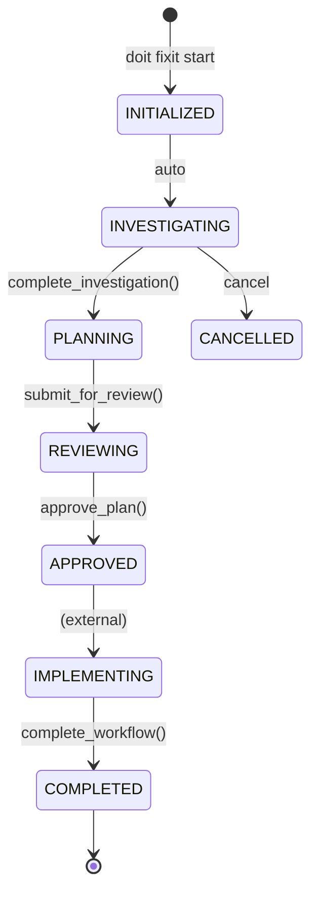

# Feature: Bug-Fix Workflow Command (doit.fixit)

**Completed**: 2026-01-16
**Branch**: `034-fixit-workflow`
**Epic**: #390

## Overview

The `doit fixit` command provides a structured workflow for fixing bugs from GitHub issues. It integrates with the existing doit command ecosystem by guiding developers through investigation, planning, and implementation phases while leveraging AI assistance for root cause analysis.

## Workflow Phases

## Requirements Implemented

| ID | Description | Status |
|----|-------------|--------|
| US-001 | Start workflow by issue ID | Done |
| US-002 | Browse and select from open bugs | Done |
| US-003 | AI-assisted investigation | Done |
| US-004 | Create fix plan with review | Done |
| US-005 | Track fix progress and resume | Done |

## CLI Commands

| Command | Description |
|---------|-------------|
| `doit fixit start <issue_id>` | Start workflow for specific issue |
| `doit fixit start` | Select from open bugs interactively |
| `doit fixit list` | List open bug issues |
| `doit fixit investigate` | Start/manage investigation |
| `doit fixit plan` | Generate/view fix plan |
| `doit fixit review` | Review and approve plan |
| `doit fixit status` | Show workflow progress |
| `doit fixit cancel` | Cancel active workflow |
| `doit fixit workflows` | List all workflows |

## Key Files

### Models
- `src/doit_cli/models/fixit_models.py` - Data models (FixWorkflow, GitHubIssue, InvestigationPlan, FixPlan)

### Services
- `src/doit_cli/services/fixit_service.py` - Workflow orchestration
- `src/doit_cli/services/github_service.py` - GitHub API operations via gh CLI

### CLI
- `src/doit_cli/cli/fixit_command.py` - Typer commands
- `src/doit_cli/prompts/fixit_prompts.py` - Interactive prompts

### Git Hooks
- `templates/hooks/post-merge.sh` - Auto-completes workflow on fix branch merge

## Testing

- **Unit Tests**: 57 tests in `tests/unit/test_fixit_*.py`
- **Integration Tests**: 20 tests in `tests/integration/test_fixit_workflow.py`
- **Total Tests**: 806 passing

## Technical Decisions

1. **CLI Structure**: Uses Typer with subcommands (`start`, `list`, `investigate`, etc.) for clear command hierarchy
2. **State Persistence**: JSON files in `.doit/state/fixit-{issue_id}.json`
3. **GitHub Integration**: Uses `gh` CLI for issue operations (get, list, close)
4. **Phase State Machine**: Enum-based phases with controlled transitions

## Related Issues

- Epic: #390
- Features: #391, #392, #393, #394, #395
- Tasks: #396-#439 (43 tasks)

## Integration Points

| Component | Integration |
|-----------|-------------|
| `StateManager` | Workflow state persistence |
| `HookManager` | Post-merge hook installation |
| `status_command` | Dashboard integration |
| `reviewit` | Fix plan review |
| `taskit` | Task generation from plan |
| `checkin` | Issue closure on completion |

---

*Generated by `/doit.checkin` on 2026-01-16*
