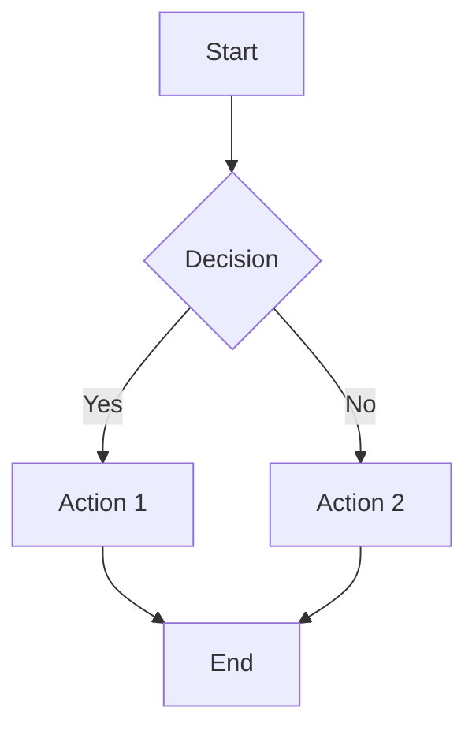
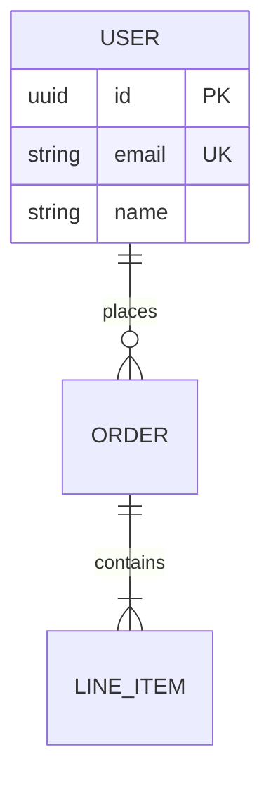
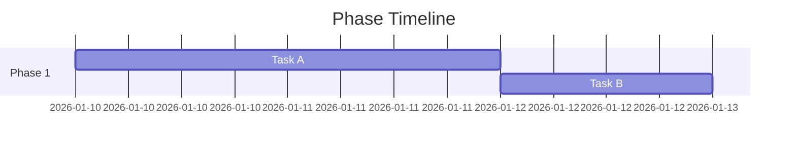
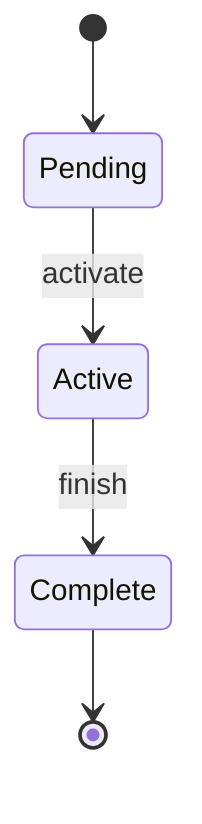
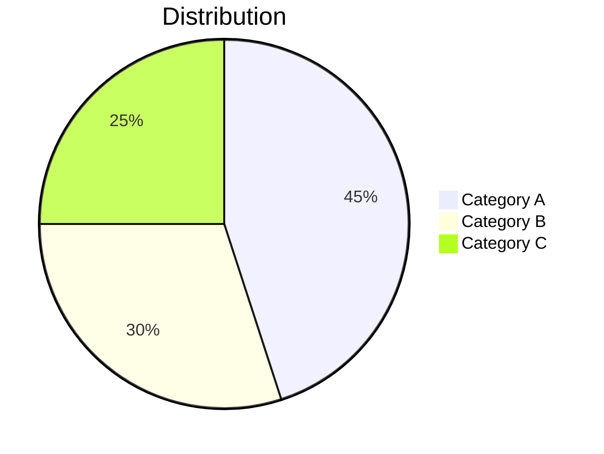
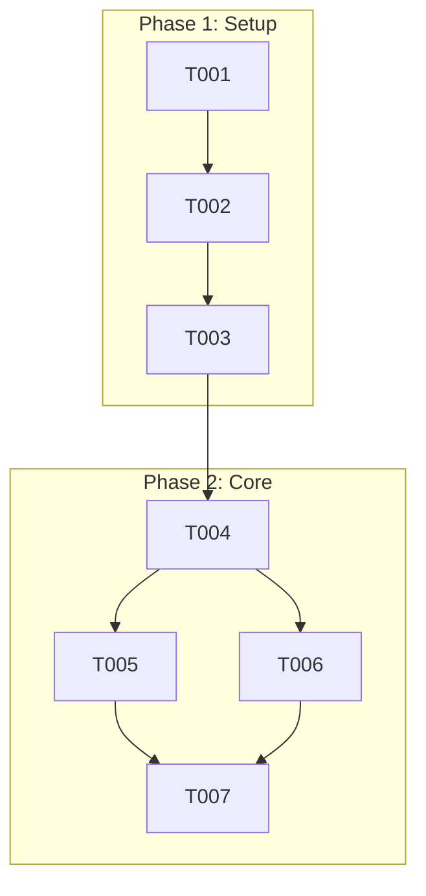

# Mermaid Diagram Patterns

**Purpose**: Define the auto-generation patterns used by doit commands to create mermaid visualizations.

## Auto-Generated Section Markers

All auto-generated diagrams use HTML comment markers to identify content boundaries:

~~~markdown
<!-- BEGIN:AUTO-GENERATED section="[section-name]" -->
## [Section Title]

```mermaid
[diagram content]
```
<!-- END:AUTO-GENERATED -->
~~~

### Marker Rules

1. **Section names must be unique** within a document
2. **Content between markers** is regenerated on each command run
3. **Content outside markers** is preserved and never modified
4. **Missing end marker** - entire section to end of file is considered auto-generated

### Section Names by Document Type

| Document | Section Name | Diagram Type |
|----------|--------------|--------------|
| spec.md | `user-journey` | flowchart |
| spec.md | `entity-relationships` | erDiagram |
| plan.md | `architecture` | flowchart |
| plan.md | `component-dependencies` | flowchart |
| data-model.md | `er-diagram` | erDiagram |
| data-model.md | `[entity]-states` | stateDiagram-v2 |
| tasks.md | `task-dependencies` | flowchart |
| tasks.md | `phase-timeline` | gantt |
| review-report.md | `finding-distribution` | pie |
| review-report.md | `test-results` | pie/bar |

## Supported Diagram Types

### Flowchart (flowchart TD/LR)

Used for: User journeys, architecture, task dependencies



**Syntax Notes**:
- `TD` = Top-Down, `LR` = Left-Right
- `[text]` = rectangle, `(text)` = rounded, `{text}` = diamond
- `-->` = arrow, `-->|label|` = labeled arrow
- `subgraph "Name"` for grouping

### ER Diagram (erDiagram)

Used for: Entity relationships in spec.md and data-model.md



**Cardinality**:
- `||--||` = one to one
- `||--o{` = one to many
- `}o--o{` = many to many

### Gantt Chart (gantt)

Used for: Phase timelines in tasks.md



### State Diagram (stateDiagram-v2)

Used for: Entity state machines



### Pie Chart (pie)

Used for: Finding distribution, test results



## Size Limits

To maintain readability, diagrams should be split when exceeding these limits:

| Diagram Type | Soft Limit | Hard Limit | Action |
|--------------|------------|------------|--------|
| Flowchart | 20 nodes | 30 nodes | Split into subgraphs |
| ER Diagram | 10 entities | 15 entities | Group by domain |
| Gantt | 15 tasks | 20 tasks | Summarize to milestones |
| State | 10 states | 15 states | Use composite states |
| Pie | 6 slices | 8 slices | Group small values as "Other" |

### Subgraph Strategy

When a flowchart exceeds the soft limit:



## Validation Guidelines

Before inserting a diagram, validate:

1. **Diagram type declaration** - First line must be valid type (flowchart, erDiagram, etc.)
2. **Matching code fences** - Opening and closing ` ```mermaid ` and ` ``` `
3. **Node syntax** - Proper brackets and identifiers
4. **Relationship syntax** - Valid arrows and cardinality
5. **No reserved characters** - Escape special characters in labels

### Common Syntax Errors

| Error | Example | Fix |
|-------|---------|-----|
| Missing arrow | `A B` | `A --> B` |
| Unmatched brackets | `A[Node` | `A[Node]` |
| Invalid characters | `A[Node "x"]` | `A["Node x"]` |
| Wrong cardinality | `\|\|--\|\|{` | `\|\|--o{` |

## Integration with Commands

Each doit command that generates diagrams follows this pattern:

1. Parse document content
2. Extract relevant data (user stories, entities, tasks, etc.)
3. Generate mermaid syntax
4. Validate syntax
5. Find or create section markers
6. Insert diagram between markers
7. Preserve content outside markers
