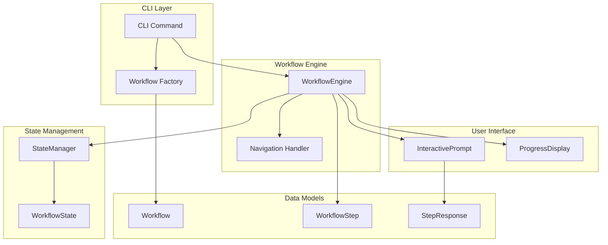

# Workflow System Guide

**Feature**: 030-guided-workflows, 031-init-workflow-integration
**Last Updated**: 2026-01-16

## Overview

The doit CLI includes a guided workflow system that provides interactive, step-by-step command execution with progress tracking, navigation support, and state persistence for interruption recovery.

This guide covers the workflow system architecture, core components, and how to create custom workflows for your commands.

## Architecture

The workflow system follows a layered architecture that separates concerns between orchestration, state management, and user interaction.



## Core Components

### WorkflowEngine

The `WorkflowEngine` is the central orchestrator that manages workflow execution. It handles:

- Starting new workflows or resuming interrupted ones
- Executing individual steps with validation
- Processing navigation commands (back, skip)
- Coordinating state persistence
- Managing progress display

```python
from doit_cli.services.workflow_engine import WorkflowEngine
from doit_cli.services.state_manager import StateManager

engine = WorkflowEngine(
    console=console,
    state_manager=StateManager(),
)

responses = engine.run(workflow)
```

### Workflow and WorkflowStep

A `Workflow` defines a complete guided process, containing one or more `WorkflowStep` instances.

```python
from doit_cli.models.workflow_models import Workflow, WorkflowStep

workflow = Workflow(
    id="my-workflow",
    command_name="mycommand",
    description="Guides through my command",
    interactive=True,
    steps=[
        WorkflowStep(
            id="step-1",
            name="First Step",
            prompt_text="Enter your choice:",
            required=True,
            order=0,
            validation_type="ChoiceValidator",
            default_value="option1",
            options={"option1": "First Option", "option2": "Second Option"},
        ),
    ],
)
```

#### WorkflowStep Properties

| Property | Type | Description |
| -------- | ---- | ----------- |
| `id` | str | Unique step identifier |
| `name` | str | Display name shown in progress |
| `prompt_text` | str | Question or instruction for user |
| `required` | bool | Whether step must be completed |
| `order` | int | Sequence position (0-indexed) |
| `validation_type` | str | Validator class name (optional) |
| `default_value` | str | Value used when skipped or non-interactive |
| `options` | dict | For choice steps: {key: description} mapping |

### StateManager

The `StateManager` handles persistence of workflow state for recovery after interruptions.

```python
from doit_cli.services.state_manager import StateManager

state_manager = StateManager()

# State is automatically saved during workflow execution
# Load interrupted state
state = state_manager.load("command_name")

# List all interrupted workflows
interrupted = state_manager.list_interrupted()

# Clean up old state files
state_manager.cleanup_stale(max_age_days=7)
```

## Validation

The workflow system supports input validation through validator classes:

| Validator | Description |
| --------- | ----------- |
| `ChoiceValidator` | Validates input against a list of options |
| `PathExistsValidator` | Validates that a path exists |
| `DirectoryValidator` | Validates that path is a directory |
| `NonEmptyValidator` | Validates non-empty string |

Custom validators can be created by implementing the validator protocol:

```python
from doit_cli.models.workflow_models import ValidationResult

class MyValidator:
    def validate(self, value: str) -> ValidationResult:
        if self._is_valid(value):
            return ValidationResult.success()
        return ValidationResult.failure(
            error_message="Invalid input",
            suggestion="Try this instead"
        )
```

## Navigation Commands

During interactive workflow execution, users can use these navigation commands:

| Command | Description |
| ------- | ----------- |
| `back` | Return to previous step (preserves answers) |
| `skip` | Skip optional step (uses default value) |
| `Ctrl+C` | Interrupt workflow (saves state for resume) |

## State Persistence

When a workflow is interrupted (Ctrl+C), the state is automatically saved to `.doit/state/`. On the next execution, the user is prompted to resume or start fresh.

State file format: `{command_name}_{timestamp}.json`

```json
{
  "id": "init_20260116_143022",
  "workflow_id": "init-workflow",
  "command_name": "init",
  "current_step": 1,
  "total_steps": 3,
  "status": "interrupted",
  "responses": {
    "select-agent": {
      "step_id": "select-agent",
      "value": "claude",
      "skipped": false
    }
  }
}
```

## API Reference

### WorkflowEngine Methods

#### `start(workflow: Workflow) -> WorkflowState`

Start a new workflow or resume an interrupted one.

#### `execute_step(state: WorkflowState, step: WorkflowStep) -> tuple[WorkflowState, StepResponse]`

Execute a single workflow step.

#### `run(workflow: Workflow) -> dict`

Run a complete workflow from start to finish. Returns a dictionary of step_id -> response value.

#### `complete(state: WorkflowState) -> dict`

Complete workflow and return collected responses.

#### `cancel(state: WorkflowState) -> None`

Cancel workflow and save state for resume.

### StateManager Methods

#### `save(state: WorkflowState) -> Path`

Save workflow state to file.

#### `load(command_name: str) -> WorkflowState | None`

Load most recent state for a command.

#### `delete(state: WorkflowState) -> None`

Delete state file after completion.

#### `list_interrupted() -> list[WorkflowState]`

List all interrupted workflow states.

#### `cleanup_stale(max_age_days: int = 7) -> int`

Remove state files older than threshold.

## Example: Init Workflow

The init command demonstrates workflow integration:

```python
def create_init_workflow(path: Path) -> Workflow:
    """Create the init workflow definition."""
    return Workflow(
        id="init-workflow",
        command_name="init",
        description="Initialize a new doit project",
        interactive=True,
        steps=[
            WorkflowStep(
                id="select-agent",
                name="Select AI Agent",
                prompt_text="Which AI agent(s) do you want to initialize for?",
                required=True,
                order=0,
                validation_type="ChoiceValidator",
                default_value="claude",
                options={
                    "claude": "Claude Code",
                    "copilot": "GitHub Copilot",
                    "both": "Both agents",
                },
            ),
            WorkflowStep(
                id="confirm-path",
                name="Confirm Project Path",
                prompt_text=f"Initialize doit in '{path}'?",
                required=True,
                order=1,
                default_value="yes",
                options={"yes": "Confirm", "no": "Cancel"},
            ),
            WorkflowStep(
                id="custom-templates",
                name="Custom Templates",
                prompt_text="Custom template directory (leave empty for default)",
                required=False,
                order=2,
                validation_type="PathExistsValidator",
                default_value="",
            ),
        ],
    )
```

## Non-Interactive Mode

For CI/CD pipelines and automation, workflows can be bypassed using the `--yes` flag:

```bash
doit init . --yes  # Uses defaults, no prompts
```

When `--yes` is provided:
- WorkflowEngine is not instantiated
- Default values are used for all steps
- Auto-detection is used where applicable
- Execution completes without user interaction

## Best Practices

1. **Keep steps focused**: Each step should collect one piece of information
2. **Provide sensible defaults**: All steps should have reasonable default values
3. **Use descriptive names**: Step names appear in progress display
4. **Add validation**: Validate input to prevent errors downstream
5. **Handle cancellation**: Always catch `KeyboardInterrupt` and exit gracefully
6. **Test both modes**: Test interactive and non-interactive execution

## See Also

- [Creating Workflows Tutorial](../tutorials/creating-workflows.md) - Step-by-step tutorial
- [Feature 030 Spec](../../specs/030-guided-workflows/spec.md) - Original specification
- [Feature 031 Spec](../../specs/031-init-workflow-integration/spec.md) - Init integration
