# Command Templates Documentation

Command templates define the workflow logic for the doit development system. Each command orchestrates a specific phase of the development lifecycle.

## Command Flow Overview

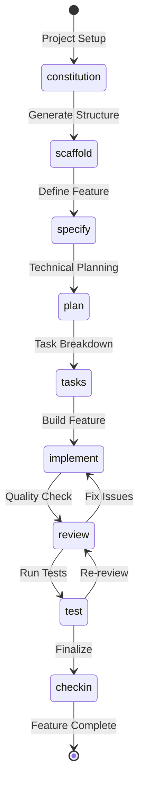

---

## doit.constitution

**Purpose**: Create or update the project constitution with principles, tech stack, and governance

**Phase**: Initialization

**Output**: `.doit/memory/constitution.md`

### Workflow

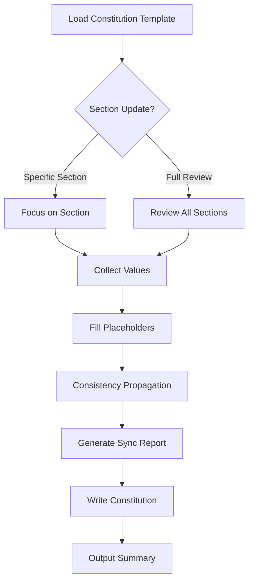

### Sections Managed

| Section | Placeholders | Purpose |
|---------|--------------|---------|
| Purpose & Goals | `[PROJECT_PURPOSE]`, `[SUCCESS_CRITERIA]` | Project mission |
| Tech Stack | `[PRIMARY_LANGUAGE]`, `[FRAMEWORKS]`, `[KEY_LIBRARIES]` | Technology choices |
| Infrastructure | `[HOSTING_PLATFORM]`, `[CLOUD_PROVIDER]`, `[DATABASE]` | Deployment target |
| Deployment | `[CICD_PIPELINE]`, `[DEPLOYMENT_STRATEGY]`, `[ENVIRONMENTS]` | Release process |
| Principles | Custom principle definitions | Project rules |
| Governance | `[CONSTITUTION_VERSION]`, dates | Change management |

### Section Keywords

```text
"purpose" / "goals"      → Purpose & Goals section
"tech" / "stack"         → Tech Stack section
"infrastructure"         → Infrastructure section
"deployment" / "ci"      → Deployment section
"principles"             → Core Principles section
"governance"             → Governance section
```

### Handoffs

- **Next**: `doit.scaffold` - Generate project structure based on tech stack

---

## doit.scaffold

**Purpose**: Generate project folder structure and starter files based on constitution

**Phase**: Initialization

**Output**: Project directories, config files, `.claude/commands/`

### Workflow

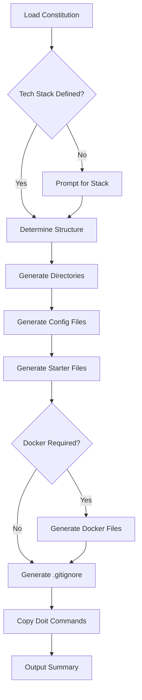

### Supported Tech Stacks

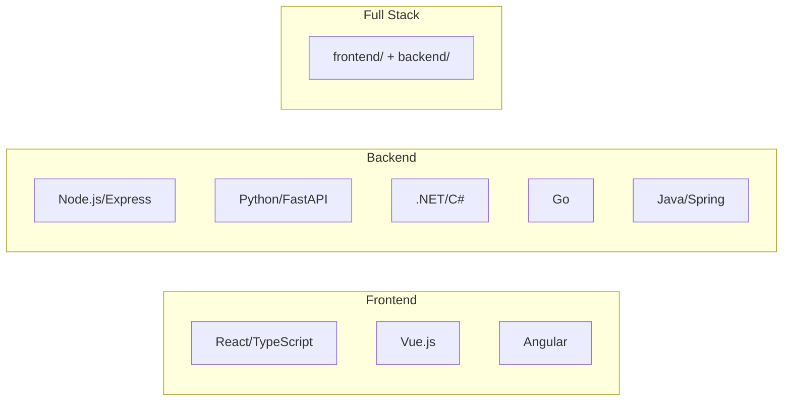

### Structure Templates

| Stack | Directories | Config Files |
|-------|-------------|--------------|
| React/TS | `src/components`, `hooks`, `pages` | `tsconfig.json`, `vite.config.ts` |
| Python/FastAPI | `src/api`, `models`, `services` | `pyproject.toml`, `requirements.txt` |
| .NET | `src/Controllers`, `Models`, `Services` | `*.csproj`, `appsettings.json` |
| Node.js | `src/controllers`, `routes`, `middleware` | `package.json`, `.eslintrc.js` |
| Go | `cmd/`, `internal/`, `pkg/` | `go.mod` |

### Doit Commands Generation

Copies all 9 command templates to `.claude/commands/`:

```text
.claude/commands/
├── doit.checkin.md
├── doit.constitution.md
├── doit.implement.md
├── doit.plan.md
├── doit.review.md
├── doit.scaffold.md
├── doit.specify.md
├── doit.tasks.md
└── doit.test.md
```

### Handoffs

- **Next**: `doit.specify` - Create feature specifications

---

## doit.specify

**Purpose**: Create feature specifications from natural language descriptions

**Phase**: Specification

**Output**: `specs/XXX-feature/spec.md`, `specs/XXX-feature/checklists/requirements.md`

### Workflow

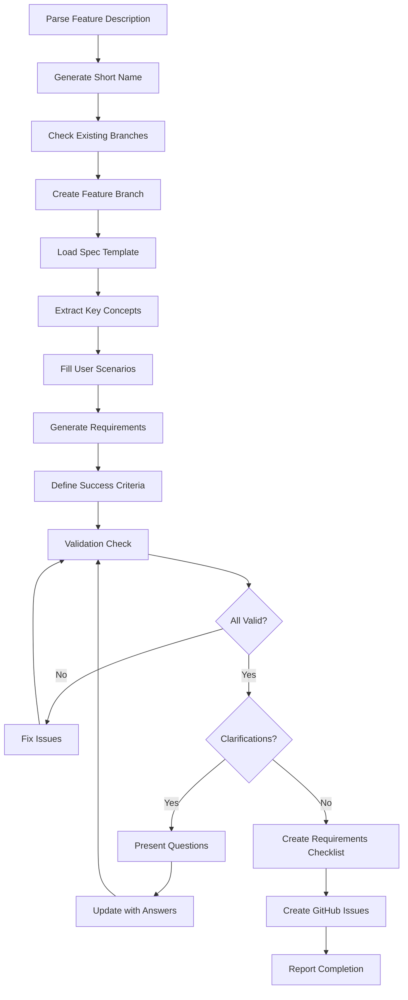

### Branch Naming

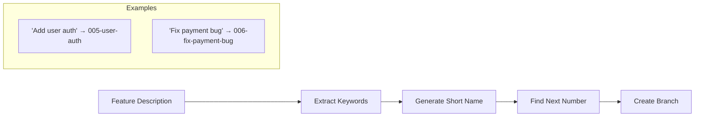

### Ambiguity Scan Categories

1. **Functional Scope & Behavior**
2. **Domain & Data Model**
3. **Interaction & UX Flow**
4. **Non-Functional Quality Attributes**
5. **Integration & External Dependencies**
6. **Edge Cases & Failure Handling**
7. **Constraints & Tradeoffs**
8. **Terminology & Consistency**

### GitHub Integration

Creates issues when remote is available:

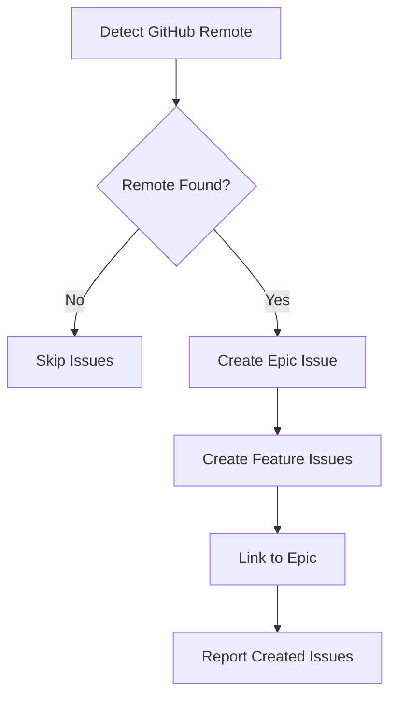

### Handoffs

- **Next**: `doit.plan` - Create technical implementation plan
- **Alt**: `doit.scaffold` - Generate project structure

---

## doit.plan

**Purpose**: Generate implementation plan with technical design artifacts

**Phase**: Planning

**Output**: `plan.md`, `research.md`, `data-model.md`, `contracts/`, `quickstart.md`

### Workflow

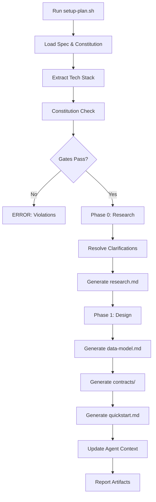

### Phase 0: Research Output

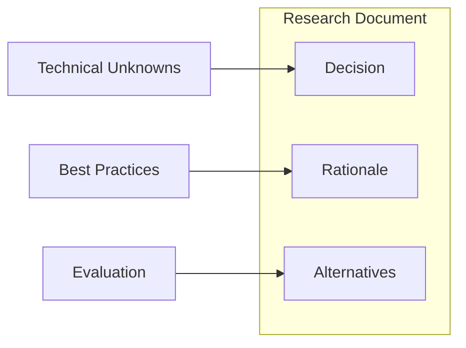

### Phase 1: Design Artifacts

| Artifact | Content | Purpose |
|----------|---------|---------|
| `data-model.md` | Entities, fields, relationships | Data structure |
| `contracts/` | OpenAPI/GraphQL schemas | API definitions |
| `quickstart.md` | Setup instructions, test scenarios | Getting started |

### Constitution Check

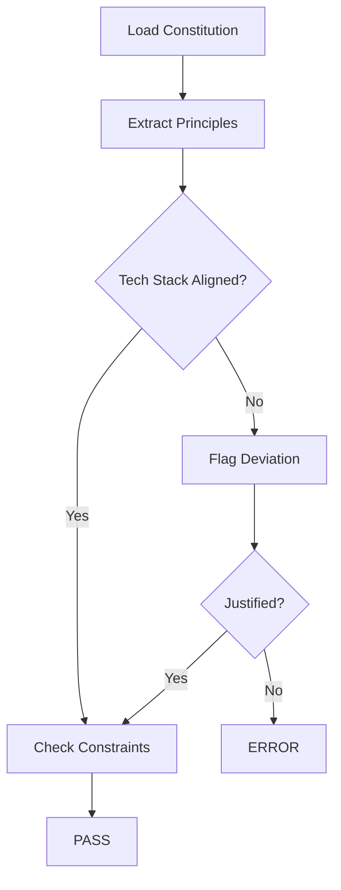

### Handoffs

- **Next**: `doit.tasks` - Generate task breakdown

---

## doit.tasks

**Purpose**: Generate actionable, dependency-ordered task list

**Phase**: Task Generation

**Output**: `specs/XXX-feature/tasks.md`

### Workflow

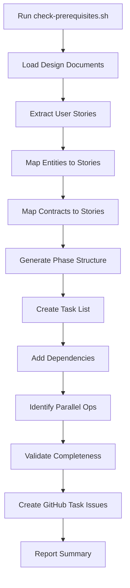

### Task Generation Rules

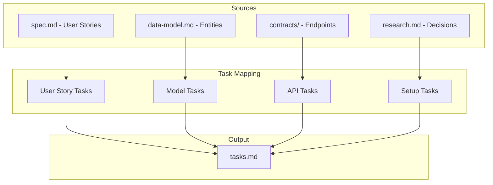

### Phase Structure

```text
Phase 1: Setup           - Project initialization (no [Story] label)
Phase 2: Foundational    - Blocking prerequisites (no [Story] label)
Phase 3: User Story 1    - P1 implementation ([US1] label)
Phase 4: User Story 2    - P2 implementation ([US2] label)
...
Phase N: Polish          - Cross-cutting concerns (no [Story] label)
```

### Handoffs

- **Next**: `doit.implement` - Execute tasks

---

## doit.implement

**Purpose**: Execute implementation tasks from tasks.md

**Phase**: Implementation

**Output**: Source code, updated tasks.md (marked complete)

### Workflow

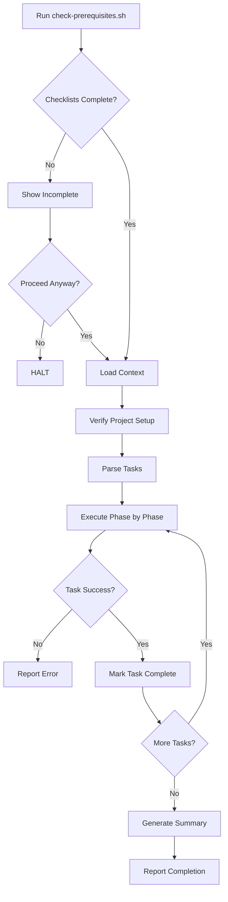

### Execution Rules

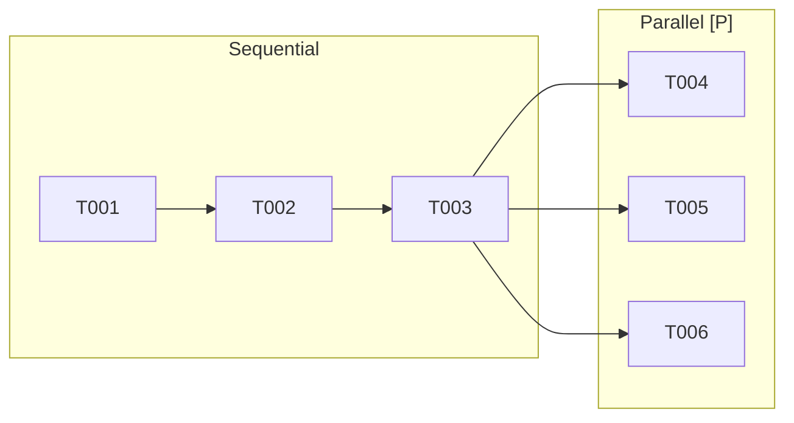

### Ignore File Generation

| Technology | Ignore File | Key Patterns |
|------------|-------------|--------------|
| Git | `.gitignore` | IDE, build, env |
| Docker | `.dockerignore` | node_modules, .git |
| ESLint | `.eslintignore` | dist, coverage |
| Terraform | `.terraformignore` | .terraform, tfstate |

### Handoffs

- **Next**: `doit.review` - Code review
- **Alt**: `doit.test` - Run tests

---

## doit.review

**Purpose**: Code review and manual testing workflow

**Phase**: Quality Assurance

**Output**: `specs/XXX-feature/review-report.md`

### Workflow

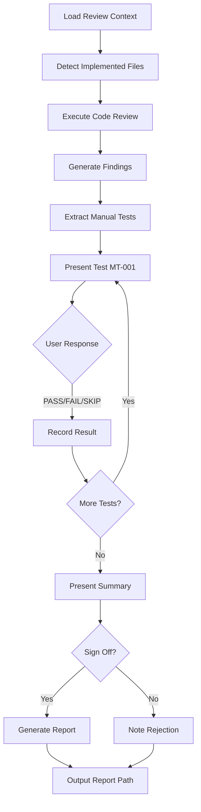

### Finding Severity Levels

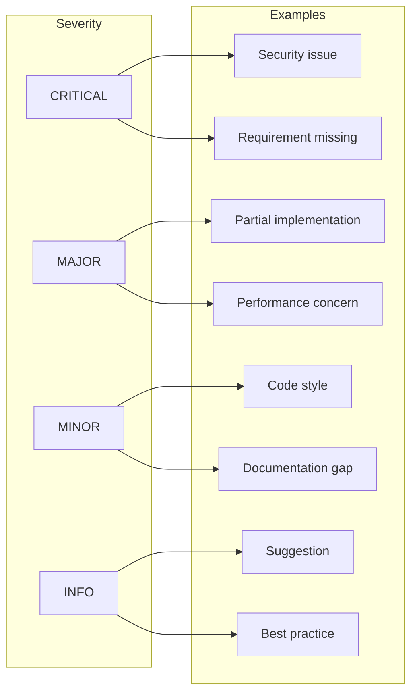

### Manual Test Flow

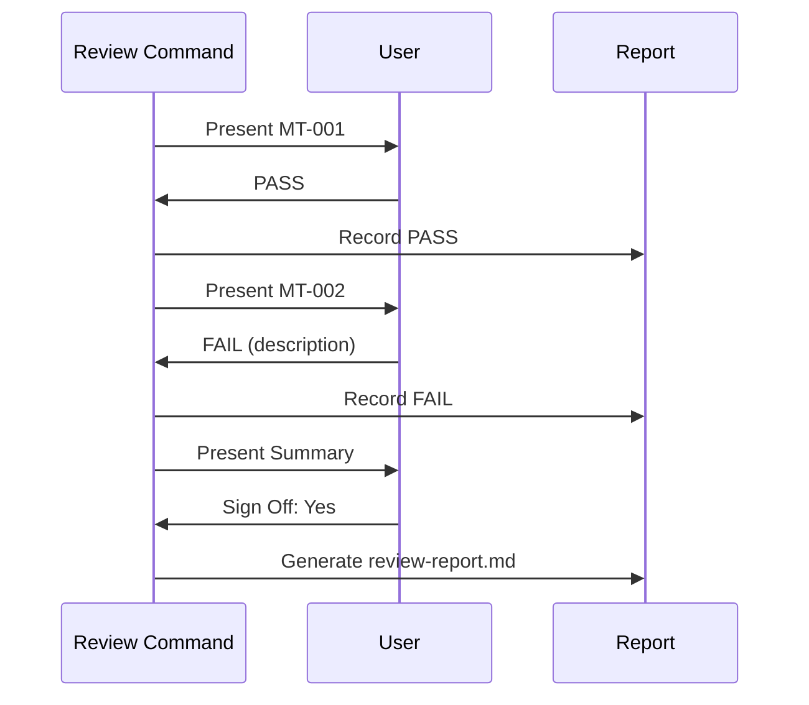

### Handoffs

- **Next**: `doit.test` - Automated tests
- **Next**: `doit.checkin` - Finalize feature

---

## doit.test

**Purpose**: Execute automated tests and generate coverage reports

**Phase**: Quality Assurance

**Output**: `specs/XXX-feature/test-report.md`

### Workflow

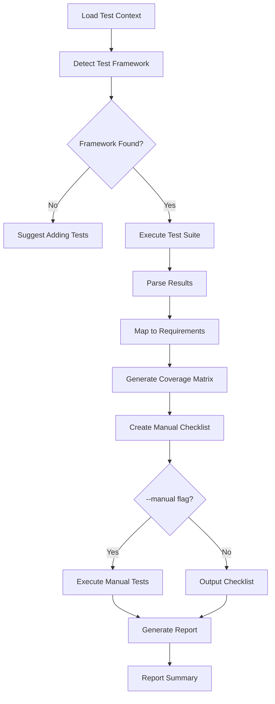

### Framework Detection

| Framework | Detection Files | Command |
|-----------|-----------------|---------|
| pytest | `pytest.ini`, `conftest.py` | `pytest -v --tb=short` |
| Jest | `jest.config.js` | `npm test` |
| Vitest | `vitest.config.ts` | `npx vitest run` |
| Go | `*_test.go` | `go test ./...` |
| Maven | `pom.xml` | `mvn test` |
| Cargo | `Cargo.toml` | `cargo test` |

### Requirement Coverage Matrix

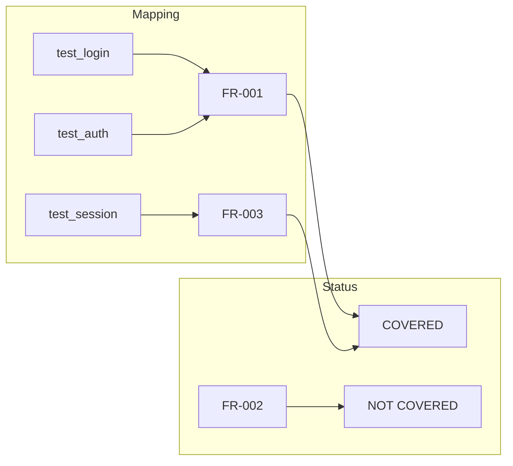

### Handoffs

- **Next**: `doit.checkin` - Finalize feature
- **Alt**: `doit.review` - Re-review after fixes

---

## doit.checkin

**Purpose**: Finalize feature, close issues, create pull request

**Phase**: Completion

**Output**: Feature documentation, PR, closed issues

### Workflow

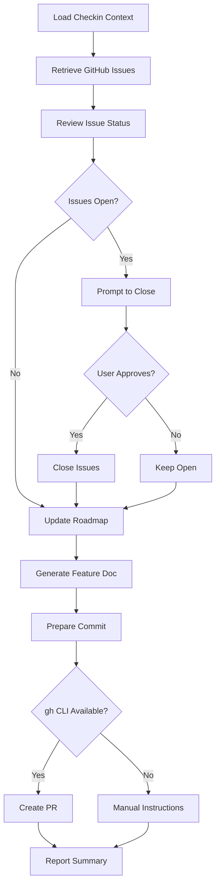

### Roadmap Updates

```mermaid
flowchart LR
    subgraph "Input"
        SPEC[spec.md]
        TASKS[tasks.md]
        REV[review-report.md]
    end

    subgraph "Updates"
        RM[roadmap.md - Mark Complete]
        RC[roadmap_completed.md - Add Entry]
        DOC[docs/features/XXX.md - Create]
    end

    SPEC --> RM & RC & DOC
    TASKS --> DOC
    REV --> DOC
```

### PR Template Structure

```markdown
## Summary
[Brief description from spec.md]

## Changes
- [List of key changes]

## Testing
- [ ] Automated tests pass
- [ ] Manual testing complete
- [ ] Code review approved

## Requirements
| ID | Description | Status |
|----|-------------|--------|
| FR-XXX | ... | Done |

## Related Issues
Closes #XXX, #YYY, #ZZZ
```

### Fallback Handling

| Scenario | Action |
|----------|--------|
| No gh CLI | Output manual PR instructions |
| No develop branch | Check main/master |
| No GitHub remote | Skip issue management |
| API failure | Log error, continue with local operations |

---

## Command Dependencies Summary

```mermaid
flowchart TD
    subgraph "Independent"
        CONST[constitution]
    end

    subgraph "Requires Constitution"
        SCAFFOLD[scaffold]
    end

    subgraph "Requires Spec"
        PLAN[plan]
    end

    subgraph "Requires Plan"
        TASKS[tasks]
    end

    subgraph "Requires Tasks"
        IMPL[implement]
    end

    subgraph "Requires Implementation"
        REV[review]
        TEST[test]
    end

    subgraph "Requires QA"
        CHECK[checkin]
    end

    CONST --> SCAFFOLD
    SCAFFOLD --> SPECIFY[specify]
    SPECIFY --> PLAN
    PLAN --> TASKS
    TASKS --> IMPL
    IMPL --> REV & TEST
    REV & TEST --> CHECK
```
