# Template Enhancement Recommendations

**Created**: 2026-01-10
**Status**: Proposed

## Overview

This document identifies opportunities to enhance the doit template system based on analysis of all current templates. The primary enhancement theme is **automatic visualization generation** using mermaid diagrams.

## Enhancement Categories

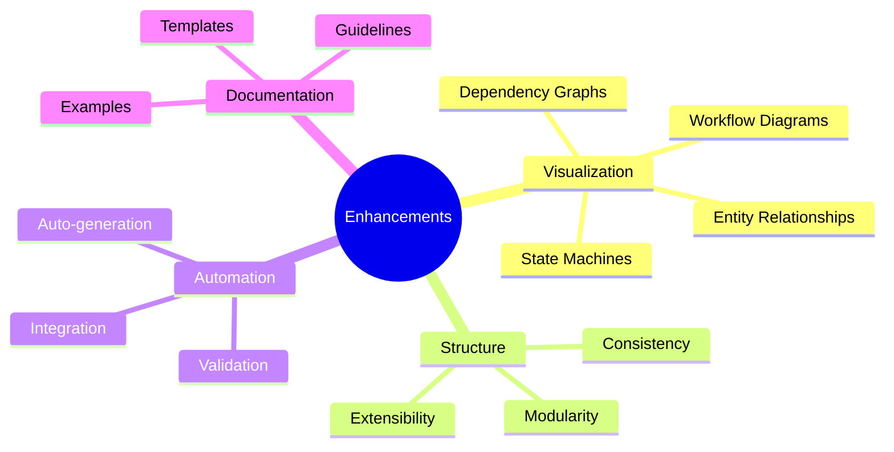

---

## E-001: Automatic Mermaid Visualization

### Problem

Current templates generate text-heavy documentation that can be difficult to quickly understand. Relationships between entities, workflows, and dependencies are described in prose rather than visualized.

### Proposed Enhancement

Add automatic mermaid diagram generation to key templates:

### spec-template.md Enhancements

Add a **User Journey Diagram** section:

```markdown
## User Journey Visualization

<!-- AUTO-GENERATED: Update by running /doit.specit -->

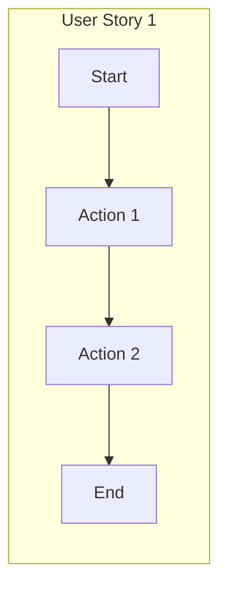

Add an **Entity Relationship Diagram** section:

```markdown
## Entity Relationships

<!-- AUTO-GENERATED: Update by running /doit.specit -->

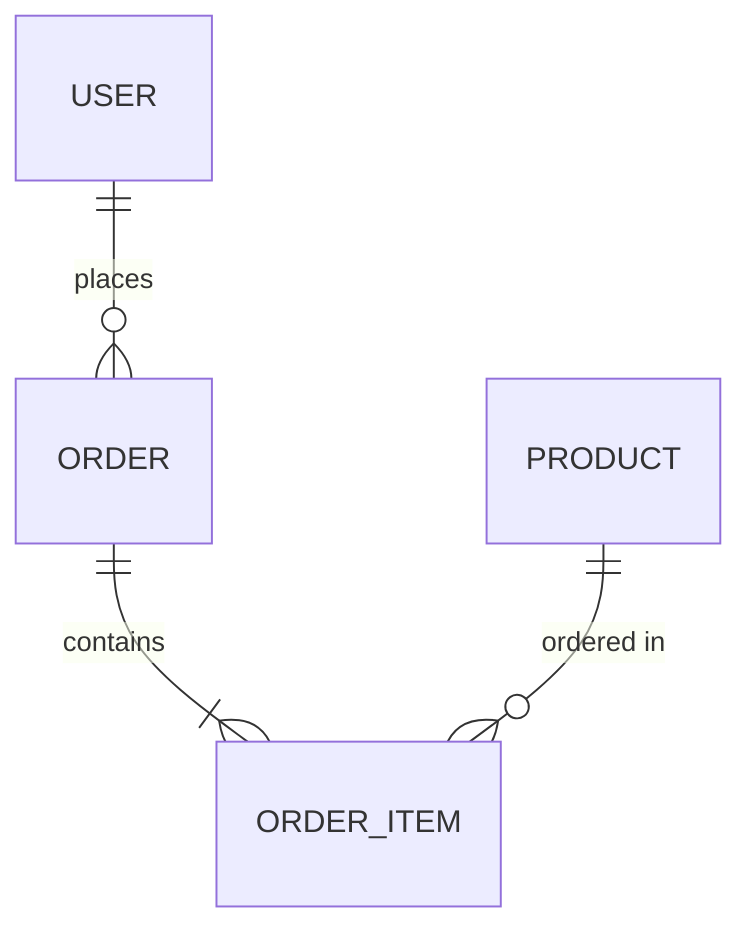

### plan-template.md Enhancements

Add an **Architecture Diagram** section:

```markdown
## Architecture Overview

<!-- AUTO-GENERATED: Update by running /doit.planit -->

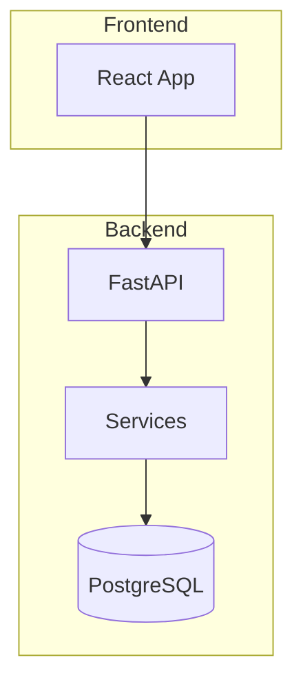

Add a **Component Dependency Diagram**:

```markdown
## Component Dependencies

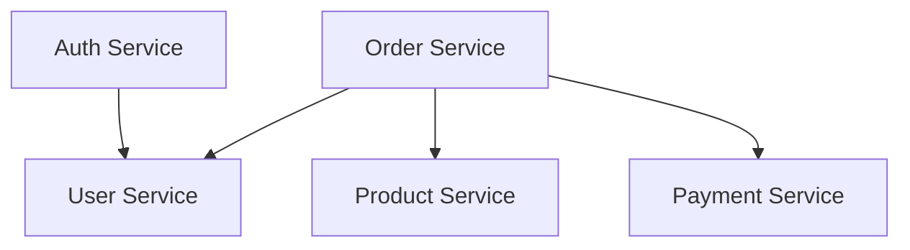

### tasks-template.md Enhancements

Add a **Task Dependency Graph**:

```markdown
## Task Dependencies

<!-- AUTO-GENERATED: Update by running /doit.taskit -->

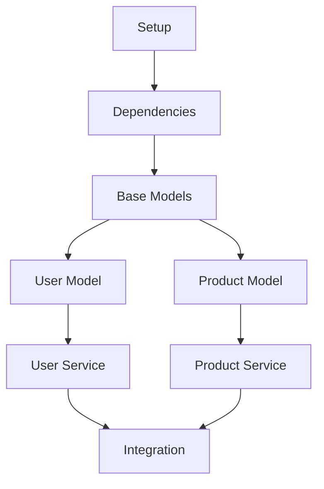

Add a **Phase Timeline**:

```markdown
## Phase Timeline

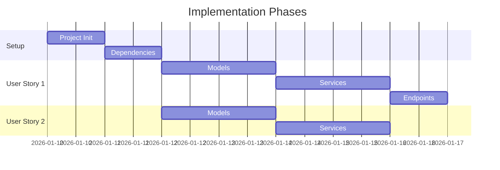

### Implementation Location

| Template | New Sections | Diagram Types |
|----------|--------------|---------------|
| spec-template.md | User Journey, Entity Relationships | flowchart, erDiagram |
| plan-template.md | Architecture, Component Dependencies | flowchart, C4 |
| tasks-template.md | Task Dependencies, Phase Timeline | flowchart, gantt |
| data-model.md | Entity Relationships | erDiagram |
| contracts/ | API Flow | sequenceDiagram |

---

## E-002: Command Template Consistency

### Problem

Command templates have inconsistent structure and documentation patterns.

### Proposed Enhancement

Standardize all command templates with:

1. **Consistent YAML Frontmatter**

```yaml
---
description: [Brief description]
version: 1.0.0
inputs:
  - name: $ARGUMENTS
    description: User input
    required: false
outputs:
  - name: [output file]
    path: [path pattern]
handoffs:
  - label: [Next Action]
    agent: [command]
    prompt: [Default prompt]
---
```

2. **Standard Outline Structure**

```markdown
## User Input
## Prerequisites
## Workflow
## Outputs
## Error Handling
## Handoffs
```

3. **Mermaid Workflow Diagram** (mandatory)

```markdown
## Workflow

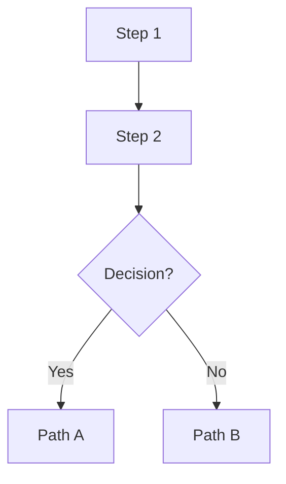

---

## E-003: Data Model Visualization

### Problem

The `data-model.md` artifact is text-based and doesn't automatically generate ER diagrams.

### Proposed Enhancement

Add automatic ER diagram generation in `/doit.planit`:

```markdown
## Entity Relationship Diagram

<!-- AUTO-GENERATED from entity definitions below -->

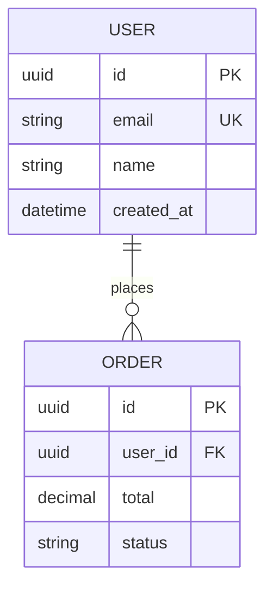

### Implementation

1. Parse entity definitions from `data-model.md`
2. Extract fields and relationships
3. Generate mermaid erDiagram syntax
4. Insert at top of document

---

## E-004: API Contract Visualization

### Problem

API contracts in `contracts/` are defined in OpenAPI/GraphQL but not visualized.

### Proposed Enhancement

Add automatic sequence diagrams for API flows:

```markdown
## API Flow: User Registration

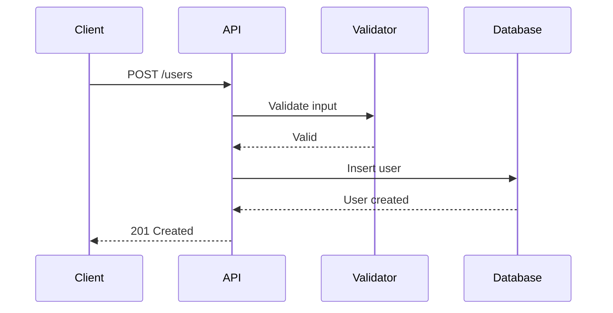

### Implementation

1. Parse OpenAPI/GraphQL schemas
2. Identify request/response flows
3. Generate sequenceDiagram for each endpoint group
4. Add to contracts documentation

---

## E-005: State Machine Visualization

### Problem

Entity state transitions are described in text but not visualized.

### Proposed Enhancement

Add state machine diagrams for entities with status fields:

```markdown
## Order State Machine

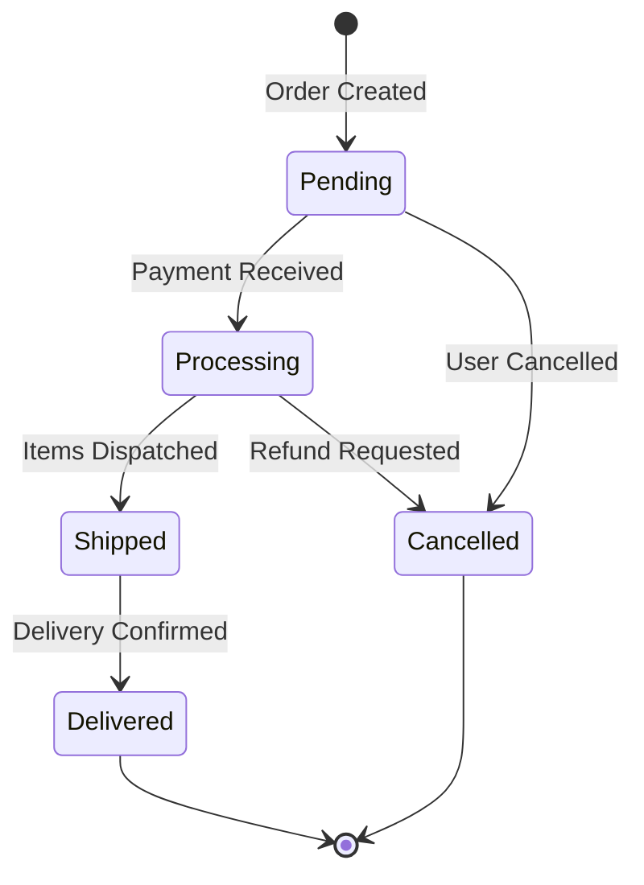

### Detection

Automatically detect state machine candidates:
- Fields named `status`, `state`, `stage`
- Enums with transition-like values
- Lifecycle patterns in requirements

---

## E-006: Review Report Visualization

### Problem

Review reports are table-heavy and don't visualize quality metrics.

### Proposed Enhancement

Add quality dashboard visualization in `/doit.reviewit`:

```markdown
## Quality Overview

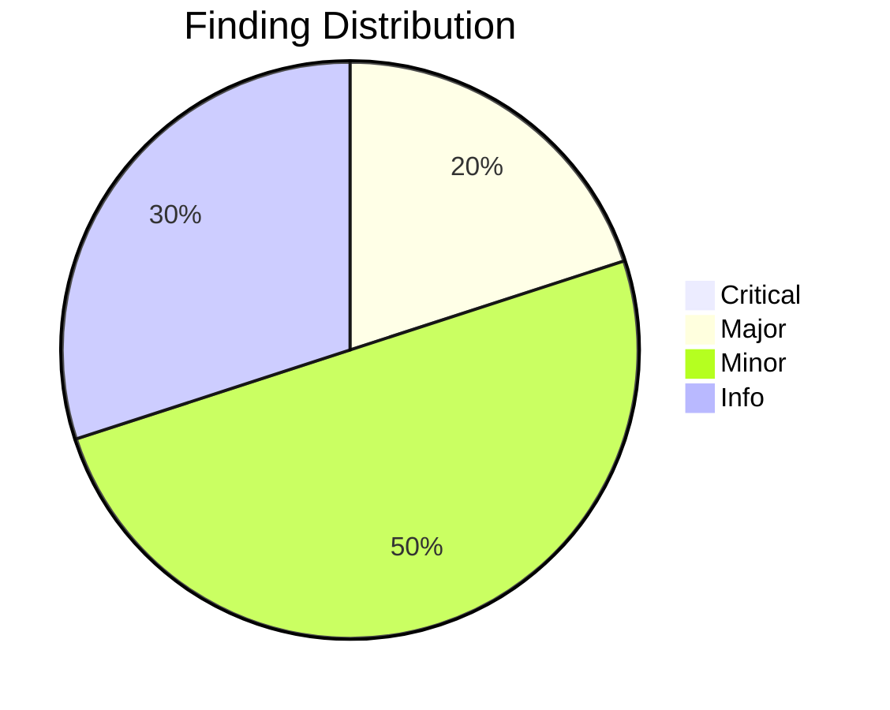

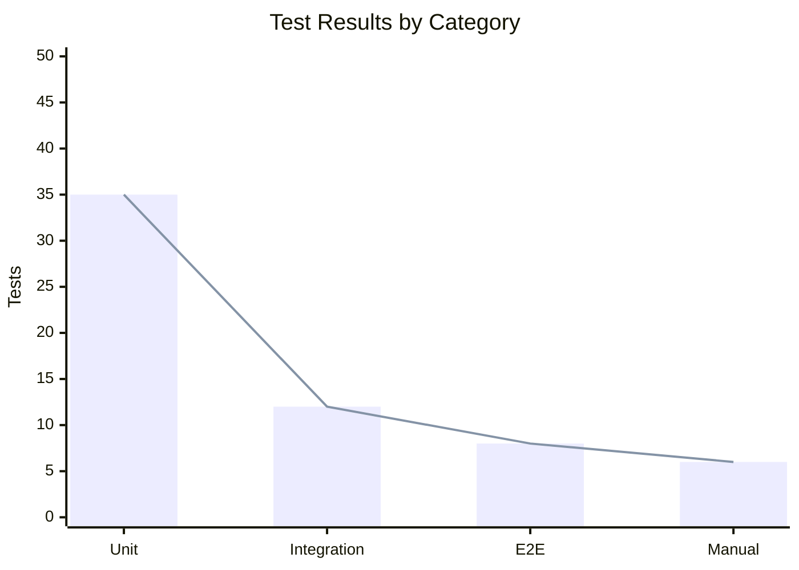

---

## E-007: Checkin Summary Visualization

### Problem

Checkin summaries don't visualize the feature's impact.

### Proposed Enhancement

Add impact visualization in `/doit.checkin`:

```markdown
## Feature Impact

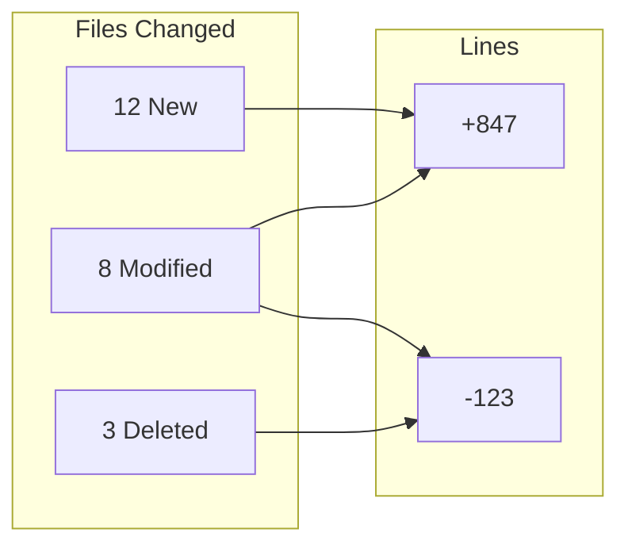

---

## E-008: Template Validation

### Problem

No automated validation that generated documents conform to template structure.

### Proposed Enhancement

Add a validation schema for each template:

```yaml
# spec-template.schema.yaml
required_sections:
  - "User Scenarios & Testing"
  - "Requirements"
  - "Success Criteria"

required_patterns:
  - pattern: "### User Story \\d+ - .+ \\(Priority: P\\d+\\)"
    min_count: 1
  - pattern: "FR-\\d{3}"
    min_count: 1
  - pattern: "SC-\\d{3}"
    min_count: 1

forbidden_patterns:
  - pattern: "\\[NEEDS CLARIFICATION\\]"
    max_count: 3
```

### Implementation

Add validation step to each command that generates documents.

---

## E-009: Cross-Reference Visualization

### Problem

Relationships between spec requirements, tasks, and tests are tracked but not visualized.

### Proposed Enhancement

Add traceability matrix visualization:

```markdown
## Traceability Matrix

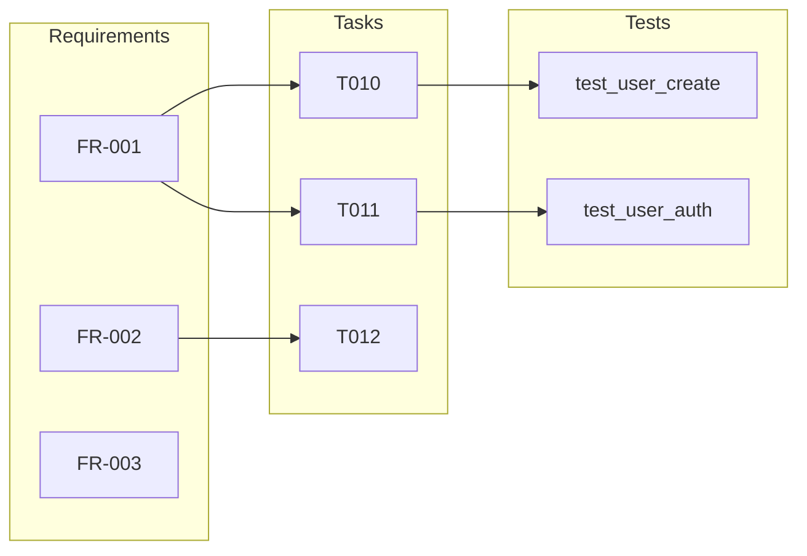

---

## E-010: Interactive Documentation

### Problem

Generated documentation is static and doesn't update as the project evolves.

### Proposed Enhancement

Add update markers that commands can refresh:

```markdown
<!-- BEGIN:AUTO-UPDATE section="task-progress" -->
## Task Progress

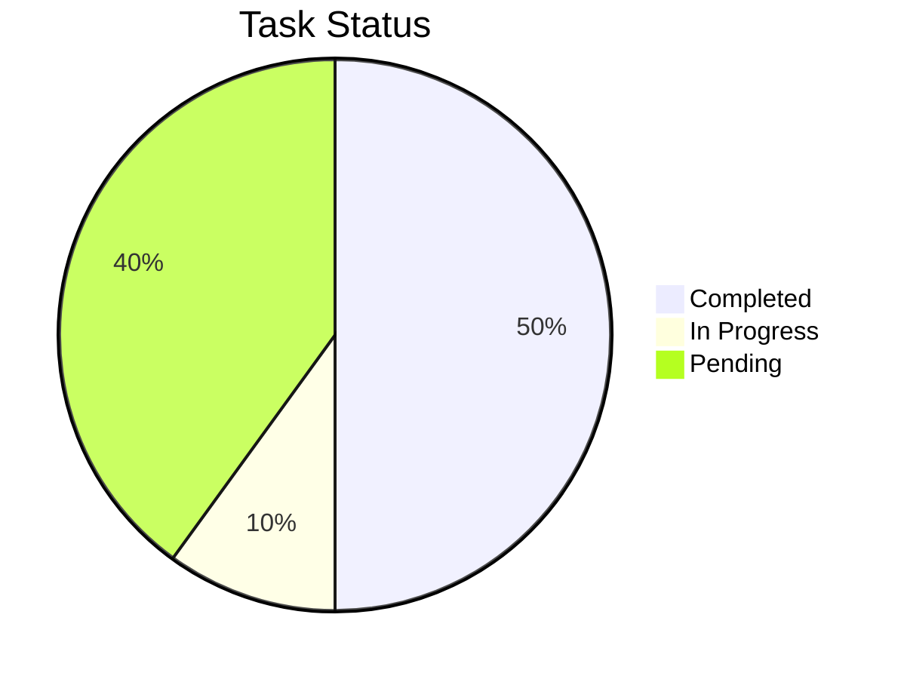
<!-- END:AUTO-UPDATE -->
```

Commands would parse these markers and update content between them while preserving manual additions.

---

## Implementation Priority

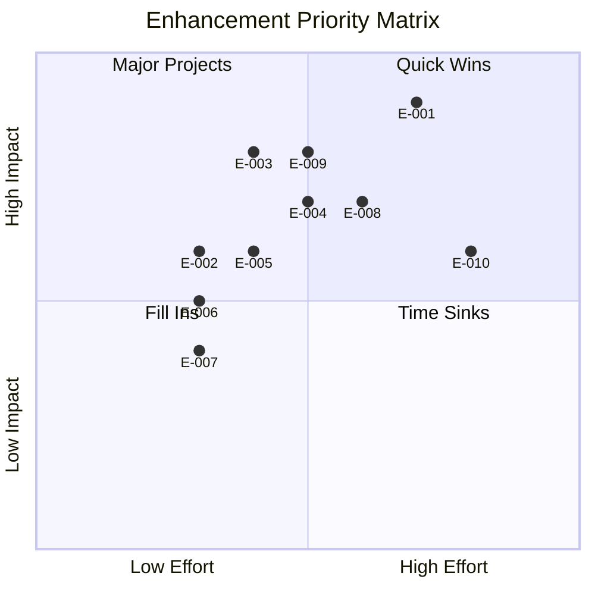

### Recommended Order

1. **E-001**: Automatic Mermaid Visualization (highest impact)
2. **E-003**: Data Model Visualization
3. **E-009**: Cross-Reference Visualization
4. **E-004**: API Contract Visualization
5. **E-002**: Command Template Consistency
6. **E-008**: Template Validation
7. **E-005**: State Machine Visualization
8. **E-006**: Review Report Visualization
9. **E-007**: Checkin Summary Visualization
10. **E-010**: Interactive Documentation

---

## Next Steps

1. Create feature specification for E-001 using `/doit.specit`
2. Implement visualization generation logic
3. Update all templates with diagram placeholders
4. Add documentation for diagram customization
5. Create examples gallery showing generated visualizations
