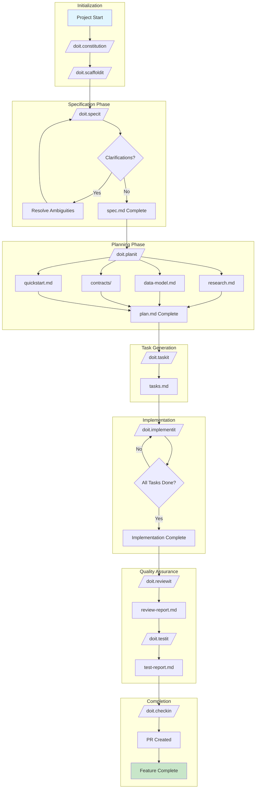
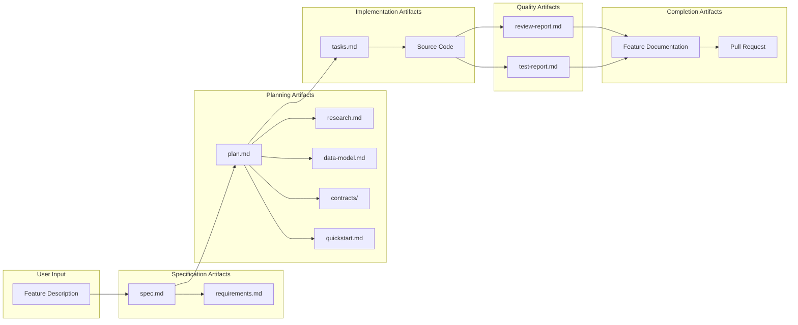
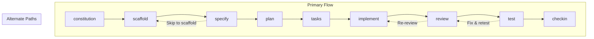

# Doit Template System Documentation

**Version**: 1.0.0
**Last Updated**: 2026-01-10

## Overview

The doit template system provides a structured workflow for feature development, from specification through implementation and deployment. It consists of two template categories:

1. **Root Templates** - Document templates that define the structure of generated artifacts
2. **Command Templates** - Workflow definitions that orchestrate the development process

## Complete Workflow



## Template Categories

### Root Templates (5 files)

| Template | Purpose | Output |
|----------|---------|--------|
| [spec-template.md](root-templates.md#spec-template) | Feature specification structure | `specs/XXX/spec.md` |
| [plan-template.md](root-templates.md#plan-template) | Implementation plan structure | `specs/XXX/plan.md` |
| [tasks-template.md](root-templates.md#tasks-template) | Task breakdown structure | `specs/XXX/tasks.md` |
| [checklist-template.md](root-templates.md#checklist-template) | Generic checklist format | Various checklist files |
| [agent-file-template.md](root-templates.md#agent-file-template) | AI agent context file | `CLAUDE.md` |

### Command Templates (9 files)

| Command | Purpose | Phase |
|---------|---------|-------|
| [doit.constitution](commands.md#doitconstitution) | Project principles & tech stack | Initialization |
| [doit.scaffold](commands.md#doitscaffold) | Generate project structure | Initialization |
| [doit.specify](commands.md#doitspecify) | Create feature specifications | Specification |
| [doit.plan](commands.md#doitplan) | Generate implementation plan | Planning |
| [doit.tasks](commands.md#doittasks) | Break down into tasks | Task Generation |
| [doit.implement](commands.md#doitimplement) | Execute tasks | Implementation |
| [doit.review](commands.md#doitreview) | Code review & manual testing | QA |
| [doit.test](commands.md#doittest) | Automated test execution | QA |
| [doit.checkin](commands.md#doitcheckin) | Finalize & create PR | Completion |

## Artifact Flow



## Directory Structure

```text
templates/
├── agent-file-template.md      # CLAUDE.md structure
├── checklist-template.md       # Generic checklist format
├── plan-template.md            # Implementation plan structure
├── spec-template.md            # Feature specification structure
├── tasks-template.md           # Task breakdown structure
├── vscode-settings.json        # Editor configuration
└── commands/                   # Command workflow definitions
    ├── doit.checkin.md
    ├── doit.constitution.md
    ├── doit.implementit.md
    ├── doit.planit.md
    ├── doit.reviewit.md
    ├── doit.scaffoldit.md
    ├── doit.specit.md
    ├── doit.taskit.md
    └── doit.testit.md
```

## Handoff Architecture

Commands are designed to flow into each other through handoffs:



## Template Variables

Common variables used across templates:

| Variable | Description | Example |
|----------|-------------|---------|
| `$ARGUMENTS` | User input from command | "Add user authentication" |
| `FEATURE_DIR` | Feature specification directory | `/specs/005-user-auth/` |
| `BRANCH` | Git branch name | `005-user-auth` |
| `SPEC_FILE` | Path to spec.md | `/specs/005-user-auth/spec.md` |
| `IMPL_PLAN` | Path to plan.md | `/specs/005-user-auth/plan.md` |

## Enhancement Opportunities

See [Enhancement Recommendations](enhancements.md) for proposed improvements to the template system.

## Related Documentation

- [Root Templates](root-templates.md) - Detailed documentation for document templates
- [Command Templates](commands.md) - Detailed documentation for workflow commands
- [Enhancement Recommendations](enhancements.md) - Proposed improvements
