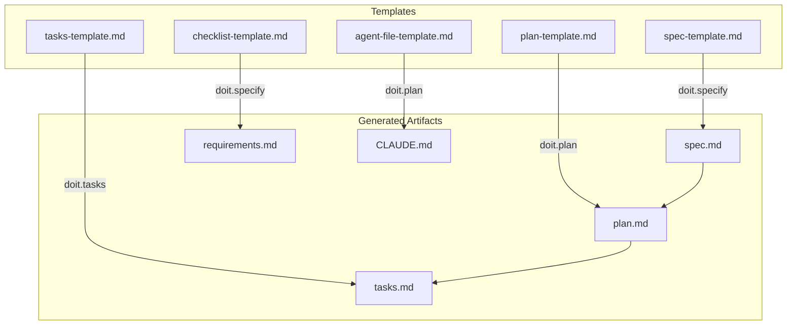
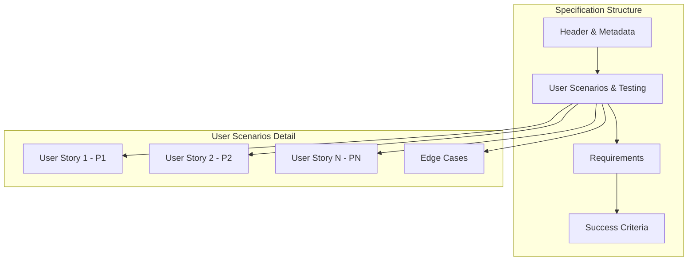
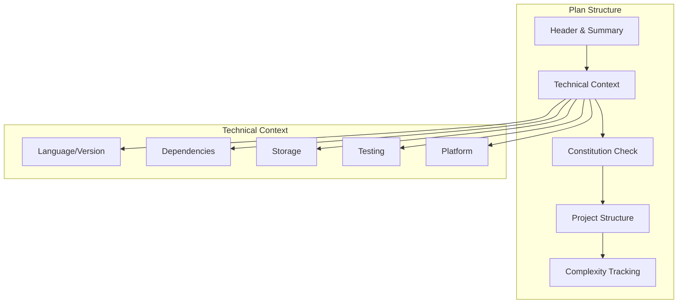
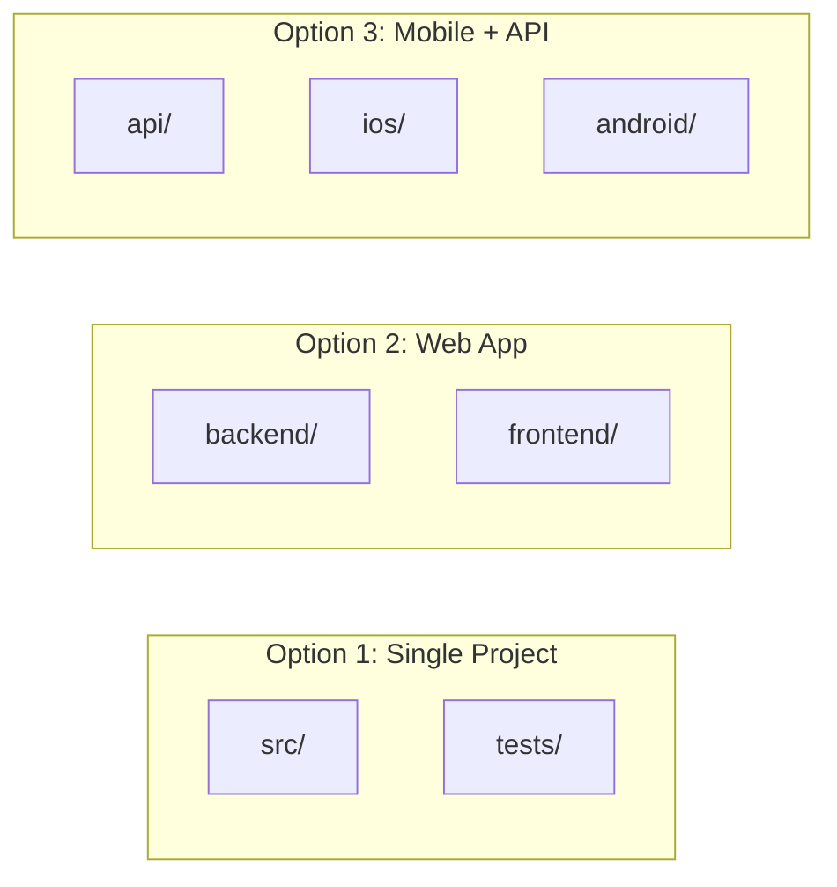
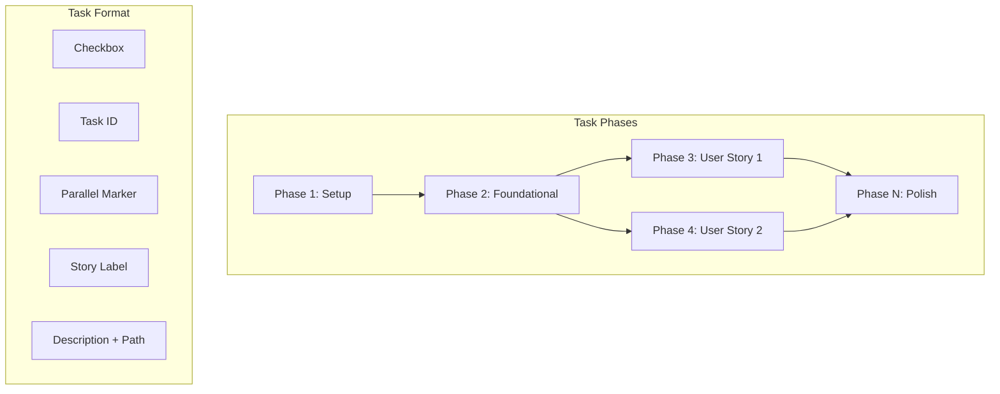
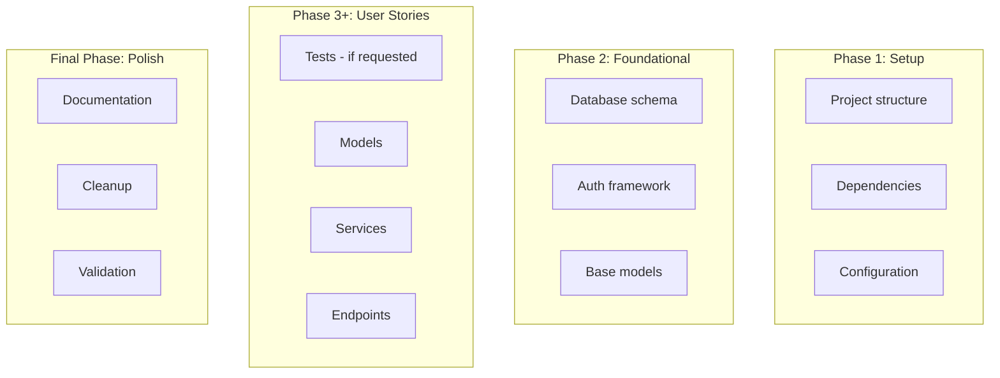
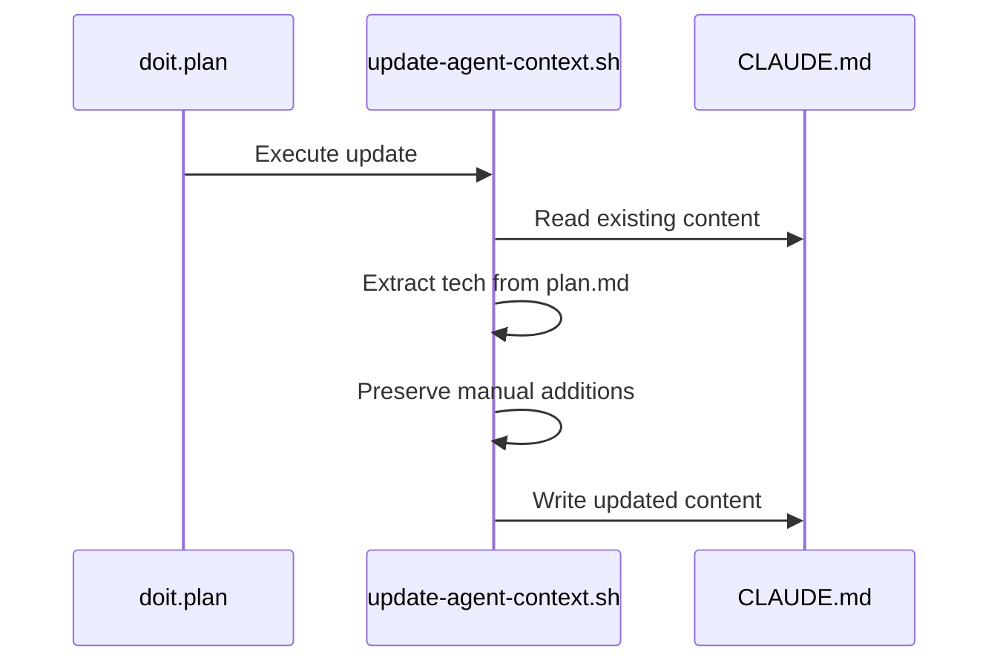
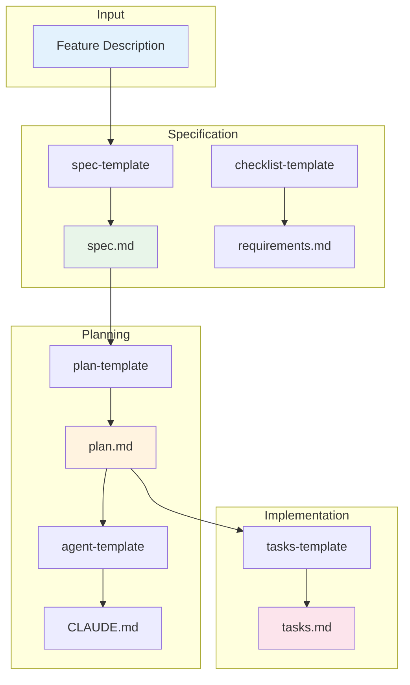

# Root Templates Documentation

Root templates define the structure and format of generated documentation artifacts. They serve as blueprints that command templates fill in during workflow execution.

## Template Relationships



---

## spec-template.md

**Purpose**: Defines the structure for feature specifications

**Used By**: `/doit.specit` command

**Output**: `specs/XXX-feature-name/spec.md`

### Structure



### Key Sections

| Section | Purpose | Required |
|---------|---------|----------|
| Header | Feature name, branch, status, date | Yes |
| User Scenarios | Prioritized user journeys with acceptance criteria | Yes |
| Functional Requirements | FR-XXX formatted requirements | Yes |
| Key Entities | Data entities (if applicable) | Conditional |
| Success Criteria | Measurable outcomes | Yes |

### User Story Format

Each user story follows this structure:

```markdown
### User Story N - [Title] (Priority: PN)

[Description]

**Why this priority**: [Justification]

**Independent Test**: [How to verify independently]

**Acceptance Scenarios**:
1. **Given** [state], **When** [action], **Then** [outcome]
```

### Guidelines

- **Focus on WHAT and WHY**, not HOW
- Requirements must be testable and unambiguous
- Success criteria must be technology-agnostic
- Maximum 3 `[NEEDS CLARIFICATION]` markers allowed
- Each user story should be independently deliverable

---

## plan-template.md

**Purpose**: Defines the implementation plan structure

**Used By**: `/doit.planit` command

**Output**: `specs/XXX-feature-name/plan.md`

### Structure



### Key Sections

| Section | Purpose | Required |
|---------|---------|----------|
| Header | Branch, date, spec link | Yes |
| Summary | Primary requirement + technical approach | Yes |
| Technical Context | Tech stack details | Yes |
| Constitution Check | Gate validation | Yes |
| Project Structure | Directory layout | Yes |
| Complexity Tracking | Justifications for violations | Conditional |

### Technical Context Fields

```markdown
**Language/Version**: [e.g., Python 3.11]
**Primary Dependencies**: [e.g., FastAPI, Pydantic]
**Storage**: [e.g., PostgreSQL or N/A]
**Testing**: [e.g., pytest]
**Target Platform**: [e.g., Linux server]
**Project Type**: [single/web/mobile]
**Performance Goals**: [domain-specific]
**Constraints**: [specific limitations]
**Scale/Scope**: [expected volume]
```

### Project Structure Options

The template supports three structure options:



---

## tasks-template.md

**Purpose**: Defines the task breakdown structure

**Used By**: `/doit.taskit` command

**Output**: `specs/XXX-feature-name/tasks.md`

### Structure



### Task Format

```text
- [ ] T001 [P] [US1] Description with exact/file/path.py
```

| Component | Description | Example |
|-----------|-------------|---------|
| Checkbox | `- [ ]` for pending, `- [X]` for complete | `- [ ]` |
| Task ID | Sequential identifier | `T001` |
| [P] | Parallel marker (optional) | `[P]` |
| [Story] | User story reference | `[US1]` |
| Description | Action with file path | `Create User model in src/models/user.py` |

### Phase Organization



### Parallel Execution Rules

- Tasks marked `[P]` can run concurrently
- Tasks affecting the same file must run sequentially
- User stories can be worked in parallel after foundational phase

---

## checklist-template.md

**Purpose**: Generic checklist format for validation

**Used By**: `/doit.specit` (requirements checklist)

**Output**: Various checklist files in `specs/XXX/checklists/`

### Structure

```markdown
# [CHECKLIST TYPE] Checklist: [FEATURE NAME]

**Purpose**: [Description]
**Created**: [DATE]
**Feature**: [Link to spec.md]

## [Category 1]

- [ ] CHK001 First checklist item
- [ ] CHK002 Second checklist item

## [Category 2]

- [ ] CHK003 Category item
- [ ] CHK004 Another item

## Notes

- Additional guidance
```

### Usage Patterns

| Checklist Type | Purpose | Generated By |
|----------------|---------|--------------|
| Requirements | Spec quality validation | doit.specify |
| Code Review | Implementation review | doit.review |
| Manual Test | Testing verification | doit.test |

---

## agent-file-template.md

**Purpose**: AI agent context file structure

**Used By**: `/doit.planit` command

**Output**: `CLAUDE.md` (or equivalent agent file)

### Structure

```markdown
# [PROJECT NAME] Development Guidelines

Auto-generated from all feature plans. Last updated: [DATE]

## Active Technologies

[Extracted from plan files]

## Project Structure

```text
[Actual structure from plans]
```

## Commands

[Only commands for active technologies]

## Code Style

[Language-specific guidance]

## Recent Changes

[Last 3 features and additions]

<!-- MANUAL ADDITIONS START -->
<!-- MANUAL ADDITIONS END -->
```

### Update Process



### Key Features

- Auto-generated from feature plans
- Preserves manual additions between markers
- Updates technology list incrementally
- Tracks recent feature changes

---

## Template Interaction Summary


