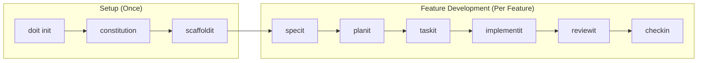
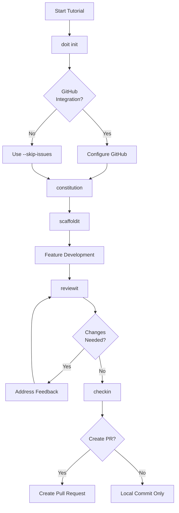
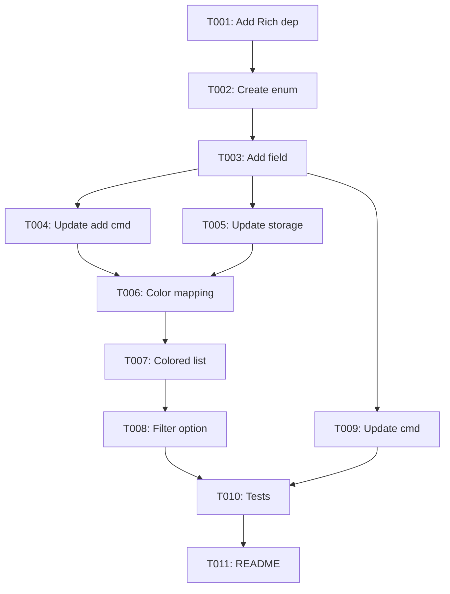
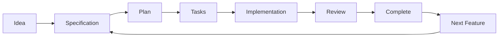

# Tutorial 1: Building a Greenfield Project with Do-It

Learn the complete Do-It spec-driven development workflow by building a TaskFlow CLI application from scratch.

## What You'll Build

**TaskFlow CLI** - A command-line task management application with the following features:
- Create, list, and complete tasks
- Assign priority levels to tasks (the feature we'll implement together)
- Store tasks in a local JSON file

By the end of this tutorial, you'll have:
- A fully initialized Do-It project
- A project constitution defining your development principles
- A complete feature implemented using the Do-It workflow
- GitHub issues and a pull request (optional)

## Time Estimate

**Total time**: ~2 hours

| Section | Time |
|---------|------|
| Setup & Installation | 10 min |
| Project Initialization | 15 min |
| Constitution & Scaffolding | 20 min |
| Feature Specification | 15 min |
| Planning & Tasks | 20 min |
| Implementation | 30 min |
| Review & Completion | 10 min |

## Do-It Workflow Overview

This tutorial follows the complete Do-It spec-driven development workflow:



### Decision Points

At various points, you may need to make choices or skip optional steps:



## Prerequisites

Before starting, ensure you have:

- [ ] **Python 3.11+** installed (`python --version`)
- [ ] **Git** installed and configured (`git --version`)
- [ ] **Claude Code** or compatible AI IDE installed
- [ ] **GitHub account** (optional - for issue/PR creation)
- [ ] A terminal/command line application

> **Windows Users**: We recommend using WSL (Windows Subsystem for Linux) for the best experience. All commands in this tutorial use Unix-style syntax.

---

## Section 1: Installation

### Step 1.1: Install Do-It CLI

Open your terminal and install Do-It using pip:

```bash
pip install doit-toolkit-cli
```

### Step 1.2: Verify Installation

Confirm Do-It is installed correctly:

```bash
doit --version
```

You should see output like:

```text
doit-cli version 0.1.11
```

### Step 1.3: Verify Claude Code

Ensure Claude Code is available in your IDE. Do-It's slash commands (like `/doit.specit`) run inside Claude Code.

> **Tip**: If you're using VS Code, install the Claude Code extension from the marketplace.

**Checkpoint**: Do-It CLI installed and Claude Code ready.

---

## Section 2: Project Initialization

Let's create a new project and initialize Do-It.

### Step 2.1: Create Project Directory

```bash
mkdir taskflow-cli
cd taskflow-cli
git init
```

### Step 2.2: Run doit init

Initialize Do-It in your project:

```bash
doit init
```

You'll see an interactive prompt:

```text
$ doit init

Welcome to Do-It! Let's set up your project.

Project name [taskflow-cli]: taskflow-cli
Project description: A command-line task management application
Primary language [python]: python
Project type (cli/web/api/library) [cli]: cli
Use GitHub integration? [Y/n]: Y
GitHub repository URL (leave blank to create later):

Creating Do-It configuration...
✓ Created .doit/ directory
✓ Created .doit/constitution.md (template)
✓ Created .doit/roadmap.md (template)
✓ Initialized specs/ directory

Do-It initialized successfully!

Next steps:
  1. Run /doit.constitution to define your project principles
  2. Run /doit.scaffoldit to generate project structure
```

### Step 2.3: Review Created Files

Check what Do-It created:

```bash
ls -la .doit/
```

```text
.doit/
├── constitution.md    # Project principles (template)
├── roadmap.md         # Project roadmap (template)
└── templates/         # Do-It templates
    ├── spec-template.md
    ├── plan-template.md
    └── ...
```

**Checkpoint**: Do-It initialized with configuration files created.

---

## Section 3: Constitution Setup

The constitution defines your project's principles, technology choices, and development standards. Let's create one.

### Step 3.1: Run /doit.constitution

In Claude Code, run:

```text
/doit.constitution
```

Claude will guide you through defining your project:

```text
$ /doit.constitution

I'll help you create a constitution for TaskFlow CLI. Let me ask a few questions:

## Question 1: Core Technology Stack

What technologies will this project use?

| Option | Answer | Description |
|--------|--------|-------------|
| A | Python + Click | CLI framework with decorators |
| B | Python + Typer | Modern CLI with type hints |
| C | Python + argparse | Standard library option |

Your choice: B

Great! Typer is excellent for modern Python CLIs with automatic help generation.

## Question 2: Data Storage

How will tasks be persisted?

| Option | Answer | Description |
|--------|--------|-------------|
| A | JSON file | Simple, human-readable |
| B | SQLite | Structured, queryable |
| C | YAML file | Configuration-style |

Your choice: A

JSON files are perfect for a simple CLI tool.

## Question 3: Code Quality Standards

What quality standards should the project follow?

| Option | Answer | Description |
|--------|--------|-------------|
| A | Minimal | Basic linting only |
| B | Standard | Linting + formatting + type hints |
| C | Strict | Full test coverage + CI/CD |

Your choice: B

Standard quality with linting, formatting, and type hints.

Creating constitution...
```

### Step 3.2: Review Generated Constitution

After completion, review `.doit/constitution.md`:

```markdown
# TaskFlow CLI Constitution

## Project Identity
- **Name**: TaskFlow CLI
- **Purpose**: A command-line task management application
- **Type**: CLI Application

## Technology Principles
- **Language**: Python 3.11+
- **CLI Framework**: Typer
- **Data Storage**: JSON files
- **Package Manager**: pip with pyproject.toml

## Code Quality Standards
- **Linting**: Ruff
- **Formatting**: Black
- **Type Checking**: Type hints required for public APIs
- **Testing**: pytest for unit tests

## Development Workflow
- **Branching**: Feature branches from main
- **Commits**: Conventional commit messages
- **Reviews**: Required before merge

## File Structure Conventions
- Source code in `src/taskflow/`
- Tests in `tests/`
- Documentation in `docs/`
```

> **Tip**: You can update the constitution anytime by running `/doit.constitution` again.

**Checkpoint**: Constitution created with project principles defined.

---

## Section 4: Project Scaffolding

Now let's generate the initial project structure based on your constitution.

### Step 4.1: Run /doit.scaffoldit

In Claude Code, run:

```text
/doit.scaffoldit
```

Claude will analyze your constitution and generate the project structure:

```text
$ /doit.scaffoldit

Based on your constitution, I'll create the following structure:

taskflow-cli/
├── src/
│   └── taskflow/
│       ├── __init__.py
│       ├── main.py          # CLI entry point
│       ├── commands/        # CLI commands
│       │   ├── __init__.py
│       │   └── tasks.py     # Task commands
│       ├── models/          # Data models
│       │   ├── __init__.py
│       │   └── task.py      # Task model
│       └── storage/         # Data persistence
│           ├── __init__.py
│           └── json_store.py
├── tests/
│   ├── __init__.py
│   └── test_tasks.py
├── pyproject.toml
├── README.md
└── .gitignore

Shall I create this structure? [Y/n]: Y

Creating files...
✓ Created src/taskflow/__init__.py
✓ Created src/taskflow/main.py
✓ Created src/taskflow/commands/tasks.py
✓ Created src/taskflow/models/task.py
✓ Created src/taskflow/storage/json_store.py
✓ Created tests/test_tasks.py
✓ Created pyproject.toml
✓ Created README.md
✓ Created .gitignore

Project structure created successfully!
```

### Step 4.2: Review Generated Files

Check the main entry point `src/taskflow/main.py`:

```python
"""TaskFlow CLI - A command-line task management application."""
import typer

app = typer.Typer(help="TaskFlow - Manage your tasks from the command line")

@app.command()
def add(title: str, description: str = ""):
    """Add a new task."""
    typer.echo(f"Adding task: {title}")
    # TODO: Implement task creation

@app.command()
def list():
    """List all tasks."""
    typer.echo("Listing tasks...")
    # TODO: Implement task listing

@app.command()
def complete(task_id: int):
    """Mark a task as complete."""
    typer.echo(f"Completing task {task_id}")
    # TODO: Implement task completion

if __name__ == "__main__":
    app()
```

### Step 4.3: Test the Scaffold

Install the project in development mode and verify it works:

```bash
pip install -e .
taskflow --help
```

```text
Usage: taskflow [OPTIONS] COMMAND [ARGS]...

  TaskFlow - Manage your tasks from the command line

Options:
  --help  Show this message and exit.

Commands:
  add       Add a new task.
  complete  Mark a task as complete.
  list      List all tasks.
```

**Checkpoint**: Project structure created with working CLI skeleton.

---

## Section 5: Feature Specification

Now let's add a new feature using the Do-It spec-driven workflow. We'll add **task priority levels**.

### Step 5.1: Run /doit.specit

In Claude Code, describe your feature:

```text
/doit.specit Add task priority levels so users can organize tasks by importance
```

Claude will help you create a detailed specification:

```text
$ /doit.specit Add task priority levels so users can organize tasks by importance

I'll create a specification for task priority levels. Let me clarify a few things:

## Ambiguity Resolution

### Question 1: Priority Scale

**Context**: The feature needs a priority system but the scale isn't defined.

| Option | Answer | Implications |
|--------|--------|--------------|
| A | High/Medium/Low | Simple 3-tier, easy to understand |
| B | 1-5 numeric | Granular, sortable |
| C | P1/P2/P3/P4 | Agile-style, familiar to devs |

Your choice: A

### Question 2: Default Priority

**Context**: What priority should new tasks have by default?

| Option | Answer | Implications |
|--------|--------|--------------|
| A | No default (required) | Forces user decision |
| B | Medium | Balanced default |
| C | Low | Conservative default |

Your choice: B

### Question 3: Priority Display

**Context**: How should priorities be shown in task list?

| Option | Answer | Implications |
|--------|--------|--------------|
| A | Color-coded | Visual distinction |
| B | Text prefix [HIGH] | Works everywhere |
| C | Sorted by priority | Automatic organization |

Your choice: A

Creating specification...
✓ Created specs/001-task-priority/
✓ Created specs/001-task-priority/spec.md
✓ Created GitHub issue #1: [Feature] Add task priority levels
```

### Step 5.2: Review the Specification

Open `specs/001-task-priority/spec.md`:

```markdown
# Feature Specification: Task Priority Levels

**Feature Branch**: `001-task-priority`
**Created**: 2026-01-13
**Status**: Draft

## Summary

Add a priority system to tasks allowing users to categorize tasks as
High, Medium, or Low priority. Priorities will be color-coded in the
task list for easy visual identification.

## User Stories

### US1: Set Task Priority (Priority: P1)

As a user, I want to assign a priority level when creating a task
so that I can organize my work by importance.

**Acceptance Criteria**:
- Tasks can be created with --priority flag
- Valid values: high, medium, low
- Default priority is medium
- Invalid values show helpful error message

### US2: View Priorities in List (Priority: P1)

As a user, I want to see task priorities in the task list
so that I can quickly identify high-priority items.

**Acceptance Criteria**:
- Task list shows priority for each task
- Priorities are color-coded (red=high, yellow=medium, green=low)
- Tasks can be filtered by priority

### US3: Update Task Priority (Priority: P2)

As a user, I want to change a task's priority
so that I can reprioritize as circumstances change.

**Acceptance Criteria**:
- Existing tasks can have priority updated
- Update command accepts --priority flag
```

> **Note**: The specification includes user stories with priorities (P1, P2) to guide implementation order.

**Checkpoint**: Feature specification created with clear requirements.

---

## Section 6: Implementation Planning

With a specification in hand, let's create an implementation plan.

### Step 6.1: Run /doit.planit

In Claude Code, run:

```text
/doit.planit
```

Claude will analyze your spec and create a detailed plan:

```text
$ /doit.planit

Analyzing specification for 001-task-priority...

I'll create an implementation plan. First, let me research your codebase...

## Research Summary

Analyzed files:
- src/taskflow/models/task.py - Task model exists, no priority field
- src/taskflow/commands/tasks.py - Commands exist, need --priority flag
- src/taskflow/storage/json_store.py - JSON storage, needs schema update

## Implementation Approach

**Pattern**: Add priority as an enum field to the Task model, update CLI
commands to accept --priority flag, and modify display to show colors.

**Key Decisions**:
1. Use Python Enum for type-safe priorities
2. Store priority as string in JSON for readability
3. Use Rich library for colored terminal output

Creating plan...
✓ Created specs/001-task-priority/research.md
✓ Created specs/001-task-priority/plan.md

Plan ready for review. Run /doit.taskit when approved.
```

### Step 6.2: Review the Plan

Open `specs/001-task-priority/plan.md`:

```markdown
# Implementation Plan: Task Priority Levels

## Technical Approach

### Data Model Changes

Add Priority enum and field to Task model:

```python
from enum import Enum

class Priority(str, Enum):
    HIGH = "high"
    MEDIUM = "medium"
    LOW = "low"

@dataclass
class Task:
    id: int
    title: str
    description: str
    completed: bool
    priority: Priority = Priority.MEDIUM  # New field
```

### CLI Changes

Update add command:

```python
@app.command()
def add(
    title: str,
    description: str = "",
    priority: Priority = Priority.MEDIUM  # New parameter
):
    ...
```

### Display Changes

Use Rich for colored output:

```python
PRIORITY_COLORS = {
    Priority.HIGH: "red",
    Priority.MEDIUM: "yellow",
    Priority.LOW: "green"
}
```

## File Changes Summary

| File | Change Type | Description |
|------|-------------|-------------|
| models/task.py | Modify | Add Priority enum and field |
| commands/tasks.py | Modify | Add --priority to add/update |
| main.py | Modify | Update list display |
| pyproject.toml | Modify | Add Rich dependency |
```

### Step 6.3: Approve the Plan

If the plan looks good, you're ready for the next step. If changes are needed, discuss with Claude and regenerate.

**Checkpoint**: Implementation plan created and approved.

---

## Section 7: Task Generation

Now let's break the plan into actionable tasks.

### Step 7.1: Run /doit.taskit

In Claude Code, run:

```text
/doit.taskit
```

Claude will generate a detailed task list:

```text
$ /doit.taskit

Generating tasks from implementation plan...

Creating task breakdown:

## Phase 1: Setup
- T001: Add Rich dependency to pyproject.toml

## Phase 2: US1 - Set Task Priority
- T002: Create Priority enum in models/task.py
- T003: Add priority field to Task dataclass
- T004: Update add command with --priority flag
- T005: Update JSON storage for priority field

## Phase 3: US2 - View Priorities
- T006: Create priority color mapping
- T007: Update list command with colored output
- T008: Add priority filter option

## Phase 4: US3 - Update Priority
- T009: Add update command with --priority flag

## Phase 5: Polish
- T010: Add unit tests for priority features
- T011: Update README with priority documentation

✓ Created specs/001-task-priority/tasks.md
✓ Created GitHub issues #2-12 (linked to Epic #1)

Tasks ready. Run /doit.implementit to start implementation.
```

### Step 7.2: Review Tasks

Open `specs/001-task-priority/tasks.md`:

```markdown
# Tasks: Task Priority Levels

## Task Dependencies



## Phase 1: Setup

- [ ] T001 Add Rich dependency to pyproject.toml

## Phase 2: US1 - Set Task Priority (P1)

- [ ] T002 [US1] Create Priority enum in src/taskflow/models/task.py
- [ ] T003 [US1] Add priority field to Task dataclass
- [ ] T004 [US1] Update add command with --priority in commands/tasks.py
- [ ] T005 [US1] Update JSON storage schema in storage/json_store.py

## Phase 3: US2 - View Priorities (P1)

- [ ] T006 [US2] Create priority color mapping in main.py
- [ ] T007 [US2] Update list command with colored output
- [ ] T008 [US2] Add --priority filter option to list command
```

**Checkpoint**: Tasks generated with dependencies mapped.

---

## Section 8: Implementation

Now let's implement the feature task by task.

### Step 8.1: Run /doit.implementit

In Claude Code, run:

```text
/doit.implementit
```

Claude will start working through the tasks:

```text
$ /doit.implementit

Starting implementation of 001-task-priority...

## T001: Add Rich dependency to pyproject.toml

Adding Rich for colored terminal output...

```diff
 [project]
 dependencies = [
     "typer>=0.9.0",
+    "rich>=13.0.0",
 ]
```

✓ T001 complete

## T002: Create Priority enum in src/taskflow/models/task.py

Creating Priority enum...

```python
from enum import Enum

class Priority(str, Enum):
    """Task priority levels."""
    HIGH = "high"
    MEDIUM = "medium"
    LOW = "low"

    @classmethod
    def from_string(cls, value: str) -> "Priority":
        """Convert string to Priority, case-insensitive."""
        try:
            return cls(value.lower())
        except ValueError:
            raise ValueError(
                f"Invalid priority '{value}'. "
                f"Valid options: {', '.join(p.value for p in cls)}"
            )
```

✓ T002 complete

## T003: Add priority field to Task dataclass

Updating Task model...

```python
@dataclass
class Task:
    """A task item."""
    id: int
    title: str
    description: str = ""
    completed: bool = False
    priority: Priority = Priority.MEDIUM

    def to_dict(self) -> dict:
        """Convert to dictionary for JSON storage."""
        return {
            "id": self.id,
            "title": self.title,
            "description": self.description,
            "completed": self.completed,
            "priority": self.priority.value,
        }

    @classmethod
    def from_dict(cls, data: dict) -> "Task":
        """Create Task from dictionary."""
        return cls(
            id=data["id"],
            title=data["title"],
            description=data.get("description", ""),
            completed=data.get("completed", False),
            priority=Priority(data.get("priority", "medium")),
        )
```

✓ T003 complete

Continuing with remaining tasks...
```

### Step 8.2: Monitor Progress

Claude will continue implementing tasks, showing diffs and progress:

```text
## T004: Update add command with --priority

Updating commands/tasks.py...

```python
@app.command()
def add(
    title: str,
    description: str = typer.Option("", help="Task description"),
    priority: str = typer.Option(
        "medium",
        "--priority", "-p",
        help="Task priority (high, medium, low)"
    ),
):
    """Add a new task."""
    try:
        task_priority = Priority.from_string(priority)
    except ValueError as e:
        typer.echo(str(e), err=True)
        raise typer.Exit(1)

    task = Task(
        id=generate_id(),
        title=title,
        description=description,
        priority=task_priority,
    )
    store.save(task)
    typer.echo(f"✓ Added task #{task.id}: {title} [{task_priority.value}]")
```

✓ T004 complete

## T007: Update list command with colored output

Adding Rich console output...

```python
from rich.console import Console
from rich.table import Table

console = Console()

PRIORITY_STYLES = {
    Priority.HIGH: "bold red",
    Priority.MEDIUM: "yellow",
    Priority.LOW: "green",
}

@app.command("list")
def list_tasks(
    priority: str = typer.Option(None, "--priority", "-p", help="Filter by priority"),
):
    """List all tasks."""
    tasks = store.load_all()

    if priority:
        filter_priority = Priority.from_string(priority)
        tasks = [t for t in tasks if t.priority == filter_priority]

    table = Table(title="Tasks")
    table.add_column("ID", style="cyan")
    table.add_column("Title")
    table.add_column("Priority")
    table.add_column("Status")

    for task in tasks:
        style = PRIORITY_STYLES[task.priority]
        status = "✓" if task.completed else " "
        table.add_row(
            str(task.id),
            task.title,
            f"[{style}]{task.priority.value}[/{style}]",
            status,
        )

    console.print(table)
```

✓ T007 complete
```

### Step 8.3: Implementation Complete

When all tasks are done:

```text
## Implementation Summary

✓ T001: Add Rich dependency to pyproject.toml
✓ T002: Create Priority enum in src/taskflow/models/task.py
✓ T003: Add priority field to Task dataclass
✓ T004: Update add command with --priority flag
✓ T005: Update JSON storage schema
✓ T006: Create priority color mapping
✓ T007: Update list command with colored output
✓ T008: Add --priority filter option
✓ T009: Add update command with --priority flag
✓ T010: Add unit tests
✓ T011: Update README

All tasks complete! Run /doit.reviewit to review the implementation.
```

### Step 8.4: Test the Implementation

Try out the new feature:

```bash
pip install -e .  # Reinstall with new dependencies

taskflow add "Write documentation" --priority high
taskflow add "Fix bug" --priority medium
taskflow add "Clean up code" --priority low

taskflow list
```

```text
                    Tasks
┏━━━━┳━━━━━━━━━━━━━━━━━━━━━━┳━━━━━━━━━━┳━━━━━━━━┓
┃ ID ┃ Title                ┃ Priority ┃ Status ┃
┡━━━━╇━━━━━━━━━━━━━━━━━━━━━━╇━━━━━━━━━━╇━━━━━━━━┩
│ 1  │ Write documentation  │ high     │        │
│ 2  │ Fix bug              │ medium   │        │
│ 3  │ Clean up code        │ low      │        │
└────┴──────────────────────┴──────────┴────────┘
```

**Checkpoint**: Feature implemented and working.

---

## Section 9: Code Review

Let's review the implementation for quality and completeness.

### Step 9.1: Run /doit.reviewit

In Claude Code, run:

```text
/doit.reviewit
```

Claude will review all changes:

```text
$ /doit.reviewit

Reviewing implementation for 001-task-priority...

## Code Quality Review

### ✓ Passes

- [x] Type hints present on all public functions
- [x] Docstrings on classes and public methods
- [x] Error handling for invalid priority values
- [x] Consistent coding style with existing code
- [x] Tests cover happy path and error cases

### ⚠️ Suggestions

1. **models/task.py:15** - Consider adding `__str__` method to Priority enum
   for cleaner string output.

2. **commands/tasks.py:45** - The error message could include available
   options more prominently.

### 📋 Checklist

- [x] All acceptance criteria met
- [x] No security vulnerabilities introduced
- [x] Backward compatible with existing tasks.json files
- [x] Documentation updated

## Summary

Implementation looks good! Minor suggestions above are optional improvements.

Ready to proceed with /doit.checkin? [Y/n]: Y
```

### Step 9.2: Address Feedback (Optional)

If there are required changes, Claude will help you fix them before proceeding.

**Checkpoint**: Code reviewed and approved.

---

## Section 10: Feature Completion

Time to finalize the feature with git commits and a pull request.

### Step 10.1: Run /doit.checkin

In Claude Code, run:

```text
/doit.checkin
```

Claude will finalize everything:

```text
$ /doit.checkin

Finalizing feature 001-task-priority...

## Git Status

Changes to commit:
  modified:   pyproject.toml
  modified:   src/taskflow/models/task.py
  modified:   src/taskflow/commands/tasks.py
  modified:   src/taskflow/main.py
  modified:   src/taskflow/storage/json_store.py
  new file:   tests/test_priority.py
  modified:   README.md

## Creating Commit

```bash
git add -A
git commit -m "feat(tasks): add task priority levels

- Add Priority enum (high, medium, low)
- Add --priority flag to add and update commands
- Add colored priority display in task list
- Add priority filter option

Closes #1"
```

✓ Commit created

## Creating Pull Request

Creating PR from 001-task-priority → main...

✓ Pull Request #2 created
  https://github.com/yourusername/taskflow-cli/pull/2

## Closing Issues

✓ Issue #1 linked to PR #2 (will close on merge)
✓ Task issues #2-12 linked to PR #2

## Summary

Feature 001-task-priority is ready for merge!

- PR: https://github.com/yourusername/taskflow-cli/pull/2
- Branch: 001-task-priority
- Commits: 1
- Files changed: 7
```

> **Without GitHub**: If you're not using GitHub integration, Do-It will still create commits and provide instructions for manual PR creation.

**Checkpoint**: Feature complete with PR ready for merge.

---

## Section 11: Bonus - Running Tests

Do-It can help you run and manage tests.

### Step 11.1: Run /doit.testit

```text
/doit.testit
```

```text
$ /doit.testit

Running tests for taskflow-cli...

$ pytest tests/ -v

tests/test_tasks.py::test_add_task PASSED
tests/test_tasks.py::test_list_tasks PASSED
tests/test_priority.py::test_priority_enum PASSED
tests/test_priority.py::test_add_with_priority PASSED
tests/test_priority.py::test_invalid_priority PASSED
tests/test_priority.py::test_filter_by_priority PASSED

==================== 6 passed in 0.42s ====================

All tests passing!
```

---

## Section 12: Bonus - Managing the Roadmap

Do-It helps you track features and plan future work.

### Step 12.1: Run /doit.roadmapit

```text
/doit.roadmapit
```

```text
$ /doit.roadmapit

Current roadmap for taskflow-cli:

## Completed Features
- [x] 001-task-priority - Task priority levels

## Planned Features
(No features planned)

Would you like to add features to the roadmap?

Enter feature ideas (or 'done' to finish):
> Add due dates to tasks
> Task categories/tags
> Export tasks to CSV
> done

Updated roadmap:

## Planned Features (Backlog)
1. Add due dates to tasks
2. Task categories/tags
3. Export tasks to CSV

Roadmap saved to .doit/roadmap.md
```

---

## Section 13: Summary

Congratulations! You've completed your first feature using the Do-It workflow.

### What You Accomplished

1. **Initialized** a new project with `doit init`
2. **Defined** project principles with `/doit.constitution`
3. **Generated** project structure with `/doit.scaffoldit`
4. **Specified** a feature with `/doit.specit`
5. **Planned** the implementation with `/doit.planit`
6. **Created** actionable tasks with `/doit.taskit`
7. **Implemented** the feature with `/doit.implementit`
8. **Reviewed** the code with `/doit.reviewit`
9. **Completed** the feature with `/doit.checkin`

### The Do-It Workflow



### Key Takeaways

1. **Spec-first development** catches ambiguity early through clarifying questions
2. **Task breakdown** makes complex features manageable
3. **Incremental implementation** allows frequent checkpoints
4. **Built-in review** ensures quality before merge

### Next Steps

- **Try another feature**: Run `/doit.specit` with a new idea
- **Explore existing projects**: See [Tutorial 2: Existing Project](02-existing-project-tutorial.md)
- **Customize templates**: Check `.doit/templates/` for customization options
- **Read the docs**: Visit the [Do-It Documentation](../index.md)

### Troubleshooting Tips

| Problem | Solution |
|---------|----------|
| Command not found | Ensure Do-It is installed: `pip install doit-toolkit-cli` |
| Slash command doesn't work | Make sure you're in Claude Code, not terminal |
| GitHub issues not created | Check `--skip-issues` flag or GitHub authentication |
| Tests failing | Run `/doit.testit` to see detailed output |

---

**You've completed Tutorial 1!** You now know how to use Do-It for greenfield projects.
