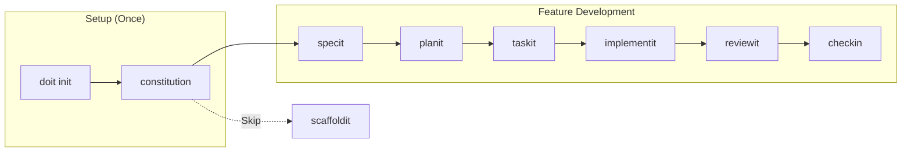
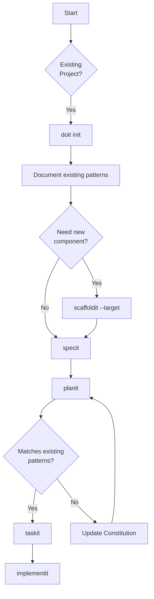
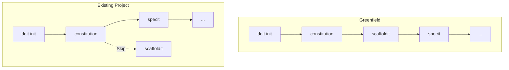

# Tutorial 2: Adding Do-It to an Existing Project

Learn how to integrate Do-It into an existing codebase and add new features using spec-driven development.

## What You'll Learn

This tutorial shows you how to:
- Add Do-It to a project that already has code
- Create a constitution that reflects your existing patterns
- Use the Do-It workflow alongside your current development process
- Know which commands to skip or adapt for existing projects

**Sample Project**: We'll use a Weather API (Flask/FastAPI) as our example, but the concepts apply to any existing project.

## Time Estimate

**Total time**: ~90 minutes

| Section | Time |
|---------|------|
| Preparation | 10 min |
| Initialization | 15 min |
| Constitution Setup | 20 min |
| Feature Development | 35 min |
| Review & Completion | 10 min |

## Workflow Overview

For existing projects, the workflow is similar but skips scaffolding:



### Decision Points for Existing Projects



## Prerequisites

Before starting, ensure you have:

- [ ] **An existing project** (or clone the sample Weather API)
- [ ] **Do-It CLI installed** (`pip install doit-cli`)
- [ ] **Git initialized** in your project (`git status` works)
- [ ] **Claude Code** or compatible AI IDE

### Using the Sample Project (Optional)

If you don't have a project ready, use our sample Weather API:

```bash
git clone https://github.com/doit-examples/weather-api.git
cd weather-api
```

The Weather API has this structure:

```text
weather-api/
├── src/
│   └── weather/
│       ├── __init__.py
│       ├── app.py           # FastAPI application
│       ├── routes/
│       │   └── forecast.py  # Forecast endpoints
│       ├── models/
│       │   └── weather.py   # Weather data models
│       └── services/
│           └── weather_service.py
├── tests/
├── pyproject.toml
└── README.md
```

---

## Section 1: Preparing Your Project

Before adding Do-It, let's prepare your existing codebase.

### Step 1.1: Create a Backup (Recommended)

While Do-It doesn't modify your existing code during initialization, it's good practice to have a clean state:

```bash
git status  # Ensure working directory is clean
git stash   # Or commit any pending changes
```

### Step 1.2: Understand What Do-It Will Add

Do-It will create these new files/directories:

```text
your-project/
├── .doit/                 # NEW: Do-It configuration
│   ├── constitution.md    # Project principles
│   ├── roadmap.md         # Feature roadmap
│   └── templates/         # Spec templates
├── specs/                 # NEW: Feature specifications
└── (your existing files remain unchanged)
```

> **Important**: Do-It never modifies your existing source code during initialization. It only adds new directories for specifications and configuration.

### Step 1.3: Review Your Project Structure

Take note of your existing patterns:

- **Where is your source code?** (`src/`, `app/`, `lib/`?)
- **Where are your tests?** (`tests/`, `test/`, `spec/`?)
- **What frameworks do you use?** (Flask, FastAPI, Django?)
- **What's your coding style?** (PEP 8, specific linter config?)

You'll use this information when setting up the constitution.

**Checkpoint**: Project backed up and structure reviewed.

---

## Section 2: Initialization

Now let's initialize Do-It in your existing project.

### Step 2.1: Run doit init

From your project root:

```bash
doit init
```

You'll see prompts tailored for existing projects:

```text
$ doit init

Welcome to Do-It! Let's set up your project.

I detected this is an existing project with:
- Python source code in src/weather/
- Tests in tests/
- pyproject.toml configuration

Project name [weather-api]: weather-api
Project description: Weather forecast API service
Primary language [python]: python
Project type (cli/web/api/library) [api]: api
Use GitHub integration? [Y/n]: Y
GitHub repository URL: https://github.com/myorg/weather-api

Creating Do-It configuration...
✓ Created .doit/ directory
✓ Created .doit/constitution.md (template)
✓ Created .doit/roadmap.md (template)
✓ Initialized specs/ directory

Do-It initialized successfully!

Since this is an existing project, your next steps are:
  1. Run /doit.constitution to document your existing patterns
  2. Skip /doit.scaffoldit (you already have structure!)
  3. Run /doit.specit when you're ready to add a feature
```

### Step 2.2: Multi-Agent Setup (Optional)

If you're using multiple AI agents (both Claude Code and GitHub Copilot), run:

```bash
doit sync-prompts
```

This ensures all your AI assistants have the same command templates.

### Step 2.3: Key Difference - Skip Scaffolding

Notice that Do-It recognizes this is an existing project and suggests **skipping** `/doit.scaffoldit`. This is because:

- You already have a project structure
- Scaffolding would create conflicting files
- Your existing patterns should be preserved

> **When to use scaffoldit on existing projects**: Only if you want to add a new, independent module that doesn't exist yet (e.g., adding a new microservice to a monorepo).

**Checkpoint**: Do-It initialized without modifying existing code.

---

## Section 3: Constitution for Existing Projects

The constitution for an existing project should **document what already exists**, not prescribe new patterns.

### Step 3.1: Run /doit.constitution

In Claude Code:

```text
/doit.constitution
```

Claude will analyze your existing codebase:

```text
$ /doit.constitution

I'll analyze your existing project to create a constitution that reflects your current patterns.

## Analyzing Codebase...

Found:
- Framework: FastAPI
- Structure: src/ layout with routes, models, services
- Testing: pytest with tests/ directory
- Code style: Black formatting, Ruff linting

## Question 1: Confirm Technology Stack

I detected these technologies. Are they correct?

| Technology | Detected | Confirm? |
|------------|----------|----------|
| FastAPI    | Yes      | [Y/n]    |
| SQLAlchemy | No       | Add? [y/N] |
| pytest     | Yes      | [Y/n]    |

Your confirmations: Y, N, Y

## Question 2: Existing Patterns

I found these patterns in your code:

| Pattern | Example | Keep as standard? |
|---------|---------|-------------------|
| Route organization | routes/*.py | [Y/n] |
| Service layer | services/*.py | [Y/n] |
| Pydantic models | models/*.py | [Y/n] |

Your confirmations: Y, Y, Y

## Question 3: Code Quality

Current quality tools detected:

| Tool | Config File | Status |
|------|-------------|--------|
| Black | pyproject.toml | Configured |
| Ruff | pyproject.toml | Configured |
| mypy | Not found | Add? [y/N] |

Your choice: N

Creating constitution based on existing patterns...
```

### Step 3.2: Review the Constitution

The generated constitution reflects your actual project:

```markdown
# Weather API Constitution

## Project Identity
- **Name**: Weather API
- **Purpose**: Weather forecast API service
- **Type**: REST API (FastAPI)

## Technology Stack (Existing)
- **Language**: Python 3.11+
- **Framework**: FastAPI
- **Data Models**: Pydantic
- **Testing**: pytest

## Code Organization (Existing Patterns)

```text
src/weather/
├── app.py           # FastAPI app factory
├── routes/          # API route handlers
├── models/          # Pydantic models
└── services/        # Business logic
```

## Conventions (Documented from Codebase)

### Routing
- Routes in `routes/` directory
- One file per resource (e.g., `forecast.py`)
- Router prefix matches filename

### Services
- Business logic in `services/` directory
- Services are stateless classes
- Dependency injection via FastAPI

### Models
- Pydantic models in `models/` directory
- Separate request/response models
- Use `Field()` for validation

## Quality Standards (Existing)
- **Formatting**: Black
- **Linting**: Ruff
- **Tests**: pytest in tests/ directory
```

> **Key Insight**: The constitution documents what IS, not what SHOULD BE. This helps Do-It generate code that matches your existing patterns.

> **Context Awareness**: Once your constitution is created, all subsequent Do-It commands automatically load it as context. Run `doit context show` to see what context is available to AI assistants.

**Checkpoint**: Constitution created reflecting existing project patterns.

---

## Section 4: Adding a New Feature

Now let's add a feature using the Do-It workflow. We'll add **weather alerts** to our API.

### Step 4.1: Run /doit.specit

In Claude Code, describe your feature:

```text
/doit.specit Add weather alerts endpoint that returns severe weather warnings for a location
```

```text
$ /doit.specit Add weather alerts endpoint that returns severe weather warnings for a location

I'll create a specification for weather alerts. Based on your existing patterns:
- Routes go in src/weather/routes/
- Models go in src/weather/models/
- Services go in src/weather/services/

## Ambiguity Resolution

### Question 1: Alert Data Source

**Context**: Weather alerts need data. Where should it come from?

| Option | Answer | Implications |
|--------|--------|--------------|
| A | National Weather Service API | Official US alerts |
| B | OpenWeatherMap | International coverage |
| C | Mock data for MVP | Development first |

Your choice: A

### Question 2: Alert Severity Levels

**Context**: How should alert severity be categorized?

| Option | Answer | Implications |
|--------|--------|--------------|
| A | NWS standard (Watch/Warning/Advisory) | Official categories |
| B | Custom (Low/Medium/High/Critical) | Simplified |
| C | Both (map NWS to custom) | Flexible |

Your choice: A

### Question 3: Response Format

**Context**: Following your existing patterns, alerts should...

| Option | Answer | Implications |
|--------|--------|--------------|
| A | Match forecast response style | Consistent API |
| B | Different structure | Alert-specific |

Your choice: A

Creating specification...
✓ Created specs/001-weather-alerts/
✓ Created specs/001-weather-alerts/spec.md
✓ Created GitHub issue #15: [Feature] Weather alerts endpoint
```

### Step 4.2: Review Specification

The spec follows your existing patterns:

```markdown
# Feature Specification: Weather Alerts

**Feature Branch**: `001-weather-alerts`

## Summary

Add a `/alerts/{location}` endpoint that returns severe weather warnings
from the National Weather Service API, following existing API patterns.

## User Stories

### US1: Get Weather Alerts (Priority: P1)

As an API consumer, I want to retrieve weather alerts for a location
so that I can warn users about severe weather.

**Acceptance Criteria**:
- GET /alerts/{location} returns active alerts
- Response format matches existing forecast endpoint
- Severity uses NWS categories (Watch/Warning/Advisory)
- Empty array returned if no active alerts

## Technical Notes

Following existing patterns:
- Route handler in `src/weather/routes/alerts.py`
- Pydantic model in `src/weather/models/alert.py`
- NWS integration in `src/weather/services/alert_service.py`
```

### Step 4.3: Plan and Tasks

Continue with the workflow:

```text
/doit.planit
```

```text
$ /doit.planit

Creating implementation plan for weather alerts...

## Research: Existing Patterns

Analyzed your codebase for patterns to follow:

| Pattern | Example in Your Code | Will Apply |
|---------|---------------------|------------|
| Route structure | routes/forecast.py | routes/alerts.py |
| Service injection | Depends(WeatherService) | Depends(AlertService) |
| Response model | ForecastResponse | AlertResponse |
| Error handling | HTTPException | Same pattern |

## Implementation Approach

1. Create `AlertResponse` model matching `ForecastResponse` style
2. Create `AlertService` for NWS API integration
3. Add `/alerts/{location}` route following forecast patterns
4. Add tests mirroring existing forecast tests

✓ Created specs/001-weather-alerts/plan.md
```

Then generate tasks:

```text
/doit.taskit
```

```text
$ /doit.taskit

Generating tasks based on existing patterns...

## Tasks

- [ ] T001 [US1] Create Alert model in src/weather/models/alert.py
- [ ] T002 [US1] Create AlertResponse model matching ForecastResponse
- [ ] T003 [US1] Create AlertService in src/weather/services/alert_service.py
- [ ] T004 [US1] Add NWS API integration to AlertService
- [ ] T005 [US1] Create alerts router in src/weather/routes/alerts.py
- [ ] T006 [US1] Register alerts router in app.py
- [ ] T007 Add tests in tests/test_alerts.py

✓ Created specs/001-weather-alerts/tasks.md
```

### Step 4.4: Implement

```text
/doit.implementit
```

Claude will implement following your existing patterns:

```text
$ /doit.implementit

Implementing weather alerts following existing patterns...

## T001: Create Alert model

Looking at your existing models/weather.py for patterns...

```python
# src/weather/models/alert.py
from datetime import datetime
from enum import Enum
from pydantic import BaseModel, Field

class AlertSeverity(str, Enum):
    """NWS alert severity categories."""
    WATCH = "watch"
    WARNING = "warning"
    ADVISORY = "advisory"

class Alert(BaseModel):
    """Weather alert from NWS."""
    id: str = Field(..., description="NWS alert ID")
    event: str = Field(..., description="Alert event type")
    severity: AlertSeverity
    headline: str
    description: str
    effective: datetime
    expires: datetime
    areas: list[str] = Field(default_factory=list)

    class Config:
        # Matching your existing model config
        json_schema_extra = {
            "example": {
                "id": "NWS-IDP-12345",
                "event": "Tornado Warning",
                "severity": "warning",
                "headline": "Tornado Warning for Dallas County",
                "description": "...",
                "effective": "2026-01-13T15:00:00Z",
                "expires": "2026-01-13T17:00:00Z",
                "areas": ["Dallas County", "Tarrant County"]
            }
        }
```

✓ T001 complete (following your existing model patterns)

## T005: Create alerts router

Looking at your routes/forecast.py for patterns...

```python
# src/weather/routes/alerts.py
from fastapi import APIRouter, Depends, HTTPException

from weather.models.alert import Alert, AlertResponse
from weather.services.alert_service import AlertService

router = APIRouter(prefix="/alerts", tags=["alerts"])

@router.get(
    "/{location}",
    response_model=AlertResponse,
    summary="Get weather alerts for a location",
)
async def get_alerts(
    location: str,
    alert_service: AlertService = Depends(),
) -> AlertResponse:
    """
    Retrieve active weather alerts for the specified location.

    Following existing forecast endpoint patterns.
    """
    try:
        alerts = await alert_service.get_alerts(location)
        return AlertResponse(
            location=location,
            alerts=alerts,
            count=len(alerts),
        )
    except ValueError as e:
        raise HTTPException(status_code=400, detail=str(e))
```

✓ T005 complete (matching your forecast.py patterns)

[Continues with remaining tasks...]
```

### Step 4.5: Complete the Feature

```text
/doit.reviewit
```

```text
$ /doit.reviewit

Reviewing implementation...

## Pattern Consistency Check

✓ Alert model follows existing Pydantic patterns
✓ Router structure matches forecast.py
✓ Service follows existing DI patterns
✓ Tests mirror existing test structure

## Code Quality

✓ All existing linting rules pass
✓ Type hints present
✓ Docstrings follow existing style

Implementation matches your existing patterns. Ready for checkin.
```

```text
/doit.checkin
```

```text
$ /doit.checkin

Finalizing feature 001-weather-alerts...

✓ Commit created
✓ PR #16 created: feat(alerts): add weather alerts endpoint
✓ Linked to issue #15

Feature complete!
```

**Checkpoint**: New feature added following existing patterns.

---

## Section 5: Key Differences from Greenfield

Here's what's different when using Do-It with existing projects:

### Commands to Skip

| Command | Greenfield | Existing Project |
|---------|------------|------------------|
| `doit init` | Always run | Always run |
| `/doit.constitution` | Create new | Document existing |
| `/doit.scaffoldit` | Always run | **Usually skip** |
| `/doit.specit` | Always run | Always run |
| `/doit.planit` | Always run | Always run |
| `/doit.taskit` | Always run | Always run |
| `/doit.implementit` | Always run | Always run |
| `/doit.reviewit` | Always run | Always run |
| `/doit.checkin` | Always run | Always run |

### Constitution Philosophy

| Greenfield | Existing Project |
|------------|------------------|
| Define what you WANT | Document what you HAVE |
| Choose new patterns | Preserve existing patterns |
| Set up from scratch | Retrofit configuration |

### Pattern Matching

Do-It will analyze your existing code to ensure new features:
- Follow your established file organization
- Use your existing naming conventions
- Match your code style and formatting
- Integrate with your existing architecture

### When to Use Scaffoldit on Existing Projects

Only use `/doit.scaffoldit` if you're adding a completely new, independent component:

```text
# Adding a new microservice to a monorepo
/doit.scaffoldit --target services/new-service/

# Adding a new frontend to an API project
/doit.scaffoldit --target frontend/
```

---

## Section 6: Common Scenarios

### Scenario 1: Different Structure Than Do-It Expects

**Problem**: Your project uses `app/` instead of `src/`.

**Solution**: Do-It detects your actual structure:

```text
$ /doit.constitution

I detected your source code is in app/ (not src/).
I'll update the constitution to reflect this.
```

### Scenario 2: No Tests Directory

**Problem**: Your project doesn't have tests yet.

**Solution**: Do-It will ask if you want to add testing:

```text
$ /doit.constitution

No tests directory found. Options:
A) Add tests/ directory (recommended)
B) Skip testing for now
C) Custom test location

Your choice: A
```

### Scenario 3: Monorepo with Multiple Services

**Problem**: You have multiple services in one repo.

**Solution**: Specify which service you're working on:

```text
$ doit init --service backend

Initializing Do-It for backend/ service only.
Other services (frontend/, mobile/) will be unaffected.
```

### Scenario 4: Legacy Code Without Modern Tooling

**Problem**: Old project without linting or type hints.

**Solution**: Constitution can document current state and aspirations:

```markdown
## Code Quality

### Current State
- No linting configured
- No type hints

### Aspirations (for new code)
- Add Ruff linting to new files
- Add type hints to new functions
```

---

## Section 7: Summary

### What You Accomplished

1. **Prepared** your existing project for Do-It integration
2. **Initialized** Do-It without modifying existing code
3. **Created** a constitution documenting your patterns
4. **Added** a new feature using spec-driven development
5. **Verified** the new code matches existing patterns

### Key Takeaways

1. **Do-It adapts to you** - It documents your patterns, not prescribes new ones
2. **Skip scaffoldit** - Your structure already exists
3. **Constitution reflects reality** - Document what IS, not what SHOULD BE
4. **Pattern matching** - New code follows your existing conventions

### Workflow Comparison



### Next Steps

- **Add more features**: Run `/doit.specit` for your next feature
- **Update roadmap**: Use `/doit.roadmapit` to plan future work
- **Customize templates**: Modify `.doit/templates/` to match your patterns
- **Team adoption**: Share the constitution with your team

### Troubleshooting

| Problem | Solution |
|---------|----------|
| Do-It creates wrong file structure | Update constitution with correct paths |
| Generated code doesn't match style | Review constitution quality standards |
| Can't skip scaffoldit | Use `doit init --skip-scaffold` flag |
| Existing tests break | Check test configuration in constitution |

---

**You've completed Tutorial 2!** You now know how to integrate Do-It into existing projects.

## Related Resources

- [Tutorial 1: Greenfield Project](01-greenfield-tutorial.md)
- [Do-It Documentation](../index.md)
- [Command Reference](../quickstart.md)
