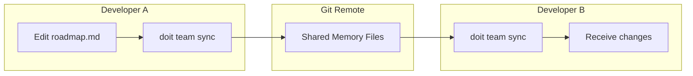
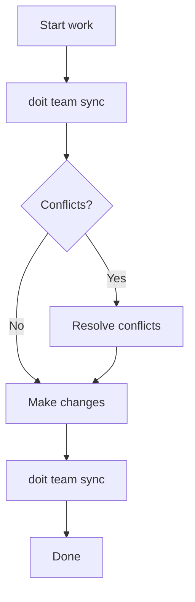

# Tutorial 3: Team Collaboration with Do-It

Learn how to set up team collaboration in Do-It so multiple developers can share project context, stay synchronized, and resolve conflicts.

## What You'll Learn

- Initialize team collaboration for a project
- Add and manage team members
- Synchronize shared memory files via Git
- Handle notifications about team changes
- Resolve conflicts when multiple developers edit the same files

## Time Estimate

**Total time**: ~45 minutes

| Section | Time |
|---------|------|
| Setup & Prerequisites | 5 min |
| Initialize Team Collaboration | 10 min |
| Managing Team Members | 10 min |
| Synchronizing Changes | 10 min |
| Handling Conflicts | 10 min |

## Prerequisites

Before starting, ensure you have:

- [ ] **Do-It CLI installed** (`pip install doit-toolkit-cli`)
- [ ] **Git configured** with your name and email
- [ ] **An initialized Do-It project** (`doit init` completed)
- [ ] **A remote Git repository** (GitHub, GitLab, Azure DevOps)
- [ ] **At least one other team member** to collaborate with

> **Note**: Team collaboration uses Git as the synchronization mechanism. All team members must have access to the same remote repository.

---

## Section 1: Understanding Team Collaboration

### What Gets Shared?

Do-It team collaboration synchronizes **project memory files** across team members:

| File | Purpose | Why Share It? |
|------|---------|---------------|
| `constitution.md` | Project principles and standards | Everyone follows the same guidelines |
| `roadmap.md` | Feature priorities (P1-P4) | Team alignment on what to build |
| `completed_roadmap.md` | History of shipped features | Context for new team members |

### How It Works



Team collaboration uses Git for synchronization:
1. Changes are committed to a shared branch
2. `doit team sync` pushes local changes and pulls remote changes
3. Conflicts are detected and resolved using familiar Git concepts

---

## Section 2: Initialize Team Collaboration

### Step 2.1: Verify Your Project

First, ensure you're in a Do-It project with memory files:

```bash
ls .doit/memory/
```

You should see:
```text
constitution.md
roadmap.md
completed_roadmap.md
```

### Step 2.2: Initialize Team Features

Run the team initialization command:

```bash
doit team init
```

You'll see an interactive setup:

```text
$ doit team init

Initializing team collaboration for this project...

Team name [my-project-team]: TaskFlow Team
Your role: owner

Creating team configuration...
✓ Created .doit/config/team.yaml
✓ Initialized shared memory tracking

Team collaboration initialized!

Your team ID: taskflow-team-abc123

Next steps:
  1. Run 'doit team add <email>' to invite team members
  2. Share the repository URL with your team
  3. Team members run 'doit team sync' after cloning
```

### Step 2.3: Review Team Configuration

Check the generated configuration:

```bash
doit team config
```

```text
Team Configuration
──────────────────────────────────────
Team Name:       TaskFlow Team
Team ID:         taskflow-team-abc123
Your Role:       owner
Your Permission: read-write

Shared Files:
  - constitution.md
  - roadmap.md
  - completed_roadmap.md

Notification Settings:
  Enabled:        true
  Batch Interval: 5 minutes
```

---

## Section 3: Managing Team Members

### Step 3.1: Add a Team Member

Invite a colleague to the team:

```bash
doit team add alice@example.com
```

```text
$ doit team add alice@example.com

Adding team member...

Member added:
  Email:      alice@example.com
  Permission: read-write (default)

Alice will have access when they:
  1. Clone/pull the repository
  2. Run 'doit team sync'

To add as read-only:
  doit team add bob@example.com --read-only
```

### Step 3.2: Add a Read-Only Member

For stakeholders who should view but not edit:

```bash
doit team add bob@example.com --read-only
```

```text
$ doit team add bob@example.com --read-only

Adding team member...

Member added:
  Email:      bob@example.com
  Permission: read-only

Bob can sync and view shared memory but cannot push changes.
```

### Step 3.3: List Team Members

View all team members and their status:

```bash
doit team list
```

```text
                    Team Members
┏━━━━━━━━━━━━━━━━━━━━━━┳━━━━━━━━━━━┳━━━━━━━━━━━━┳━━━━━━━━━━━━━━━━━┓
┃ Email                ┃ Role      ┃ Permission ┃ Last Sync       ┃
┡━━━━━━━━━━━━━━━━━━━━━━╇━━━━━━━━━━━╇━━━━━━━━━━━━╇━━━━━━━━━━━━━━━━━┩
│ you@example.com      │ owner     │ read-write │ 2 minutes ago   │
│ alice@example.com    │ member    │ read-write │ Never           │
│ bob@example.com      │ member    │ read-only  │ Never           │
└──────────────────────┴───────────┴────────────┴─────────────────┘
```

### Step 3.4: Remove a Team Member

When someone leaves the project:

```bash
doit team remove bob@example.com
```

```text
$ doit team remove bob@example.com

Are you sure you want to remove bob@example.com? [y/N]: y

Member removed:
  Email: bob@example.com

Bob can no longer sync shared memory files.
```

---

## Section 4: Synchronizing Changes

### Step 4.1: Check Sync Status

Before syncing, check the current status:

```bash
doit team status
```

```text
                    Team Sync Status
──────────────────────────────────────────────────────
Status:         In sync
Last Sync:      5 minutes ago
Pending Changes: 0 local, 0 remote

Shared Files:
  ✓ constitution.md    (unchanged)
  ✓ roadmap.md         (unchanged)
  ✓ completed_roadmap.md (unchanged)
```

### Step 4.2: Make a Local Change

Edit your roadmap to add a new item:

```bash
# Use your preferred editor or doit roadmapit add
doit roadmapit add "New authentication feature" --priority P2
```

Now check status again:

```bash
doit team status
```

```text
                    Team Sync Status
──────────────────────────────────────────────────────
Status:         Changes pending
Last Sync:      10 minutes ago
Pending Changes: 1 local, 0 remote

Shared Files:
  ✓ constitution.md    (unchanged)
  ⚠ roadmap.md         (modified locally)
  ✓ completed_roadmap.md (unchanged)

Run 'doit team sync' to share your changes.
```

### Step 4.3: Sync Your Changes

Push your changes and pull any remote updates:

```bash
doit team sync
```

```text
$ doit team sync

Synchronizing shared memory...

Checking for remote changes...
  ✓ No remote changes

Pushing local changes...
  ✓ roadmap.md updated

Sync complete!

Changes pushed:
  - roadmap.md: Added P2 item "New authentication feature"

Your team members will see these changes on their next sync.
```

### Step 4.4: Pulling Remote Changes (As Another Team Member)

When Alice runs sync after you've pushed:

```bash
# On Alice's machine
doit team sync
```

```text
$ doit team sync

Synchronizing shared memory...

Checking for remote changes...
  ↓ 1 file changed remotely

Pulling remote changes...
  ✓ roadmap.md updated

Sync complete!

Changes received:
  - roadmap.md: Updated by you@example.com
    Added P2 item "New authentication feature"
```

---

## Section 5: Managing Notifications

### Step 5.1: View Notifications

Check for updates from your team:

```bash
doit team notify list
```

```text
                    Notifications
┏━━━━━━━━━━━━━━━━━┳━━━━━━━━━━━━━━━━━━━━━━━━━━━━━━━━━━━━━━━━━━┳━━━━━━━━┓
┃ Time            ┃ Message                                  ┃ Status ┃
┡━━━━━━━━━━━━━━━━━╇━━━━━━━━━━━━━━━━━━━━━━━━━━━━━━━━━━━━━━━━━━╇━━━━━━━━┩
│ 10 minutes ago  │ alice@example.com updated constitution.md│ unread │
│ 2 hours ago     │ alice@example.com updated roadmap.md     │ read   │
└─────────────────┴──────────────────────────────────────────┴────────┘
```

### Step 5.2: Mark Notifications as Read

Clear unread notifications:

```bash
doit team notify read
```

```text
$ doit team notify read

Marked 1 notification as read.
```

### Step 5.3: Configure Notification Settings

Adjust how you receive notifications:

```bash
doit team notify config
```

```text
$ doit team notify config

Notification Settings
─────────────────────────────────
Notifications enabled: true
Batch interval: 5 minutes

Options:
  1. Disable notifications
  2. Change batch interval
  3. Keep current settings

Your choice: 2

New batch interval (in minutes) [5]: 15

Settings updated:
  Batch interval: 15 minutes
```

---

## Section 6: Resolving Conflicts

Conflicts occur when two team members edit the same file simultaneously.

### Step 6.1: Detect a Conflict

When you sync and a conflict is detected:

```bash
doit team sync
```

```text
$ doit team sync

Synchronizing shared memory...

Checking for remote changes...
  ⚠ Conflict detected in roadmap.md

CONFLICT: roadmap.md
  Your version:    Added "API optimization" (P2)
  Remote version:  Added "Security audit" (P1) by alice@example.com

Run 'doit team conflict show roadmap.md' for details.
Run 'doit team conflict resolve roadmap.md' to resolve.
```

### Step 6.2: View Conflict Details

Examine both versions:

```bash
doit team conflict show roadmap.md
```

```text
Conflict in roadmap.md
────────────────────────────────────────────────────────

Your Local Version (modified 5 minutes ago):
┌────────────────────────────────────────────────────┐
│ ## P2 - High Priority                              │
│                                                    │
│ - [ ] API optimization `[045-api-optimization]`   │
│   Improve API response times                       │
└────────────────────────────────────────────────────┘

Remote Version (by alice@example.com, 3 minutes ago):
┌────────────────────────────────────────────────────┐
│ ## P1 - Critical                                   │
│                                                    │
│ - [ ] Security audit `[045-security-audit]`       │
│   Comprehensive security review                    │
└────────────────────────────────────────────────────┘

Resolution options:
  --keep-local   Keep your version, discard remote
  --keep-remote  Keep remote version, discard yours
  --manual       Open editor to merge manually
```

### Step 6.3: Resolve the Conflict

**Option A: Keep Your Version**

```bash
doit team conflict resolve roadmap.md --keep-local
```

```text
$ doit team conflict resolve roadmap.md --keep-local

Resolving conflict...
  ✓ Keeping your local version
  ✓ Remote version archived to .doit/conflicts/roadmap.md.remote.2026-01-22

Conflict resolved. Run 'doit team sync' to push your version.
```

**Option B: Keep Remote Version**

```bash
doit team conflict resolve roadmap.md --keep-remote
```

```text
$ doit team conflict resolve roadmap.md --keep-remote

Resolving conflict...
  ✓ Keeping remote version
  ✓ Your version archived to .doit/conflicts/roadmap.md.local.2026-01-22

Conflict resolved. Your local file has been updated.
```

**Option C: Manual Merge (Recommended for complex conflicts)**

```bash
doit team conflict resolve roadmap.md --manual
```

```text
$ doit team conflict resolve roadmap.md --manual

Opening merge editor...

Both versions have been combined in roadmap.md with conflict markers:

<<<<<<< LOCAL
- [ ] API optimization `[045-api-optimization]`
=======
- [ ] Security audit `[045-security-audit]`
>>>>>>> REMOTE

Edit the file to keep the content you want, then run:
  doit team sync

Tip: You can keep both items by removing the conflict markers!
```

After manually editing:

```bash
doit team sync
```

```text
$ doit team sync

Conflict markers removed. Syncing merged version...
  ✓ roadmap.md merged and pushed

Sync complete!
```

### Step 6.4: List All Conflicts

If you have multiple conflicts:

```bash
doit team conflict list
```

```text
                    Unresolved Conflicts
┏━━━━━━━━━━━━━━━━━━━━━━━━┳━━━━━━━━━━━━━━━━━━━━━┳━━━━━━━━━━━━━━━━━┓
┃ File                   ┃ Remote Author       ┃ Detected        ┃
┡━━━━━━━━━━━━━━━━━━━━━━━━╇━━━━━━━━━━━━━━━━━━━━━╇━━━━━━━━━━━━━━━━━┩
│ roadmap.md             │ alice@example.com   │ 5 minutes ago   │
│ constitution.md        │ alice@example.com   │ 5 minutes ago   │
└────────────────────────┴─────────────────────┴─────────────────┘

Resolve with: doit team conflict resolve <file>
```

---

## Section 7: Best Practices

### Communication

- **Announce major changes**: Let team know before editing constitution
- **Claim files**: "I'm updating the roadmap" prevents conflicts
- **Sync frequently**: Small, frequent syncs are better than large, rare ones

### Workflow



### Conflict Prevention

1. **Sync before editing**: Always pull latest before making changes
2. **Edit different sections**: Coordinate who edits what
3. **Keep changes small**: Easier to merge than large rewrites
4. **Use feature branches**: For major spec work, use Git branches

### Access Control Tips

| Role | Best For |
|------|----------|
| **Owner (read-write)** | Project leads, architects |
| **Member (read-write)** | Active developers |
| **Member (read-only)** | Stakeholders, reviewers, new team members |

---

## Section 8: Quick Reference

### Common Commands

| Command | Purpose |
|---------|---------|
| `doit team init` | Initialize team collaboration |
| `doit team add <email>` | Add a team member |
| `doit team remove <email>` | Remove a team member |
| `doit team list` | List all members |
| `doit team sync` | Sync memory files |
| `doit team status` | Show sync status |
| `doit team config` | View/update settings |
| `doit team notify list` | List notifications |
| `doit team notify read` | Mark as read |
| `doit team conflict list` | List conflicts |
| `doit team conflict show <file>` | View conflict details |
| `doit team conflict resolve <file>` | Resolve conflict |

### Flags

| Flag | Command | Purpose |
|------|---------|---------|
| `--read-only` | `team add` | Add member with read-only access |
| `--keep-local` | `conflict resolve` | Keep your version |
| `--keep-remote` | `conflict resolve` | Keep remote version |
| `--manual` | `conflict resolve` | Open merge editor |
| `--json` | Most commands | Output as JSON |

---

## Summary

You've learned how to:

1. **Initialize** team collaboration with `doit team init`
2. **Manage members** with add, remove, and list commands
3. **Synchronize** shared memory files with `doit team sync`
4. **Handle notifications** about team changes
5. **Resolve conflicts** when multiple people edit the same files

### Next Steps

- **Set up notifications**: Configure alert preferences for your workflow
- **Establish team conventions**: Agree on who edits what and when
- **Explore other tutorials**: [Greenfield Tutorial](01-greenfield-tutorial.md) | [Existing Project Tutorial](02-existing-project-tutorial.md)
- **Read the docs**: [Team Collaboration Feature](../features/042-team-collaboration.md)

---

**You've completed Tutorial 3!** Your team is now set up for collaborative spec-driven development.
