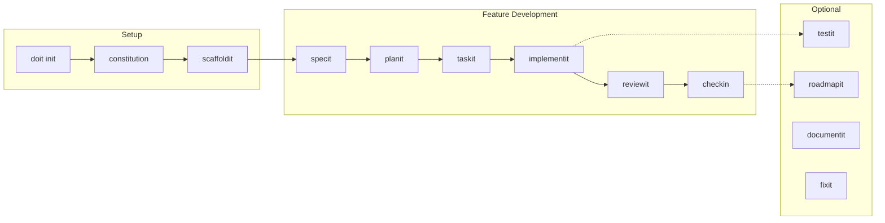

# Do-It Tutorials

Welcome to the Do-It tutorials! These step-by-step guides will teach you how to use Do-It's spec-driven development workflow to build software efficiently with AI assistance.

## Choose Your Path

| Tutorial | Best For | Time |
|----------|----------|------|
| [Greenfield Project](01-greenfield-tutorial.md) | Starting a new project from scratch | ~2 hours |
| [Existing Project](02-existing-project-tutorial.md) | Adding Do-It to an existing codebase | ~90 minutes |
| [Team Collaboration](03-team-collaboration-tutorial.md) | Setting up multi-developer workflows | ~45 minutes |
| [GitLab Provider](04-gitlab-provider-tutorial.md) | Configuring GitLab integration | ~30 minutes |
| [Creating Workflows](creating-workflows.md) | Building custom interactive workflows | ~60 minutes |

## Tutorial Overview

### Tutorial 1: Greenfield Project

**What you'll build**: A TaskFlow CLI application - a command-line task management tool.

**What you'll learn**:
- Initialize a new Do-It project with `doit init`
- Create a project constitution with `/doit.constitution`
- Generate project structure with `/doit.scaffoldit`
- Write feature specifications with `/doit.specit`
- Plan implementations with `/doit.planit`
- Create actionable tasks with `/doit.taskit`
- Implement features with `/doit.implementit`
- Review code with `/doit.reviewit`
- Complete features with `/doit.checkin`

**Prerequisites**:
- Do-It CLI installed (`pip install doit-toolkit-cli`)
- Git installed and configured
- Claude Code or compatible AI IDE
- GitHub account (optional, for issue/PR creation)

---

### Tutorial 2: Existing Project Integration

**What you'll build**: Add a new feature to an existing Weather API project.

**What you'll learn**:
- Add Do-It to an existing codebase
- Create a constitution that reflects existing patterns
- Skip or adapt commands for existing projects
- Use the Do-It workflow alongside existing code

**Prerequisites**:
- An existing project (or use our sample Weather API)
- Do-It CLI installed
- Git initialized in your project

---

### Tutorial 3: Team Collaboration

**What you'll build**: A shared team environment for collaborative spec-driven development.

**What you'll learn**:
- Initialize team collaboration with `doit team init`
- Add and manage team members with permissions
- Synchronize shared memory files across the team
- Handle notifications about team changes
- Resolve conflicts when multiple developers edit the same files

**Prerequisites**:
- Do-It CLI installed (`pip install doit-toolkit-cli`)
- An initialized Do-It project
- A remote Git repository (GitHub, GitLab, Azure DevOps)
- At least one other team member to collaborate with

---

### Tutorial 4: GitLab Provider Configuration

**What you'll build**: Full GitLab integration for your Do-It project.

**What you'll learn**:
- Create a GitLab Personal Access Token with the right permissions
- Configure Do-It to use GitLab (gitlab.com or self-hosted)
- Use the provider wizard for interactive setup
- Work with GitLab issues and merge requests through Do-It
- Sync milestones and manage roadmap items

**Prerequisites**:
- Do-It CLI installed (`pip install doit-toolkit-cli`)
- A GitLab account with a project
- Git repository with a GitLab remote

---

## Do-It Command Workflow

## Quick Reference

| Command | Purpose | When to Use |
|---------|---------|-------------|
| `doit init` | Initialize Do-It in a project | Once per project |
| `/doit.constitution` | Define project principles | After init, or to update |
| `/doit.scaffoldit` | Generate project structure | Greenfield projects |
| `/doit.specit` | Create feature specification | Start of each feature |
| `/doit.planit` | Generate implementation plan | After spec is approved |
| `/doit.taskit` | Create actionable tasks | After plan is approved |
| `/doit.implementit` | Execute tasks | During development |
| `/doit.reviewit` | Review implementation | After implementation |
| `/doit.testit` | Run automated tests | Before/after changes |
| `/doit.checkin` | Finalize feature | When feature is complete |
| `/doit.fixit` | Bug-fix workflow | When fixing bugs |
| `/doit.roadmapit` | Manage project backlog | Anytime |
| `/doit.documentit` | Organize documentation | As needed |
| `doit validate` | Validate spec quality | Before commit |
| `doit status` | Show spec dashboard | Track progress |
| `doit xref` | Cross-reference traceability | Verify coverage |
| `doit diagram` | Generate diagrams | After spec updates |
| `doit roadmapit show` | Display roadmap with GitHub epics | View priorities |
| `doit roadmapit add` | Add item and create GitHub epic | Add to roadmap |
| `doit roadmapit sync-milestones` | Sync GitHub milestones | Priority tracking |
| `doit team sync` | Sync shared memory files | Team collaboration |
| `doit team status` | Show team sync status | Check collaboration |

## Need Help?

- **Documentation**: [Do-It Documentation](../index.md)
- **Installation**: [Installation Guide](../installation.md)
- **GitHub Issues**: [Report a problem](https://github.com/seanbarlow/doit/issues)
