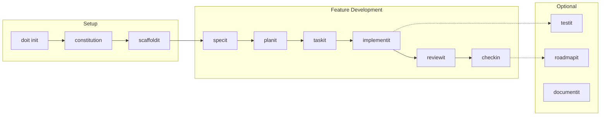

# DoIt Tutorials

Welcome to the DoIt tutorials! These step-by-step guides will teach you how to use DoIt's spec-driven development workflow to build software efficiently with AI assistance.

## Choose Your Path

| Tutorial | Best For | Time |
|----------|----------|------|
| [Greenfield Project](01-greenfield-tutorial.md) | Starting a new project from scratch | ~2 hours |
| [Existing Project](02-existing-project-tutorial.md) | Adding DoIt to an existing codebase | ~90 minutes |

## Tutorial Overview

### Tutorial 1: Greenfield Project

**What you'll build**: A TaskFlow CLI application - a command-line task management tool.

**What you'll learn**:
- Initialize a new DoIt project with `doit init`
- Create a project constitution with `/doit.constitution`
- Generate project structure with `/doit.scaffoldit`
- Write feature specifications with `/doit.specit`
- Plan implementations with `/doit.planit`
- Create actionable tasks with `/doit.taskit`
- Implement features with `/doit.implementit`
- Review code with `/doit.reviewit`
- Complete features with `/doit.checkin`

**Prerequisites**:
- DoIt CLI installed (`pip install doit-cli`)
- Git installed and configured
- Claude Code or compatible AI IDE
- GitHub account (optional, for issue/PR creation)

---

### Tutorial 2: Existing Project Integration

**What you'll build**: Add a new feature to an existing Weather API project.

**What you'll learn**:
- Add DoIt to an existing codebase
- Create a constitution that reflects existing patterns
- Skip or adapt commands for existing projects
- Use the DoIt workflow alongside existing code

**Prerequisites**:
- An existing project (or use our sample Weather API)
- DoIt CLI installed
- Git initialized in your project

---

## DoIt Command Workflow

## Quick Reference

| Command | Purpose | When to Use |
|---------|---------|-------------|
| `doit init` | Initialize DoIt in a project | Once per project |
| `/doit.constitution` | Define project principles | After init, or to update |
| `/doit.scaffoldit` | Generate project structure | Greenfield projects |
| `/doit.specit` | Create feature specification | Start of each feature |
| `/doit.planit` | Generate implementation plan | After spec is approved |
| `/doit.taskit` | Create actionable tasks | After plan is approved |
| `/doit.implementit` | Execute tasks | During development |
| `/doit.reviewit` | Review implementation | After implementation |
| `/doit.testit` | Run automated tests | Before/after changes |
| `/doit.checkin` | Finalize feature | When feature is complete |
| `/doit.roadmapit` | Manage project backlog | Anytime |
| `/doit.documentit` | Organize documentation | As needed |

## Need Help?

- **Documentation**: [DoIt Documentation](../index.md)
- **Installation**: [Installation Guide](../installation.md)
- **GitHub Issues**: [Report a problem](https://github.com/seanbarlow/doit/issues)
