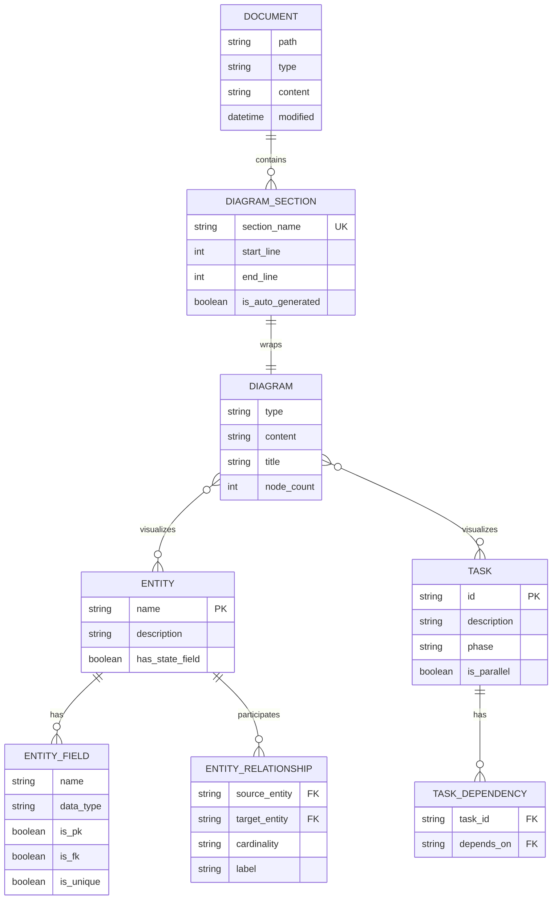
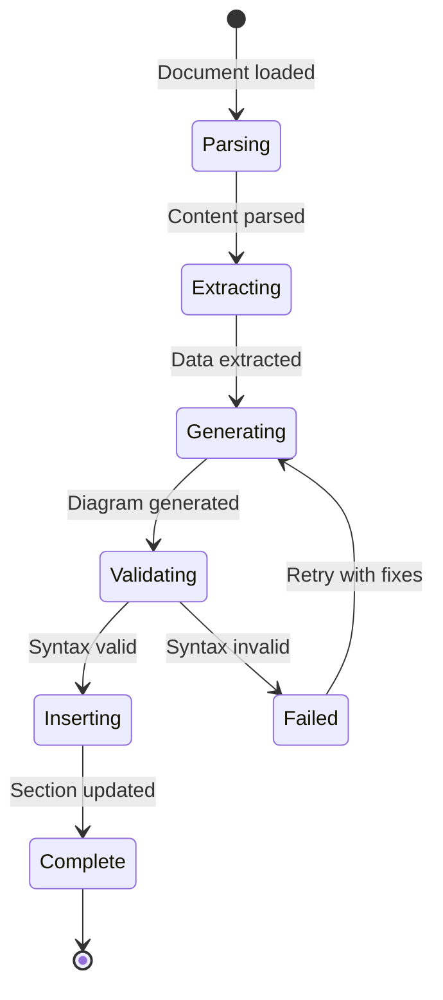

# Data Model: Automatic Mermaid Visualization

**Feature Branch**: `005-mermaid-visualization`
**Date**: 2026-01-10

## Entity Relationship Diagram



## Entity Definitions

### Document

Represents a markdown document that can contain diagram sections.

| Field | Type | Description |
|-------|------|-------------|
| path | string | Absolute file path to the document |
| type | enum | Document type: spec, plan, tasks, data-model, review |
| content | string | Full markdown content |
| modified | datetime | Last modification timestamp |

### DiagramSection

A marked region in a document containing auto-generated diagram content.

| Field | Type | Description |
|-------|------|-------------|
| section_name | string | Unique identifier for the section (e.g., "user-journey") |
| start_line | int | Line number where section begins |
| end_line | int | Line number where section ends |
| is_auto_generated | boolean | Whether content is auto-generated |

**Markup Format**:
```markdown
<!-- BEGIN:AUTO-GENERATED section="[section_name]" -->
[content]
<!-- END:AUTO-GENERATED -->
```

### Diagram

A mermaid visualization with type, content, and metadata.

| Field | Type | Description |
|-------|------|-------------|
| type | enum | Diagram type: flowchart, erDiagram, sequenceDiagram, stateDiagram-v2, gantt, pie |
| content | string | Mermaid syntax content |
| title | string | Optional diagram title |
| node_count | int | Number of nodes/elements (for size management) |

**Diagram Types by Template**:

| Template | Diagram Types |
|----------|---------------|
| spec.md | flowchart (user journey), erDiagram (entities) |
| plan.md | flowchart (architecture, components) |
| tasks.md | flowchart (dependencies), gantt (timeline) |
| data-model.md | erDiagram (full model), stateDiagram-v2 (states) |
| review-report.md | pie (findings), bar (test results) |

### Entity

A data model element that can be visualized in ER diagrams.

| Field | Type | Description |
|-------|------|-------------|
| name | string | Entity name (PascalCase) |
| description | string | What the entity represents |
| has_state_field | boolean | Whether entity has status/state field |

### EntityField

A field belonging to an entity.

| Field | Type | Description |
|-------|------|-------------|
| name | string | Field name (snake_case) |
| data_type | string | Data type (string, int, uuid, datetime, enum, etc.) |
| is_pk | boolean | Is primary key |
| is_fk | boolean | Is foreign key |
| is_unique | boolean | Has unique constraint |

### EntityRelationship

A relationship between two entities.

| Field | Type | Description |
|-------|------|-------------|
| source_entity | string | Source entity name (FK) |
| target_entity | string | Target entity name (FK) |
| cardinality | enum | Relationship cardinality |
| label | string | Relationship description |

**Cardinality Values**:
- `||--||` - One to one
- `||--o{` - One to many
- `}o--o{` - Many to many
- `||--o|` - One to zero or one

### Task

An implementation unit with dependencies that can be visualized.

| Field | Type | Description |
|-------|------|-------------|
| id | string | Task identifier (e.g., "T001") |
| description | string | Task description |
| phase | string | Implementation phase |
| is_parallel | boolean | Can run in parallel with siblings |

### TaskDependency

A dependency relationship between tasks.

| Field | Type | Description |
|-------|------|-------------|
| task_id | string | Task that has dependency |
| depends_on | string | Task that must complete first |

## State Machines

### Diagram Generation States



## Constraints

1. **Section names must be unique** within a document
2. **Diagram type must match template context** (e.g., no gantt in spec.md)
3. **Node count soft limit**: 20 nodes before subgraph splitting
4. **Entity names must be PascalCase** for ER diagrams
5. **Task IDs must follow pattern**: `T###` or `T###.#`
