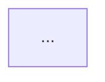
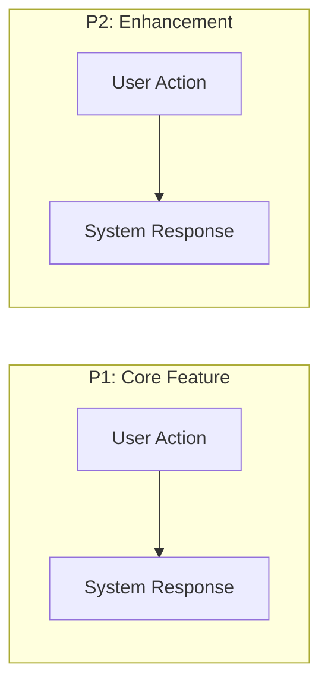
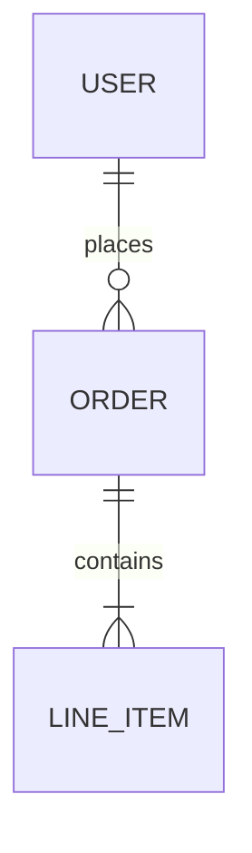
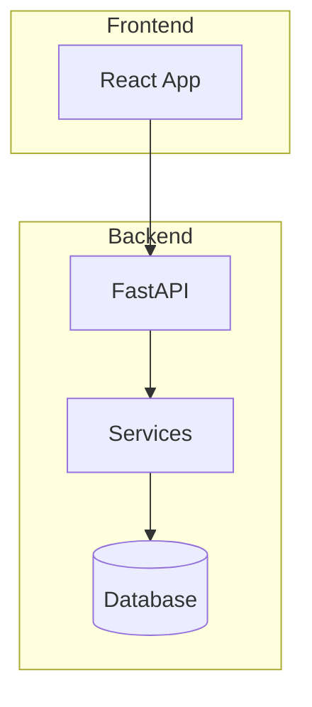
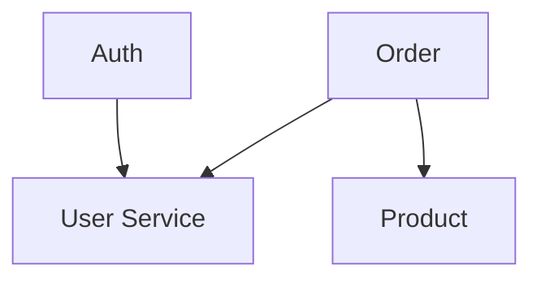
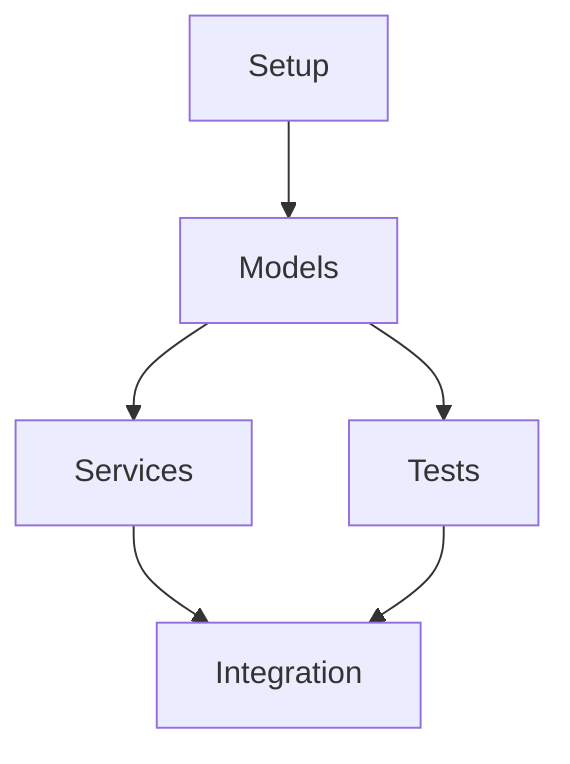
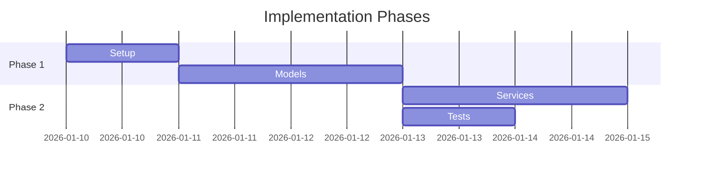

# Quickstart: Automatic Mermaid Visualization

**Feature Branch**: `005-mermaid-visualization`
**Date**: 2026-01-10

## Overview

This feature automatically generates mermaid diagrams in your specification, planning, and task documents. Diagrams are created during the doit workflow commands and inserted into marked sections.

## Quick Reference

### Commands and Generated Diagrams

| Command | Document | Diagrams Generated |
|---------|----------|-------------------|
| `/doit.specify` | spec.md | User Journey flowchart, ER diagram |
| `/doit.plan` | plan.md | Architecture flowchart, Component dependencies |
| `/doit.plan` | data-model.md | ER diagram, State machines |
| `/doit.tasks` | tasks.md | Task dependencies flowchart, Phase gantt |
| `/doit.review` | review-report.md | Finding distribution pie, Test results |

### Auto-Generated Section Format

All auto-generated diagrams are wrapped in markers:

```markdown
<!-- BEGIN:AUTO-GENERATED section="user-journey" -->
## User Journey Visualization


<!-- END:AUTO-GENERATED -->
```

## Usage Examples

### 1. Specification Diagrams

After running `/doit.specify`, your spec.md will include:

**User Journey** (from user stories):


**Entity Relationships** (from Key Entities):


### 2. Planning Diagrams

After running `/doit.plan`, your plan.md will include:

**Architecture Overview**:


**Component Dependencies**:


### 3. Task Diagrams

After running `/doit.tasks`, your tasks.md will include:

**Task Dependencies**:


**Phase Timeline**:


## Customization

### Manual Edits

Content **outside** auto-generated markers is preserved:

```markdown
## My Custom Section
This content is never modified by auto-generation.

<!-- BEGIN:AUTO-GENERATED section="user-journey" -->
This content WILL be regenerated.
<!-- END:AUTO-GENERATED -->

## Another Custom Section
This is also preserved.
```

### Disabling Sections

To prevent a diagram from being generated, remove or rename the section:

```markdown
<!-- DISABLED:AUTO-GENERATED section="user-journey" -->
```

### Node Limits

Diagrams automatically split into subgraphs when exceeding limits:

| Diagram Type | Soft Limit | Action |
|--------------|------------|--------|
| Flowchart | 20 nodes | Group by phase/category |
| ER Diagram | 10 entities | Group by domain |
| Gantt | 15 tasks | Summarize phases |

## Troubleshooting

### Diagram Not Rendering

1. Check mermaid syntax is valid
2. Verify code fence markers: ` ```mermaid ` and ` ``` `
3. Ensure diagram type is spelled correctly

### Section Not Updating

1. Verify markers are intact: `<!-- BEGIN:AUTO-GENERATED section="..." -->`
2. Check section name matches expected value
3. Run the appropriate command to regenerate

### Large Diagrams

If a diagram is too large to read:
1. The system auto-splits at soft limits
2. Manually add subgraph boundaries if needed
3. Consider splitting across multiple diagrams

## Section Names Reference

| Document | Section Name | Diagram Type |
|----------|--------------|--------------|
| spec.md | `user-journey` | flowchart |
| spec.md | `entity-relationships` | erDiagram |
| plan.md | `architecture` | flowchart |
| plan.md | `component-dependencies` | flowchart |
| data-model.md | `er-diagram` | erDiagram |
| data-model.md | `[entity]-states` | stateDiagram-v2 |
| tasks.md | `task-dependencies` | flowchart |
| tasks.md | `phase-timeline` | gantt |
| review-report.md | `finding-distribution` | pie |
| review-report.md | `test-results` | bar |
