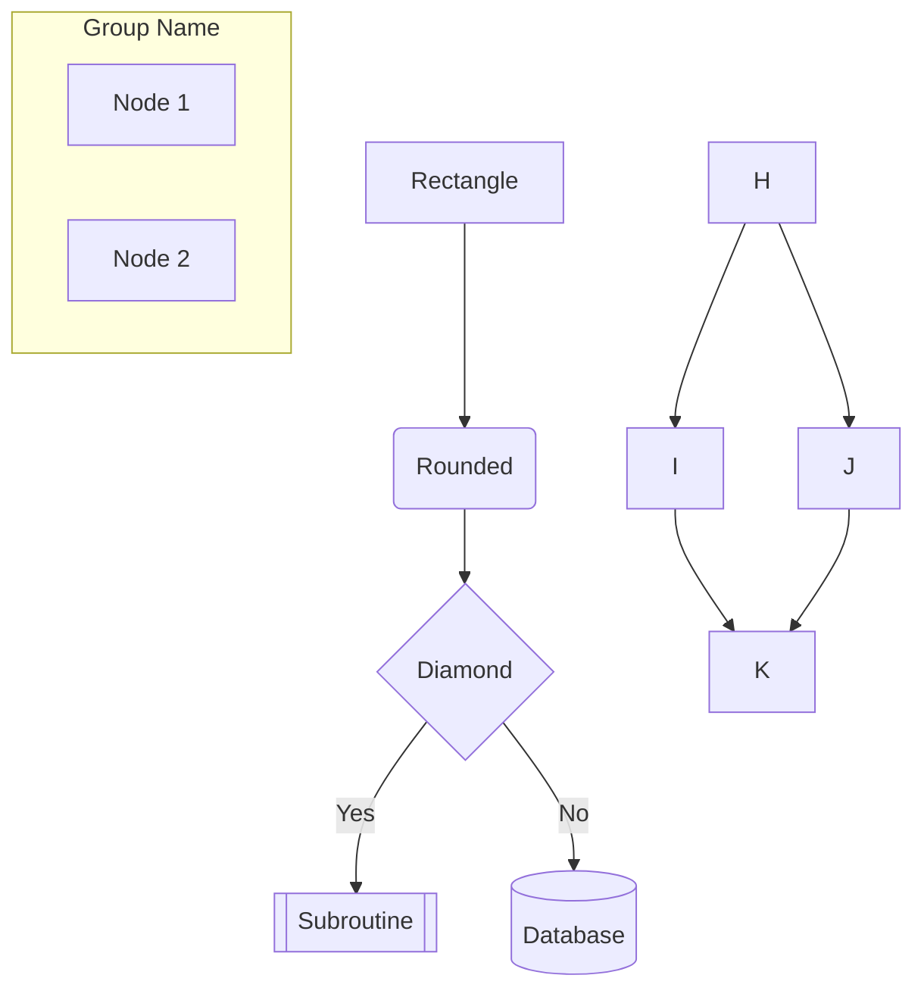
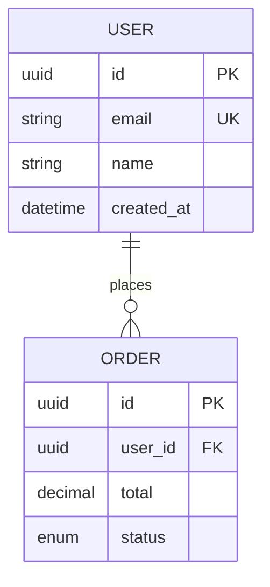
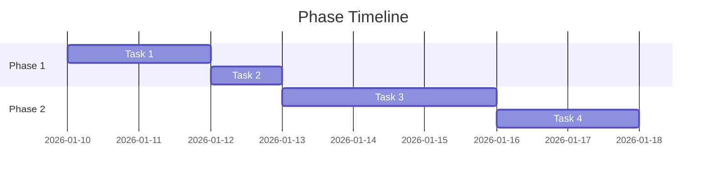
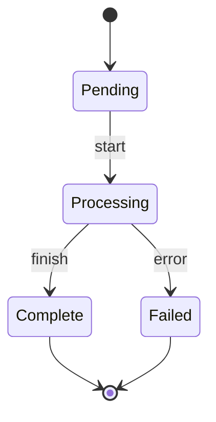
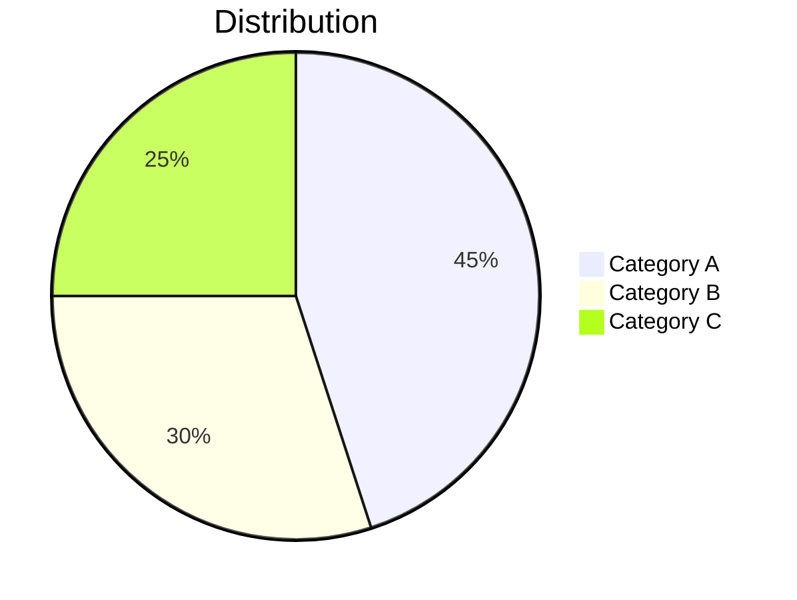
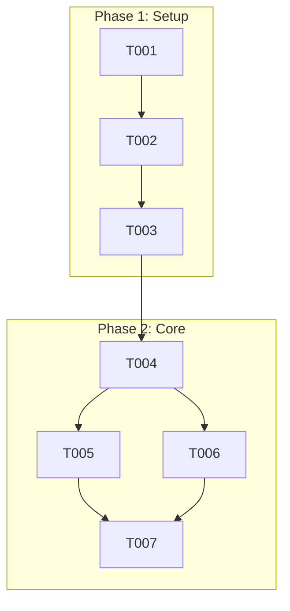

# Research: Automatic Mermaid Visualization

**Feature Branch**: `005-mermaid-visualization`
**Date**: 2026-01-10
**Status**: Complete

## Overview

This document consolidates research findings for the mermaid visualization feature. Since this is a template enhancement with no external dependencies, research focuses on mermaid syntax patterns and template integration strategies.

## Mermaid Syntax Reference

### Diagram Type Syntax

| Type | Declaration | Use Case | Node Limit |
|------|-------------|----------|------------|
| Flowchart | `flowchart TD` or `flowchart LR` | User journeys, architecture, dependencies | ~30 nodes |
| ER Diagram | `erDiagram` | Entity relationships | ~15 entities |
| Sequence | `sequenceDiagram` | API flows, interactions | ~10 participants |
| State | `stateDiagram-v2` | State machines | ~15 states |
| Gantt | `gantt` | Phase timelines | ~20 tasks |
| Pie | `pie` | Distribution charts | ~8 slices |

### Flowchart Syntax Patterns



### ER Diagram Syntax Patterns



### Gantt Chart Syntax Patterns



### State Diagram Syntax Patterns



### Pie Chart Syntax Patterns



## Auto-Generation Markers

### Recommended Pattern

```markdown
<!-- BEGIN:AUTO-GENERATED section="[section-name]" -->
## Section Title

```mermaid
[diagram content]
```
<!-- END:AUTO-GENERATED -->
```

### Benefits

1. **Clear boundaries**: Easy to identify auto-generated vs manual content
2. **Safe updates**: Can regenerate without overwriting manual edits
3. **Machine-readable**: Scripts can parse and update sections
4. **IDE-friendly**: Most editors won't interfere with HTML comments

### Alternative Patterns Considered

| Pattern | Pros | Cons |
|---------|------|------|
| YAML frontmatter | Standard format | Only works at file start |
| Magic comments (`<!-- @auto -->`) | Compact | Less explicit boundaries |
| Markdown comments | Native | Not well-supported |
| **HTML comments (chosen)** | Universal support | Slightly verbose |

## Template Integration Points

### spec-template.md

Insert after User Scenarios section:
- User Journey Visualization (flowchart)
- Entity Relationships (erDiagram) - conditional

### plan-template.md

Insert in Technical Context section:
- Architecture Overview (flowchart)
- Component Dependencies (flowchart) - conditional

### tasks-template.md

Insert at top of Implementation section:
- Task Dependencies (flowchart)
- Phase Timeline (gantt)

### data-model.md

Insert at document top:
- Entity Relationship Diagram (erDiagram)
- State Machine Diagrams (stateDiagram-v2) - conditional per entity

## Diagram Size Guidelines

### Node Limits by Type

To maintain readability:

| Diagram Type | Soft Limit | Hard Limit | Mitigation |
|--------------|------------|------------|------------|
| Flowchart | 20 nodes | 30 nodes | Split into subgraphs |
| ER Diagram | 10 entities | 15 entities | Group by domain |
| Sequence | 6 participants | 10 participants | Abstract intermediaries |
| State | 10 states | 15 states | Use composite states |
| Gantt | 15 tasks | 20 tasks | Summarize phases |

### Subgraph Strategy

For diagrams exceeding soft limits:



## Validation Approach

### Syntax Validation

Mermaid diagrams can be validated by:
1. Checking for matching code fence markers
2. Verifying diagram type declaration exists
3. Ensuring relationship syntax is valid (for ER diagrams)
4. Checking for common syntax errors (missing arrows, unmatched brackets)

### Common Syntax Errors

| Error | Example | Fix |
|-------|---------|-----|
| Missing arrow | `A B` | `A --> B` |
| Unmatched brackets | `A[Node` | `A[Node]` |
| Invalid characters | `A[Node "with" quotes]` | `A["Node with quotes"]` |
| Wrong cardinality | `||--||{` | `||--o{` |

## Research Conclusions

1. **No NEEDS CLARIFICATION items** - The spec is complete and unambiguous
2. **Mermaid syntax is stable** - All 6 diagram types have well-documented syntax
3. **HTML comment markers** are the best approach for auto-generated sections
4. **Node limits are important** - Must implement automatic subgraph splitting
5. **Template integration is straightforward** - Clear insertion points identified

## References

- [Mermaid Official Documentation](https://mermaid.js.org/intro/)
- [GitHub Mermaid Support](https://docs.github.com/en/get-started/writing-on-github/working-with-advanced-formatting/creating-diagrams)
- [VS Code Mermaid Extension](https://marketplace.visualstudio.com/items?itemName=bierner.markdown-mermaid)
