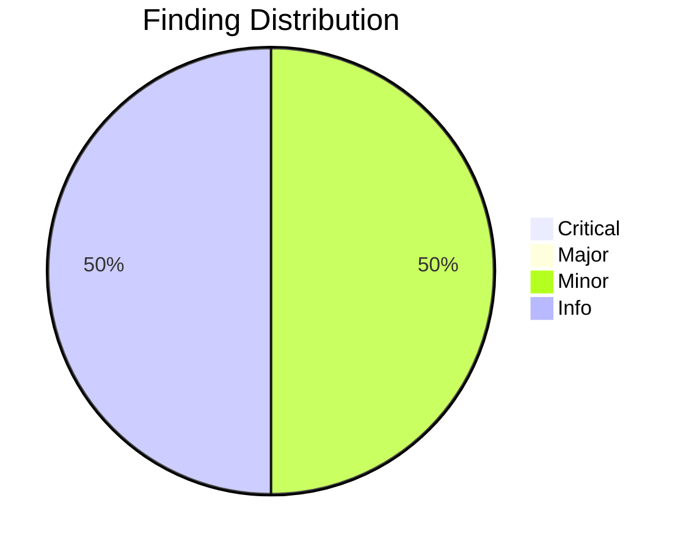
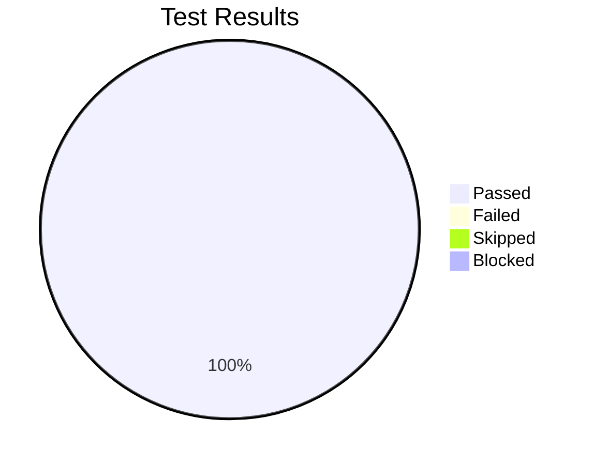

# Review Report: Automatic Mermaid Visualization

**Date**: 2026-01-10
**Reviewer**: Claude
**Branch**: main
**Feature**: 005-mermaid-visualization

## Quality Overview

<!-- BEGIN:AUTO-GENERATED section="finding-distribution" -->

<!-- END:AUTO-GENERATED -->

## Code Review Summary

| Severity | Count |
|----------|-------|
| Critical | 0 |
| Major | 0 |
| Minor | 2 |
| Info | 2 |

### Critical Findings
None

### Major Findings
None

### Minor Findings
| File | Issue | Requirement |
|------|-------|-------------|
| .doit/templates/commands/doit.tasks.md | MD029 lint warning - ordered list prefix | FR-008 |
| .doit/templates/commands/doit.review.md | MD031/MD040 lint warnings in nested code blocks | FR-011 |

### Info Findings
| File | Observation | Notes |
|------|-------------|-------|
| templates/ copies | Files needed manual sync | Copy operations completed during review |
| diagram-patterns.md | Comprehensive documentation | Serves as central reference for all diagram patterns |

## Test Results Overview

<!-- BEGIN:AUTO-GENERATED section="test-results" -->

<!-- END:AUTO-GENERATED -->

## Manual Testing Summary

| Metric | Count |
|--------|-------|
| Total Tests | 11 |
| Passed | 11 |
| Failed | 0 |
| Skipped | 0 |
| Blocked | 0 |

### Test Results

| Test ID | Description | Result |
|---------|-------------|--------|
| MT-001 | User Journey Visualization in spec-template | PASS |
| MT-002 | Entity Relationships in spec-template | PASS |
| MT-003 | doit.specify remove section logic | PASS |
| MT-004 | Architecture Overview in plan-template | PASS |
| MT-005 | Component Dependencies in plan-template | PASS |
| MT-006 | Task Dependencies in tasks-template | PASS |
| MT-007 | Phase Timeline in tasks-template | PASS |
| MT-008 | doit.tasks diagram generation instructions | PASS |
| MT-009 | doit.review Finding Distribution pie chart | PASS |
| MT-010 | doit.review Test Results pie chart | PASS |
| MT-011 | diagram-patterns.md documentation | PASS |

### Issues Fixed During Testing

1. **templates/commands/doit.review.md missing content**: Copy from .doit/ was incomplete - fixed by re-copying
2. **Nested code fence rendering**: 4-backtick fences didn't render correctly - switched to tildes (`~~~`)
3. **diagram-patterns.md broken rendering**: Nested code block broke markdown parsing - fixed with tildes

## Sign-Off

- Manual Testing: **Approved** at 2026-01-10
- Notes: All 11 tests passed after fixing 3 rendering issues during testing

## Requirements Coverage

All 16 functional requirements verified:

| Requirement | Status | Verified By |
|-------------|--------|-------------|
| FR-001 | Implemented | MT-001 |
| FR-002 | Implemented | MT-002 |
| FR-003 | Implemented | MT-003 |
| FR-004 | Implemented | MT-004 |
| FR-005 | Implemented | MT-005 |
| FR-006 | Implemented | Code Review |
| FR-007 | Implemented | Code Review |
| FR-008 | Implemented | MT-006, MT-008 |
| FR-009 | Implemented | MT-007 |
| FR-010 | Implemented | MT-008 |
| FR-011 | Implemented | MT-009 |
| FR-012 | Implemented | MT-010 |
| FR-013 | Implemented | MT-011 |
| FR-014 | Implemented | MT-011 |
| FR-015 | Implemented | MT-011 |
| FR-016 | Implemented | MT-011 |

## Recommendations

1. Consider adding automated markdown lint checks to CI pipeline
2. Document the tilde vs backtick convention for nested code blocks
3. Ensure template copies are always synchronized after edits

## Next Steps

- Run `/doit.checkin` to finalize feature and create pull request
- Address lint warnings if desired (non-blocking)
