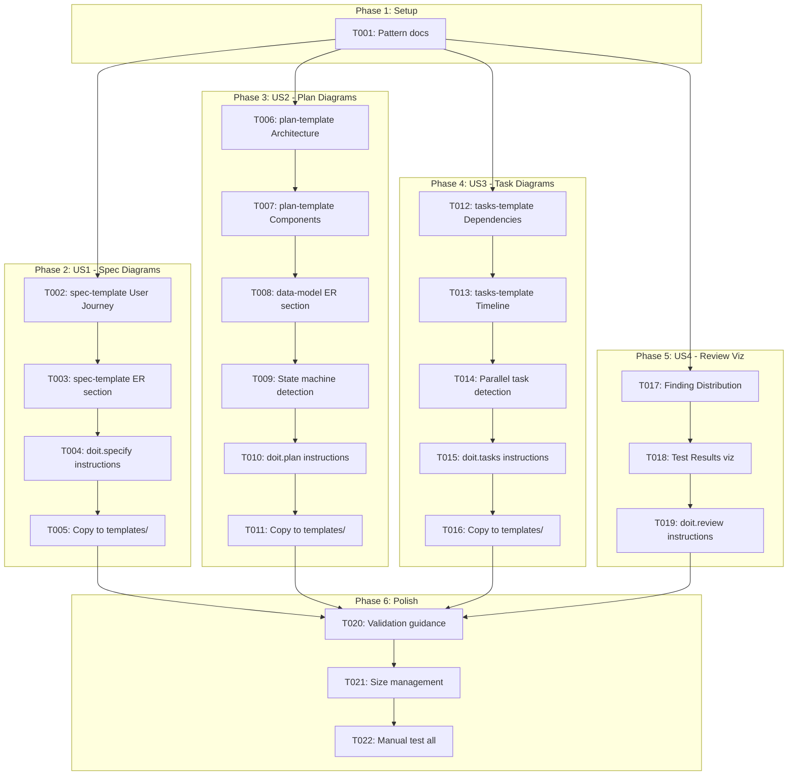
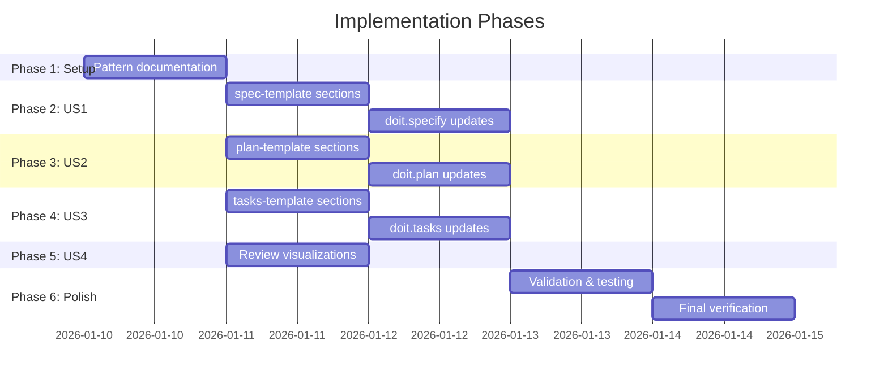
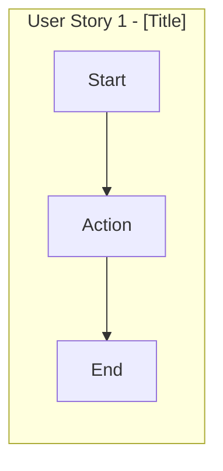
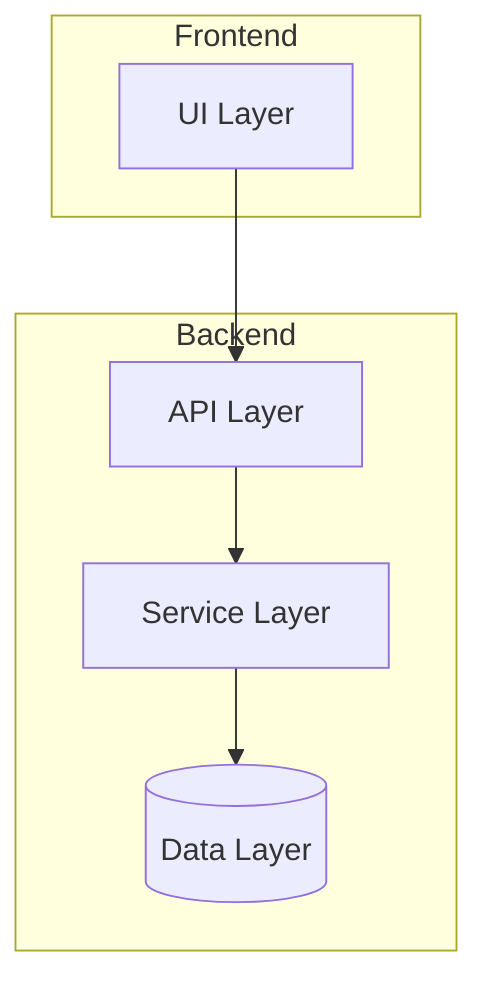
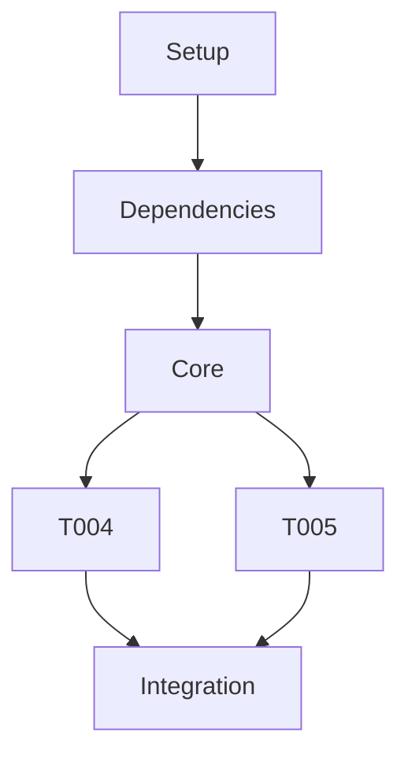
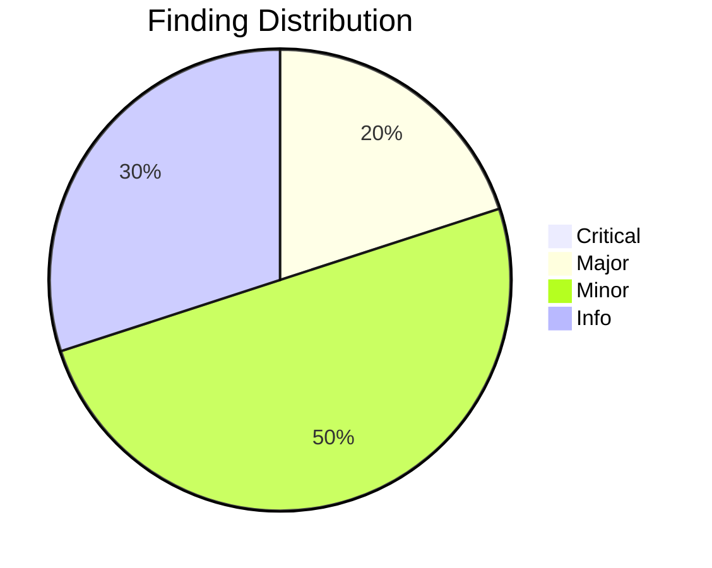

# Tasks: Automatic Mermaid Visualization

**Input**: Design documents from `/specs/005-mermaid-visualization/`
**Prerequisites**: plan.md (complete), spec.md (complete), data-model.md (complete), research.md (complete)

**Project Type**: Template enhancement (markdown files only - no application code)

**Tests**: Manual verification via markdown preview (no automated tests for markdown templates)

**Organization**: Tasks are grouped by user story to enable independent implementation and testing of each story.

## Task Dependencies



## Phase Timeline



## Format: `[ID] [P?] [Story] Description`

- **[P]**: Can run in parallel (different files, no dependencies)
- **[Story]**: Which user story this task belongs to (e.g., US1, US2, US3, US4)
- Include exact file paths in descriptions

---

## Phase 1: Setup (Pattern Documentation)

**Purpose**: Establish auto-generation patterns used by all subsequent phases

- [ ] T001 Document auto-generation marker pattern in .doit/docs/diagram-patterns.md

**Pattern to document**:
```markdown
<!-- BEGIN:AUTO-GENERATED section="[section-name]" -->
## [Section Title]

```mermaid
[diagram content]
```
<!-- END:AUTO-GENERATED -->
```

**Checkpoint**: Pattern documented - user story implementation can begin

---

## Phase 2: User Story 1 - Specification Diagrams (Priority: P1) 🎯 MVP

**Goal**: Auto-generate User Journey flowchart and ER diagram in spec.md during `/doit.specify`

**Independent Test**: Run `/doit.specify` on a sample feature and verify spec.md contains valid mermaid diagrams

**Requirements**: FR-001, FR-002, FR-003, FR-013

### Implementation for User Story 1

- [ ] T002 [US1] Add User Journey Visualization section to .doit/templates/spec-template.md
- [ ] T003 [US1] Add Entity Relationships section (conditional) to .doit/templates/spec-template.md
- [ ] T004 [US1] Add diagram generation instructions to .doit/templates/commands/doit.specify.md
- [ ] T005 [US1] Copy updated templates to templates/spec-template.md and templates/commands/doit.specify.md

**Section to add to spec-template.md (T002)**:
```markdown
## User Journey Visualization

<!-- BEGIN:AUTO-GENERATED section="user-journey" -->

<!-- END:AUTO-GENERATED -->
```

**Instructions to add to doit.specify.md (T004)**:
- Parse user stories from generated spec
- Generate flowchart with subgraph per story
- If Key Entities section exists, generate erDiagram
- If no entities, omit Entity Relationships section entirely

**Checkpoint**: User Story 1 complete - `/doit.specify` generates visual diagrams

---

## Phase 3: User Story 2 - Planning Diagrams (Priority: P2)

**Goal**: Auto-generate Architecture and Component dependency diagrams in plan.md during `/doit.plan`

**Independent Test**: Run `/doit.plan` on an existing spec and verify plan.md contains architecture diagrams

**Requirements**: FR-004, FR-005, FR-006, FR-007, FR-013

### Implementation for User Story 2

- [ ] T006 [US2] Add Architecture Overview section to .doit/templates/plan-template.md
- [ ] T007 [US2] Add Component Dependencies section to .doit/templates/plan-template.md
- [ ] T008 [US2] Add ER diagram auto-generation to data-model.md workflow in .doit/templates/commands/doit.plan.md
- [ ] T009 [US2] Add state machine detection logic to .doit/templates/commands/doit.plan.md
- [ ] T010 [US2] Add diagram generation instructions to .doit/templates/commands/doit.plan.md
- [ ] T011 [US2] Copy updated templates to templates/plan-template.md and templates/commands/doit.plan.md

**Section to add to plan-template.md (T006)**:
```markdown
## Architecture Overview

<!-- BEGIN:AUTO-GENERATED section="architecture" -->

<!-- END:AUTO-GENERATED -->
```

**Instructions to add to doit.plan.md (T010)**:
- Parse Technical Context for tech stack components
- Generate architecture flowchart from component layers
- If multiple services defined, generate component dependencies flowchart
- If data-model.md created, insert ER diagram at top
- Detect entities with status/state fields for state machine diagrams

**Checkpoint**: User Story 2 complete - `/doit.plan` generates architecture diagrams

---

## Phase 4: User Story 3 - Task Diagrams (Priority: P3)

**Goal**: Auto-generate Task Dependencies flowchart and Phase Timeline gantt chart in tasks.md during `/doit.tasks`

**Independent Test**: Run `/doit.tasks` on an existing plan and verify tasks.md contains dependency graphs

**Requirements**: FR-008, FR-009, FR-010, FR-013

### Implementation for User Story 3

- [ ] T012 [US3] Add Task Dependencies section to .doit/templates/tasks-template.md
- [ ] T013 [US3] Add Phase Timeline section to .doit/templates/tasks-template.md
- [ ] T014 [US3] Add parallel task ([P]) detection logic to .doit/templates/commands/doit.tasks.md
- [ ] T015 [US3] Add diagram generation instructions to .doit/templates/commands/doit.tasks.md
- [ ] T016 [US3] Copy updated templates to templates/tasks-template.md and templates/commands/doit.tasks.md

**Section to add to tasks-template.md (T012)**:
```markdown
## Task Dependencies

<!-- BEGIN:AUTO-GENERATED section="task-dependencies" -->

<!-- END:AUTO-GENERATED -->
```

**Instructions to add to doit.tasks.md (T015)**:
- Parse generated tasks and their dependencies
- Generate flowchart showing task execution order
- Group parallel tasks ([P]) together with & syntax
- Generate gantt chart showing phase timelines
- Use task IDs as node identifiers

**Checkpoint**: User Story 3 complete - `/doit.tasks` generates task visualization

---

## Phase 5: User Story 4 - Review Visualizations (Priority: P4)

**Goal**: Auto-generate Finding Distribution and Test Results visualizations in review-report.md during `/doit.review`

**Independent Test**: Run `/doit.review` on a completed implementation and verify review-report.md contains charts

**Requirements**: FR-011, FR-012, FR-013

### Implementation for User Story 4

- [ ] T017 [US4] Add Finding Distribution pie chart instructions to .doit/templates/commands/doit.review.md
- [ ] T018 [US4] Add Test Results visualization instructions to .doit/templates/commands/doit.review.md
- [ ] T019 [US4] Update review-report generation in .doit/templates/commands/doit.review.md

**Diagram to generate (T017)**:
```markdown
## Quality Overview

<!-- BEGIN:AUTO-GENERATED section="finding-distribution" -->

<!-- END:AUTO-GENERATED -->
```

**Instructions to add to doit.review.md (T019)**:
- After code review, count findings by severity
- Generate pie chart with finding distribution
- After test execution, count results by category
- Generate bar/pie chart with test results

**Checkpoint**: User Story 4 complete - `/doit.review` generates quality dashboards

---

## Phase 6: Polish & Cross-Cutting Concerns

**Purpose**: Validation, size management, and final verification

**Requirements**: FR-014, FR-015, FR-016

- [ ] T020 Add mermaid syntax validation guidance to all command templates
- [ ] T021 Add diagram size management instructions (split at 20+ nodes) to all command templates
- [ ] T022 Manual test all 4 commands with sample features, verify diagrams render correctly

**Validation guidance to add (T020)**:
```markdown
### Diagram Validation
- Verify diagram type declaration exists (flowchart, erDiagram, etc.)
- Check for matching code fence markers
- If diagram exceeds 20 nodes, split into subgraphs
- Log warning if syntax appears invalid
```

**Size management instructions (T021)**:
```markdown
### Large Diagram Handling
- If flowchart exceeds 20 nodes: group into subgraphs by phase/category
- If ER diagram exceeds 10 entities: group by domain
- If gantt exceeds 15 tasks: summarize into phase milestones
```

**Checkpoint**: All cross-cutting concerns addressed - feature complete

---

## Dependencies & Execution Order

### Phase Dependencies

- **Setup (Phase 1)**: No dependencies - can start immediately
- **User Stories (Phases 2-5)**: All can start after Phase 1 (pattern documented)
  - US1, US2, US3, US4 can proceed in parallel (different files)
  - Or sequentially in priority order (P1 → P2 → P3 → P4)
- **Polish (Phase 6)**: Depends on all user stories being complete

### User Story Dependencies

- **User Story 1 (P1)**: Can start after Phase 1 - No dependencies on other stories
- **User Story 2 (P2)**: Can start after Phase 1 - Independent of US1
- **User Story 3 (P3)**: Can start after Phase 1 - Independent of US1/US2
- **User Story 4 (P4)**: Can start after Phase 1 - Independent of US1/US2/US3

### Within Each User Story

- Template sections added first
- Command instructions added second
- Copy to secondary location last

### Parallel Opportunities

- **T002, T006, T012, T017**: All can run in parallel (different template files)
- **US1 through US4**: All user stories can be worked on in parallel
- Template updates and command updates within a story should be sequential

---

## Parallel Example: Starting All User Stories

```bash
# After T001 is complete, launch all user stories in parallel:
Task: "T002 [US1] Add User Journey Visualization section to spec-template.md"
Task: "T006 [US2] Add Architecture Overview section to plan-template.md"
Task: "T012 [US3] Add Task Dependencies section to tasks-template.md"
Task: "T017 [US4] Add Finding Distribution pie chart to doit.review.md"
```

---

## Implementation Strategy

### MVP First (User Story 1 Only)

1. Complete Phase 1: Setup (T001)
2. Complete Phase 2: User Story 1 (T002-T005)
3. **STOP and VALIDATE**: Test `/doit.specify` generates diagrams
4. Commit if ready

### Incremental Delivery

1. Complete Setup → Pattern established
2. Add User Story 1 → Test independently → Commit (MVP!)
3. Add User Story 2 → Test independently → Commit
4. Add User Story 3 → Test independently → Commit
5. Add User Story 4 → Test independently → Commit
6. Complete Polish → Final validation → Commit

### Parallel Team Strategy

With multiple developers:

1. Single developer completes Setup (T001)
2. Once Setup is done:
   - Developer A: User Story 1 (T002-T005)
   - Developer B: User Story 2 (T006-T011)
   - Developer C: User Story 3 (T012-T016)
   - Developer D: User Story 4 (T017-T019)
3. All complete → Polish phase together

---

## Files Modified

| File | User Story | Changes |
|------|------------|---------|
| .doit/docs/diagram-patterns.md | Setup | New file - pattern documentation |
| .doit/templates/spec-template.md | US1 | +User Journey, +ER sections |
| .doit/templates/commands/doit.specify.md | US1 | +diagram generation instructions |
| templates/spec-template.md | US1 | Copy from .doit/ |
| templates/commands/doit.specify.md | US1 | Copy from .doit/ |
| .doit/templates/plan-template.md | US2 | +Architecture, +Components sections |
| .doit/templates/commands/doit.plan.md | US2 | +diagram generation instructions |
| templates/plan-template.md | US2 | Copy from .doit/ |
| templates/commands/doit.plan.md | US2 | Copy from .doit/ |
| .doit/templates/tasks-template.md | US3 | +Task Dependencies, +Timeline sections |
| .doit/templates/commands/doit.tasks.md | US3 | +diagram generation instructions |
| templates/tasks-template.md | US3 | Copy from .doit/ |
| templates/commands/doit.tasks.md | US3 | Copy from .doit/ |
| .doit/templates/commands/doit.review.md | US4 | +pie chart, +test results instructions |

---

## Notes

- [P] tasks = different files, no dependencies
- [Story] label maps task to specific user story for traceability
- Each user story should be independently completable and testable
- Commit after each task or logical group
- Stop at any checkpoint to validate story independently
- This is a template-only feature - no application code or automated tests
