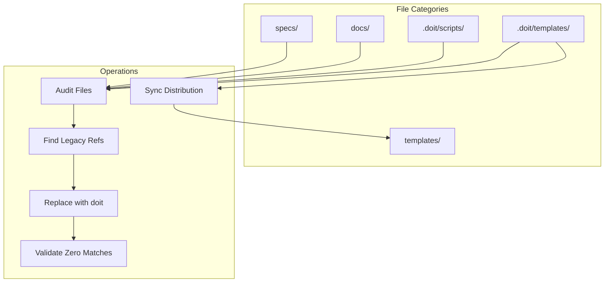

# Implementation Plan: Documentation Doit Migration

**Branch**: `006-docs-doit-migration` | **Date**: 2026-01-10 | **Spec**: [spec.md](spec.md)
**Input**: Feature specification from `/specs/006-docs-doit-migration/spec.md`

## Summary

Comprehensive audit and update of all documentation, code comments, and examples to migrate from legacy "specify" naming convention to standardized "doit" naming. This is a documentation-only feature involving text search and replace operations across markdown files and script comments.

## Technical Context

**Language/Version**: Bash 5.x (text processing), Markdown (documentation)
**Primary Dependencies**: grep, sed (standard Unix utilities)
**Storage**: N/A (file-based documentation)
**Testing**: grep-based validation scripts
**Target Platform**: Any Unix-like system
**Project Type**: Documentation update (no application code changes)
**Performance Goals**: N/A (one-time migration)
**Constraints**: Must preserve "specify" when used as English verb
**Scale/Scope**: ~50+ files across templates, docs, and specs directories

## Architecture Overview

<!-- BEGIN:AUTO-GENERATED section="architecture" -->

<!-- END:AUTO-GENERATED -->

## Constitution Check

*GATE: Must pass before Phase 0 research. Re-check after Phase 1 design.*

| Gate | Status | Notes |
|------|--------|-------|
| Tech Stack Alignment | PASS | Uses only Bash/Unix utilities per project conventions |
| No New Dependencies | PASS | Standard grep/sed only |
| Single Project | PASS | Documentation-only, no app code changes |
| Simplicity | PASS | Direct text replacement, no abstraction needed |

## Project Structure

### Documentation (this feature)

```text
specs/006-docs-doit-migration/
├── plan.md              # This file
├── research.md          # Scope analysis and file inventory
├── quickstart.md        # Quick reference for migration tasks
├── checklists/
│   └── requirements.md  # Quality checklist
└── tasks.md             # Task breakdown (generated by /doit.tasks)
```

### Files to Update (repository root)

```text
.doit/
├── templates/
│   ├── commands/*.md    # Update .specify/ → .doit/ paths
│   └── *.md             # Update command references
├── scripts/
│   └── bash/*.sh        # Update comments and paths
└── docs/                # Update any legacy references

templates/               # Sync from .doit/templates/

docs/                    # Update terminology and examples

specs/*/                 # Update quickstart.md files
```

**Structure Decision**: No new source code files. This feature modifies existing markdown and shell script files only.

## Migration Scope

### Priority 1: Path References (.specify/ → .doit/)

Files containing `.specify/` path references that need updating:

| Category | Pattern | Expected Files |
|----------|---------|----------------|
| Command templates | `.doit/templates/commands/*.md` | ~9 files |
| Bash scripts | `.doit/scripts/bash/*.sh` | ~5 files |
| Distribution templates | `templates/commands/*.md` | ~9 files |
| Spec documents | `specs/*/quickstart.md` | ~6 files |

### Priority 2: Command References (/specify.* → /doit.*)

Legacy command patterns to replace:

| Legacy | Replacement |
|--------|-------------|
| `/specify.` | `/doit.specify` (or appropriate doit command) |
| `/speckit.` | `/doit.` equivalent |

### Priority 3: Documentation Terminology

Update narrative content for consistency:
- "speckit" → "doit" (tool name references)
- "specify system" → "doit system" (system references)
- Preserve "specify" as verb (e.g., "you can specify requirements")

## Complexity Tracking

> No complexity violations - this is a straightforward text replacement feature.

| Aspect | Complexity | Justification |
|--------|------------|---------------|
| No new abstractions | Low | Direct find/replace operations |
| No new dependencies | Low | Uses standard Unix tools |
| No API changes | Low | Documentation only |
