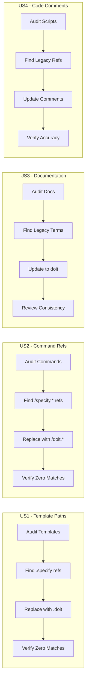

# Feature Specification: Documentation Doit Migration

**Feature Branch**: `006-docs-doit-migration`
**Created**: 2026-01-10
**Status**: Draft
**Input**: User description: "Review all documentation, code, and code comments and update from specify to doit naming, ensuring correct doit command references"

## Summary

Comprehensive audit and update of all documentation, code comments, and examples throughout the repository to migrate from the legacy "specify" naming convention to the standardized "doit" naming convention. This ensures consistency across all artifacts and prevents confusion for users learning the system.

## User Scenarios & Testing *(mandatory)*

### User Story 1 - Template Path Correction (Priority: P1)

As a developer using doit commands, I want all template files to reference `.doit/` paths instead of `.specify/` paths so that the commands execute correctly and find the expected resources.

**Why this priority**: Incorrect path references cause command failures and block all users from using the system effectively. This is a critical blocker.

**Independent Test**: Can be fully tested by searching for `.specify/` path references in all template and script files and verifying zero matches remain after update.

**Acceptance Scenarios**:

1. **Given** any `.doit/templates/commands/*.md` file, **When** the file is searched for `.specify/` paths, **Then** zero matches are found
2. **Given** any `.doit/scripts/bash/*.sh` file, **When** the file is searched for `.specify/` paths, **Then** zero matches are found
3. **Given** any `templates/` distribution file, **When** the file is searched for `.specify/` paths, **Then** zero matches are found

---

### User Story 2 - Command Reference Updates (Priority: P1)

As a developer reading documentation, I want all command references to use `/doit.*` format instead of legacy `/specify.*` or `/speckit.*` formats so that I can correctly invoke the commands.

**Why this priority**: Incorrect command references cause immediate user confusion and failed command invocations. Equally critical as path corrections.

**Independent Test**: Can be fully tested by searching for legacy command patterns (`/specify.`, `/speckit.`) in all markdown files and verifying zero matches remain.

**Acceptance Scenarios**:

1. **Given** any documentation file mentioning slash commands, **When** searched for `/specify.` pattern, **Then** zero matches are found
2. **Given** any documentation file mentioning slash commands, **When** searched for `/speckit.` pattern, **Then** zero matches are found
3. **Given** command examples in documentation, **When** reviewing command syntax, **Then** all use `/doit.*` format

---

### User Story 3 - Documentation Content Updates (Priority: P2)

As a new user reading the documentation, I want all narrative content to consistently use "doit" terminology so that I understand this is a unified system with consistent naming.

**Why this priority**: While not blocking functionality, inconsistent terminology creates confusion and reduces trust in the documentation quality.

**Independent Test**: Can be fully tested by reviewing key documentation files (README, quickstart, guides) and verifying consistent "doit" terminology throughout.

**Acceptance Scenarios**:

1. **Given** the root README.md file, **When** reviewing the content, **Then** the system is consistently referred to as "doit"
2. **Given** any quickstart.md file in specs/, **When** reviewing the content, **Then** all command references use doit naming
3. **Given** the docs/ folder documentation, **When** reviewing content, **Then** no "speckit" or legacy "specify" branding appears

---

### User Story 4 - Code Comment Updates (Priority: P3)

As a developer maintaining the codebase, I want all code comments to reference doit commands and paths so that the comments accurately reflect the current system.

**Why this priority**: Code comments are less frequently read than documentation but still important for maintainability and onboarding.

**Independent Test**: Can be fully tested by searching for legacy references in code comments across all script files.

**Acceptance Scenarios**:

1. **Given** any bash script in `.doit/scripts/`, **When** reviewing comments, **Then** all references use doit terminology
2. **Given** any Python file in `src/`, **When** reviewing docstrings and comments, **Then** all references use doit terminology

---

### Edge Cases

- What happens when a file mentions "specify" as a verb (e.g., "specify requirements")? Should be preserved - only update when referring to the tool/system name.
- What happens with historical references in CHANGELOG.md? Preserve historical accuracy - do not update past entries, only future references.
- How to handle specs/ directories from completed features? Update only actively referenced paths, preserve historical spec content integrity.

## User Journey Visualization

<!-- BEGIN:AUTO-GENERATED section="user-journey" -->

<!-- END:AUTO-GENERATED -->

## Requirements *(mandatory)*

### Functional Requirements

#### Template Path Corrections

- **FR-001**: System MUST update all `.specify/` path references to `.doit/` in template command files
- **FR-002**: System MUST update all `.specify/` path references to `.doit/` in bash script files
- **FR-003**: System MUST synchronize updated templates to `templates/` distribution directory

#### Command Reference Updates

- **FR-004**: System MUST replace all `/specify.*` command references with `/doit.*` equivalents
- **FR-005**: System MUST replace all `/speckit.*` command references with `/doit.*` equivalents
- **FR-006**: System MUST verify command reference mapping is accurate (specify.plan → doit.plan, etc.)

#### Documentation Content Updates

- **FR-007**: System MUST update README.md to use consistent doit terminology
- **FR-008**: System MUST update docs/ folder files to use doit terminology
- **FR-009**: System MUST update quickstart guides in specs/ to reference doit commands
- **FR-010**: System MUST preserve the word "specify" when used as a verb (not tool reference)

#### Code Comment Updates

- **FR-011**: System MUST update bash script comments to reference doit paths and commands
- **FR-012**: System MUST update Python docstrings and comments to reference doit terminology

#### Validation Requirements

- **FR-013**: System MUST provide grep-based validation that zero `.specify/` path references remain
- **FR-014**: System MUST provide grep-based validation that zero `/specify.` command references remain
- **FR-015**: System MUST provide grep-based validation that zero `/speckit.` command references remain

#### Preservation Requirements

- **FR-016**: System MUST NOT modify CHANGELOG.md historical entries (preserve accuracy)
- **FR-017**: System MUST NOT modify completed feature spec.md content unless actively broken

## Success Criteria *(mandatory)*

### Measurable Outcomes

- **SC-001**: Zero files contain `.specify/` path references (excluding historical CHANGELOG entries)
- **SC-002**: Zero files contain `/specify.` command references
- **SC-003**: Zero files contain `/speckit.` command references
- **SC-004**: All 9 doit commands (`/doit.specify`, `/doit.plan`, `/doit.tasks`, `/doit.implement`, `/doit.test`, `/doit.review`, `/doit.checkin`, `/doit.constitution`, `/doit.scaffold`) are correctly referenced in documentation
- **SC-005**: Template distribution copies in `templates/` match source in `.doit/templates/`
- **SC-006**: All bash scripts execute without path-related errors

## Assumptions

- The word "specify" used as a common English verb (meaning "to state explicitly") should be preserved
- Historical entries in CHANGELOG.md should maintain accuracy and not be modified
- Completed feature specs in `specs/00X-*/` directories may contain historical references that don't need updating unless they cause active confusion
- The mapping of legacy commands to doit commands is 1:1 (specify.plan → doit.plan, etc.)

## Out of Scope

- Renaming the `specs/` directory itself (this is a content update, not structural change)
- Creating new documentation (this feature only updates existing content)
- Modifying git history or commit messages
- Updating any external documentation or wikis outside this repository
