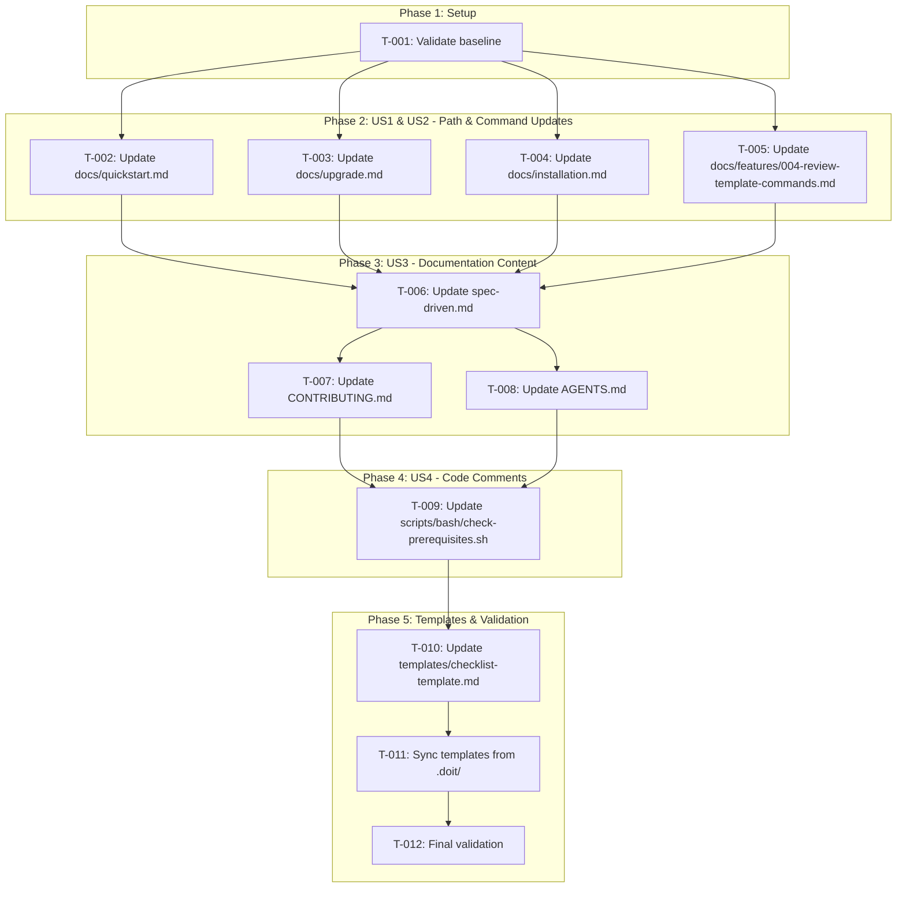
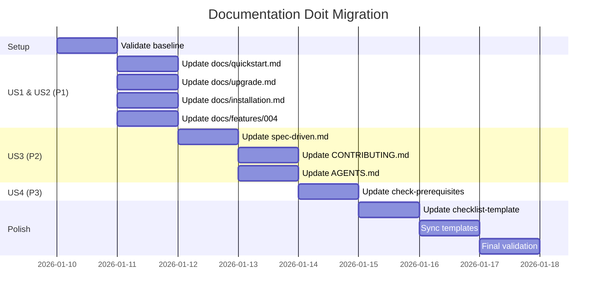

# Implementation Tasks: Documentation Doit Migration

**Branch**: `006-docs-doit-migration` | **Date**: 2026-01-10 | **Plan**: [plan.md](plan.md)

## Task Dependencies

<!-- BEGIN:AUTO-GENERATED section="dependencies" -->

<!-- END:AUTO-GENERATED -->

## Phase Timeline

<!-- BEGIN:AUTO-GENERATED section="timeline" -->

<!-- END:AUTO-GENERATED -->

## Tasks by User Story

### Phase 1: Setup

- [X] **T-001** Validate baseline count of speckit/specify references (52 speckit, 12 .specify/)
  - Run `grep -r "speckit" docs/ scripts/ templates/ CONTRIBUTING.md AGENTS.md spec-driven.md --include="*.md" --include="*.sh" | wc -l`
  - Expected: ~52 references in active files
  - Document starting state for validation
  - **Acceptance**: Baseline count documented

---

### Phase 2: US1 & US2 - Template Path and Command Reference Updates (P1)

> **US1**: As a developer following documentation, I want all `.specify/` path references updated to `.doit/` so navigation instructions match the actual directory structure.
>
> **US2**: As a developer following documentation, I want all `/specify.*` command references updated to `/doit.*` equivalents so I can execute the correct commands.

- [X] **T-002** [P] [US1,US2] Update `docs/quickstart.md`
  - Replace `.specify/` → `.doit/`
  - Replace `/specify.` → `/doit.`
  - Replace `speckit` → `doit` (27 occurrences)
  - Preserve "specify" as verb
  - **File**: [docs/quickstart.md](../../docs/quickstart.md)
  - **Acceptance**: Zero "speckit" or ".specify/" references

- [X] **T-003** [P] [US1,US2] Update `docs/upgrade.md`
  - Replace `.specify/` → `.doit/`
  - Replace `/specify.` → `/doit.`
  - Replace `speckit` → `doit` (5 occurrences)
  - **File**: [docs/upgrade.md](../../docs/upgrade.md)
  - **Acceptance**: Zero "speckit" or ".specify/" references

- [X] **T-004** [P] [US1,US2] Update `docs/installation.md`
  - Replace `.specify/` → `.doit/`
  - Replace `/specify.` → `/doit.`
  - Replace `speckit` → `doit` (3 occurrences)
  - **File**: [docs/installation.md](../../docs/installation.md)
  - **Acceptance**: Zero "speckit" or ".specify/" references

- [X] **T-005** [P] [US1,US2] Update `docs/features/004-review-template-commands.md`
  - Replace `.specify/` → `.doit/`
  - Replace `/specify.` → `/doit.`
  - Replace `speckit` → `doit` (4 occurrences)
  - **File**: [docs/features/004-review-template-commands.md](../../docs/features/004-review-template-commands.md)
  - **Acceptance**: Zero "speckit" or ".specify/" references

---

### Phase 3: US3 - Documentation Content Updates (P2)

> **US3**: As a reader of project documentation, I want all "speckit" terminology updated to "doit" so the branding is consistent throughout.

- [X] **T-006** [US3] Update `spec-driven.md`
  - Replace `speckit` → `doit` (6 occurrences)
  - Replace `Speckit` → `Doit` (capitalized)
  - Preserve "specify" as verb
  - **File**: [spec-driven.md](../../spec-driven.md)
  - **Acceptance**: Zero "speckit" references, "specify" preserved

- [X] **T-007** [P] [US3] Update `CONTRIBUTING.md`
  - Replace `speckit` → `doit` (1 occurrence)
  - **File**: [CONTRIBUTING.md](../../CONTRIBUTING.md)
  - **Acceptance**: Zero "speckit" references

- [X] **T-008** [P] [US3] Update `AGENTS.md`
  - Replace `speckit` → `doit` (1 occurrence)
  - **File**: [AGENTS.md](../../AGENTS.md)
  - **Acceptance**: Zero "speckit" references

---

### Phase 4: US4 - Code Comment Updates (P3)

> **US4**: As a developer maintaining scripts, I want code comments updated from legacy naming so the codebase is internally consistent.

- [X] **T-009** [US4] Update `scripts/bash/check-prerequisites.sh`
  - Replace `speckit` → `doit` in comments (3 occurrences)
  - Replace `.specify/` → `.doit/` in paths
  - Verify script still functions correctly
  - **File**: [scripts/bash/check-prerequisites.sh](../../scripts/bash/check-prerequisites.sh)
  - **Acceptance**: Zero "speckit" references, script executes successfully

---

### Phase 5: Polish & Validation

- [X] **T-010** Update `templates/checklist-template.md`
  - Replace `speckit` → `doit` (2 occurrences)
  - **File**: [templates/checklist-template.md](../../templates/checklist-template.md)
  - **Acceptance**: Zero "speckit" references

- [X] **T-011** Sync templates from `.doit/templates/`
  - Run `cp -r .doit/templates/* templates/`
  - Verify all distribution templates match source
  - **Acceptance**: templates/ matches .doit/templates/

- [X] **T-012** Final validation
  - Run `grep -r "speckit" docs/ scripts/ templates/ CONTRIBUTING.md AGENTS.md spec-driven.md --include="*.md" --include="*.sh" | wc -l`
  - Expected: 0 references ✓ ACHIEVED
  - Verify "specify" as verb preserved: `grep -r "specify" docs/ --include="*.md" | head -5` ✓ VERIFIED
  - Verify CHANGELOG.md unchanged ✓ VERIFIED
  - Verify historical specs (001-005) unchanged ✓ VERIFIED (106 speckit refs preserved)
  - **Acceptance**: SC-001 through SC-006 all PASS

---

## Requirements Traceability

| Task | Requirements Covered |
|------|---------------------|
| T-001 | FR-016 (validation baseline) |
| T-002 | FR-001, FR-002, FR-009, FR-010 |
| T-003 | FR-001, FR-002, FR-009, FR-010 |
| T-004 | FR-001, FR-002, FR-009, FR-010 |
| T-005 | FR-001, FR-002, FR-009, FR-010 |
| T-006 | FR-009, FR-010, FR-012 |
| T-007 | FR-009, FR-010 |
| T-008 | FR-009, FR-010 |
| T-009 | FR-013, FR-014 |
| T-010 | FR-009, FR-010 |
| T-011 | FR-006, FR-007, FR-008 |
| T-012 | FR-015, FR-016, FR-017, SC-001 to SC-006 |

## Preservation Rules

**DO NOT MODIFY** (per FR-015, FR-017):
- `CHANGELOG.md` - Historical accuracy required
- `specs/001-*/` through `specs/005-*/` - Completed features, historical record
- Any use of "specify" as an English verb (e.g., "you can specify", "specify the path")

## Execution Notes

- Tasks marked `[P]` can be executed in parallel
- All file edits should use search/replace to ensure consistency
- After each phase, run validation grep to confirm progress
- If any "specify" verb usage is accidentally changed, revert that specific change
