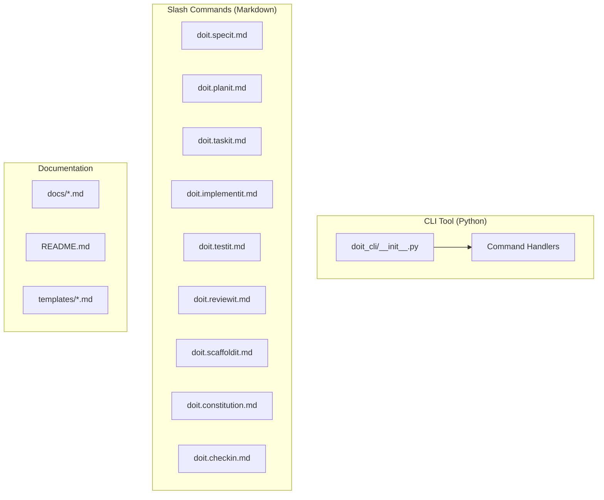

# Implementation Plan: Doit CLI and Command Rename

**Branch**: `007-doit-cli-rename` | **Date**: 2026-01-10 | **Spec**: [spec.md](spec.md)
**Input**: Feature specification from `/specs/007-007-doit-cli-rename/spec.md`

## Summary

Rename the CLI tool from "Specify CLI" to "Doit CLI" and transform slash commands to shorter, action-oriented names within the `doit.` namespace. This is a refactoring feature with no new functionality - only branding and naming changes across Python code, markdown command files, and documentation.

## Technical Context

**Language/Version**: Python 3.11+, Markdown, Bash 5.x
**Primary Dependencies**: Typer (CLI), Rich (output), httpx (HTTP)
**Storage**: N/A (file-based operations only)
**Testing**: Manual verification (no automated tests for this refactoring)
**Target Platform**: Cross-platform CLI tool
**Project Type**: Single project
**Performance Goals**: N/A (refactoring only)
**Constraints**: Must preserve backwards compatibility with existing project structure
**Scale/Scope**: ~35 string replacements in Python, 7 command file renames, ~167 documentation updates

## Architecture Overview

<!-- BEGIN:AUTO-GENERATED section="architecture" -->

<!-- END:AUTO-GENERATED -->

## Constitution Check

*GATE: Must pass before Phase 0 research. Re-check after Phase 1 design.*

**Status**: PASS - This feature is a refactoring/renaming operation that doesn't introduce new architecture patterns or violate any constitution principles.

- No new dependencies introduced
- No change to project structure beyond directory rename
- Maintains existing CLI patterns (Typer + Rich)

## Project Structure

### Documentation (this feature)

```text
specs/007-007-doit-cli-rename/
├── plan.md              # This file
├── research.md          # Completed - naming decisions documented
├── quickstart.md        # Completed - usage guide
└── tasks.md             # To be generated by /doit.taskit
```

### Source Code (repository root)

```text
src/
└── doit_cli/                    # Renamed from specify_cli/
    └── __init__.py              # All branding updated

.doit/
└── templates/
    └── commands/
        ├── doit.specit.md       # Renamed from doit.specify.md
        ├── doit.planit.md       # Renamed from doit.plan.md
        ├── doit.taskit.md       # Renamed from doit.tasks.md
        ├── doit.implementit.md  # Renamed from doit.implement.md
        ├── doit.testit.md       # Renamed from doit.test.md
        ├── doit.reviewit.md     # Renamed from doit.review.md
        ├── doit.scaffoldit.md   # Renamed from doit.scaffold.md
        ├── doit.constitution.md # UNCHANGED
        └── doit.checkin.md      # UNCHANGED

templates/
└── commands/                    # Distribution copies (synced from .doit/)
    └── [same as above]

docs/
├── quickstart.md                # Update command references
├── installation.md              # Update CLI branding
├── upgrade.md                   # Update command references
└── features/                    # Update command references
```

**Structure Decision**: Single project structure maintained. The only structural change is renaming `src/specify_cli/` to `src/doit_cli/`.

## Implementation Phases

### Phase 1: Python Package Rename (US1, US5)

1. Rename `src/specify_cli/` → `src/doit_cli/`
2. Update `pyproject.toml` package references
3. Update all branding strings in `__init__.py` (~35 replacements)

### Phase 2: Command File Rename (US2)

1. Rename 7 command files in `.doit/templates/commands/`
2. Update internal skill name references
3. Update cross-references between commands

### Phase 3: Documentation Updates (US4)

1. Update `spec-driven.md` and main docs
2. Update all `.doit/templates/*.md` files
3. Sync templates to `templates/` distribution directory

### Phase 4: Validation (US3)

1. Verify `/doit.constitution` and `/doit.checkin` unchanged
2. Run grep validation for zero old command refs
3. Test CLI commands work correctly

## Key Decisions from Research

| Decision | Choice | Rationale |
|----------|--------|-----------|
| Command naming | `doit.specit`, `doit.planit`, etc. | Action + "it" suffix, preserves namespace |
| Namespace | Keep `doit.` prefix | Avoid conflicts with other tools |
| Package rename | `specify_cli` → `doit_cli` | Match product branding |
| Preserved commands | constitution, checkin | Less frequent, explicit naming preferred |

## Files Modified Summary

| Category | Count | Files |
|----------|-------|-------|
| Python | 1 | `src/specify_cli/__init__.py` → `src/doit_cli/__init__.py` |
| pyproject.toml | 1 | Package and entry point references |
| Command files | 7 | `.doit/templates/commands/doit.*.md` |
| Documentation | ~20 | `docs/`, `templates/`, `README.md`, etc. |
| Total refs | ~200 | Across all categories |

## Risk Assessment

| Risk | Likelihood | Impact | Mitigation |
|------|------------|--------|------------|
| Missed reference | Low | Low | Grep validation catches remaining refs |
| Breaking existing projects | N/A | N/A | Out of scope - template updates only |
| Git mv issues | Low | Low | Use proper git mv for renames |

## Complexity Tracking

No constitution violations - this is a straightforward renaming operation.
