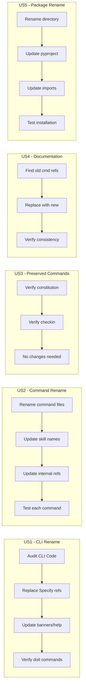

# Feature Specification: Doit CLI and Command Rename

**Feature Branch**: `007-doit-cli-rename`
**Created**: 2026-01-10
**Status**: Draft
**Input**: User description: "Update the CLI tool from Specify naming to doit naming, and rename commands to scaffoldit, planit, implementit, testit, specit, reviewit, taskit while keeping constitution and checkin as-is"

## Summary

Comprehensive rename of the CLI tool from "Specify CLI" to "Doit CLI" and transformation of slash commands from the `/doit.*` pattern to shorter, action-oriented names (`/scaffoldit`, `/planit`, etc.). This creates a more memorable and streamlined command experience while maintaining consistency with the doit branding established in Feature 006.

## User Scenarios & Testing *(mandatory)*

### User Story 1 - CLI Tool Rename (Priority: P1)

As a developer setting up new projects, I want to use the `doit` command (already configured) with consistent "Doit CLI" branding throughout so the tool identity matches the command I type.

**Why this priority**: The CLI tool is the entry point for new users. Inconsistent branding between the command (`doit`) and internal references ("Specify CLI") creates confusion.

**Independent Test**: Can be fully tested by running `doit --help`, `doit info`, and `doit init --here` and verifying all output uses "Doit CLI" terminology with no "Specify" references.

**Acceptance Scenarios**:

1. **Given** a user runs `doit --help`, **When** viewing the output, **Then** all text refers to "Doit CLI" not "Specify CLI"
2. **Given** a user runs `doit info`, **When** viewing the version panel, **Then** the title shows "Doit CLI Information"
3. **Given** a user runs `doit init my-project`, **When** viewing the setup banner, **Then** it shows "Doit Project Setup"
4. **Given** the source code in `src/`, **When** searching for "Specify CLI", **Then** zero matches are found (except historical comments if preserved)

---

### User Story 2 - Slash Command Rename (Priority: P1)

As a developer using the doit workflow, I want shorter, memorable command names (`/specit`, `/planit`, `/taskit`, etc.) so I can invoke commands more quickly and remember them easily.

**Why this priority**: Commands are used frequently throughout development. Shorter, action-oriented names improve developer experience and productivity.

**Independent Test**: Can be fully tested by invoking each renamed command and verifying it executes the correct workflow.

**Acceptance Scenarios**:

1. **Given** a user types `/specit`, **When** executed, **Then** the specification workflow runs (previously `/doit.specify`)
2. **Given** a user types `/planit`, **When** executed, **Then** the planning workflow runs (previously `/doit.plan`)
3. **Given** a user types `/taskit`, **When** executed, **Then** the task generation workflow runs (previously `/doit.tasks`)
4. **Given** a user types `/implementit`, **When** executed, **Then** the implementation workflow runs (previously `/doit.implement`)
5. **Given** a user types `/testit`, **When** executed, **Then** the test workflow runs (previously `/doit.test`)
6. **Given** a user types `/reviewit`, **When** executed, **Then** the review workflow runs (previously `/doit.review`)
7. **Given** a user types `/scaffoldit`, **When** executed, **Then** the scaffold workflow runs (previously `/doit.scaffold`)

---

### User Story 3 - Preserved Commands (Priority: P1)

As a developer, I want `/doit.constitution` and `/doit.checkin` to remain unchanged so that these less frequently used but important commands maintain their clear, descriptive names.

**Why this priority**: Constitution and checkin are conceptually different from the action-oriented commands and benefit from their explicit naming.

**Independent Test**: Can be fully tested by invoking `/doit.constitution` and `/doit.checkin` and verifying they still work.

**Acceptance Scenarios**:

1. **Given** a user types `/doit.constitution`, **When** executed, **Then** the constitution workflow runs unchanged
2. **Given** a user types `/doit.checkin`, **When** executed, **Then** the checkin workflow runs unchanged

---

### User Story 4 - Documentation Updates (Priority: P2)

As a developer reading documentation, I want all command references updated to the new names so documentation matches the actual commands.

**Why this priority**: Documentation accuracy is important but secondary to the actual functionality working.

**Independent Test**: Can be fully tested by searching documentation for old command names and verifying zero matches.

**Acceptance Scenarios**:

1. **Given** any documentation file, **When** searching for `/doit.specify`, **Then** zero matches found (replaced with `/specit`)
2. **Given** any documentation file, **When** searching for `/doit.plan`, **Then** zero matches found (replaced with `/planit`)
3. **Given** the quickstart guide, **When** reviewing the workflow section, **Then** all commands use new names

---

### User Story 5 - Package Structure Rename (Priority: P2)

As a maintainer of the codebase, I want the Python package directory renamed from `specify_cli` to `doit_cli` so the source structure matches the product naming.

**Why this priority**: Internal consistency matters for maintainability but doesn't affect end-user experience.

**Independent Test**: Can be fully tested by verifying `src/doit_cli/` exists and `src/specify_cli/` is removed.

**Acceptance Scenarios**:

1. **Given** the source directory structure, **When** listing `src/`, **Then** `doit_cli/` exists and `specify_cli/` does not
2. **Given** pyproject.toml, **When** reviewing the package configuration, **Then** it references `src/doit_cli`
3. **Given** the package is installed, **When** running `doit init`, **Then** the command works correctly

---

### Edge Cases

- What happens if a user types the old command name (`/doit.specify`)? The command will not be found - documentation should guide users to new names.
- What about existing projects with old command references in their local files? Out of scope - this feature updates the template/distribution, not existing projects.
- How to handle "specify" as a verb in documentation? Preserve - only rename tool/command references.

## User Journey Visualization

<!-- BEGIN:AUTO-GENERATED section="user-journey" -->

<!-- END:AUTO-GENERATED -->

## Requirements *(mandatory)*

### Functional Requirements

#### CLI Tool Rename

- **FR-001**: System MUST rename all "Specify CLI" text references to "Doit CLI" in `src/specify_cli/__init__.py`
- **FR-002**: System MUST update help text to reference "Doit" instead of "Specify"
- **FR-003**: System MUST update the setup banner from "Specify Project Setup" to "Doit Project Setup"
- **FR-004**: System MUST update the info panel title from "Specify CLI Information" to "Doit CLI Information"
- **FR-005**: System MUST update all usage examples from `specify init` to `doit init`

#### Slash Command Rename

- **FR-006**: System MUST rename `/doit.specify` command to `/specit`
- **FR-007**: System MUST rename `/doit.plan` command to `/planit`
- **FR-008**: System MUST rename `/doit.tasks` command to `/taskit`
- **FR-009**: System MUST rename `/doit.implement` command to `/implementit`
- **FR-010**: System MUST rename `/doit.test` command to `/testit`
- **FR-011**: System MUST rename `/doit.review` command to `/reviewit`
- **FR-012**: System MUST rename `/doit.scaffold` command to `/scaffoldit`

#### Preserved Commands

- **FR-013**: System MUST NOT rename `/doit.constitution` command
- **FR-014**: System MUST NOT rename `/doit.checkin` command

#### Package Structure

- **FR-015**: System MUST rename `src/specify_cli/` directory to `src/doit_cli/`
- **FR-016**: System MUST update pyproject.toml package reference from `src/specify_cli` to `src/doit_cli`
- **FR-017**: System MUST update pyproject.toml script entry from `specify_cli:main` to `doit_cli:main`

#### Documentation Updates

- **FR-018**: System MUST update all documentation files to reference new command names
- **FR-019**: System MUST update README.md with new command names
- **FR-020**: System MUST update quickstart.md with new command names
- **FR-021**: System MUST preserve "specify" when used as a verb (not a command reference)

#### Cross-Reference Updates

- **FR-022**: System MUST update command template files to reference new skill names
- **FR-023**: System MUST update CLAUDE.md if it references old command names
- **FR-024**: System MUST update any bash scripts that reference old command names

## Success Criteria *(mandatory)*

### Measurable Outcomes

- **SC-001**: `doit --help` output contains "Doit CLI" and zero "Specify CLI" references
- **SC-002**: `doit info` shows "Doit CLI Information" title
- **SC-003**: All 7 renamed commands (`/specit`, `/planit`, `/taskit`, `/implementit`, `/testit`, `/reviewit`, `/scaffoldit`) execute successfully
- **SC-004**: `/doit.constitution` and `/doit.checkin` continue to work unchanged
- **SC-005**: `src/doit_cli/` directory exists and `src/specify_cli/` does not exist
- **SC-006**: Zero documentation files contain old command names (`/doit.specify`, `/doit.plan`, etc.) except preserved ones
- **SC-007**: Package installs and runs correctly after rename (`pip install -e . && doit --help`)

## Assumptions

- The pyproject.toml already has `name = "doit-cli"` and script entry `doit = ...` - only internal references need updating
- Old command names will simply not work after rename - no backwards compatibility layer needed
- The `.doit/templates/commands/` directory structure will use new filenames (e.g., `specit.md` instead of `doit.specify.md`)
- Historical references in CHANGELOG.md should be preserved for accuracy

## Out of Scope

- Backwards compatibility aliases for old command names
- Migration tool for existing projects using old command names
- Renaming the `specs/` directory or feature branch naming convention
- Changes to the git workflow or branch naming
