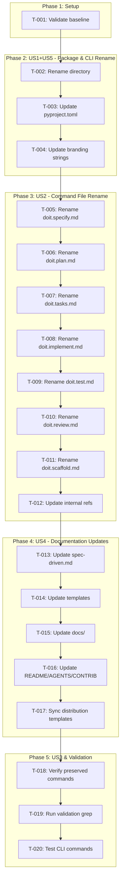
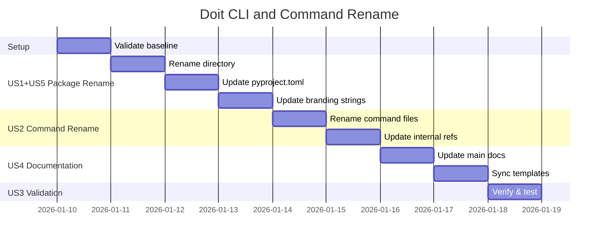

# Implementation Tasks: Doit CLI and Command Rename

**Branch**: `007-doit-cli-rename` | **Date**: 2026-01-10 | **Plan**: [plan.md](plan.md)

## Task Dependencies

<!-- BEGIN:AUTO-GENERATED section="dependencies" -->

<!-- END:AUTO-GENERATED -->

## Phase Timeline

<!-- BEGIN:AUTO-GENERATED section="timeline" -->

<!-- END:AUTO-GENERATED -->

## Tasks by User Story

### Phase 1: Setup

- [x] **T-001** Validate baseline - document current state
  - Count "Specify CLI" references: `grep -r "Specify CLI" src/ --include="*.py" | wc -l`
  - Count command file names: `ls .doit/templates/commands/doit.*.md | wc -l`
  - Document expected changes
  - **Acceptance**: Baseline counts documented

---

### Phase 2: US1 + US5 - CLI Tool & Package Rename (P1 + P2)

> **US1**: As a developer, I want consistent "Doit CLI" branding throughout so the tool identity matches the command.
>
> **US5**: As a maintainer, I want the Python package directory renamed from `specify_cli` to `doit_cli`.

- [ ] **T-002** [US5] Rename `src/specify_cli/` directory to `src/doit_cli/`
  - Use `git mv src/specify_cli src/doit_cli`
  - Verify git tracking is preserved
  - **File**: [src/specify_cli/](../../src/specify_cli/) → `src/doit_cli/`
  - **Acceptance**: Directory renamed, git history preserved

- [ ] **T-003** [US5] Update `pyproject.toml` package references
  - Replace `src/specify_cli` → `src/doit_cli` in `[tool.hatch.build.targets.wheel]`
  - Replace `specify_cli:main` → `doit_cli:main` in `[project.scripts]`
  - **File**: [pyproject.toml](../../pyproject.toml)
  - **Acceptance**: Package installs correctly with `pip install -e .`

- [ ] **T-004** [US1] Update all branding strings in `src/doit_cli/__init__.py`
  - Replace "Specify CLI" → "Doit CLI" (docstrings, help text)
  - Replace "Specify Project Setup" → "Doit Project Setup" (banner)
  - Replace "Specify CLI Information" → "Doit CLI Information" (info panel)
  - Replace `specify init` → `doit init` (usage examples)
  - Replace `specify-cli` → `doit-cli` (package references)
  - Replace "Initialize a new Specify project" → "Initialize a new Doit project"
  - Replace "Initial commit from Specify template" → "Initial commit from Doit template"
  - **File**: `src/doit_cli/__init__.py`
  - **Acceptance**: `doit --help` shows "Doit CLI", zero "Specify" refs (except verb usage)

**Checkpoint**: CLI tool should work with `doit --help`, `doit info`, `doit init --help`

---

### Phase 3: US2 - Slash Command Rename (P1)

> **US2**: As a developer using the doit workflow, I want shorter, memorable command names within the `doit.` namespace.

- [ ] **T-005** [P] [US2] Rename `doit.specify.md` to `doit.specit.md`
  - Use `git mv .doit/templates/commands/doit.specify.md .doit/templates/commands/doit.specit.md`
  - **File**: `.doit/templates/commands/doit.specify.md` → `doit.specit.md`
  - **Acceptance**: File renamed, git tracked

- [ ] **T-006** [P] [US2] Rename `doit.plan.md` to `doit.planit.md`
  - Use `git mv .doit/templates/commands/doit.plan.md .doit/templates/commands/doit.planit.md`
  - **File**: `.doit/templates/commands/doit.plan.md` → `doit.planit.md`
  - **Acceptance**: File renamed, git tracked

- [ ] **T-007** [P] [US2] Rename `doit.tasks.md` to `doit.taskit.md`
  - Use `git mv .doit/templates/commands/doit.tasks.md .doit/templates/commands/doit.taskit.md`
  - **File**: `.doit/templates/commands/doit.tasks.md` → `doit.taskit.md`
  - **Acceptance**: File renamed, git tracked

- [ ] **T-008** [P] [US2] Rename `doit.implement.md` to `doit.implementit.md`
  - Use `git mv .doit/templates/commands/doit.implement.md .doit/templates/commands/doit.implementit.md`
  - **File**: `.doit/templates/commands/doit.implement.md` → `doit.implementit.md`
  - **Acceptance**: File renamed, git tracked

- [ ] **T-009** [P] [US2] Rename `doit.test.md` to `doit.testit.md`
  - Use `git mv .doit/templates/commands/doit.test.md .doit/templates/commands/doit.testit.md`
  - **File**: `.doit/templates/commands/doit.test.md` → `doit.testit.md`
  - **Acceptance**: File renamed, git tracked

- [ ] **T-010** [P] [US2] Rename `doit.review.md` to `doit.reviewit.md`
  - Use `git mv .doit/templates/commands/doit.review.md .doit/templates/commands/doit.reviewit.md`
  - **File**: `.doit/templates/commands/doit.review.md` → `doit.reviewit.md`
  - **Acceptance**: File renamed, git tracked

- [ ] **T-011** [P] [US2] Rename `doit.scaffold.md` to `doit.scaffoldit.md`
  - Use `git mv .doit/templates/commands/doit.scaffold.md .doit/templates/commands/doit.scaffoldit.md`
  - **File**: `.doit/templates/commands/doit.scaffold.md` → `doit.scaffoldit.md`
  - **Acceptance**: File renamed, git tracked

- [ ] **T-012** [US2] Update internal skill name references in all command files
  - In each renamed command file, update skill name in frontmatter/header
  - Update cross-references: `/doit.specify` → `/doit.specit`, etc.
  - Update "Run `/doit.plan` next" → "Run `/doit.planit` next"
  - **Files**: All `.doit/templates/commands/doit.*.md` files
  - **Acceptance**: All internal references use new command names

**Checkpoint**: All 7 command files renamed, internal references updated

---

### Phase 4: US4 - Documentation Updates (P2)

> **US4**: As a developer reading documentation, I want all command references updated to the new names.

- [ ] **T-013** [US4] Update `spec-driven.md` with new command names
  - Replace `/doit.specify` → `/doit.specit`
  - Replace `/doit.plan` → `/doit.planit`
  - Replace `/doit.tasks` → `/doit.taskit`
  - Replace `/doit.implement` → `/doit.implementit`
  - Replace `/doit.test` → `/doit.testit`
  - Replace `/doit.review` → `/doit.reviewit`
  - Replace `/doit.scaffold` → `/doit.scaffoldit`
  - **File**: [spec-driven.md](../../spec-driven.md)
  - **Acceptance**: Zero old command name references

- [ ] **T-014** [P] [US4] Update `.doit/templates/*.md` files with new command names
  - Update `spec-template.md`
  - Update `plan-template.md`
  - Update `tasks-template.md`
  - Update `checklist-template.md`
  - **Files**: `.doit/templates/*.md`
  - **Acceptance**: All templates reference new command names

- [ ] **T-015** [P] [US4] Update `docs/*.md` files with new command names
  - Update `docs/quickstart.md`
  - Update `docs/installation.md`
  - Update `docs/upgrade.md`
  - Update any `docs/features/*.md` that reference commands
  - **Files**: `docs/*.md`, `docs/features/*.md`
  - **Acceptance**: All docs reference new command names

- [ ] **T-016** [P] [US4] Update root documentation files
  - Update `README.md` with new command names
  - Update `CONTRIBUTING.md` with new command names
  - Update `AGENTS.md` with new command names
  - Update `CLAUDE.md` if it references old command names
  - **Files**: Root `.md` files
  - **Acceptance**: Zero old command references in root docs

- [ ] **T-017** [US4] Sync distribution templates from `.doit/templates/`
  - Run `cp -r .doit/templates/commands/* templates/commands/`
  - Verify all distribution templates match source
  - **Files**: `templates/commands/`
  - **Acceptance**: templates/ matches .doit/templates/

**Checkpoint**: All documentation updated with new command names

---

### Phase 5: US3 & Validation (P1)

> **US3**: As a developer, I want `/doit.constitution` and `/doit.checkin` to remain unchanged.

- [ ] **T-018** [US3] Verify preserved commands are unchanged
  - Confirm `doit.constitution.md` file NOT renamed
  - Confirm `doit.checkin.md` file NOT renamed
  - Verify contents reference correct workflow
  - **Files**: `.doit/templates/commands/doit.constitution.md`, `.doit/templates/commands/doit.checkin.md`
  - **Acceptance**: Both files unchanged

- [ ] **T-019** Run final validation grep
  - Run `grep -r "/doit\.specify\|/doit\.plan\|/doit\.tasks\|/doit\.implement\|/doit\.test\|/doit\.review\|/doit\.scaffold" --include="*.md" 2>/dev/null | grep -v "specs/00[1-6]-" | wc -l`
  - Expected: 0 references in active files
  - Run `grep -r "Specify CLI" src/ --include="*.py" | wc -l`
  - Expected: 0 references (excluding verb usage)
  - **Acceptance**: Zero old command/branding references

- [ ] **T-020** Test CLI commands work correctly
  - Run `pip install -e .`
  - Run `doit --help` - verify "Doit CLI" branding
  - Run `doit info` - verify "Doit CLI Information" title
  - Verify preserved commands work
  - **Acceptance**: SC-001, SC-002, SC-007 pass

---

## Requirements Traceability

| Task | Requirements Covered |
|------|---------------------|
| T-001 | Baseline validation |
| T-002 | FR-015 |
| T-003 | FR-016, FR-017 |
| T-004 | FR-001, FR-002, FR-003, FR-004, FR-005 |
| T-005 | FR-006 |
| T-006 | FR-007 |
| T-007 | FR-008 |
| T-008 | FR-009 |
| T-009 | FR-010 |
| T-010 | FR-011 |
| T-011 | FR-012 |
| T-012 | FR-022 |
| T-013 | FR-018 |
| T-014 | FR-022 |
| T-015 | FR-018, FR-020 |
| T-016 | FR-019, FR-023 |
| T-017 | FR-022 |
| T-018 | FR-013, FR-014 |
| T-019 | SC-006 |
| T-020 | SC-001, SC-002, SC-007 |

## Preservation Rules

**DO NOT MODIFY** (per FR-021):
- `CHANGELOG.md` - Historical accuracy required
- `specs/001-*/` through `specs/006-*/` - Completed features, historical record
- Any use of "specify" as an English verb (e.g., "you can specify", "specify the path")

## Execution Notes

- Tasks T-005 through T-011 marked `[P]` can be executed in parallel (different files)
- Tasks T-014, T-015, T-016 marked `[P]` can be executed in parallel
- Use `git mv` for all file renames to preserve history
- After each phase, run validation grep to confirm progress
- If any "specify" verb usage is accidentally changed, revert that specific change
