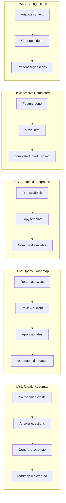
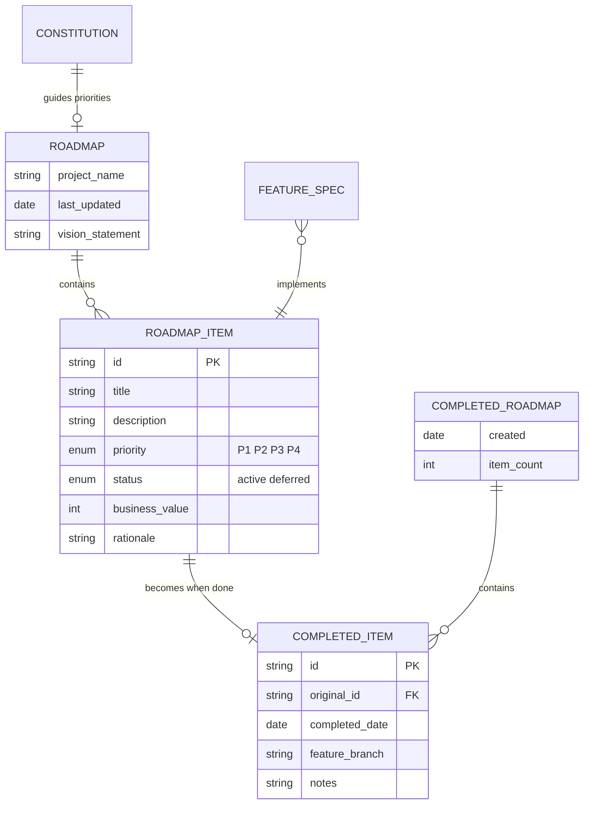

# Feature Specification: Doit Roadmapit Command

**Feature Branch**: `008-doit-roadmapit-command`
**Created**: 2026-01-10
**Status**: Draft
**Input**: User description: "Add a new command for doit.roadmapit which is used to update or create the roadmap.md file with high-level requirements, deferred functionality, and prioritized order by business value. The command asks clarifying questions and provides feature enhancement suggestions. Includes integration with other doit commands and a completed_roadmap.md for historical context."

## User Scenarios & Testing *(mandatory)*

### User Story 1 - Create Initial Roadmap (Priority: P1)

A developer starting a new project wants to establish a roadmap that captures high-level requirements and business priorities. They run `/doit.roadmapit` to create the initial `roadmap.md` file with guided prompts that help them articulate their vision.

**Why this priority**: The ability to create a roadmap is the foundational capability - without it, no other roadmap features can function. This provides immediate value by establishing project direction and priorities.

**Independent Test**: Can be fully tested by running `/doit.roadmapit` on a project without an existing roadmap and verifying a well-structured `roadmap.md` is created in `.doit/memory/`.

**Acceptance Scenarios**:

1. **Given** a project with no existing roadmap, **When** user runs `/doit.roadmapit create my initial vision`, **Then** the system creates `.doit/memory/roadmap.md` with structured sections for requirements, priorities, and deferred items.
2. **Given** the command is running, **When** the user provides a high-level description, **Then** the system asks clarifying questions to refine requirements and priorities.
3. **Given** the user has answered clarifying questions, **When** roadmap generation completes, **Then** the system suggests potential enhancements or features the user may not have considered.

---

### User Story 2 - Update Existing Roadmap (Priority: P1)

A developer with an existing roadmap wants to add new requirements, reprioritize items, or defer functionality. They run `/doit.roadmapit` to update the roadmap while preserving existing context and history.

**Why this priority**: Roadmaps must evolve as projects progress. Equal priority with creation because both are essential for the core workflow.

**Independent Test**: Can be fully tested by running `/doit.roadmapit` on a project with an existing roadmap and verifying changes are applied while preserving existing content.

**Acceptance Scenarios**:

1. **Given** a project with an existing roadmap, **When** user runs `/doit.roadmapit add user authentication feature`, **Then** the system adds the new item to the appropriate section with clarified priority.
2. **Given** an existing roadmap item, **When** user requests to defer an item, **Then** the item moves to the "Deferred" section with reason and original priority preserved.
3. **Given** an existing roadmap, **When** user runs update command, **Then** the system shows current roadmap state and asks targeted questions about changes.

---

### User Story 3 - Initialize Roadmap Command for New Projects (Priority: P2)

When a user initializes a new project using `/doit.scaffoldit`, the roadmap command template should be automatically included so users can immediately use `/doit.roadmapit` without additional setup.

**Why this priority**: This ensures the command is available out-of-the-box for all new projects, but depends on the core command being defined first.

**Independent Test**: Can be tested by running `/doit.scaffoldit` on a new project and verifying the `doit.roadmapit.md` command file is created in the agent's commands directory.

**Acceptance Scenarios**:

1. **Given** a user runs `/doit.scaffoldit`, **When** the scaffold completes, **Then** `doit.roadmapit.md` exists in `.claude/commands/` (or equivalent agent directory).
2. **Given** the command template is copied, **When** user types `/doit.roadmapit`, **Then** the command is recognized and executable.

---

### User Story 4 - Move Completed Items to Archive (Priority: P2)

When a feature from the roadmap is completed via `/doit.checkin`, the completed item should be moved from `roadmap.md` to `completed_roadmap.md` with completion metadata, maintaining historical context for the AI agent.

**Why this priority**: This maintains clean roadmaps and preserves institutional memory, but requires the update functionality to work first.

**Independent Test**: Can be tested by marking a roadmap item as complete and verifying it appears in `completed_roadmap.md` with appropriate metadata.

**Acceptance Scenarios**:

1. **Given** a roadmap item is completed, **When** `/doit.checkin` finishes successfully, **Then** the item moves to `completed_roadmap.md` with completion date and linked feature branch.
2. **Given** an item is moved to completed_roadmap, **When** the agent reads project context, **Then** it can reference historical decisions and deferred items from past features.
3. **Given** completed_roadmap.md doesn't exist, **When** first item is completed, **Then** the file is created with proper structure.

---

### User Story 5 - AI-Suggested Enhancements (Priority: P3)

The roadmap command should analyze the user's input and project context to suggest features or functionality that could enhance the application, helping users think beyond their immediate requirements.

**Why this priority**: This is a value-add feature that improves the user experience but isn't essential for core roadmap functionality.

**Independent Test**: Can be tested by providing a roadmap description and verifying the system offers relevant enhancement suggestions.

**Acceptance Scenarios**:

1. **Given** user creates/updates a roadmap, **When** generation completes, **Then** the system offers 2-5 relevant enhancement suggestions based on the project context.
2. **Given** enhancement suggestions are presented, **When** user accepts a suggestion, **Then** it's added to the roadmap with appropriate priority.
3. **Given** the project has a constitution, **When** generating suggestions, **Then** suggestions align with the project's governing principles.

---

### Edge Cases

- What happens when roadmap.md exists but is malformed or corrupted?
  - System backs up existing file and creates fresh structure, preserving readable content
- What happens when user tries to defer an item that doesn't exist?
  - System shows available items and asks user to select from the list
- What happens when completed_roadmap.md grows very large?
  - System maintains only last 20 completed items in active file, archives older items
- How does system handle conflicting priorities?
  - System prompts user to resolve conflicts with guided comparison questions
- What happens when project has no constitution?
  - Roadmap command works without constitution but recommends running `/doit.constitution` first

## User Journey Visualization

<!-- BEGIN:AUTO-GENERATED section="user-journey" -->

<!-- END:AUTO-GENERATED -->

## Entity Relationships

<!-- BEGIN:AUTO-GENERATED section="entity-relationships" -->

<!-- END:AUTO-GENERATED -->

## Requirements *(mandatory)*

### Functional Requirements

**Command Core Functionality**

- **FR-001**: System MUST create `roadmap.md` in `.doit/memory/` when no roadmap exists
- **FR-002**: System MUST update existing `roadmap.md` when one already exists, preserving unmodified content
- **FR-003**: System MUST organize roadmap items by business value priority (P1 highest)
- **FR-004**: System MUST include sections for: Vision, Active Requirements, Deferred Items
- **FR-005**: System MUST ask clarifying questions when user input is ambiguous or incomplete

**Interactive Guidance**

- **FR-006**: System MUST present clarifying questions one at a time with suggested answers
- **FR-007**: System MUST provide 2-5 feature enhancement suggestions after roadmap creation/update
- **FR-008**: System MUST allow users to accept, modify, or reject enhancement suggestions
- **FR-009**: System MUST explain priority recommendations with business value rationale

**Template & CLI Integration**

- **FR-010**: System MUST create `roadmap-template.md` in `.doit/templates/`
- **FR-011**: System MUST create `doit.roadmapit.md` command in `.doit/templates/commands/`
- **FR-012**: `/doit.scaffoldit` MUST copy `doit.roadmapit.md` to agent commands directory
- **FR-013**: System MUST update scaffold command documentation to include the new command (10 commands total)

**Completed Items Archive**

- **FR-014**: System MUST create `completed_roadmap.md` in `.doit/memory/` when first item completes
- **FR-015**: System MUST move completed roadmap items to `completed_roadmap.md` with metadata
- **FR-016**: Completed items MUST include: completion date, original priority, linked feature branch
- **FR-017**: `/doit.checkin` MUST trigger roadmap item completion when feature branch matches

**Cross-Command Integration**

- **FR-018**: `/doit.specit` SHOULD reference relevant roadmap items when creating specifications
- **FR-019**: `/doit.planit` SHOULD check roadmap for context when generating implementation plans
- **FR-020**: System MUST read constitution (if exists) to align suggestions with project principles

### Key Entities

- **Roadmap**: The master document containing project vision and prioritized requirements. Stored at `.doit/memory/roadmap.md`. Contains vision statement, active items, and deferred items.

- **Roadmap Item**: A single requirement or feature in the roadmap. Has priority (P1-P4), business value score, status (active/deferred), and rationale. Can be linked to feature specifications.

- **Completed Item**: An archived roadmap item that has been implemented. Preserves original metadata plus completion date, feature branch reference, and any notes about the implementation.

- **Completed Roadmap**: The archive file containing all completed items. Stored at `.doit/memory/completed_roadmap.md`. Provides historical context for the AI agent.

## Assumptions

- Users are familiar with the doit command workflow (`/doit.specit`, `/doit.planit`, etc.)
- Projects using this feature have Git initialized (for branch linking)
- The `.doit/memory/` directory exists or will be created by the command
- Business value priority uses P1 (highest) through P4 (lowest) scale
- Maximum 20 completed items kept in active completed_roadmap.md before archiving

## Success Criteria *(mandatory)*

### Measurable Outcomes

- **SC-001**: Users can create a structured roadmap in under 5 minutes using guided prompts
- **SC-002**: 100% of new projects scaffolded with `/doit.scaffoldit` include the roadmapit command
- **SC-003**: Roadmap updates preserve 100% of unmodified existing content
- **SC-004**: AI suggestions are relevant to the project context in 80% of cases (user acceptance rate)
- **SC-005**: Completed items maintain full traceability to their original roadmap entry
- **SC-006**: The AI agent can reference completed_roadmap.md to understand project history and past decisions
