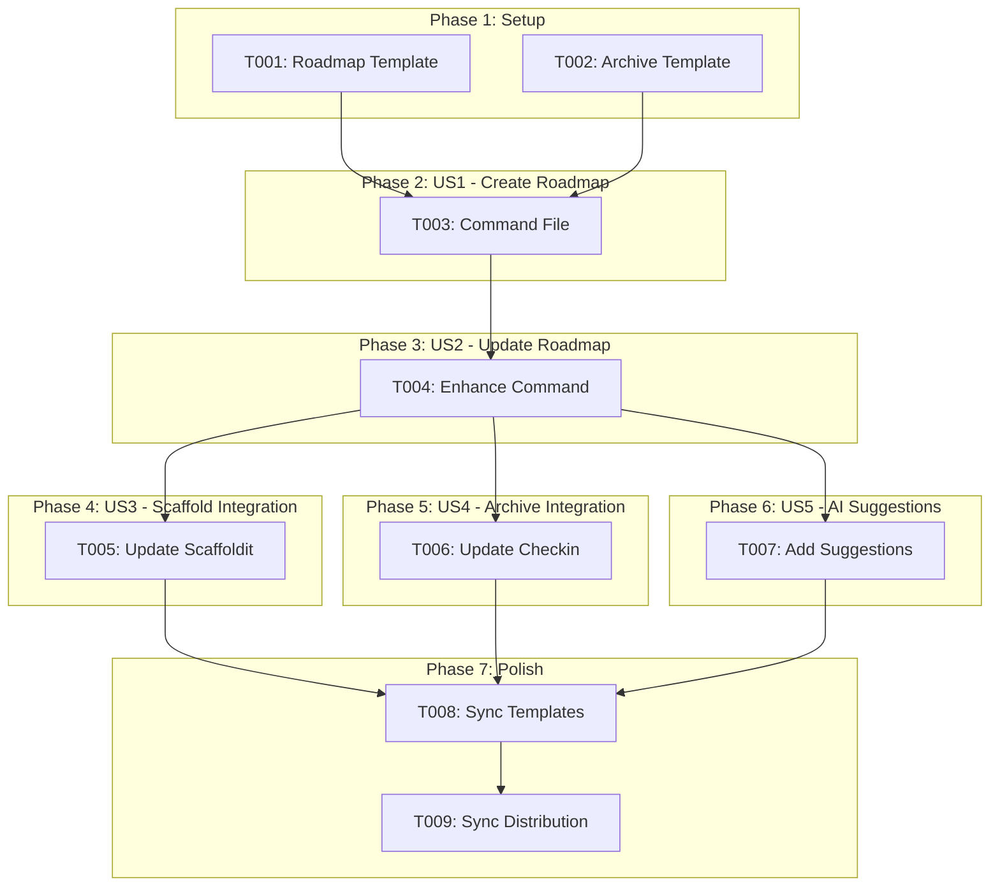
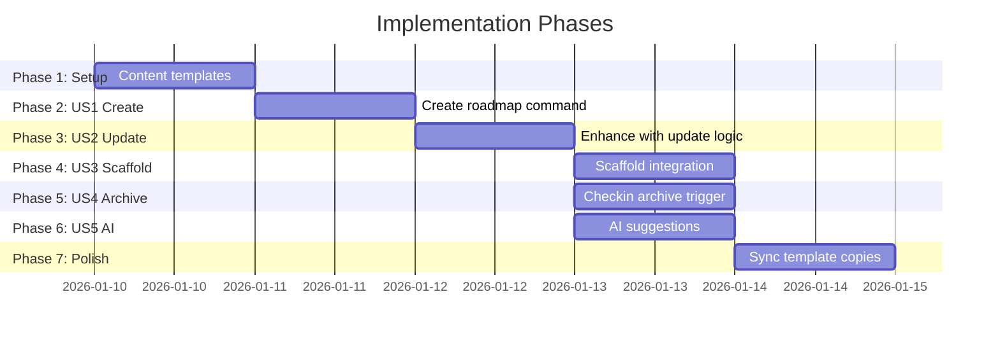

# Tasks: Doit Roadmapit Command

**Input**: Design documents from `/specs/008-doit-roadmapit-command/`
**Prerequisites**: plan.md (required), spec.md (required for user stories), research.md

**Tests**: No automated tests required - manual verification via command execution per plan.md.

**Organization**: Tasks are grouped by user story to enable independent implementation and testing of each story.

## Task Dependencies

<!-- BEGIN:AUTO-GENERATED section="task-dependencies" -->

<!-- END:AUTO-GENERATED -->

## Phase Timeline

<!-- BEGIN:AUTO-GENERATED section="phase-timeline" -->

<!-- END:AUTO-GENERATED -->

## Format: `[ID] [P?] [Story] Description`

- **[P]**: Can run in parallel (different files, no dependencies)
- **[Story]**: Which user story this task belongs to (e.g., US1, US2, US3)
- Include exact file paths in descriptions

## Path Conventions

This feature uses template/command file structure:
- Command definitions: `.claude/commands/`
- Template source: `.doit/templates/` and `.doit/templates/commands/`
- Distribution copies: `templates/commands/`
- Memory files: `.doit/memory/` (created at runtime by command)

---

## Phase 1: Setup (Shared Templates)

**Purpose**: Create content templates that the command will use

- [x] T001 [P] Create roadmap content template in .doit/templates/roadmap-template.md
- [x] T002 [P] Create completed roadmap archive template in .doit/templates/completed-roadmap-template.md

---

## Phase 2: User Story 1 - Create Initial Roadmap (Priority: P1) MVP

**Goal**: Allow users to create a new roadmap.md file with guided prompts

**Independent Test**: Run `/doit.roadmapit create my initial vision` on a project with no roadmap and verify `.doit/memory/roadmap.md` is created with proper structure

### Implementation for User Story 1

- [x] T003 [US1] Create doit.roadmapit.md command in .claude/commands/doit.roadmapit.md with:
  - YAML frontmatter (description, handoffs)
  - User Input section for $ARGUMENTS
  - Create roadmap workflow (check if roadmap exists, create if not)
  - Read roadmap-template.md and populate with user input
  - Ask clarifying questions for vision, priorities, initial items
  - Write to .doit/memory/roadmap.md

**Checkpoint**: At this point, `/doit.roadmapit` can create new roadmaps

---

## Phase 3: User Story 2 - Update Existing Roadmap (Priority: P1)

**Goal**: Allow users to add items, reprioritize, or defer functionality in existing roadmaps

**Independent Test**: Run `/doit.roadmapit add user authentication` on a project with existing roadmap and verify item is added with clarified priority

### Implementation for User Story 2

- [x] T004 [US2] Enhance doit.roadmapit.md command in .claude/commands/doit.roadmapit.md with:
  - Detect existing roadmap and load current state
  - Support "add [item]" arguments to add new items
  - Support "defer [item]" arguments to move items to deferred section
  - Support "reprioritize" arguments to change item priorities
  - Preserve unmodified content when updating
  - Show current roadmap state before asking for changes
  - Ask targeted questions about changes

**Checkpoint**: At this point, `/doit.roadmapit` can both create and update roadmaps

---

## Phase 4: User Story 3 - Scaffold Integration (Priority: P2)

**Goal**: New projects scaffolded with `/doit.scaffoldit` include the roadmapit command

**Independent Test**: Run `/doit.scaffoldit` on a new project and verify `doit.roadmapit.md` exists in the agent commands directory

### Implementation for User Story 3

- [x] T005 [US3] Update doit.scaffoldit.md command in .claude/commands/doit.scaffoldit.md to:
  - Add doit.roadmapit.md to the list of commands copied (10 total, was 9)
  - Update documentation comments to reflect 10 commands

**Checkpoint**: At this point, scaffolded projects include the roadmapit command

---

## Phase 5: User Story 4 - Archive Completed Items (Priority: P2)

**Goal**: When features complete via `/doit.checkin`, matching roadmap items move to `completed_roadmap.md`

**Independent Test**: Mark a roadmap item as complete via checkin and verify it appears in `completed_roadmap.md` with metadata

### Implementation for User Story 4

- [x] T006 [US4] Update doit.checkin.md command in .claude/commands/doit.checkin.md to:
  - After successful checkin, read .doit/memory/roadmap.md
  - Match current feature branch (###-feature-name) to roadmap items with [###-feature-name] reference
  - If match found, move item to .doit/memory/completed_roadmap.md
  - Create completed_roadmap.md if it doesn't exist (use completed-roadmap-template.md)
  - Add completion metadata: date, feature branch, original priority
  - Remove matched item from roadmap.md
  - Maintain only last 20 items in completed_roadmap.md (archive older)

**Checkpoint**: At this point, completed features automatically archive their roadmap items

---

## Phase 6: User Story 5 - AI Suggestions (Priority: P3)

**Goal**: The command provides 2-5 feature enhancement suggestions after roadmap operations

**Independent Test**: Create/update a roadmap and verify system offers relevant enhancement suggestions based on project context

### Implementation for User Story 5

- [x] T007 [US5] Enhance doit.roadmapit.md command in .claude/commands/doit.roadmapit.md to:
  - After roadmap create/update, analyze project context
  - Read .doit/memory/constitution.md if exists for project principles
  - Read existing roadmap for gaps and patterns
  - Generate 2-5 complementary feature suggestions with rationale
  - Present suggestions to user with accept/modify/reject options
  - If accepted, add suggestion to roadmap with appropriate priority

**Checkpoint**: At this point, the command provides intelligent enhancement suggestions

---

## Phase 7: Polish & Sync

**Purpose**: Ensure all template copies are synchronized across distribution directories

- [x] T008 [P] Copy doit.roadmapit.md to .doit/templates/commands/doit.roadmapit.md
- [x] T009 [P] Copy doit.roadmapit.md to templates/commands/doit.roadmapit.md
- [x] T010 [P] Copy updated doit.scaffoldit.md to .doit/templates/commands/doit.scaffoldit.md
- [x] T011 [P] Copy updated doit.scaffoldit.md to templates/commands/doit.scaffoldit.md
- [x] T012 [P] Copy updated doit.checkin.md to .doit/templates/commands/doit.checkin.md (if template exists)
- [x] T013 [P] Copy updated doit.checkin.md to templates/commands/doit.checkin.md (if template exists)
- [x] T014 Verify all command files have consistent YAML frontmatter structure
- [x] T015 Update README.md if needed to document new command (10 commands)

---

## Dependencies & Execution Order

### Phase Dependencies

- **Setup (Phase 1)**: No dependencies - can start immediately
- **US1 Create (Phase 2)**: Depends on Setup (needs templates)
- **US2 Update (Phase 3)**: Depends on US1 (enhances same file)
- **US3 Scaffold (Phase 4)**: Depends on US2 (command must be complete)
- **US4 Archive (Phase 5)**: Depends on US2 (command must be complete)
- **US5 AI Suggestions (Phase 6)**: Depends on US2 (enhances same file)
- **Polish (Phase 7)**: Depends on all user stories being complete

### User Story Dependencies

- **US1 (P1)**: Can start after Setup - foundational command creation
- **US2 (P1)**: Depends on US1 - enhances same command file
- **US3 (P2)**: Independent of US4/US5 - different file (scaffoldit)
- **US4 (P2)**: Independent of US3/US5 - different file (checkin)
- **US5 (P3)**: Independent of US3/US4 - enhances main command

### Parallel Opportunities

- **Phase 1**: T001 and T002 can run in parallel (different files)
- **Phase 4-6**: US3, US4, US5 can run in parallel (different files)
- **Phase 7**: T008-T013 can run in parallel (different files)

---

## Parallel Example: Phase 1 Setup

```bash
# Launch both template creation tasks together:
Task: "Create roadmap content template in .doit/templates/roadmap-template.md"
Task: "Create completed roadmap archive template in .doit/templates/completed-roadmap-template.md"
```

## Parallel Example: Phase 4-6 (After US2 Complete)

```bash
# Launch US3, US4, US5 together (different files):
Task: "Update doit.scaffoldit.md command" (US3)
Task: "Update doit.checkin.md command" (US4)
Task: "Enhance doit.roadmapit.md with AI suggestions" (US5)
```

---

## Implementation Strategy

### MVP First (User Story 1 Only)

1. Complete Phase 1: Setup (templates)
2. Complete Phase 2: User Story 1 (create command)
3. **STOP and VALIDATE**: Test roadmap creation independently
4. Demo: Users can create new roadmaps

### Incremental Delivery

1. Setup + US1 → Create capability (MVP)
2. Add US2 → Update capability
3. Add US3 → Scaffold integration
4. Add US4 → Archive integration
5. Add US5 → AI enhancement suggestions
6. Polish → Sync all copies

---

## Notes

- [P] tasks = different files, no dependencies
- [Story] label maps task to specific user story for traceability
- Each user story should be independently completable and testable
- Commit after each task or logical group
- Stop at any checkpoint to validate story independently
- The main command file (.claude/commands/doit.roadmapit.md) is enhanced across US1, US2, and US5
- Template sync (Phase 7) ensures distribution packages stay current
