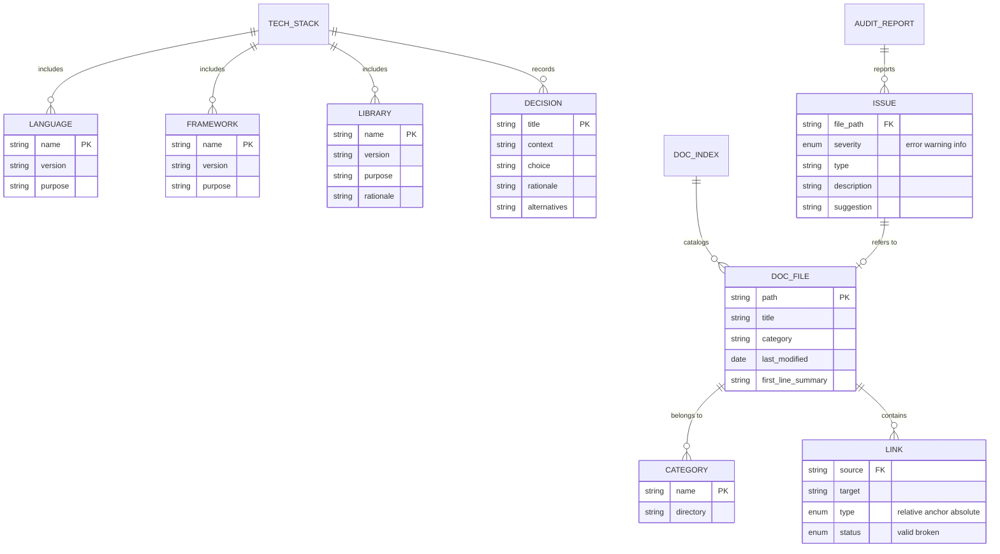

# Data Model: Doit Documentit Command & Scaffoldit Enhancement

**Feature**: 009-doit-documentit-command
**Date**: 2026-01-10
**Status**: Complete

## Overview

This document defines the data structures for documentation management and tech stack tracking. All data is stored in markdown files, so "data models" represent the file structures and content schemas.

## File Schemas

### 1. Tech Stack File (`.doit/memory/tech-stack.md`)

Generated by `/doit.scaffoldit` during project scaffolding.

```markdown
# Tech Stack

**Generated**: [DATE]
**Last Updated**: [DATE]

## Languages

| Language | Version | Purpose |
| -------- | ------- | ------- |
| [name]   | [ver]   | [role]  |

## Frameworks

| Framework | Version | Purpose |
| --------- | ------- | ------- |
| [name]    | [ver]   | [role]  |

## Key Libraries

| Library | Version | Purpose | Why Chosen |
| ------- | ------- | ------- | ---------- |
| [name]  | [ver]   | [role]  | [rationale]|

## Infrastructure

- **Hosting**: [platform]
- **Cloud Provider**: [provider]
- **Database**: [database or "None"]

## Architecture Decisions

### [Decision 1 Title]

**Context**: [what prompted the decision]
**Decision**: [what was chosen]
**Rationale**: [why this choice]
**Alternatives Considered**: [other options]

<!-- BEGIN:AUTO-GENERATED section="scaffold-captured" -->
[Auto-populated from scaffoldit prompts]
<!-- END:AUTO-GENERATED -->

## Custom Notes

[User can add manual notes here - preserved during updates]
```

### 2. Documentation Index (`docs/index.md`)

Generated/updated by `/doit.documentit index`.

```markdown
# Documentation

**Last Updated**: [DATE]
**Total Files**: [count]

## Overview

[Optional: Manual overview section - preserved during regeneration]

<!-- BEGIN:AUTO-GENERATED section="documentation-index" -->

## Features

| Document | Description | Last Modified |
| -------- | ----------- | ------------- |
| [title](./features/file.md) | [first line summary] | [date] |

## Guides

| Document | Description | Last Modified |
| -------- | ----------- | ------------- |
| [title](./guides/file.md) | [first line summary] | [date] |

## API Reference

| Document | Description | Last Modified |
| -------- | ----------- | ------------- |
| [title](./api/file.md) | [first line summary] | [date] |

## Templates

| Document | Description | Last Modified |
| -------- | ----------- | ------------- |
| [title](./templates/file.md) | [first line summary] | [date] |

## Other

| Document | Description | Last Modified |
| -------- | ----------- | ------------- |
| [title](./file.md) | [first line summary] | [date] |

<!-- END:AUTO-GENERATED -->

## Additional Resources

[Manual section - preserved during regeneration]
```

### 3. Audit Report (Output Format)

Generated by `/doit.documentit audit` - not persisted to file by default.

```markdown
# Documentation Audit Report

**Generated**: [DATE]
**Project**: [project name]

## Summary

| Metric | Count |
| ------ | ----- |
| Total Documentation Files | [n] |
| Files with Issues | [n] |
| Broken Links | [n] |
| Missing Headers | [n] |
| Orphaned Files | [n] |
| Coverage Score | [%] |

## Issues by Severity

### Errors (Must Fix)

| File | Issue | Suggestion |
| ---- | ----- | ---------- |
| [path] | Broken link to [target] | Update or remove link |

### Warnings (Should Fix)

| File | Issue | Suggestion |
| ---- | ----- | ---------- |
| [path] | Missing # header | Add title header |

### Info (Consider)

| File | Issue | Suggestion |
| ---- | ----- | ---------- |
| [path] | No internal links | Consider linking to related docs |

## Coverage Analysis

### Documented Features

| Feature | Spec Exists | User Doc Exists | Status |
| ------- | ----------- | --------------- | ------ |
| [name]  | ✅          | ✅              | Complete |
| [name]  | ✅          | ❌              | Missing |

### Undocumented Areas

- [area description]
```

### 4. Migration Report (Output Format)

Generated by `/doit.documentit organize` - shown to user for confirmation.

```markdown
# Documentation Migration Plan

**Generated**: [DATE]

## Proposed Changes

| Current Location | New Location | Reason |
| ---------------- | ------------ | ------ |
| [old path] | [new path] | [category assignment] |

## Directory Creation

These directories will be created:
- docs/features/
- docs/guides/
- docs/api/
- docs/templates/
- docs/assets/

## Files Unchanged

| File | Location | Notes |
| ---- | -------- | ----- |
| [path] | [current] | Already in correct location |

## Confirmation Required

[Y/N prompt before executing moves]
```

## Entity Relationships



## Category Mapping

| Category | Directory | File Patterns |
| -------- | --------- | ------------- |
| Features | docs/features/ | Feature documentation, release notes |
| Guides | docs/guides/ | How-to, tutorials, getting started |
| API Reference | docs/api/ | API docs, endpoint references |
| Templates | docs/templates/ | Template documentation |
| Assets | docs/assets/ | Images, diagrams, PDFs |
| Other | docs/ | Uncategorized markdown |

## File Detection Patterns

### Documentation Files

```text
*.md                  # Markdown files
*.mdx                 # MDX (Markdown + JSX)
README*               # README variants
CHANGELOG*            # Changelog files
```

### Non-Documentation (Excluded)

```text
node_modules/         # Package directories
.git/                 # Git directory
.doit/templates/      # Template source (not user docs)
specs/                # Spec files (developer docs)
```

### Binary Assets

```text
*.png, *.jpg, *.jpeg, *.gif, *.svg    # Images
*.pdf                                   # PDFs
*.mp4, *.webm                          # Videos
```
