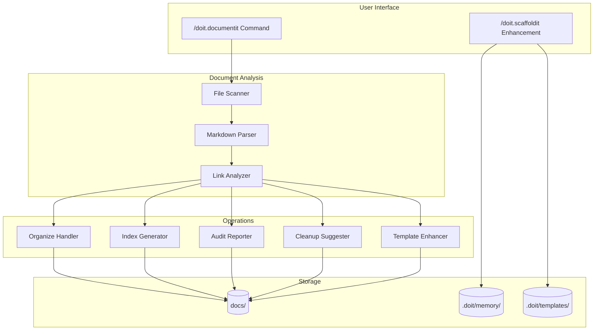
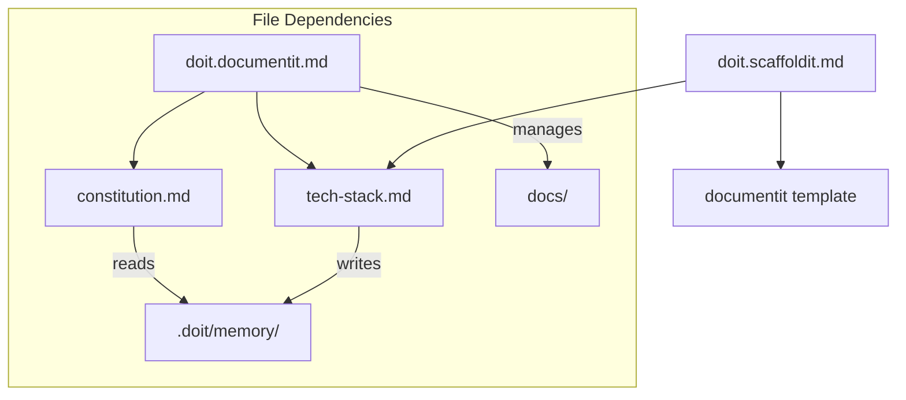

# Implementation Plan: Doit Documentit Command & Scaffoldit Enhancement

**Branch**: `009-doit-documentit-command` | **Date**: 2026-01-10 | **Spec**: [spec.md](./spec.md)
**Input**: Feature specification from `/specs/009-doit-documentit-command/spec.md`

**Note**: This template is filled in by the `/doit.planit` command. See `.claude/commands/doit.planit.md` for the execution workflow.

## Summary

Add `/doit.documentit` command for documentation management (organize, index, audit, cleanup, enhance-templates) and enhance `/doit.scaffoldit` to generate `.doit/memory/tech-stack.md` capturing technology choices at scaffold time. The feature uses markdown-based slash commands with file-based storage, following established patterns from existing doit commands.

## Technical Context

**Language/Version**: Markdown (command definitions), Bash 5.x (helper scripts)
**Primary Dependencies**: Claude Code slash command system, GitHub-flavored Markdown, Mermaid diagrams
**Storage**: File-based markdown (`.doit/memory/`, `.doit/templates/`, `docs/`)
**Testing**: Manual verification via command execution (no automated tests required)
**Target Platform**: Cross-platform via AI coding agents (Linux/macOS/Windows)
**Project Type**: Single project (CLI tool templates)
**Performance Goals**: N/A (file-based operations)
**Constraints**: Commands must complete within reasonable time for interactive use
**Scale/Scope**: Single-project documentation (typical: 10-100 doc files)

## Architecture Overview

<!-- BEGIN:AUTO-GENERATED section="architecture" -->

<!-- END:AUTO-GENERATED -->

## Component Dependencies

<!-- BEGIN:AUTO-GENERATED section="component-dependencies" -->

<!-- END:AUTO-GENERATED -->

## Constitution Check

*GATE: Must pass before Phase 0 research. Re-check after Phase 1 design.*

| Gate                              | Status  | Notes                                                                |
| --------------------------------- | ------- | -------------------------------------------------------------------- |
| Follows existing command patterns | ✅ Pass | Uses same YAML frontmatter and workflow structure as doit.roadmapit  |
| File-based storage only           | ✅ Pass | All data in markdown files under .doit/ and docs/                    |
| No external dependencies          | ✅ Pass | Uses only Claude Code slash command system                           |
| User confirmation before changes  | ✅ Pass | FR-004 requires confirmation before file modifications               |
| Template-driven approach          | ✅ Pass | Uses templates for consistent output format                          |

## Project Structure

### Documentation (this feature)

```text
specs/009-doit-documentit-command/
├── plan.md              # This file (/doit.planit command output)
├── research.md          # Phase 0 output (/doit.planit command)
├── data-model.md        # Phase 1 output (/doit.planit command)
├── quickstart.md        # Phase 1 output (/doit.planit command)
├── contracts/           # Phase 1 output (/doit.planit command)
└── tasks.md             # Phase 2 output (/doit.taskit command - NOT created by /doit.planit)
```

### Source Code (repository root)

```text
# Command files
.claude/commands/
├── doit.documentit.md   # NEW: Main documentit command
└── doit.scaffoldit.md   # MODIFIED: Add tech-stack.md generation

# Template files
.doit/templates/
├── docs-index-template.md           # NEW: Template for docs/index.md
├── tech-stack-template.md           # NEW: Template for tech-stack.md
└── commands/
    ├── doit.documentit.md           # NEW: Template copy for scaffolding
    └── doit.scaffoldit.md           # MODIFIED: Updated template

# Distribution templates
templates/commands/
├── doit.documentit.md               # NEW: Distribution copy
└── doit.scaffoldit.md               # MODIFIED: Distribution copy

# Runtime storage (created by commands)
.doit/memory/
└── tech-stack.md                    # NEW: Generated at scaffold time

# Standard documentation structure (managed by documentit)
docs/
├── index.md                         # Auto-generated/updated by documentit
├── features/                        # Feature documentation
├── guides/                          # User guides
├── api/                             # API reference
├── templates/                       # Template documentation
└── assets/                          # Binary files (images, PDFs)
```

**Structure Decision**: This feature uses the existing slash command structure with markdown templates. No src/ or tests/ directories needed - all functionality is in markdown command files executed by Claude Code.

## Complexity Tracking

> **No constitution violations - all gates passed.**

*No complexity justifications required.*

## Design Artifacts

| Artifact | Path | Description |
| -------- | ---- | ----------- |
| Research | [research.md](./research.md) | Technical decisions and resolved clarifications |
| Data Model | [data-model.md](./data-model.md) | File schemas and entity relationships |
| Quickstart | [quickstart.md](./quickstart.md) | Usage guide for the feature |
| Tech Stack Contract | [contracts/tech-stack-template-contract.md](./contracts/tech-stack-template-contract.md) | Template specification |
| Index Contract | [contracts/docs-index-template-contract.md](./contracts/docs-index-template-contract.md) | Template specification |

## Next Steps

1. Run `/doit.taskit` to generate implementation tasks from this plan
2. Execute tasks following the user story order (US1-US6)
3. Sync template copies to distribution directories
4. Update README.md to document 11 commands
