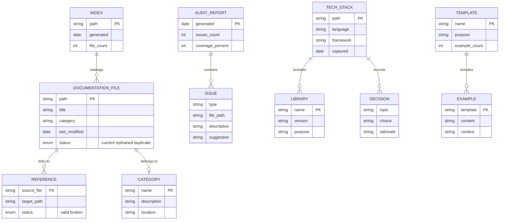

# Feature Specification: Doit Documentit Command & Scaffoldit Enhancement

**Feature Branch**: `009-doit-documentit-command`
**Created**: 2026-01-10
**Status**: Draft
**Input**: User description: "how can we enhance our templates and commands to provide better instructions and code generation. we also want to add another command doit.documentit which is used to organize the projects docs folder, consolidate index and clean up the documentation as well as review the project structure and see if any documentation is in the wrong place. We want to align to best practices and the scaffold project structure. We also want to enhance scaffoldit so that it creates tech-stack.md in the memory folder and documents the tech stack key libraries and architecture decisions that were defined during scaffold."

## User Scenarios & Testing *(mandatory)*

### User Story 1 - Organize Documentation Structure (Priority: P1)

A developer has accumulated documentation files across their project in various locations. They want to organize all documentation into a proper structure aligned with best practices and the scaffoldit-defined conventions. They run `/doit.documentit` to analyze and reorganize their docs folder.

**Why this priority**: Documentation organization is the core value proposition of this command. Users need a working docs structure before they can consolidate or index.

**Independent Test**: Can be fully tested by running `/doit.documentit organize` on a project with scattered documentation and verifying files are moved to appropriate locations with a proper structure.

**Acceptance Scenarios**:

1. **Given** a project with documentation files in non-standard locations, **When** user runs `/doit.documentit organize`, **Then** the system identifies misplaced files and suggests moves to proper locations.
2. **Given** a project with no docs/ folder, **When** user runs `/doit.documentit`, **Then** the system creates the standard documentation structure based on scaffoldit conventions.
3. **Given** documentation files exist, **When** the system suggests reorganization, **Then** the user is prompted to confirm before any files are moved.

---

### User Story 2 - Generate Documentation Index (Priority: P1)

A developer wants a consolidated index of all documentation in their project. They run `/doit.documentit index` to generate or update the main index file that links to all documentation sections.

**Why this priority**: An index is essential for discoverability - without it, organized docs are still hard to navigate. Equal priority with organization since both provide immediate value.

**Independent Test**: Can be fully tested by running `/doit.documentit index` on a project with multiple documentation files and verifying an index.md is created with proper links.

**Acceptance Scenarios**:

1. **Given** a project with multiple documentation files, **When** user runs `/doit.documentit index`, **Then** the system generates/updates docs/index.md with categorized links to all documentation.
2. **Given** an existing index.md, **When** user runs the index command, **Then** the system preserves custom content while updating the auto-generated sections.
3. **Given** documentation across features, templates, and guides, **When** the index is generated, **Then** files are categorized by type (Features, Guides, API Reference, Templates).

---

### User Story 3 - Generate Tech Stack Documentation During Scaffold (Priority: P1)

A developer scaffolds a new project using `/doit.scaffoldit`. After answering questions about their tech stack, they want that information preserved in a tech-stack.md file for future reference and AI context.

**Why this priority**: Capturing tech decisions at scaffold time provides immediate value and ensures architecture decisions are documented from day one.

**Independent Test**: Can be fully tested by running `/doit.scaffoldit` on a new project and verifying `.doit/memory/tech-stack.md` is created with tech stack details.

**Acceptance Scenarios**:

1. **Given** a user runs `/doit.scaffoldit`, **When** tech stack questions are answered, **Then** a `.doit/memory/tech-stack.md` file is created documenting: languages, frameworks, key libraries, and architecture decisions.
2. **Given** a constitution.md exists with partial tech stack info, **When** scaffoldit runs, **Then** tech-stack.md includes both constitution info and newly captured details.
3. **Given** tech-stack.md already exists, **When** scaffoldit runs again, **Then** the system updates the file preserving custom notes while refreshing generated sections.

---

### User Story 4 - Audit Documentation Health (Priority: P2)

A developer wants to ensure their documentation is complete and well-maintained. They run `/doit.documentit audit` to get a report on documentation coverage, broken links, and outdated content.

**Why this priority**: Auditing is a quality check that builds on having organized documentation. Important but not blocking core functionality.

**Independent Test**: Can be fully tested by running `/doit.documentit audit` and verifying the report identifies documentation gaps and issues.

**Acceptance Scenarios**:

1. **Given** a project with documentation, **When** user runs `/doit.documentit audit`, **Then** the system generates a report showing: documented vs undocumented features, broken internal links, files without proper headers.
2. **Given** documentation exists in feature specs, **When** audit runs, **Then** it checks if corresponding docs/features/*.md files exist for completed features.
3. **Given** broken links exist in documentation, **When** audit runs, **Then** broken links are listed with file locations and suggested fixes.

---

### User Story 5 - Clean Up Redundant Documentation (Priority: P2)

A developer has accumulated duplicate or outdated documentation over time. They run `/doit.documentit cleanup` to identify and consolidate redundant content.

**Why this priority**: Cleanup is a maintenance task that improves quality but isn't essential for basic functionality.

**Independent Test**: Can be fully tested by creating duplicate documentation files and verifying the cleanup command identifies them.

**Acceptance Scenarios**:

1. **Given** multiple files covering the same topic, **When** user runs `/doit.documentit cleanup`, **Then** the system identifies duplicates and suggests consolidation.
2. **Given** documentation files with no internal or external references, **When** cleanup runs, **Then** orphaned files are flagged for review or deletion.
3. **Given** cleanup suggestions are generated, **When** the user reviews them, **Then** they can accept, reject, or modify each suggestion before changes are applied.

---

### User Story 6 - Enhance Command Templates (Priority: P3)

A developer wants clearer instructions in their doit command templates. They run `/doit.documentit enhance-templates` to review and improve template documentation with better examples and clearer guidelines.

**Why this priority**: Template enhancement is valuable but builds on having documentation infrastructure in place. Lower priority than core documentation management.

**Independent Test**: Can be fully tested by running `/doit.documentit enhance-templates` and verifying templates include improved instructions.

**Acceptance Scenarios**:

1. **Given** existing command templates, **When** user runs `/doit.documentit enhance-templates`, **Then** the system analyzes templates and suggests improvements for clarity and completeness.
2. **Given** a template lacks usage examples, **When** enhancement runs, **Then** appropriate examples are suggested based on the template's purpose.
3. **Given** templates have inconsistent formatting, **When** enhancement runs, **Then** standardization suggestions are provided.

---

### Edge Cases

- What happens when docs/ folder has custom structure that doesn't match scaffoldit conventions?
  - System preserves custom structure but suggests alignment, never forces changes
- How does system handle binary files (images, PDFs) in documentation?
  - Binary files are cataloged but not modified; moved to docs/assets/ if misplaced
- What happens when index.md has manually curated sections?
  - System uses markers to identify auto-generated vs manual sections, preserves manual content
- How does system handle symlinks in documentation directories?
  - Symlinks are followed for reading but flagged in audit; not modified without explicit confirmation
- What happens when a file is referenced by multiple documents?
  - System tracks references and warns before suggesting moves or deletions
- What if tech-stack.md already exists with manual architecture decisions?
  - System preserves manually added sections using auto-generated markers

## User Journey Visualization

```mermaid
flowchart LR
    subgraph "US1: Organize Documentation"
        US1_S[Scattered docs] --> US1_A[Analyze structure] --> US1_M[Suggest moves] --> US1_E[Organized docs/]
    end
    subgraph "US2: Generate Index"
        US2_S[Multiple doc files] --> US2_A[Scan docs/] --> US2_G[Generate links] --> US2_E[index.md updated]
    end
    subgraph "US3: Tech Stack Doc"
        US3_S[Run scaffoldit] --> US3_A[Capture tech answers] --> US3_G[Generate tech-stack.md] --> US3_E[Memory file created]
    end
    subgraph "US4: Audit Health"
        US4_S[Existing docs] --> US4_A[Check coverage] --> US4_R[Generate report] --> US4_E[Audit results]
    end
    subgraph "US5: Cleanup Redundant"
        US5_S[Duplicate docs] --> US5_A[Find duplicates] --> US5_S2[Suggest consolidation] --> US5_E[Clean docs/]
    end
    subgraph "US6: Enhance Templates"
        US6_S[Basic templates] --> US6_A[Analyze clarity] --> US6_S2[Suggest improvements] --> US6_E[Enhanced templates]
    end
```

<!-- BEGIN:AUTO-GENERATED section="user-journey" -->

<!-- END:AUTO-GENERATED -->

## Entity Relationships

<!-- BEGIN:AUTO-GENERATED section="entity-relationships" -->

<!-- END:AUTO-GENERATED -->

## Requirements *(mandatory)*

### Functional Requirements

#### Command Core Functionality

- **FR-001**: System MUST provide `/doit.documentit` command for documentation management
- **FR-002**: System MUST support subcommands: `organize`, `index`, `audit`, `cleanup`, `enhance-templates`
- **FR-003**: System MUST default to interactive mode when no subcommand provided, offering menu of available operations
- **FR-004**: System MUST never modify files without user confirmation (preview changes first)

#### Documentation Organization (US1)

- **FR-005**: System MUST detect documentation files outside the standard docs/ structure
- **FR-006**: System MUST align organization with scaffoldit-defined conventions for the project's tech stack
- **FR-007**: System MUST create standard subdirectories: `docs/features/`, `docs/guides/`, `docs/api/`, `docs/templates/`, `docs/assets/`
- **FR-008**: System MUST preserve file history by using git mv when available
- **FR-009**: System MUST generate a migration report showing all proposed file movements

#### Index Generation (US2)

- **FR-010**: System MUST generate docs/index.md with categorized links to all documentation
- **FR-011**: System MUST use auto-generated markers (`<!-- BEGIN:AUTO-GENERATED -->`) to separate generated from manual content
- **FR-012**: System MUST include file titles extracted from markdown headers (# Title)
- **FR-013**: System MUST group documentation by category (Features, Guides, API, Templates, Other)
- **FR-014**: System MUST update existing index.md preserving content outside auto-generated markers

#### Tech Stack Documentation (US3)

- **FR-015**: Scaffoldit MUST create `.doit/memory/tech-stack.md` during project scaffolding
- **FR-016**: Tech-stack.md MUST include: primary language, framework, key libraries with versions, database choice, hosting platform
- **FR-017**: Tech-stack.md MUST document architecture decisions made during scaffolding with rationale
- **FR-018**: Tech-stack.md MUST use auto-generated markers to preserve custom additions
- **FR-019**: Scaffoldit MUST update scaffoldit command count to 11 total (adding documentit)

#### Documentation Audit (US4)

- **FR-020**: System MUST check for broken internal links (references to non-existent files)
- **FR-021**: System MUST identify documentation files without proper markdown headers
- **FR-022**: System MUST cross-reference completed feature specs with docs/features/ to find undocumented features
- **FR-023**: System MUST generate audit report in markdown format
- **FR-024**: System MUST assign severity levels to issues (error, warning, info)

#### Documentation Cleanup (US5)

- **FR-025**: System MUST identify files with substantially similar content (potential duplicates)
- **FR-026**: System MUST identify orphaned documentation (not linked from any other file)
- **FR-027**: System MUST suggest consolidation strategies for duplicates
- **FR-028**: System MUST allow selective application of cleanup suggestions

#### Template Enhancement (US6)

- **FR-029**: System MUST analyze command templates for clarity and completeness
- **FR-030**: System MUST suggest usage examples for templates lacking them
- **FR-031**: System MUST check for consistent formatting across templates
- **FR-032**: System MUST preserve existing template functionality when suggesting enhancements

#### Integration

- **FR-033**: System MUST integrate with scaffoldit to understand project structure conventions
- **FR-034**: System MUST read constitution.md (if exists) for project context
- **FR-035**: System MUST read tech-stack.md (if exists) for technology context
- **FR-036**: System MUST include `doit.documentit.md` in scaffoldit command list (11 commands total)

### Key Entities

- **Documentation File**: Any markdown file in the project that serves as documentation. Has a path, title (from header), category assignment, and status (current, orphaned, duplicate).

- **Category**: A logical grouping for documentation (Features, Guides, API Reference, Templates, Assets). Maps to physical directories in docs/.

- **Reference**: A link from one documentation file to another. Can be valid or broken. Used to track dependencies and identify orphans.

- **Index**: The main navigation file (docs/index.md) that catalogs all documentation with organized links.

- **Audit Report**: A generated assessment of documentation health including coverage, broken links, and issues found.

- **Tech Stack**: A memory file (`.doit/memory/tech-stack.md`) documenting the project's technology choices, key libraries, and architecture decisions made during scaffolding.

- **Library**: A key dependency documented in the tech stack with name, version, and purpose.

- **Decision**: An architecture decision documented in tech-stack.md with topic, choice made, and rationale.

- **Template**: A command template file (.claude/commands/*.md) that may need enhancement for better instructions and examples.

## Assumptions

- Projects follow or will adopt standard markdown documentation practices
- Git is available for file operations (git mv) to preserve history
- The docs/ folder is the canonical location for user-facing documentation
- Feature documentation in specs/ is development-focused, while docs/features/ is user-focused
- DocFX or similar static site generators may be used (toc.yml support)
- Binary assets belong in docs/assets/ subdirectory
- Index files use markdown format with optional YAML frontmatter
- Tech stack decisions are captured at scaffold time and may be refined later
- The `.doit/memory/` directory is the canonical location for AI context files

## Success Criteria *(mandatory)*

### Measurable Outcomes

- **SC-001**: Users can organize scattered documentation into standard structure in under 5 minutes
- **SC-002**: Generated index covers 100% of markdown files in docs/ directory
- **SC-003**: Audit identifies 95% of broken internal links within documentation
- **SC-004**: Documentation coverage report shows percentage of completed features with user documentation
- **SC-005**: Cleanup correctly identifies duplicate content with 90% accuracy
- **SC-006**: 100% of scaffolded projects include tech-stack.md with complete technology documentation
- **SC-007**: Users report 40% improvement in documentation discoverability after running the command
- **SC-008**: Template enhancement suggestions are accepted by users 70% of the time
- **SC-009**: Tech-stack.md provides sufficient context for AI agents to understand project technology choices
