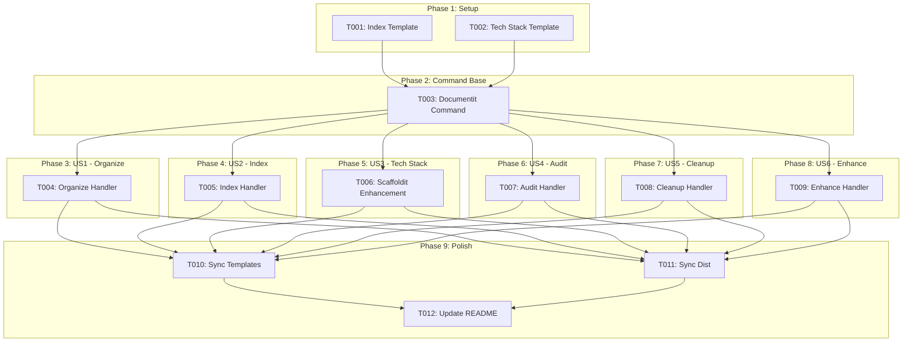
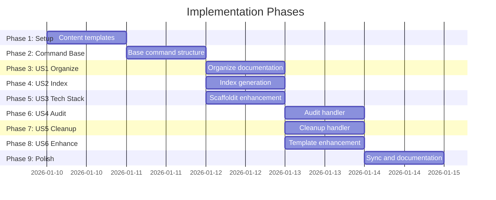

# Tasks: Doit Documentit Command & Scaffoldit Enhancement

**Input**: Design documents from `/specs/009-doit-documentit-command/`
**Prerequisites**: plan.md (required), spec.md (required for user stories), research.md, data-model.md, contracts/

**Tests**: No automated tests required - manual verification via command execution per plan.md.

**Organization**: Tasks are grouped by user story to enable independent implementation and testing of each story.

## Task Dependencies

<!-- BEGIN:AUTO-GENERATED section="task-dependencies" -->

<!-- END:AUTO-GENERATED -->

## Phase Timeline

<!-- BEGIN:AUTO-GENERATED section="phase-timeline" -->

<!-- END:AUTO-GENERATED -->

## Format: `[ID] [P?] [Story] Description`

- **[P]**: Can run in parallel (different files, no dependencies)
- **[Story]**: Which user story this task belongs to (e.g., US1, US2, US3)
- Include exact file paths in descriptions

## Path Conventions

This feature uses template/command file structure:
- Command definitions: `.claude/commands/`
- Template source: `.doit/templates/` and `.doit/templates/commands/`
- Distribution copies: `templates/commands/`
- Runtime storage: `.doit/memory/` and `docs/` (created at runtime by command)

---

## Phase 1: Setup (Content Templates)

**Purpose**: Create content templates that the documentit command will use

- [x] T001 [P] Create documentation index template in .doit/templates/docs-index-template.md with:
  - Header section (title, dates, counts)
  - Auto-generated markers for documentation sections
  - Category tables (Features, Guides, API, Templates, Other)
  - Preserved sections for manual content

- [x] T002 [P] Create tech stack template in .doit/templates/tech-stack-template.md with:
  - Languages table (name, version, purpose)
  - Frameworks table (name, version, purpose)
  - Key Libraries table (name, version, purpose, rationale)
  - Infrastructure section (hosting, cloud, database)
  - Architecture Decisions section (ADR format)
  - Auto-generated markers for scaffold-captured content
  - Custom Notes section (preserved during updates)

---

## Phase 2: Command Base Structure

**Purpose**: Create the base documentit command with subcommand routing

- [x] T003 Create doit.documentit.md command in .claude/commands/doit.documentit.md with:
  - YAML frontmatter (description, handoffs)
  - User Input section for $ARGUMENTS
  - Subcommand detection (organize, index, audit, cleanup, enhance-templates)
  - Default interactive menu when no subcommand provided
  - FR-003: Interactive mode menu of available operations
  - FR-004: User confirmation before file modifications

**Checkpoint**: Base command structure ready - subcommand handlers can be added

---

## Phase 3: User Story 1 - Organize Documentation (Priority: P1) MVP

**Goal**: Allow users to reorganize scattered documentation into standard structure

**Independent Test**: Run `/doit.documentit organize` on a project with scattered docs and verify files are moved to proper locations

### Implementation for User Story 1

- [x] T004 [US1] Enhance doit.documentit.md command in .claude/commands/doit.documentit.md with organize handler:
  - FR-005: Detect documentation files outside standard docs/ structure
  - FR-006: Align with scaffoldit conventions for project's tech stack
  - FR-007: Create standard subdirectories (docs/features/, docs/guides/, docs/api/, docs/templates/, docs/assets/)
  - FR-008: Use git mv when available to preserve file history
  - FR-009: Generate migration report showing proposed file movements
  - Scan project for .md files in non-standard locations
  - Categorize files by content type (feature docs, guides, api docs, etc.)
  - Present migration plan to user for confirmation
  - Execute moves only after confirmation

**Checkpoint**: `/doit.documentit organize` can reorganize scattered documentation

---

## Phase 4: User Story 2 - Generate Documentation Index (Priority: P1)

**Goal**: Generate or update docs/index.md with categorized links to all documentation

**Independent Test**: Run `/doit.documentit index` on a project with multiple doc files and verify index.md is created with proper links

### Implementation for User Story 2

- [x] T005 [US2] Enhance doit.documentit.md command in .claude/commands/doit.documentit.md with index handler:
  - FR-010: Generate docs/index.md with categorized links
  - FR-011: Use auto-generated markers to separate generated from manual content
  - FR-012: Extract titles from markdown headers (# Title)
  - FR-013: Group by category (Features, Guides, API, Templates, Other)
  - FR-014: Preserve content outside auto-generated markers
  - Read docs-index-template.md for structure
  - Scan docs/ directory and subdirectories for .md files
  - Extract title (first # heading) and description (first paragraph)
  - Generate categorized tables with links
  - Update existing index.md or create new one

**Checkpoint**: `/doit.documentit index` can generate documentation navigation

---

## Phase 5: User Story 3 - Tech Stack Documentation (Priority: P1)

**Goal**: Enhance scaffoldit to generate tech-stack.md capturing technology choices

**Independent Test**: Run `/doit.scaffoldit` on a new project and verify .doit/memory/tech-stack.md is created

### Implementation for User Story 3

- [x] T006 [US3] Update doit.scaffoldit.md command in .claude/commands/doit.scaffoldit.md to:
  - FR-015: Create .doit/memory/tech-stack.md during project scaffolding
  - FR-016: Include primary language, framework, key libraries with versions, database, hosting
  - FR-017: Document architecture decisions with rationale
  - FR-018: Use auto-generated markers to preserve custom additions
  - FR-019: Update command count to 11 total (adding documentit)
  - FR-036: Include doit.documentit.md in command list
  - Read tech-stack-template.md for structure
  - After tech stack questions are answered, populate template
  - If constitution.md exists, include tech info from there
  - If tech-stack.md exists, preserve Custom Notes section

**Checkpoint**: Scaffolded projects include tech-stack.md with technology documentation

---

## Phase 6: User Story 4 - Audit Documentation Health (Priority: P2)

**Goal**: Check documentation for broken links, missing headers, coverage gaps

**Independent Test**: Run `/doit.documentit audit` and verify report identifies issues

### Implementation for User Story 4

- [x] T007 [US4] Enhance doit.documentit.md command in .claude/commands/doit.documentit.md with audit handler:
  - FR-020: Check for broken internal links (references to non-existent files)
  - FR-021: Identify files without proper markdown headers
  - FR-022: Cross-reference completed feature specs with docs/features/
  - FR-023: Generate audit report in markdown format
  - FR-024: Assign severity levels (error, warning, info)
  - Parse all markdown files for internal links
  - Validate each link target exists
  - Check for # heading in each file
  - Compare specs/ completed features to docs/features/
  - Generate report with categorized issues

**Checkpoint**: `/doit.documentit audit` identifies documentation health issues

---

## Phase 7: User Story 5 - Cleanup Redundant Documentation (Priority: P2)

**Goal**: Identify duplicate and orphaned documentation for consolidation

**Independent Test**: Create duplicate documentation files and verify cleanup command identifies them

### Implementation for User Story 5

- [x] T008 [US5] Enhance doit.documentit.md command in .claude/commands/doit.documentit.md with cleanup handler:
  - FR-025: Identify files with substantially similar content (potential duplicates)
  - FR-026: Identify orphaned documentation (not linked from any other file)
  - FR-027: Suggest consolidation strategies for duplicates
  - FR-028: Allow selective application of cleanup suggestions
  - Compare file titles for near-matches
  - Flag files with identical first 500 characters
  - Track all internal links to identify orphaned files
  - Present cleanup suggestions with accept/reject options

**Checkpoint**: `/doit.documentit cleanup` identifies redundant documentation

---

## Phase 8: User Story 6 - Enhance Command Templates (Priority: P3)

**Goal**: Review and improve command template documentation

**Independent Test**: Run `/doit.documentit enhance-templates` and verify improvement suggestions

### Implementation for User Story 6

- [x] T009 [US6] Enhance doit.documentit.md command in .claude/commands/doit.documentit.md with enhance-templates handler:
  - FR-029: Analyze command templates for clarity and completeness
  - FR-030: Suggest usage examples for templates lacking them
  - FR-031: Check for consistent formatting across templates
  - FR-032: Preserve existing template functionality when suggesting enhancements
  - Read all .claude/commands/*.md files
  - Check for missing ## Examples sections
  - Verify consistent YAML frontmatter structure
  - Suggest improvements without breaking existing functionality

**Checkpoint**: `/doit.documentit enhance-templates` suggests template improvements

---

## Phase 9: Polish & Sync

**Purpose**: Ensure all template copies are synchronized and documentation updated

- [x] T010 [P] Copy doit.documentit.md to .doit/templates/commands/doit.documentit.md
- [x] T011 [P] Copy doit.documentit.md to templates/commands/doit.documentit.md
- [x] T012 [P] Copy updated doit.scaffoldit.md to .doit/templates/commands/doit.scaffoldit.md
- [x] T013 [P] Copy updated doit.scaffoldit.md to templates/commands/doit.scaffoldit.md
- [x] T014 Verify all command files have consistent YAML frontmatter structure
- [x] T015 Update README.md to document new command (11 commands)

---

## Dependencies & Execution Order

### Phase Dependencies

- **Setup (Phase 1)**: No dependencies - can start immediately
- **Command Base (Phase 2)**: Depends on Setup (needs templates)
- **US1 Organize (Phase 3)**: Depends on Command Base
- **US2 Index (Phase 4)**: Depends on Command Base
- **US3 Tech Stack (Phase 5)**: Depends on Command Base (modifies scaffoldit)
- **US4 Audit (Phase 6)**: Depends on Command Base
- **US5 Cleanup (Phase 7)**: Depends on Command Base
- **US6 Enhance (Phase 8)**: Depends on Command Base
- **Polish (Phase 9)**: Depends on all user stories being complete

### User Story Dependencies

- **US1 (P1)**: Can start after Phase 2 - foundational organize capability
- **US2 (P1)**: Can start after Phase 2 - foundational index capability
- **US3 (P1)**: Can start after Phase 2 - modifies different file (scaffoldit)
- **US4 (P2)**: Can start after Phase 2 - builds on organize/index patterns
- **US5 (P2)**: Can start after Phase 2 - builds on audit patterns
- **US6 (P3)**: Can start after Phase 2 - independent template analysis

### Parallel Opportunities

- **Phase 1**: T001 and T002 can run in parallel (different files)
- **Phases 3-8**: US1-US6 can run in parallel after Phase 2 (different handlers in same file, or different files)
- **Phase 9**: T010-T015 can run in parallel (different files)

---

## Parallel Example: Phase 1 Setup

```bash
# Launch both template creation tasks together:
Task: "Create documentation index template in .doit/templates/docs-index-template.md"
Task: "Create tech stack template in .doit/templates/tech-stack-template.md"
```

## Parallel Example: Phase 3-5 (P1 Stories After Phase 2)

```bash
# Launch all P1 user stories together (different handlers):
Task: "Enhance documentit with organize handler" (US1)
Task: "Enhance documentit with index handler" (US2)
Task: "Update scaffoldit with tech-stack generation" (US3 - different file)
```

---

## Implementation Strategy

### MVP First (US1 + US2 + US3 Only)

1. Complete Phase 1: Setup (templates)
2. Complete Phase 2: Command Base (documentit structure)
3. Complete Phase 3: User Story 1 - Organize
4. Complete Phase 4: User Story 2 - Index
5. Complete Phase 5: User Story 3 - Tech Stack (scaffoldit)
6. **STOP and VALIDATE**: Test all P1 stories independently
7. Demo: Users can organize docs, generate index, get tech stack at scaffold

### Incremental Delivery

1. Setup + Command Base → Foundation ready
2. Add US1 → Organize capability (MVP increment 1)
3. Add US2 → Index capability (MVP increment 2)
4. Add US3 → Tech Stack at scaffold (MVP increment 3)
5. Add US4 → Audit capability (P2)
6. Add US5 → Cleanup capability (P2)
7. Add US6 → Template enhancement (P3)
8. Polish → Sync all copies

---

## Notes

- [P] tasks = different files, no dependencies
- [Story] label maps task to specific user story for traceability
- Each user story should be independently completable and testable
- Commit after each task or logical group
- Stop at any checkpoint to validate story independently
- The main command file (.claude/commands/doit.documentit.md) is enhanced across US1, US2, US4-US6
- US3 modifies different file (.claude/commands/doit.scaffoldit.md)
- Template sync (Phase 9) ensures distribution packages stay current
