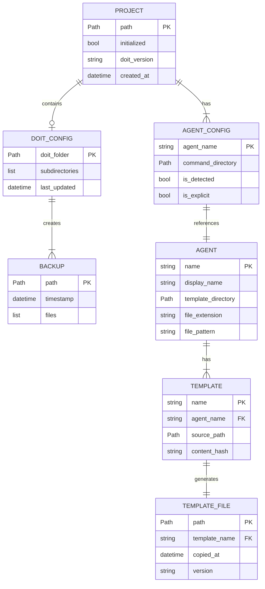

# Data Model: CLI Project Setup & Template Generation

**Feature**: 010-cli-project-setup | **Date**: 2026-01-10 | **Phase**: 1

## Overview

This document defines the data models, enums, and type definitions for the CLI project setup feature. All models are implemented as Python dataclasses or Pydantic models.

## Entity Relationship Diagram



## Core Models

### Agent Enum

```python
from enum import Enum

class Agent(str, Enum):
    """Supported AI coding agents."""
    CLAUDE = "claude"
    COPILOT = "copilot"

    @property
    def display_name(self) -> str:
        """Human-readable name for display."""
        return {
            Agent.CLAUDE: "Claude Code",
            Agent.COPILOT: "GitHub Copilot",
        }[self]

    @property
    def command_directory(self) -> str:
        """Relative path to command/prompt directory."""
        return {
            Agent.CLAUDE: ".claude/commands",
            Agent.COPILOT: ".github/prompts",
        }[self]

    @property
    def template_directory(self) -> str:
        """Relative path within bundled templates."""
        return {
            Agent.CLAUDE: "commands",
            Agent.COPILOT: "prompts",
        }[self]

    @property
    def file_extension(self) -> str:
        """File extension for command files."""
        return {
            Agent.CLAUDE: ".md",
            Agent.COPILOT: ".prompt.md",
        }[self]

    @property
    def file_pattern(self) -> str:
        """Glob pattern for doit-managed files."""
        return {
            Agent.CLAUDE: "doit.*.md",
            Agent.COPILOT: "doit-*.prompt.md",
        }[self]
```

### Project Model

```python
from dataclasses import dataclass, field
from pathlib import Path
from datetime import datetime
from typing import Optional

@dataclass
class Project:
    """Represents a project being initialized for doit workflow."""

    path: Path
    initialized: bool = False
    doit_version: Optional[str] = None
    created_at: Optional[datetime] = None
    agents: list[Agent] = field(default_factory=list)

    @property
    def doit_folder(self) -> Path:
        """Path to .doit/ directory."""
        return self.path / ".doit"

    @property
    def memory_folder(self) -> Path:
        """Path to .doit/memory/ directory."""
        return self.doit_folder / "memory"

    @property
    def templates_folder(self) -> Path:
        """Path to .doit/templates/ directory."""
        return self.doit_folder / "templates"

    @property
    def scripts_folder(self) -> Path:
        """Path to .doit/scripts/ directory."""
        return self.doit_folder / "scripts"

    @property
    def backups_folder(self) -> Path:
        """Path to .doit/backups/ directory."""
        return self.doit_folder / "backups"

    def command_directory(self, agent: Agent) -> Path:
        """Path to command directory for given agent."""
        return self.path / agent.command_directory

    def is_safe_directory(self) -> bool:
        """Check if project path is safe for initialization."""
        unsafe_paths = [
            Path.home(),
            Path("/"),
            Path("/usr"),
            Path("/etc"),
            Path("/var"),
            Path("/opt"),
            Path("/bin"),
            Path("/sbin"),
        ]
        resolved = self.path.resolve()
        return resolved not in unsafe_paths
```

### Template Model

```python
from dataclasses import dataclass
from pathlib import Path
import hashlib

@dataclass
class Template:
    """Represents a bundled command template."""

    name: str
    agent: Agent
    source_path: Path
    content: str = ""

    @property
    def content_hash(self) -> str:
        """SHA-256 hash of template content."""
        return hashlib.sha256(self.content.encode()).hexdigest()[:12]

    @property
    def target_filename(self) -> str:
        """Filename for the generated command file."""
        if self.agent == Agent.CLAUDE:
            return f"doit.{self.name}.md"
        else:  # COPILOT
            return f"doit-{self.name}.prompt.md"
```

### InitResult Model

```python
from dataclasses import dataclass, field
from pathlib import Path
from typing import Optional

@dataclass
class InitResult:
    """Result of initialization operation."""

    success: bool
    project: Project
    created_directories: list[Path] = field(default_factory=list)
    created_files: list[Path] = field(default_factory=list)
    updated_files: list[Path] = field(default_factory=list)
    skipped_files: list[Path] = field(default_factory=list)
    backup_path: Optional[Path] = None
    error_message: Optional[str] = None
```

### VerifyResult Model

```python
from dataclasses import dataclass, field
from enum import Enum

class VerifyStatus(str, Enum):
    """Status of verification check."""
    PASS = "pass"
    WARN = "warn"
    FAIL = "fail"

@dataclass
class VerifyCheck:
    """Single verification check result."""
    name: str
    status: VerifyStatus
    message: str
    suggestion: Optional[str] = None

@dataclass
class VerifyResult:
    """Result of project verification."""

    project: Project
    checks: list[VerifyCheck] = field(default_factory=list)

    @property
    def passed(self) -> bool:
        """All checks passed (no failures)."""
        return not any(c.status == VerifyStatus.FAIL for c in self.checks)

    @property
    def has_warnings(self) -> bool:
        """Any checks have warnings."""
        return any(c.status == VerifyStatus.WARN for c in self.checks)

    @property
    def summary(self) -> str:
        """Summary of check results."""
        passed = sum(1 for c in self.checks if c.status == VerifyStatus.PASS)
        warned = sum(1 for c in self.checks if c.status == VerifyStatus.WARN)
        failed = sum(1 for c in self.checks if c.status == VerifyStatus.FAIL)
        return f"{passed} passed, {warned} warnings, {failed} failed"
```

## File Schemas

### .doit/ Directory Structure

```
.doit/
├── memory/                 # Preserved during updates
│   ├── constitution.md     # Project constitution (user-managed)
│   ├── roadmap.md          # Feature roadmap (user-managed)
│   └── tech-stack.md       # Technology decisions (generated)
├── templates/              # Local template overrides
├── scripts/                # Helper scripts
└── backups/                # Automatic backups
    └── {timestamp}/        # Timestamped backup directories
```

### Template Manifest (Future)

For future version tracking, a manifest file may be added:

```yaml
# .doit/manifest.yml (future consideration)
version: "1.0.0"
initialized: "2026-01-10T14:30:22Z"
agents:
  - name: claude
    template_version: "1.0.0"
    files:
      - name: doit.specit.md
        hash: "a1b2c3d4e5f6"
  - name: copilot
    template_version: "1.0.0"
    files:
      - name: doit-specit.prompt.md
        hash: "f6e5d4c3b2a1"
```

## Type Definitions

### CLI Options

```python
from typing import Optional, Annotated
from pathlib import Path
import typer

# Type aliases for CLI options
AgentOption = Annotated[
    Optional[str],
    typer.Option(
        "--agent", "-a",
        help="Target agent(s): claude, copilot, or claude,copilot for both"
    )
]

TemplatesOption = Annotated[
    Optional[Path],
    typer.Option(
        "--templates", "-t",
        help="Custom template directory path"
    )
]

UpdateFlag = Annotated[
    bool,
    typer.Option(
        "--update", "-u",
        help="Update existing project, preserving custom files"
    )
]

ForceFlag = Annotated[
    bool,
    typer.Option(
        "--force", "-f",
        help="Overwrite existing files without backup"
    )
]
```

## Validation Rules

### Project Path Validation

| Rule | Condition | Error Message |
|------|-----------|---------------|
| VP-001 | Path must exist | "Directory does not exist: {path}" |
| VP-002 | Path must be directory | "Not a directory: {path}" |
| VP-003 | Path must be writable | "No write permission: {path}" |
| VP-004 | Path not in unsafe list | "Cannot initialize in system directory: {path}" |

### Template Source Validation

| Rule | Condition | Error Message |
|------|-----------|---------------|
| VT-001 | Source path must exist | "Template directory not found: {path}" |
| VT-002 | Must contain required templates | "Missing required templates: {list}" |
| VT-003 | Templates must be readable | "Cannot read template: {path}" |

### Agent Validation

| Rule | Condition | Error Message |
|------|-----------|---------------|
| VA-001 | Agent name must be valid | "Unknown agent: {name}. Use 'claude' or 'copilot'" |
| VA-002 | At least one agent required | "At least one agent must be specified" |
