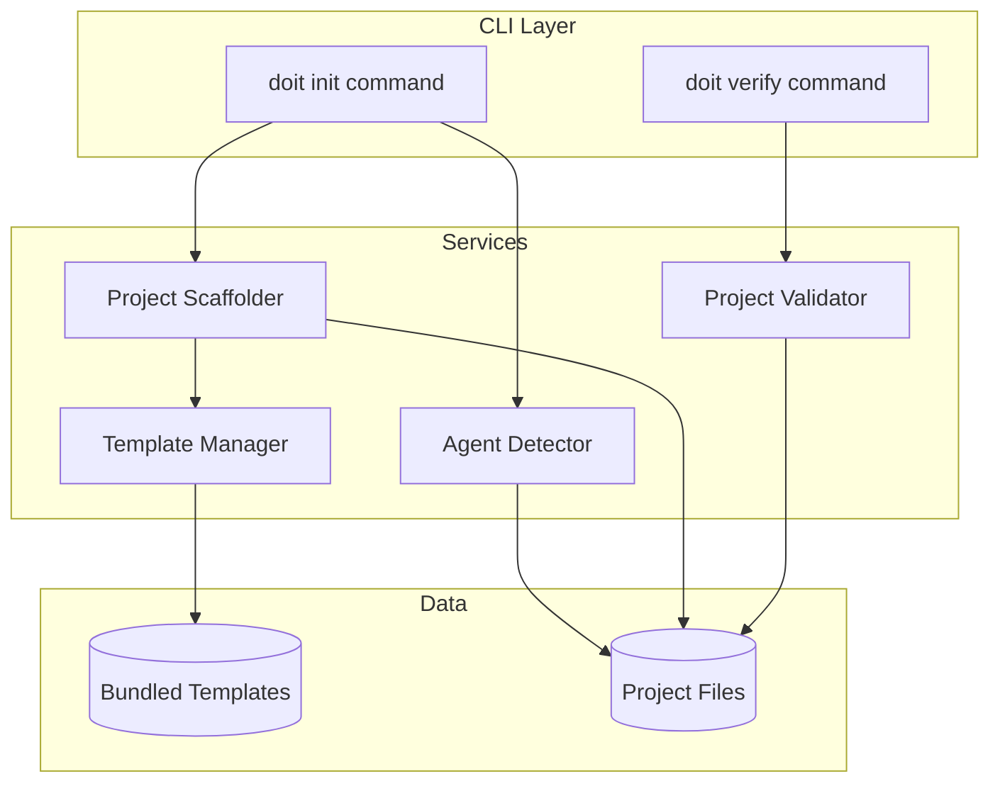

# Implementation Plan: CLI Project Setup & Template Generation

**Branch**: `010-cli-project-setup` | **Date**: 2026-01-10 | **Spec**: [spec.md](./spec.md)
**Input**: Feature specification from `/specs/010-cli-project-setup/spec.md`

**Note**: This template is filled in by the `/doit.planit` command. See `.claude/commands/doit.planit.md` for the execution workflow.

## Summary

Implement the `doit init` and `doit verify` CLI commands that initialize projects for the Doit workflow. The CLI creates the `.doit/` folder structure and copies command templates to agent-specific directories (`.claude/commands/` for Claude, `.github/prompts/` for GitHub Copilot). Supports multi-agent detection, template-based generation, project updates, and verification.

## Technical Context

**Language/Version**: Python 3.11+ (primary)
**Primary Dependencies**: typer (CLI framework), rich (terminal output), pathlib (file operations)
**Storage**: File-based (markdown templates, directory structures)
**Testing**: pytest with file system fixtures
**Target Platform**: Cross-platform CLI (Linux, macOS, Windows)
**Project Type**: Single project (CLI tool)
**Performance Goals**: Initialization completes in under 10 seconds
**Constraints**: No external network calls during init, offline-capable
**Scale/Scope**: Single project initialization, 11 command templates per agent

## Architecture Overview

<!-- BEGIN:AUTO-GENERATED section="architecture" -->

<!-- END:AUTO-GENERATED -->

## Constitution Check

*GATE: Must pass before Phase 0 research. Re-check after Phase 1 design.*

| Gate | Status | Notes |
|------|--------|-------|
| Follows existing CLI patterns | Pass | Uses typer consistent with existing doit CLI |
| File-based storage only | Pass | All templates stored as markdown files |
| No external dependencies at runtime | Pass | Offline-capable, no network calls |
| Cross-platform compatibility | Pass | Uses pathlib for path handling |
| Template-driven approach | Pass | Commands generated from bundled templates |

## Project Structure

### Documentation (this feature)

```text
specs/010-cli-project-setup/
├── plan.md              # This file (/doit.planit command output)
├── research.md          # Phase 0 output (/doit.planit command)
├── data-model.md        # Phase 1 output (/doit.planit command)
├── quickstart.md        # Phase 1 output (/doit.planit command)
├── contracts/           # Phase 1 output (/doit.planit command)
└── tasks.md             # Phase 2 output (/doit.taskit command - NOT created by /doit.planit)
```

### Source Code (repository root)

```text
src/
├── doit/
│   ├── __init__.py
│   ├── cli/
│   │   ├── __init__.py
│   │   ├── main.py              # Main CLI entry point
│   │   ├── init_command.py      # doit init implementation
│   │   └── verify_command.py    # doit verify implementation
│   ├── services/
│   │   ├── __init__.py
│   │   ├── agent_detector.py    # Detect Claude/Copilot from project
│   │   ├── scaffolder.py        # Create directory structures
│   │   ├── template_manager.py  # Copy/manage templates
│   │   └── validator.py         # Verify project setup
│   └── models/
│       ├── __init__.py
│       ├── agent.py             # Agent enum and config
│       └── project.py           # Project model

templates/
├── commands/                    # Claude command templates (existing)
│   ├── doit.checkin.md
│   ├── doit.constitution.md
│   ├── doit.documentit.md
│   ├── doit.implementit.md
│   ├── doit.planit.md
│   ├── doit.reviewit.md
│   ├── doit.roadmapit.md
│   ├── doit.scaffoldit.md
│   ├── doit.specit.md
│   ├── doit.taskit.md
│   └── doit.testit.md
└── prompts/                     # GitHub Copilot prompt templates (NEW)
    ├── doit-checkin.prompt.md
    ├── doit-constitution.prompt.md
    ├── doit-documentit.prompt.md
    ├── doit-implementit.prompt.md
    ├── doit-planit.prompt.md
    ├── doit-reviewit.prompt.md
    ├── doit-roadmapit.prompt.md
    ├── doit-scaffoldit.prompt.md
    ├── doit-specit.prompt.md
    ├── doit-taskit.prompt.md
    └── doit-testit.prompt.md

tests/
├── unit/
│   ├── test_agent_detector.py
│   ├── test_scaffolder.py
│   ├── test_template_manager.py
│   └── test_validator.py
└── integration/
    ├── test_init_command.py
    └── test_verify_command.py
```

**Structure Decision**: Single project CLI structure with clear separation between CLI commands, services, and models. Templates are organized by agent type (commands/ for Claude, prompts/ for Copilot).

## Complexity Tracking

> **No constitution violations - all gates passed.**

*No complexity justifications required.*

## Design Artifacts

| Artifact | Path | Description |
|----------|------|-------------|
| Research | [research.md](./research.md) | Agent detection strategies, template formats |
| Data Model | [data-model.md](./data-model.md) | Agent, Project, Template models |
| Quickstart | [quickstart.md](./quickstart.md) | Usage guide for init and verify commands |
| CLI Contract | [contracts/cli-contract.md](./contracts/cli-contract.md) | Command interface specification |

## Next Steps

1. Run `/doit.taskit` to generate implementation tasks from this plan
2. Execute tasks following the user story order (US1-US6)
3. Create Copilot prompt templates in templates/prompts/
4. Update pyproject.toml with new dependencies if needed
