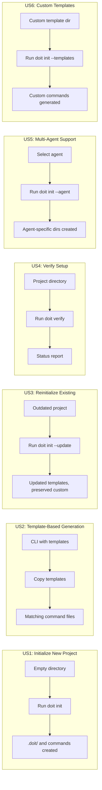
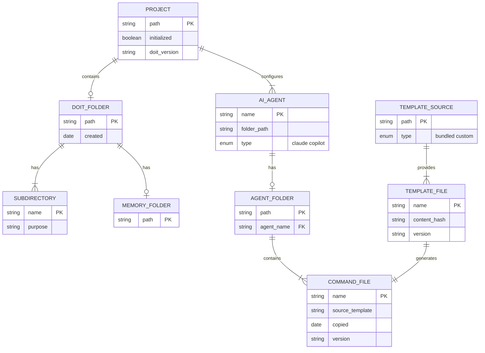

# Feature Specification: CLI Project Setup & Template Generation

**Feature Branch**: `010-cli-project-setup`
**Created**: 2026-01-10
**Status**: Draft
**Input**: User description: "we need to make sure the cli correctly creates the .doit folder and uses the templates to generate the commands and templates it needs when setting up a new project using the cli"

## User Scenarios & Testing *(mandatory)*

### User Story 1 - Initialize New Project (Priority: P1)

A developer wants to use the Doit workflow in a new or existing project. They run the Doit CLI `init` command to set up the required folder structure and command templates. The CLI creates the `.doit/` folder with all necessary subdirectories and copies the command templates so the developer can immediately start using doit commands like `/doit.specit` and `/doit.planit`.

**Why this priority**: This is the core functionality - without proper initialization, no other doit commands can be used. This is the essential first step for any project adoption.

**Independent Test**: Can be fully tested by running `doit init` in an empty directory and verifying the `.doit/` folder structure and `.claude/commands/` files are created correctly.

**Acceptance Scenarios**:

1. **Given** an empty directory without doit setup, **When** user runs `doit init`, **Then** the system creates `.doit/` folder with `memory/`, `templates/`, and `scripts/` subdirectories.
2. **Given** a project without `.claude/commands/` folder, **When** user runs `doit init`, **Then** the system creates `.claude/commands/` and populates it with all 11 doit command templates.
3. **Given** doit init is run, **When** initialization completes, **Then** the system displays a summary of created files and directories with next steps guidance.

---

### User Story 2 - Template-Based Command Generation (Priority: P1)

A developer expects that when they initialize a project, the CLI uses the official doit templates (not hardcoded content) to generate the command files. This ensures consistency with the canonical templates and allows template updates to propagate to new projects.

**Why this priority**: Using templates ensures maintainability and consistency. If templates are bypassed, projects get outdated or incorrect command definitions.

**Independent Test**: Can be fully tested by comparing generated command files against source templates and verifying byte-for-byte or functional equivalence.

**Acceptance Scenarios**:

1. **Given** the CLI has access to source templates, **When** `doit init` runs, **Then** each generated command file in `.claude/commands/` matches the corresponding template from the distribution.
2. **Given** a template is updated in a future doit version, **When** a new project runs `doit init`, **Then** the project receives the updated template content.
3. **Given** the CLI is installed, **When** templates are requested, **Then** the CLI reads from its bundled `templates/commands/` directory.

---

### User Story 3 - Reinitialize Existing Project (Priority: P2)

A developer has an existing project that was set up with an older version of doit. They want to update their command templates to the latest version without losing any custom project-specific files they've added.

**Why this priority**: Projects evolve and need to stay current with template improvements, but developers should not lose their customizations.

**Independent Test**: Can be fully tested by running `doit init` on a project with existing `.doit/` folder and verifying templates are updated while custom files are preserved.

**Acceptance Scenarios**:

1. **Given** a project with existing `.doit/memory/constitution.md`, **When** user runs `doit init --update`, **Then** the constitution.md file is preserved unchanged.
2. **Given** a project with outdated command templates, **When** user runs `doit init --update`, **Then** command templates are updated to latest versions with backup of previous versions.
3. **Given** a user has added custom commands to `.claude/commands/`, **When** `doit init --update` runs, **Then** custom commands (non-doit prefixed) are preserved.

---

### User Story 4 - Verify Project Setup (Priority: P2)

A developer wants to verify their project is correctly set up for doit workflow. They run a verification command that checks the project structure and reports any missing or misconfigured components.

**Why this priority**: Verification helps troubleshoot issues and ensures the project is ready for doit workflow before starting development.

**Independent Test**: Can be fully tested by running `doit verify` on projects with various states (complete, missing files, outdated) and checking the diagnostic output.

**Acceptance Scenarios**:

1. **Given** a properly initialized project, **When** user runs `doit verify`, **Then** the system reports all checks passed with green status.
2. **Given** a project missing some doit commands, **When** user runs `doit verify`, **Then** the system lists missing commands and suggests running `doit init --update`.
3. **Given** a project with no doit setup, **When** user runs `doit verify`, **Then** the system reports "Not initialized" and suggests running `doit init`.

---

### User Story 5 - Multi-Agent Support (Priority: P1)

A developer uses different AI coding assistants on different projects - some use Claude Code, others use GitHub Copilot. They want the Doit CLI to detect or allow selection of the target agent and set up the appropriate command directory structure for that agent.

**Why this priority**: Supporting multiple agents expands the user base and ensures doit works regardless of which AI coding assistant is used. This is essential for broad adoption.

**Independent Test**: Can be fully tested by running `doit init --agent claude` and `doit init --agent copilot` and verifying the correct directory structure is created for each.

**Acceptance Scenarios**:

1. **Given** a project without agent configuration, **When** user runs `doit init`, **Then** the system prompts to select an agent (Claude or GitHub Copilot) or auto-detects based on existing configuration.
2. **Given** user specifies `--agent claude`, **When** `doit init` runs, **Then** the system creates `.claude/commands/` with doit command templates.
3. **Given** user specifies `--agent copilot`, **When** `doit init` runs, **Then** the system creates `.github/copilot-instructions.md` and `.github/prompts/` with doit prompt templates.
4. **Given** a project has existing `.claude/` folder, **When** `doit init` runs without --agent flag, **Then** the system auto-detects Claude as the target agent.
5. **Given** a project has existing `.github/copilot-instructions.md`, **When** `doit init` runs without --agent flag, **Then** the system auto-detects Copilot as the target agent.

---

### User Story 6 - Custom Template Source (Priority: P3)

An organization maintains their own customized doit templates. They want to initialize projects using their custom template source instead of the default bundled templates.

**Why this priority**: Enables enterprise customization but is not required for core functionality.

**Independent Test**: Can be fully tested by specifying a custom template path during init and verifying templates are sourced from that location.

**Acceptance Scenarios**:

1. **Given** a custom template directory exists, **When** user runs `doit init --templates /path/to/custom`, **Then** the system uses templates from the specified directory.
2. **Given** an invalid template path is provided, **When** user runs `doit init --templates /invalid/path`, **Then** the system displays an error message and does not proceed.
3. **Given** custom templates are missing required files, **When** init runs, **Then** the system warns about missing templates and offers to use defaults for those.

---

### Edge Cases

- What happens when `.doit/` folder exists but is empty?
  - Treat as partial initialization, create missing subdirectories and files
- What happens when user doesn't have write permissions to target directory?
  - Display clear error message with required permissions
- What happens when disk is full during initialization?
  - Rollback partial changes and report the error
- What happens when some but not all command templates exist?
  - Only copy missing templates, leave existing ones unchanged (unless --force flag)
- What happens when init is run in the home directory or system paths?
  - Warn user and require explicit confirmation to prevent accidental broad changes

## User Journey Visualization

<!-- BEGIN:AUTO-GENERATED section="user-journey" -->

<!-- END:AUTO-GENERATED -->

## Entity Relationships

<!-- BEGIN:AUTO-GENERATED section="entity-relationships" -->

<!-- END:AUTO-GENERATED -->

## Requirements *(mandatory)*

### Functional Requirements

#### Project Initialization

- **FR-001**: CLI MUST provide `doit init` command to initialize a project for doit workflow
- **FR-002**: CLI MUST create `.doit/` directory with subdirectories: `memory/`, `templates/`, `scripts/`
- **FR-003**: CLI MUST create `.claude/commands/` directory if it doesn't exist
- **FR-004**: CLI MUST copy all 11 doit command templates to `.claude/commands/`:
  - `doit.checkin.md`, `doit.constitution.md`, `doit.documentit.md`, `doit.implementit.md`
  - `doit.planit.md`, `doit.reviewit.md`, `doit.roadmapit.md`, `doit.scaffoldit.md`
  - `doit.specit.md`, `doit.taskit.md`, `doit.testit.md`
- **FR-005**: CLI MUST display initialization summary showing created files and directories
- **FR-006**: CLI MUST display next steps guidance after successful initialization

#### Template Management

- **FR-007**: CLI MUST read templates from bundled `templates/commands/` directory within the installed package
- **FR-008**: CLI MUST preserve template content exactly (no modifications during copy)
- **FR-009**: CLI MUST support `--templates <path>` flag to use custom template source
- **FR-010**: CLI MUST validate template source directory contains required files before proceeding

#### Update and Verification

- **FR-011**: CLI MUST provide `--update` flag to update existing project without overwriting custom files
- **FR-012**: CLI MUST backup existing command files before updating (to `.doit/backups/`)
- **FR-013**: CLI MUST preserve files in `.doit/memory/` during updates (constitution.md, roadmap.md, etc.)
- **FR-014**: CLI MUST preserve non-doit-prefixed files in `.claude/commands/` during updates
- **FR-015**: CLI MUST provide `doit verify` command to check project setup status

#### Multi-Agent Support

- **FR-021**: CLI MUST support `--agent <name>` flag to specify target AI agent (claude, copilot)
- **FR-022**: CLI MUST auto-detect target agent from existing project configuration when no flag provided
- **FR-023**: CLI MUST prompt user for agent selection if no flag provided and no existing configuration detected
- **FR-024**: For Claude agent, CLI MUST create `.claude/commands/` directory with markdown command files
- **FR-025**: For GitHub Copilot agent, CLI MUST create `.github/prompts/` directory with prompt files
- **FR-026**: For GitHub Copilot agent, CLI MUST create or update `.github/copilot-instructions.md` with doit instructions
- **FR-027**: CLI MUST support initializing for multiple agents in the same project (both Claude and Copilot)
- **FR-028**: CLI MUST maintain agent-specific template directories in the bundled templates

#### Safety and Error Handling

- **FR-029**: CLI MUST warn and require confirmation when running in home directory or system paths
- **FR-030**: CLI MUST provide `--force` flag to overwrite existing files without backup
- **FR-031**: CLI MUST rollback partial changes if initialization fails mid-process
- **FR-032**: CLI MUST display clear error messages with suggested fixes for common issues
- **FR-033**: CLI MUST check write permissions before attempting file operations

### Key Entities

- **Project**: A directory being initialized for doit workflow. Has a path, initialization status, and associated doit version.

- **Doit Folder**: The `.doit/` directory containing project-specific doit configuration, memory files, and templates.

- **AI Agent**: A supported AI coding assistant (Claude or GitHub Copilot). Each agent has a specific folder structure and command format.

- **Agent Folder**: The agent-specific directory for commands (`.claude/commands/` for Claude, `.github/prompts/` for Copilot).

- **Command File**: A markdown/prompt file that defines a doit command. Generated from a template and placed in the agent-specific folder.

- **Template File**: A source template file that defines the canonical content for a command. Stored in the bundled templates directory.

- **Template Source**: The location from which templates are read - either the bundled distribution or a custom path.

## Assumptions

- The CLI is installed as a Python package with bundled template files in a `templates/` subdirectory
- Projects may use Claude Code (`.claude/commands/`) or GitHub Copilot (`.github/prompts/`) or both
- Claude Code recognizes `.claude/commands/` for slash commands
- GitHub Copilot uses `.github/copilot-instructions.md` for custom instructions and `.github/prompts/` for reusable prompts
- The `.doit/` folder is git-ignored in most projects to avoid committing generated files
- Users have basic familiarity with command-line interfaces
- Template updates are backward compatible (new templates work with existing projects)
- A project can be initialized for multiple agents simultaneously

## Success Criteria *(mandatory)*

### Measurable Outcomes

- **SC-001**: Users can initialize a new project in under 10 seconds with a single command
- **SC-002**: 100% of initialized projects have all 11 required doit commands available for the selected agent
- **SC-003**: Template updates propagate to new projects without requiring CLI code changes
- **SC-004**: Projects can be reinitialized without losing custom memory files (constitution.md, roadmap.md)
- **SC-005**: Verification command accurately detects 95% of common setup issues
- **SC-006**: Users report successful first-time initialization rate of 90% or higher
- **SC-007**: Error messages provide actionable guidance in 100% of common failure scenarios
- **SC-008**: Both Claude and GitHub Copilot users can use doit workflow with their preferred agent
- **SC-009**: Agent auto-detection correctly identifies the target agent 95% of the time based on existing project configuration
