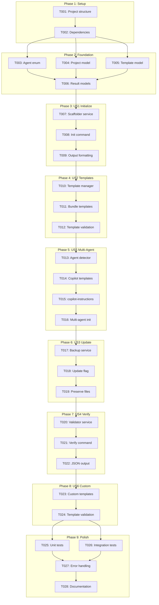
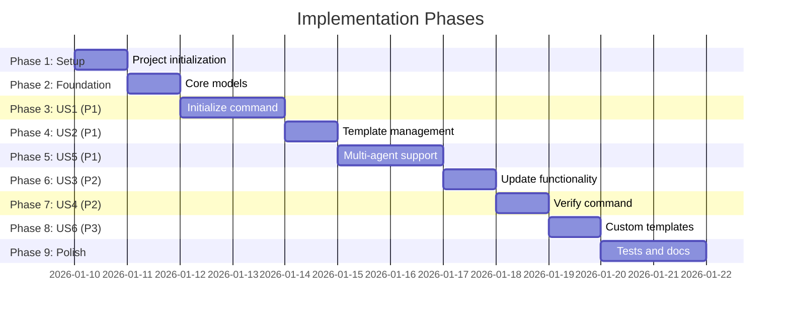

# Tasks: CLI Project Setup & Template Generation

**Input**: Design documents from `/specs/010-cli-project-setup/`
**Prerequisites**: plan.md (required), spec.md (required for user stories), research.md, data-model.md, contracts/

**Tests**: Unit and integration tests are included as specified in the plan.

**Organization**: Tasks are grouped by user story to enable independent implementation and testing of each story.

## Task Dependencies

<!-- BEGIN:AUTO-GENERATED section="task-dependencies" -->

<!-- END:AUTO-GENERATED -->

## Phase Timeline

<!-- BEGIN:AUTO-GENERATED section="phase-timeline" -->

<!-- END:AUTO-GENERATED -->

## Format: `[ID] [P?] [Story] Description`

- **[P]**: Can run in parallel (different files, no dependencies)
- **[Story]**: Which user story this task belongs to (e.g., US1, US2, US3)
- Include exact file paths in descriptions

## Path Conventions

Based on plan.md structure:

- **CLI commands**: `src/doit/cli/`
- **Services**: `src/doit/services/`
- **Models**: `src/doit/models/`
- **Templates**: `templates/commands/` (Claude), `templates/prompts/` (Copilot)
- **Tests**: `tests/unit/`, `tests/integration/`

---

## Phase 1: Setup (Shared Infrastructure)

**Purpose**: Project initialization and basic structure

- [x] T001 Create project structure per plan.md with src/doit_cli/cli/, src/doit_cli/services/, src/doit_cli/models/ directories
- [x] T002 Add dependencies to pyproject.toml: typer>=0.9.0, rich>=13.0.0, pytest>=7.0.0

---

## Phase 2: Foundational (Blocking Prerequisites)

**Purpose**: Core models and types that ALL user stories depend on

**⚠️ CRITICAL**: No user story work can begin until this phase is complete

- [x] T003 [P] Create Agent enum in src/doit_cli/models/agent.py with CLAUDE and COPILOT values, properties for command_directory, template_directory, file_extension, file_pattern
- [x] T004 [P] Create Project dataclass in src/doit_cli/models/project.py with path, initialized, doit_version, agents, and computed properties for folder paths
- [x] T005 [P] Create Template dataclass in src/doit_cli/models/template.py with name, agent, source_path, content, content_hash, and target_filename properties
- [x] T006 Create InitResult and VerifyResult models in src/doit_cli/models/results.py for operation return values

**Checkpoint**: Foundation ready - user story implementation can now begin

---

## Phase 3: User Story 1 - Initialize New Project (Priority: P1) 🎯 MVP

**Goal**: Create `.doit/` folder structure and basic initialization flow

**Independent Test**: Run `doit init` in an empty directory and verify `.doit/` folder with `memory/`, `templates/`, `scripts/` subdirectories is created

### Implementation for User Story 1

- [x] T007 [US1] Implement Scaffolder service in src/doit_cli/services/scaffolder.py with create_doit_structure() method to create .doit/ with subdirectories
- [x] T008 [US1] Create init_command.py in src/doit_cli/cli/init_command.py with basic `doit init` command using typer, calls scaffolder
- [x] T009 [US1] Add rich output formatting to display initialization summary showing created directories and next steps guidance

**Checkpoint**: Basic `doit init` creates `.doit/` folder structure

---

## Phase 4: User Story 2 - Template-Based Command Generation (Priority: P1)

**Goal**: Copy command templates from bundled source to project

**Independent Test**: Compare generated command files against source templates and verify byte-for-byte equivalence

### Implementation for User Story 2

- [x] T010 [US2] Implement TemplateManager service in src/doit_cli/services/template_manager.py with get_bundled_templates() and copy_templates() methods
- [x] T011 [US2] Configure template bundling in pyproject.toml using package_data to include templates/commands/*.md files
- [x] T012 [US2] Add template validation in TemplateManager to verify all 11 required templates exist in bundled source

**Checkpoint**: `doit init` copies all 11 command templates to `.claude/commands/`

---

## Phase 5: User Story 5 - Multi-Agent Support (Priority: P1)

**Goal**: Support both Claude and GitHub Copilot agent initialization

**Independent Test**: Run `doit init --agent claude` and `doit init --agent copilot` and verify correct directory structure for each

### Implementation for User Story 5

- [x] T013 [US5] Implement AgentDetector service in src/doit_cli/services/agent_detector.py with detect_agents() to check for .claude/ or .github/copilot-instructions.md
- [x] T014 [US5] Create Copilot prompt templates in templates/prompts/ directory with all 11 doit-*.prompt.md files with YAML frontmatter
- [x] T015 [US5] Add copilot-instructions.md management to TemplateManager to create/update .github/copilot-instructions.md with DOIT INSTRUCTIONS section
- [x] T016 [US5] Update init_command.py to add --agent flag accepting claude, copilot, or both; integrate agent detection and interactive prompt

**Checkpoint**: `doit init --agent copilot` creates `.github/prompts/` with all templates; auto-detection works

---

## Phase 6: User Story 3 - Reinitialize Existing Project (Priority: P2)

**Goal**: Update templates while preserving custom files and memory

**Independent Test**: Run `doit init --update` on project with existing `.doit/memory/constitution.md` and verify it's preserved while templates are updated

### Implementation for User Story 3

- [x] T017 [US3] Implement backup functionality in src/doit_cli/services/backup_service.py to create timestamped backups in .doit/backups/
- [x] T018 [US3] Add --update flag to init_command.py that triggers update mode instead of fresh initialization
- [x] T019 [US3] Implement preserve logic in Scaffolder to skip .doit/memory/ files and non-doit-prefixed command files during updates

**Checkpoint**: `doit init --update` backs up and updates templates while preserving custom files

---

## Phase 7: User Story 4 - Verify Project Setup (Priority: P2)

**Goal**: Check project setup and report missing components

**Independent Test**: Run `doit verify` on projects with various states and check diagnostic output accuracy

### Implementation for User Story 4

- [x] T020 [US4] Implement Validator service in src/doit_cli/services/validator.py with check methods for doit folder, agent directories, command files, template versions
- [x] T021 [US4] Create verify_command.py in src/doit_cli/cli/verify_command.py with `doit verify` command showing pass/warn/fail status for each check
- [x] T022 [US4] Add --json flag to verify command for machine-readable output using VerifyResult model

**Checkpoint**: `doit verify` accurately reports project setup status with actionable suggestions

---

## Phase 8: User Story 6 - Custom Template Source (Priority: P3)

**Goal**: Allow custom template directory for enterprise customization

**Independent Test**: Specify custom template path during init and verify templates are sourced from that location

### Implementation for User Story 6

- [x] T023 [US6] Add --templates flag to init_command.py accepting Path to custom template directory
- [x] T024 [US6] Add custom template source validation in TemplateManager to verify required files exist and warn about missing templates

**Checkpoint**: `doit init --templates /path/to/custom` uses custom templates with validation

---

## Phase 9: Polish & Cross-Cutting Concerns

**Purpose**: Tests, error handling, and documentation

- [x] T025 [P] Create unit tests in tests/unit/ for agent_detector, scaffolder, template_manager, validator services
- [x] T026 [P] Create integration tests in tests/integration/ for init_command and verify_command CLI workflows
- [x] T027 Add safety checks and error handling per FR-029 to FR-033: unsafe directory warning, --force flag, rollback on failure, permission checks
- [x] T028 Update README.md with `doit init` and `doit verify` command documentation

---

## Dependencies & Execution Order

### Phase Dependencies

- **Setup (Phase 1)**: No dependencies - can start immediately
- **Foundational (Phase 2)**: Depends on Setup completion - BLOCKS all user stories
- **US1-Initialize (Phase 3)**: Depends on Foundational - MVP milestone
- **US2-Templates (Phase 4)**: Depends on US1 (extends init with templates)
- **US5-MultiAgent (Phase 5)**: Depends on US2 (extends templates for multiple agents)
- **US3-Update (Phase 6)**: Depends on US5 (update needs full init functionality)
- **US4-Verify (Phase 7)**: Depends on US5 (verify needs to check multi-agent setup)
- **US6-Custom (Phase 8)**: Depends on US4 (adds alternative template source)
- **Polish (Phase 9)**: Depends on all user stories being complete

### User Story Dependencies

- **User Story 1 (P1)**: Can start after Foundational - Creates basic init
- **User Story 2 (P1)**: Depends on US1 - Adds template copying
- **User Story 5 (P1)**: Depends on US2 - Adds multi-agent support
- **User Story 3 (P2)**: Depends on US5 - Adds update mode
- **User Story 4 (P2)**: Depends on US5 - Separate verify command
- **User Story 6 (P3)**: Depends on US4 - Adds custom templates

### Parallel Opportunities

- **Phase 2**: T003, T004, T005 can run in parallel (different model files)
- **Phase 9**: T025, T026 can run in parallel (different test directories)

---

## Parallel Example: Phase 2 Foundation

```bash
# Launch all model creation tasks together:
Task: "Create Agent enum in src/doit/models/agent.py"
Task: "Create Project dataclass in src/doit/models/project.py"
Task: "Create Template dataclass in src/doit/models/template.py"
```

---

## Implementation Strategy

### MVP First (User Stories 1-2)

1. Complete Phase 1: Setup
2. Complete Phase 2: Foundational (CRITICAL - blocks all stories)
3. Complete Phase 3: User Story 1 (basic init)
4. Complete Phase 4: User Story 2 (template copying)
5. **STOP and VALIDATE**: Test `doit init` creates structure and copies templates
6. Deploy/demo if ready

### Full P1 Delivery (Add US5)

1. Complete Phases 1-4 (MVP)
2. Complete Phase 5: User Story 5 (multi-agent)
3. **VALIDATE**: Test both `--agent claude` and `--agent copilot`
4. All P1 requirements satisfied

### Incremental Delivery

1. MVP (US1+US2) → Basic Claude initialization works
2. Add US5 → Multi-agent support (full P1)
3. Add US3 → Update existing projects
4. Add US4 → Verification command
5. Add US6 → Custom templates
6. Polish → Tests, docs, hardening

---

## Notes

- [P] tasks = different files, no dependencies
- [Story] label maps task to specific user story for traceability
- Each user story should be independently completable and testable
- Commit after each task or logical group
- Stop at any checkpoint to validate story independently
- Template files: 11 per agent (22 total for full multi-agent support)
- Copilot templates use `.prompt.md` extension with YAML frontmatter
