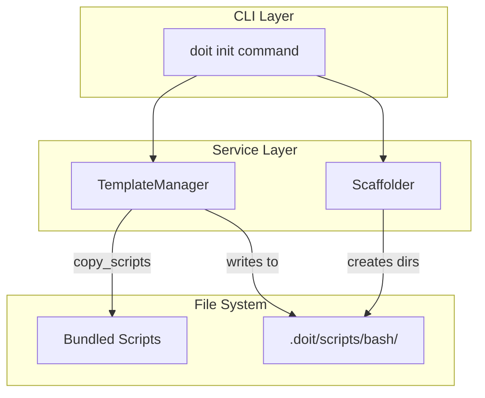

# Implementation Plan: Init Scripts Copy

**Branch**: `011-init-scripts-copy` | **Date**: 2026-01-10 | **Spec**: [spec.md](spec.md)
**Input**: Feature specification from `/specs/011-init-scripts-copy/spec.md`

## Summary

Add automatic copying of 5 workflow bash scripts during `doit init`. Scripts are bundled with the doit-cli package and copied to `.doit/scripts/bash/` with executable permissions preserved. The implementation follows the existing pattern used for workflow templates.

## Technical Context

**Language/Version**: Python 3.11+
**Primary Dependencies**: typer, rich, shutil (stdlib), pathlib (stdlib)
**Storage**: File system only
**Testing**: pytest
**Target Platform**: macOS, Linux (scripts require bash; Windows users need WSL/Git Bash)
**Project Type**: Single CLI application
**Performance Goals**: Script copy completes in <1 second
**Constraints**: Preserve executable permissions (mode 755)
**Scale/Scope**: 5 scripts, ~1500 lines of bash total

## Architecture Overview



## Constitution Check

*GATE: Must pass before Phase 0 research. Re-check after Phase 1 design.*

| Gate | Status | Notes |
|------|--------|-------|
| Follows existing patterns | ✅ Pass | Uses same pattern as `copy_workflow_templates()` |
| No new dependencies | ✅ Pass | Uses stdlib shutil, pathlib |
| Simple implementation | ✅ Pass | Single method addition + integration call |
| Test coverage | ✅ Pass | Unit + integration tests planned |

## Project Structure

### Documentation (this feature)

```text
specs/011-init-scripts-copy/
├── spec.md              # Feature specification
├── plan.md              # This file
├── research.md          # Phase 0 research output
├── data-model.md        # Phase 1 data model
└── checklists/
    └── requirements.md  # Requirements checklist
```

### Source Code (repository root)

```text
src/doit_cli/
├── cli/
│   └── init_command.py     # MODIFY: Add copy_scripts() call
└── services/
    └── template_manager.py # MODIFY: Add WORKFLOW_SCRIPTS constant and copy_scripts() method

templates/
└── scripts/
    └── bash/               # NEW: Move/copy scripts for bundling
        ├── common.sh
        ├── check-prerequisites.sh
        ├── create-new-feature.sh
        ├── setup-plan.sh
        └── update-agent-context.sh

tests/
├── unit/
│   └── services/
│       └── test_template_manager.py  # MODIFY: Add script copy tests
└── integration/
    └── test_init_command.py          # MODIFY: Add script verification
```

**Structure Decision**: Single project structure. Scripts are bundled under `templates/scripts/bash/` for consistency with template bundling mechanism.

## Implementation Details

### Step 1: Create Scripts Directory in Templates

Move/copy existing scripts from `.doit/scripts/bash/` to `templates/scripts/bash/` for bundling:

```bash
mkdir -p templates/scripts/bash
cp .doit/scripts/bash/*.sh templates/scripts/bash/
```

### Step 2: Update pyproject.toml

Ensure scripts are bundled with the wheel:

```toml
[tool.hatch.build.targets.wheel.force-include]
"templates" = "doit_cli/templates"
```

Scripts under `templates/scripts/bash/` will be automatically included.

### Step 3: Add WORKFLOW_SCRIPTS Constant

In `template_manager.py`:

```python
WORKFLOW_SCRIPTS = [
    "common.sh",
    "check-prerequisites.sh",
    "create-new-feature.sh",
    "setup-plan.sh",
    "update-agent-context.sh",
]
```

### Step 4: Implement copy_scripts() Method

```python
def copy_scripts(
    self,
    target_dir: Path,
    overwrite: bool = False,
) -> dict:
    """Copy workflow scripts to target directory.

    Args:
        target_dir: Destination directory (typically .doit/scripts/bash/)
        overwrite: Whether to overwrite existing files

    Returns:
        Dict with 'created', 'updated', 'skipped' lists of paths
    """
    result = {
        "created": [],
        "updated": [],
        "skipped": [],
    }

    source_dir = self.get_base_template_path() / "scripts" / "bash"
    if not source_dir.exists():
        return result

    # Ensure target directory exists
    target_dir.mkdir(parents=True, exist_ok=True)

    for script_name in WORKFLOW_SCRIPTS:
        source_path = source_dir / script_name
        if not source_path.exists():
            continue

        target_path = target_dir / script_name

        if target_path.exists():
            if overwrite:
                shutil.copy2(source_path, target_path)
                result["updated"].append(target_path)
            else:
                result["skipped"].append(target_path)
        else:
            shutil.copy2(source_path, target_path)
            result["created"].append(target_path)

    return result
```

### Step 5: Integrate in init_command.py

Add after workflow templates copy (around line 336):

```python
# Copy workflow scripts to .doit/scripts/bash/
scripts_result = template_manager.copy_scripts(
    target_dir=project.doit_folder / "scripts" / "bash",
    overwrite=update or force,
)
result.created_files.extend(scripts_result.get("created", []))
result.updated_files.extend(scripts_result.get("updated", []))
result.skipped_files.extend(scripts_result.get("skipped", []))
```

## Test Plan

### Unit Tests

```python
def test_copy_scripts_creates_new_files(tmp_path, template_manager):
    """Test scripts are created when target dir is empty."""
    target_dir = tmp_path / ".doit" / "scripts" / "bash"
    result = template_manager.copy_scripts(target_dir)

    assert len(result["created"]) == 5
    assert len(result["skipped"]) == 0
    assert (target_dir / "common.sh").exists()

def test_copy_scripts_preserves_permissions(tmp_path, template_manager):
    """Test scripts retain executable permissions."""
    target_dir = tmp_path / ".doit" / "scripts" / "bash"
    template_manager.copy_scripts(target_dir)

    for script in WORKFLOW_SCRIPTS:
        script_path = target_dir / script
        assert os.access(script_path, os.X_OK)

def test_copy_scripts_skips_existing(tmp_path, template_manager):
    """Test existing scripts are not overwritten without flag."""
    target_dir = tmp_path / ".doit" / "scripts" / "bash"
    target_dir.mkdir(parents=True)
    (target_dir / "common.sh").write_text("custom content")

    result = template_manager.copy_scripts(target_dir)

    assert (target_dir / "common.sh").read_text() == "custom content"
    assert target_dir / "common.sh" in result["skipped"]

def test_copy_scripts_overwrites_with_flag(tmp_path, template_manager):
    """Test existing scripts are overwritten with overwrite=True."""
    target_dir = tmp_path / ".doit" / "scripts" / "bash"
    target_dir.mkdir(parents=True)
    (target_dir / "common.sh").write_text("custom content")

    result = template_manager.copy_scripts(target_dir, overwrite=True)

    assert (target_dir / "common.sh").read_text() != "custom content"
    assert target_dir / "common.sh" in result["updated"]
```

### Integration Tests

```python
def test_init_copies_scripts(tmp_path, cli_runner):
    """Test doit init copies all 5 scripts."""
    result = cli_runner.invoke(["init", str(tmp_path), "--agent", "claude", "--yes"])

    assert result.exit_code == 0
    scripts_dir = tmp_path / ".doit" / "scripts" / "bash"
    assert scripts_dir.exists()
    assert len(list(scripts_dir.glob("*.sh"))) == 5

def test_init_scripts_are_executable(tmp_path, cli_runner):
    """Test initialized scripts have execute permission."""
    cli_runner.invoke(["init", str(tmp_path), "--agent", "claude", "--yes"])

    scripts_dir = tmp_path / ".doit" / "scripts" / "bash"
    for script in scripts_dir.glob("*.sh"):
        assert os.access(script, os.X_OK)
```

## Complexity Tracking

No constitution violations. Implementation follows existing patterns exactly.

## Acceptance Criteria Mapping

| Requirement | Implementation | Test |
|-------------|----------------|------|
| FR-001: Copy scripts during init | `copy_scripts()` called in `run_init()` | `test_init_copies_scripts` |
| FR-002: Preserve execute permissions | `shutil.copy2` preserves mode | `test_copy_scripts_preserves_permissions` |
| FR-003: Don't overwrite without flag | Check `target_path.exists()` first | `test_copy_scripts_skips_existing` |
| FR-004: Report copy results | Results added to `InitResult` | Verified in CLI output |
| FR-005: Bundle with package | `templates/scripts/bash/` included | Manual verification |
| FR-010: Create parent directories | `target_dir.mkdir(parents=True)` | Implicit in all tests |

## Risks and Mitigations

| Risk | Mitigation |
|------|------------|
| Scripts not bundled in wheel | Test wheel build before release |
| Permissions lost on Windows | Document bash requirement in README |
| Source path resolution fails | Use existing `get_base_template_path()` pattern |

## Definition of Done

- [ ] Scripts copied to `templates/scripts/bash/`
- [ ] `WORKFLOW_SCRIPTS` constant added
- [ ] `copy_scripts()` method implemented
- [ ] Integration in `run_init()` added
- [ ] Unit tests pass
- [ ] Integration tests pass
- [ ] Manual test: `doit init` creates executable scripts
- [ ] Manual test: Scripts work with `/doit.specit` workflow
