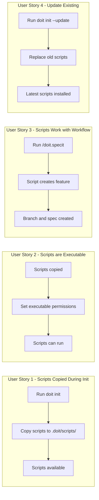

# Feature Specification: Init Scripts Copy

**Feature Branch**: `011-init-scripts-copy`
**Created**: 2026-01-10
**Status**: Draft
**Input**: User description: "We need to update the scripts and make sure the scripts are copied when the project is initialized from the command line using init. We need to verify the scripts still work and update them as needed to work with our workflow"

## User Scenarios & Testing *(mandatory)*

### User Story 1 - Scripts Copied During Initialization (Priority: P1)

As a developer initializing a new project with doit, I want the workflow scripts to be automatically copied to my project's `.doit/scripts/` directory so that I can immediately use doit workflow commands without manual setup.

**Why this priority**: Without scripts, core doit commands like creating new features (`/doit.specit`) fail because they depend on the `create-new-feature.sh` script. This is foundational to the entire workflow.

**Independent Test**: Can be fully tested by running `doit init . --agent claude --yes` on a new empty directory and verifying scripts are present and executable.

**Acceptance Scenarios**:

1. **Given** an empty project directory, **When** I run `doit init . --agent claude --yes`, **Then** the `.doit/scripts/bash/` directory contains all 5 workflow scripts (common.sh, check-prerequisites.sh, create-new-feature.sh, setup-plan.sh, update-agent-context.sh)
2. **Given** a project directory with existing `.doit/scripts/` content, **When** I run `doit init` without force flag, **Then** existing scripts are preserved and not overwritten
3. **Given** a project directory with existing `.doit/scripts/` content, **When** I run `doit init --force`, **Then** scripts are replaced with the latest versions

---

### User Story 2 - Scripts are Executable (Priority: P1)

As a developer who has initialized doit, I want the copied scripts to retain their executable permissions so that they can be invoked directly from the command line or by doit commands.

**Why this priority**: Scripts without execute permissions will fail when invoked, breaking all workflow commands that depend on them.

**Independent Test**: After `doit init`, verify each script in `.doit/scripts/bash/` has executable permissions and can be run.

**Acceptance Scenarios**:

1. **Given** scripts have been copied during init, **When** I check file permissions, **Then** all `.sh` files have the executable bit set (chmod +x)
2. **Given** the scripts directory exists, **When** I run `.doit/scripts/bash/create-new-feature.sh --help`, **Then** the script executes successfully and displays help text

---

### User Story 3 - Scripts Work with Current Workflow (Priority: P2)

As a developer using doit workflow, I want the scripts to be compatible with the current project structure and workflow commands so that features like `/doit.specit` work correctly.

**Why this priority**: Scripts must be updated to work with the current directory structure and tooling. This ensures end-to-end workflow functionality.

**Independent Test**: After initialization, run `/doit.specit "test feature"` and verify it successfully creates a branch and spec file.

**Acceptance Scenarios**:

1. **Given** a project initialized with `doit init`, **When** I invoke the `create-new-feature.sh` script, **Then** it correctly creates a new feature branch and spec directory under `specs/`
2. **Given** a project with existing specs, **When** I run `create-new-feature.sh`, **Then** it correctly determines the next feature number by scanning existing branches and spec directories
3. **Given** the workflow scripts are present, **When** `/doit.specit` command is invoked, **Then** it can successfully call the scripts to complete its workflow

---

### User Story 4 - Update Existing Installations (Priority: P3)

As a developer with an existing doit project, I want to be able to update my scripts to the latest version using `doit init --update` so that I get bug fixes and new features.

**Why this priority**: Existing projects need a way to update their scripts without reinitializing everything. Lower priority since new projects are the primary use case.

**Independent Test**: Initialize a project, modify a script, then run `doit init --update` and verify scripts are updated.

**Acceptance Scenarios**:

1. **Given** a project with outdated scripts, **When** I run `doit init --update`, **Then** scripts are updated to the latest bundled versions
2. **Given** a project with custom scripts (non-doit-prefixed), **When** I run `doit init --update`, **Then** custom scripts are preserved

---

### Edge Cases

- What happens when the target project has scripts with different content but same filenames? Handled by skip/overwrite logic based on --force/--update flags
- What happens on Windows where bash scripts may not be directly executable? Scripts are still copied; users must use bash/WSL/Git Bash to execute them
- What happens if copy fails due to permission errors? Report error clearly, don't leave partial state

## User Journey Visualization

<!-- BEGIN:AUTO-GENERATED section="user-journey" -->

<!-- END:AUTO-GENERATED -->

## Requirements *(mandatory)*

### Functional Requirements

- **FR-001**: The `doit init` command MUST copy all bundled workflow scripts to the `.doit/scripts/bash/` directory
- **FR-002**: Copied scripts MUST retain executable permissions (mode 755 or equivalent)
- **FR-003**: The init command MUST NOT overwrite existing scripts unless `--force` or `--update` flag is provided
- **FR-004**: The init command MUST report which scripts were created, updated, or skipped in its output
- **FR-005**: Scripts MUST be bundled with the doit-cli package for distribution (similar to templates)
- **FR-006**: The `create-new-feature.sh` script MUST correctly determine the next feature number by checking local branches, remote branches, and spec directories
- **FR-007**: The `create-new-feature.sh` script MUST create the feature branch and spec directory structure
- **FR-008**: The `common.sh` script MUST provide shared utility functions used by other scripts
- **FR-009**: All scripts MUST work with the current project structure (specs/, .doit/, templates/)
- **FR-010**: The init command MUST create the parent directories for scripts if they don't exist

### Scripts to Copy

| Script Name               | Purpose                                         |
| ------------------------- | ----------------------------------------------- |
| `common.sh`               | Shared utility functions for all scripts        |
| `check-prerequisites.sh`  | Verify system prerequisites (git, gh CLI, etc.) |
| `create-new-feature.sh`   | Create new feature branches and spec directories|
| `setup-plan.sh`           | Setup planning files for features               |
| `update-agent-context.sh` | Update agent context files                      |

## Success Criteria *(mandatory)*

### Measurable Outcomes

- **SC-001**: After running `doit init`, users can successfully run `.doit/scripts/bash/create-new-feature.sh` within 2 seconds
- **SC-002**: 100% of bundled scripts are copied during initialization (5 out of 5 scripts)
- **SC-003**: Users can complete the `/doit.specit` workflow end-to-end without manual script setup
- **SC-004**: Script updates via `doit init --update` complete in under 5 seconds
- **SC-005**: Zero manual post-initialization steps required for scripts to be functional

## Assumptions

- Users have bash available on their system (native on macOS/Linux, via WSL or Git Bash on Windows)
- The `gh` CLI is optional but recommended for GitHub integration features
- Scripts follow the same copy/skip/overwrite semantics as templates
- Script directory structure mirrors the source: `.doit/scripts/bash/`
