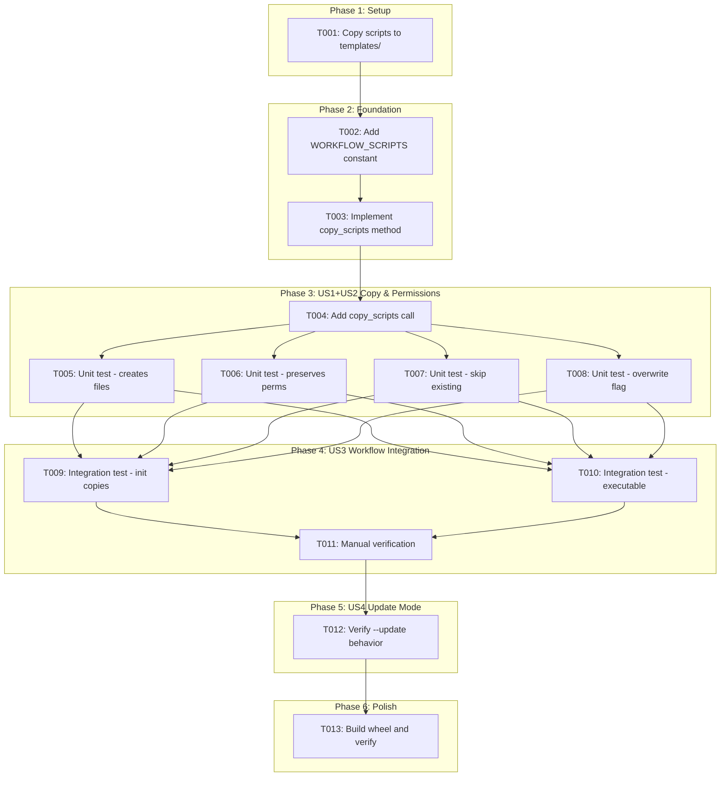
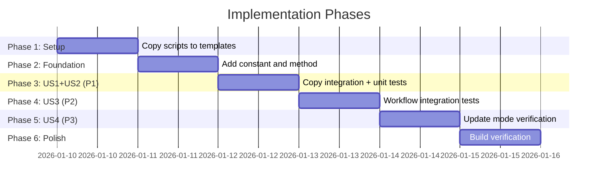

# Tasks: Init Scripts Copy

**Input**: Design documents from `/specs/011-init-scripts-copy/`
**Prerequisites**: plan.md (required), spec.md (required for user stories), research.md, data-model.md

**Tests**: Included - spec and plan request unit and integration tests.

**Organization**: Tasks are grouped by user story to enable independent implementation and testing of each story.

## Task Dependencies

<!-- BEGIN:AUTO-GENERATED section="task-dependencies" -->

<!-- END:AUTO-GENERATED -->

## Phase Timeline

<!-- BEGIN:AUTO-GENERATED section="phase-timeline" -->

<!-- END:AUTO-GENERATED -->

## Format: `[ID] [P?] [Story] Description`

- **[P]**: Can run in parallel (different files, no dependencies)
- **[Story]**: Which user story this task belongs to (e.g., US1, US2, US3)
- Include exact file paths in descriptions

## Path Conventions

- **Single project**: `src/doit_cli/`, `tests/` at repository root
- Scripts bundled under `templates/scripts/bash/`

---

## Phase 1: Setup (Script Bundling)

**Purpose**: Copy existing scripts to templates directory for package bundling

- [x] T001 Copy all 5 scripts from `.doit/scripts/bash/` to `templates/scripts/bash/` using `mkdir -p templates/scripts/bash && cp .doit/scripts/bash/*.sh templates/scripts/bash/`

---

## Phase 2: Foundational (TemplateManager Changes)

**Purpose**: Add script copying capability to TemplateManager

**⚠️ CRITICAL**: No user story work can begin until this phase is complete

- [x] T002 Add `WORKFLOW_SCRIPTS` constant after `GITHUB_ISSUE_TEMPLATES` in src/doit_cli/services/template_manager.py
- [x] T003 Implement `copy_scripts()` method in src/doit_cli/services/template_manager.py following `copy_workflow_templates()` pattern

**Checkpoint**: TemplateManager can now copy scripts - integration can begin

---

## Phase 3: User Story 1+2 - Scripts Copied with Executable Permissions (Priority: P1) 🎯 MVP

**Goal**: `doit init` copies all 5 scripts to `.doit/scripts/bash/` with executable permissions preserved

**Independent Test**: Run `doit init . --agent claude --yes` on empty directory, verify 5 scripts exist and are executable

### Implementation for User Story 1+2

- [x] T004 [US1] Add `copy_scripts()` call in `run_init()` after workflow templates copy in src/doit_cli/cli/init_command.py (around line 336)

### Tests for User Story 1+2

- [x] T005 [P] [US1] Add unit test `test_copy_scripts_creates_new_files` in tests/unit/services/test_template_manager.py
- [x] T006 [P] [US2] Add unit test `test_copy_scripts_preserves_permissions` in tests/unit/services/test_template_manager.py
- [x] T007 [P] [US1] Add unit test `test_copy_scripts_skips_existing` in tests/unit/services/test_template_manager.py
- [x] T008 [P] [US1] Add unit test `test_copy_scripts_overwrites_with_flag` in tests/unit/services/test_template_manager.py

**Checkpoint**: US1+US2 complete - scripts copy with correct permissions

---

## Phase 4: User Story 3 - Scripts Work with Workflow (Priority: P2)

**Goal**: Copied scripts work correctly with `/doit.specit` and other workflow commands

**Independent Test**: After `doit init`, run `/doit.specit "test feature"` and verify branch+spec are created

### Tests for User Story 3

- [x] T009 [P] [US3] Add integration test `test_init_copies_scripts` in tests/integration/test_init_command.py
- [x] T010 [P] [US3] Add integration test `test_init_scripts_are_executable` in tests/integration/test_init_command.py

### Verification for User Story 3

- [x] T011 [US3] Manual verification: Initialize fresh project with `doit init`, then run `.doit/scripts/bash/create-new-feature.sh --help` to confirm script works

**Checkpoint**: US3 complete - end-to-end workflow functional

---

## Phase 5: User Story 4 - Update Existing Installations (Priority: P3)

**Goal**: `doit init --update` replaces outdated scripts while preserving custom scripts

**Independent Test**: Initialize project, modify a script, run `doit init --update`, verify script was updated

### Verification for User Story 4

- [x] T012 [US4] Manual verification: Test `--update` and `--force` flags correctly overwrite existing scripts

**Checkpoint**: US4 complete - update mode works correctly

---

## Phase 6: Polish & Cross-Cutting Concerns

**Purpose**: Final verification and packaging

- [x] T013 Build wheel with `python3.11 -m pip wheel . -w dist/ --no-deps` and verify scripts are included in package

---

## Dependencies & Execution Order

### Phase Dependencies

- **Setup (Phase 1)**: No dependencies - can start immediately
- **Foundational (Phase 2)**: Depends on Setup completion - BLOCKS all user stories
- **US1+US2 (Phase 3)**: Depends on Foundational phase completion
- **US3 (Phase 4)**: Depends on US1+US2 implementation
- **US4 (Phase 5)**: Depends on US1+US2 implementation
- **Polish (Phase 6)**: Depends on all user stories complete

### User Story Dependencies

- **User Story 1+2 (P1)**: Can start after Foundational (Phase 2)
- **User Story 3 (P2)**: Requires US1+US2 complete (scripts must exist to test workflow)
- **User Story 4 (P3)**: Requires US1+US2 complete (scripts must exist to test update)

### Within Each User Story

- Implementation before tests (for this feature - implementation is minimal)
- Unit tests can run in parallel
- Integration tests can run in parallel
- Manual verification last

### Parallel Opportunities

- T005, T006, T007, T008 can run in parallel (different test functions)
- T009, T010 can run in parallel (different test functions)

---

## Parallel Example: Unit Tests

```bash
# Launch all unit tests for US1+US2 together:
Task: T005 "Add unit test test_copy_scripts_creates_new_files in tests/unit/services/test_template_manager.py"
Task: T006 "Add unit test test_copy_scripts_preserves_permissions in tests/unit/services/test_template_manager.py"
Task: T007 "Add unit test test_copy_scripts_skips_existing in tests/unit/services/test_template_manager.py"
Task: T008 "Add unit test test_copy_scripts_overwrites_with_flag in tests/unit/services/test_template_manager.py"
```

---

## Implementation Strategy

### MVP First (User Story 1+2 Only)

1. Complete Phase 1: Setup (copy scripts to templates/)
2. Complete Phase 2: Foundational (add constant + method)
3. Complete Phase 3: US1+US2 implementation + tests
4. **STOP and VALIDATE**: Test with `doit init` on fresh directory
5. Deploy if ready

### Incremental Delivery

1. Complete Setup + Foundational → Foundation ready
2. Add US1+US2 → Test independently → Deploy (MVP!)
3. Add US3 integration tests → Verify workflow
4. Add US4 update verification → Complete feature

---

## Notes

- [P] tasks = different files, no dependencies
- [Story] label maps task to specific user story for traceability
- US1 and US2 are combined since `shutil.copy2` handles both (copy + permissions)
- Total: 13 tasks across 6 phases
- Parallel opportunities: 6 tasks can run in parallel (T005-T008, T009-T010)
- MVP scope: Tasks T001-T008 (8 tasks)
