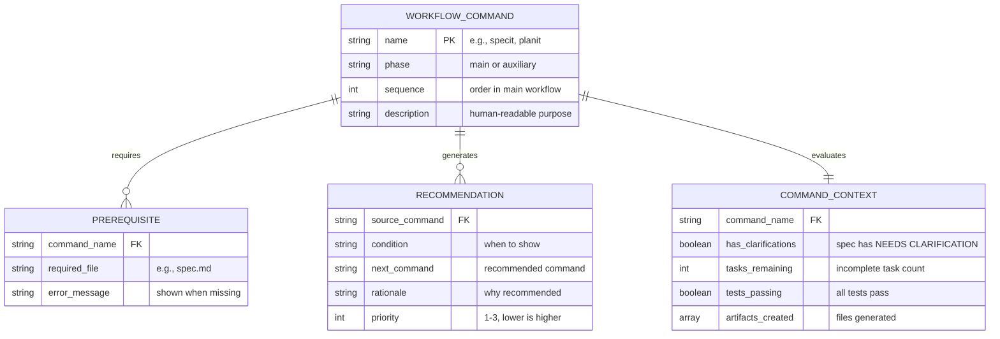

# Data Model: Command Workflow Recommendations

**Feature**: 012-command-recommendations
**Date**: 2026-01-10

## Entity Relationship Diagram

<!-- BEGIN:AUTO-GENERATED section="er-diagram" -->

<!-- END:AUTO-GENERATED -->

## Workflow Commands

### Main Workflow (Sequential)

| Command | Sequence | Prerequisites | Primary Output |
| ------- | -------- | ------------- | -------------- |
| specit | 1 | none | spec.md |
| planit | 2 | spec.md | plan.md, research.md, data-model.md |
| taskit | 3 | plan.md | tasks.md |
| implementit | 4 | tasks.md | code changes |
| testit | 5 | code changes | test results |
| reviewit | 6 | code changes | review feedback |
| checkin | 7 | code changes | PR/commit |

### Auxiliary Commands (Non-Sequential)

| Command | Context | Typical Entry Point |
| ------- | ------- | ------------------- |
| constitution | Project setup | Before first specit |
| scaffoldit | Project structure | After constitution |
| documentit | Documentation | Any time |
| roadmapit | Planning | After checkin or for new features |

## Recommendation Rules

### specit Recommendations

```yaml
specit:
  on_success:
    - condition: "no [NEEDS CLARIFICATION] markers"
      recommend: "/doit.planit"
      rationale: "Create implementation plan"
      priority: 1
    - condition: "has [NEEDS CLARIFICATION] markers"
      recommend: "Resolve clarifications in spec"
      rationale: "N open questions need answers"
      priority: 1
  on_error:
    - condition: "branch creation failed"
      recommend: "Check git status and try again"
      priority: 1
```

### planit Recommendations

```yaml
planit:
  on_success:
    - condition: "tasks.md does not exist"
      recommend: "/doit.taskit"
      rationale: "Create implementation tasks"
      priority: 1
    - condition: "tasks.md exists"
      recommend: "/doit.implementit"
      rationale: "Begin implementation"
      priority: 1
  on_error:
    - condition: "spec.md not found"
      recommend: "/doit.specit"
      rationale: "Create feature specification first"
      priority: 1
```

### taskit Recommendations

```yaml
taskit:
  on_success:
    - condition: "always"
      recommend: "/doit.implementit"
      rationale: "Execute implementation tasks"
      priority: 1
  on_error:
    - condition: "plan.md not found"
      recommend: "/doit.planit"
      rationale: "Create implementation plan first"
      priority: 1
```

### implementit Recommendations

```yaml
implementit:
  on_success:
    - condition: "all tasks complete"
      recommend: "/doit.testit"
      rationale: "Verify implementation with tests"
      priority: 1
    - condition: "tasks remaining"
      recommend: "/doit.implementit"
      rationale: "Continue with remaining N tasks"
      priority: 1
    - condition: "all tasks complete"
      recommend: "/doit.reviewit"
      rationale: "Request code review"
      priority: 2
  on_error:
    - condition: "tasks.md not found"
      recommend: "/doit.taskit"
      rationale: "Create tasks first"
      priority: 1
```

### testit Recommendations

```yaml
testit:
  on_success:
    - condition: "all tests pass"
      recommend: "/doit.reviewit"
      rationale: "Request code review"
      priority: 1
    - condition: "all tests pass"
      recommend: "/doit.checkin"
      rationale: "Finalize and merge changes"
      priority: 2
  on_error:
    - condition: "tests fail"
      recommend: "/doit.implementit"
      rationale: "Fix N failing tests"
      priority: 1
```

### reviewit Recommendations

```yaml
reviewit:
  on_success:
    - condition: "review approved"
      recommend: "/doit.checkin"
      rationale: "Merge your changes"
      priority: 1
    - condition: "changes requested"
      recommend: "/doit.implementit"
      rationale: "Address review feedback"
      priority: 1
```

### checkin Recommendations

```yaml
checkin:
  on_success:
    - condition: "PR merged"
      recommend: "/doit.roadmapit"
      rationale: "Update project roadmap"
      priority: 1
    - condition: "PR merged"
      recommend: "/doit.specit"
      rationale: "Start next feature"
      priority: 2
```

### Auxiliary Command Recommendations

```yaml
constitution:
  on_success:
    - recommend: "/doit.scaffoldit"
      rationale: "Generate project structure"
      priority: 1
    - recommend: "/doit.specit"
      rationale: "Create first feature specification"
      priority: 2

scaffoldit:
  on_success:
    - recommend: "/doit.specit"
      rationale: "Create feature specification"
      priority: 1

documentit:
  on_success:
    - recommend: "Continue development workflow"
      rationale: "Documentation updated"
      priority: 1

roadmapit:
  on_success:
    - recommend: "/doit.specit"
      rationale: "Start next prioritized feature"
      priority: 1
```

## Progress Indicator Format

```text
Workflow Progress:
○ specit → ● planit → ○ taskit → ○ implementit → ○ testit → ○ reviewit → ○ checkin

Legend: ● current/completed | ○ upcoming
```

### State Detection Logic

| File/Condition | Indicates |
| -------------- | --------- |
| spec.md exists | specit complete |
| plan.md exists | planit complete |
| tasks.md exists | taskit complete |
| All tasks [x] | implementit complete |
| Tests pass | testit complete |
| PR created | reviewit complete |
| PR merged | checkin complete |
