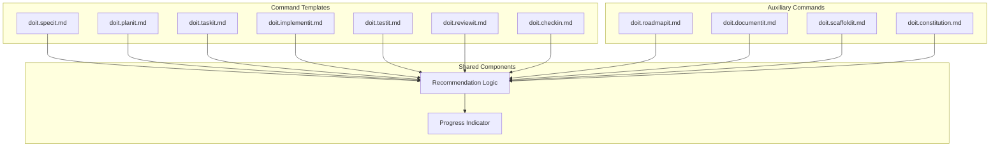

# Implementation Plan: Command Workflow Recommendations

**Branch**: `012-command-recommendations` | **Date**: 2026-01-10 | **Spec**: [spec.md](spec.md)
**Input**: Feature specification from `/specs/012-command-recommendations/spec.md`

## Summary

Enhance all doit workflow commands to provide context-aware "Next Steps" recommendations at the end of execution. Each command template will be updated to include a recommendation section that analyzes execution results (success/failure, artifacts created, items remaining) and suggests the most appropriate next command(s) in the workflow. Additionally, a visual workflow progress indicator will show users their current position in the doit lifecycle.

## Technical Context

**Language/Version**: Markdown (command templates), Bash 5.x (scripts)
**Primary Dependencies**: Claude Code slash command system, existing doit template structure
**Storage**: N/A (file-based templates only)
**Testing**: Manual verification via command execution
**Target Platform**: Cross-platform (macOS, Linux, Windows via WSL)
**Project Type**: single
**Performance Goals**: Recommendations displayed within 1 second of command completion
**Constraints**: Template-only changes, no Python CLI modifications required
**Scale/Scope**: 11 command templates to update

## Architecture Overview

<!-- BEGIN:AUTO-GENERATED section="architecture" -->

<!-- END:AUTO-GENERATED -->

## Constitution Check

*GATE: Must pass before Phase 0 research. Re-check after Phase 1 design.*

| Principle | Status | Notes |
|-----------|--------|-------|
| Template-based changes | PASS | All changes are in .md command templates |
| No new dependencies | PASS | Uses existing formatting patterns |
| Maintains backward compatibility | PASS | Recommendations are additive, not breaking |

## Project Structure

### Documentation (this feature)

```text
specs/012-command-recommendations/
├── spec.md              # Feature specification
├── plan.md              # This file
├── research.md          # Phase 0 output
├── data-model.md        # Phase 1 output
└── tasks.md             # Phase 2 output (from /doit.taskit)
```

### Source Code (repository root)

```text
templates/commands/
├── doit.specit.md       # Add Next Steps section
├── doit.planit.md       # Add Next Steps section
├── doit.taskit.md       # Add Next Steps section
├── doit.implementit.md  # Add Next Steps section
├── doit.testit.md       # Add Next Steps section
├── doit.reviewit.md     # Add Next Steps section
├── doit.checkin.md      # Add Next Steps section
├── doit.roadmapit.md    # Add Next Steps section
├── doit.documentit.md   # Add Next Steps section
├── doit.scaffoldit.md   # Add Next Steps section
└── doit.constitution.md # Add Next Steps section
```

**Structure Decision**: All changes are modifications to existing command template files in `templates/commands/`. No new files or directories are needed except for a potential shared recommendation snippet.

## Complexity Tracking

> No complexity violations - feature uses existing patterns and infrastructure.

| Aspect | Approach | Justification |
|--------|----------|---------------|
| Template modifications | Direct edits | Each command template is self-contained |
| Progress indicator | Inline markdown | Uses existing box formatting pattern |
| Recommendations | Conditional logic in template | Agent evaluates context and generates appropriate recommendation |
