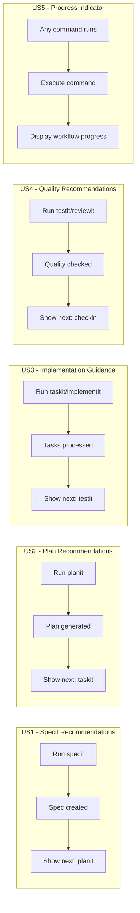
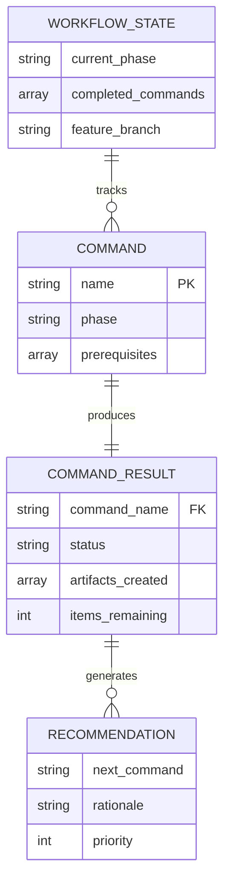

# Feature Specification: Command Workflow Recommendations

**Feature Branch**: `012-command-recommendations`
**Created**: 2026-01-10
**Status**: Draft
**Input**: User description: "Enhance commands to make recommendations and recommend the next command in the workflow to run"

## Summary

Enhance all doit workflow commands to provide context-aware recommendations at the end of execution. Each command will analyze execution results and recommend the most appropriate next command(s) in the workflow, helping users navigate the development lifecycle efficiently.

## User Scenarios & Testing *(mandatory)*

### User Story 1 - Receive Next Step Guidance After Specit (Priority: P1)

After running `/doit.specit` to create a feature specification, users see a clear recommendation section showing what to do next based on the spec's state.

**Why this priority**: This is the entry point of the workflow. Users often start here and need guidance on what comes next (planning, clarification, or scaffolding).

**Independent Test**: Run `/doit.specit` with a feature description and verify a "Next Steps" section appears with contextual recommendations.

**Acceptance Scenarios**:

1. **Given** a spec was created successfully with no clarification markers, **When** the command completes, **Then** the output shows "Recommended: Run `/doit.planit` to create an implementation plan"
2. **Given** a spec was created with [NEEDS CLARIFICATION] markers, **When** the command completes, **Then** the output shows "Recommended: Resolve N open questions in the spec before proceeding"
3. **Given** a spec was created, **When** the command completes, **Then** the output shows the full workflow context (where user is now and what comes next)

---

### User Story 2 - Context-Aware Plan Recommendations (Priority: P1)

After running `/doit.planit`, users receive recommendations based on plan completeness and whether tasks exist.

**Why this priority**: Planning is critical for implementation success. Recommendations here guide users toward task creation or implementation.

**Independent Test**: Run `/doit.planit` on an existing spec and verify recommendations appear based on plan artifacts generated.

**Acceptance Scenarios**:

1. **Given** a plan was created successfully, **When** the command completes, **Then** the output shows "Recommended: Run `/doit.taskit` to create implementation tasks"
2. **Given** a plan was created and tasks.md already exists, **When** the command completes, **Then** the output shows "Recommended: Run `/doit.implementit` to begin implementation"
3. **Given** a plan requires research resolution, **When** the command completes, **Then** the output indicates research items need attention before task creation

---

### User Story 3 - Implementation Workflow Guidance (Priority: P2)

After running `/doit.taskit` or `/doit.implementit`, users receive recommendations for testing, review, or check-in based on task completion status.

**Why this priority**: Implementation commands are frequent and benefit greatly from workflow automation.

**Independent Test**: Run `/doit.taskit` and verify it recommends `/doit.implementit`. Run `/doit.implementit` with all tasks complete and verify it recommends `/doit.testit`.

**Acceptance Scenarios**:

1. **Given** tasks were created successfully, **When** `/doit.taskit` completes, **Then** the output shows "Recommended: Run `/doit.implementit` to execute the tasks"
2. **Given** all implementation tasks are marked complete, **When** `/doit.implementit` completes, **Then** the output shows "Recommended: Run `/doit.testit` to verify implementation"
3. **Given** some tasks remain incomplete, **When** `/doit.implementit` is paused, **Then** the output shows "N tasks remaining - continue with `/doit.implementit` or run `/doit.testit` for partial verification"

---

### User Story 4 - Quality Workflow Recommendations (Priority: P2)

After running quality commands (`/doit.testit`, `/doit.reviewit`), users receive recommendations for next steps based on results.

**Why this priority**: Quality gates determine whether to proceed to check-in or address issues first.

**Independent Test**: Run `/doit.testit` with passing tests and verify it recommends `/doit.reviewit` or `/doit.checkin`.

**Acceptance Scenarios**:

1. **Given** all tests pass, **When** `/doit.testit` completes, **Then** the output shows "Recommended: Run `/doit.reviewit` for code review or `/doit.checkin` to finalize"
2. **Given** tests fail, **When** `/doit.testit` completes, **Then** the output shows "Fix N failing tests before proceeding. Run `/doit.implementit` to address issues"
3. **Given** review completes successfully, **When** `/doit.reviewit` completes, **Then** the output shows "Recommended: Run `/doit.checkin` to merge your changes"

---

### User Story 5 - Workflow Progress Indicator (Priority: P3)

All commands display a visual workflow progress indicator showing the current position in the doit lifecycle.

**Why this priority**: Visual context helps users understand where they are in the workflow, but is not essential for functionality.

**Independent Test**: Run any doit command and verify a progress indicator shows current workflow position.

**Acceptance Scenarios**:

1. **Given** any doit command runs, **When** the command completes, **Then** a workflow progress indicator shows: specit → planit → taskit → implementit → testit → reviewit → checkin
2. **Given** the current command is `/doit.planit`, **When** it completes, **Then** the progress indicator highlights "planit" as current and shows completed/upcoming steps
3. **Given** a command is run outside the normal flow (e.g., `roadmapit`), **When** it completes, **Then** the indicator shows the auxiliary command separately without disrupting main flow display

---

### Edge Cases

- What happens when a command fails mid-execution? Show recovery recommendations based on the error type
- How does the system handle running commands out of order? Indicate prerequisites that may be missing
- What if required files are missing (no spec.md for planit)? Recommend running the prerequisite command first
- What if user runs a command multiple times? Recommendations should reflect the current state, not assume first run

## User Journey Visualization

<!-- BEGIN:AUTO-GENERATED section="user-journey" -->

<!-- END:AUTO-GENERATED -->

## Requirements *(mandatory)*

### Functional Requirements

- **FR-001**: Each doit command MUST display a "Next Steps" section at the end of successful execution
- **FR-002**: Recommendations MUST be context-aware based on command execution results (success/failure, artifacts created, items remaining)
- **FR-003**: The recommendation section MUST include the specific command to run (e.g., `/doit.planit`)
- **FR-004**: Commands MUST detect missing prerequisites and recommend running the appropriate prerequisite command
- **FR-005**: Commands MUST display a workflow progress indicator showing position in the doit lifecycle
- **FR-006**: When errors occur, commands MUST provide recovery recommendations (not just error messages)
- **FR-007**: Auxiliary commands (roadmapit, documentit, scaffoldit, constitution) MUST show appropriate next steps for their context
- **FR-008**: The recommendation output MUST be visually distinct (formatted box or section) from command output
- **FR-009**: Recommendations MUST be concise (1-3 actionable suggestions maximum)
- **FR-010**: Progress indicator MUST show: completed steps, current step (highlighted), and upcoming steps

### Key Entities

- **WorkflowState**: Current position in workflow, completed steps, next possible steps
- **CommandResult**: Execution outcome (success/failure/partial), artifacts created, items requiring attention
- **Recommendation**: Suggested next command, rationale, priority level

## Entity Relationships

<!-- BEGIN:AUTO-GENERATED section="entity-relationships" -->

<!-- END:AUTO-GENERATED -->

## Success Criteria *(mandatory)*

### Measurable Outcomes

- **SC-001**: 100% of doit workflow commands display next step recommendations on completion
- **SC-002**: Users can navigate the entire specit → checkin workflow by following only the recommendations
- **SC-003**: When prerequisites are missing, 100% of commands recommend the correct prerequisite command
- **SC-004**: Recommendations are displayed within 1 second of command completion (no perceptible delay)
- **SC-005**: Users report increased confidence in workflow navigation (qualitative - validated through usage)
- **SC-006**: Workflow progress indicator is visible on 100% of command completions

## Assumptions

- The existing command output structure can accommodate an additional "Next Steps" section
- Rich formatting (boxes, colors) is available in the terminal output via existing patterns
- The command templates are the primary mechanism for adding recommendations (no core CLI changes required)
- Users are familiar with the doit command names and workflow concept
- Recommendations are guidance, not enforcement - users can choose to run different commands
- Workflow state can be inferred from file existence (spec.md, plan.md, tasks.md, etc.)

## Out of Scope

- Automatic execution of recommended commands (users must manually invoke)
- Persistent workflow state tracking across sessions (recommendations are stateless, based on file existence)
- Custom workflow definitions (the standard workflow is fixed)
- Integration with external project management tools
- Recommending non-doit commands or external tools
