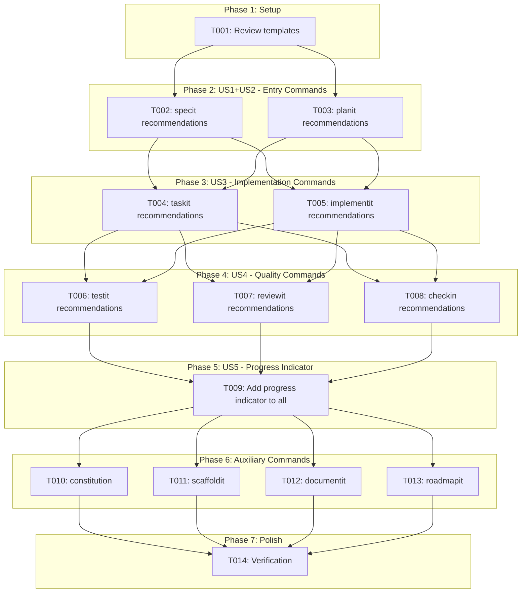
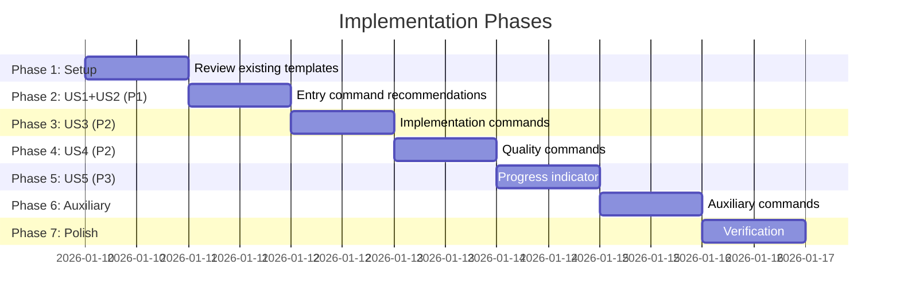

# Tasks: Command Workflow Recommendations

**Input**: Design documents from `/specs/012-command-recommendations/`
**Prerequisites**: plan.md, spec.md, data-model.md, research.md

**Tests**: Not required for this feature (template-only changes, manual verification)

**Organization**: Tasks are grouped by user story to enable independent implementation and testing of each story.

## Task Dependencies

<!-- BEGIN:AUTO-GENERATED section="task-dependencies" -->

<!-- END:AUTO-GENERATED -->

## Phase Timeline

<!-- BEGIN:AUTO-GENERATED section="phase-timeline" -->

<!-- END:AUTO-GENERATED -->

## Format: `[ID] [P?] [Story] Description`

- **[P]**: Can run in parallel (different files, no dependencies)
- **[Story]**: Which user story this task belongs to (e.g., US1, US2, US3)
- Include exact file paths in descriptions

---

## Phase 1: Setup

**Purpose**: Review existing templates and understand current structure

- [x] T001 Review existing command templates to identify insertion points in templates/commands/

---

## Phase 2: User Story 1+2 - Entry Commands (Priority: P1) 🎯 MVP

**Goal**: Add Next Steps recommendations to specit and planit commands

**Independent Test**: Run `/doit.specit` and `/doit.planit` and verify Next Steps section appears

### Implementation for User Story 1 - Specit Recommendations

- [x] T002 [US1] Add Next Steps section to doit.specit.md with conditional recommendations in templates/commands/doit.specit.md
  - On success with no clarifications: Recommend `/doit.planit`
  - On success with clarifications: Recommend "Resolve N open questions"
  - On error: Recommend recovery action
  - Include workflow progress indicator

### Implementation for User Story 2 - Plan Recommendations

- [x] T003 [P] [US2] Add Next Steps section to doit.planit.md with conditional recommendations in templates/commands/doit.planit.md
  - On success: Recommend `/doit.taskit`
  - If tasks.md exists: Recommend `/doit.implementit`
  - On error (no spec.md): Recommend `/doit.specit`
  - Include workflow progress indicator

**Checkpoint**: Entry commands (specit, planit) show Next Steps recommendations

---

## Phase 3: User Story 3 - Implementation Commands (Priority: P2)

**Goal**: Add Next Steps recommendations to taskit and implementit commands

**Independent Test**: Run `/doit.taskit` and `/doit.implementit` and verify Next Steps section appears

### Implementation for User Story 3

- [x] T004 [P] [US3] Add Next Steps section to doit.taskit.md with recommendations in templates/commands/doit.taskit.md
  - On success: Recommend `/doit.implementit`
  - On error (no plan.md): Recommend `/doit.planit`
  - Include workflow progress indicator

- [x] T005 [P] [US3] Add Next Steps section to doit.implementit.md with conditional recommendations in templates/commands/doit.implementit.md
  - All tasks complete: Recommend `/doit.testit`
  - Tasks remaining: Show count and recommend continue or `/doit.testit`
  - On error (no tasks.md): Recommend `/doit.taskit`
  - Include workflow progress indicator

**Checkpoint**: Implementation commands (taskit, implementit) show Next Steps recommendations

---

## Phase 4: User Story 4 - Quality Commands (Priority: P2)

**Goal**: Add Next Steps recommendations to testit, reviewit, and checkin commands

**Independent Test**: Run quality commands and verify Next Steps section appears with context-aware recommendations

### Implementation for User Story 4

- [x] T006 [P] [US4] Add Next Steps section to doit.testit.md with conditional recommendations in templates/commands/doit.testit.md
  - All tests pass: Recommend `/doit.reviewit` or `/doit.checkin`
  - Tests fail: Recommend `/doit.implementit` to fix issues
  - Include workflow progress indicator

- [x] T007 [P] [US4] Add Next Steps section to doit.reviewit.md with conditional recommendations in templates/commands/doit.reviewit.md
  - Review approved: Recommend `/doit.checkin`
  - Changes requested: Recommend `/doit.implementit`
  - Include workflow progress indicator

- [x] T008 [P] [US4] Add Next Steps section to doit.checkin.md with recommendations in templates/commands/doit.checkin.md
  - On success (merged): Recommend `/doit.roadmapit` or `/doit.specit` for next feature
  - Include workflow progress indicator

**Checkpoint**: Quality commands (testit, reviewit, checkin) show Next Steps recommendations

---

## Phase 5: User Story 5 - Progress Indicator (Priority: P3)

**Goal**: Add visual workflow progress indicator to all commands

**Independent Test**: Run any command and verify progress indicator shows current position

### Implementation for User Story 5

- [x] T009 [US5] Ensure all main workflow commands include progress indicator format in their Next Steps sections
  - Verify format: `○ specit → ● planit → ○ taskit → ...`
  - Current step highlighted with ●
  - Completed steps with ●
  - Upcoming steps with ○

**Checkpoint**: All main workflow commands show progress indicator

---

## Phase 6: Auxiliary Commands

**Goal**: Add appropriate Next Steps to auxiliary commands

### Implementation for Auxiliary Commands

- [x] T010 [P] Add Next Steps section to doit.constitution.md in templates/commands/doit.constitution.md
  - Recommend `/doit.scaffoldit` or `/doit.specit`

- [x] T011 [P] Add Next Steps section to doit.scaffoldit.md in templates/commands/doit.scaffoldit.md
  - Recommend `/doit.specit` to start feature development

- [x] T012 [P] Add Next Steps section to doit.documentit.md in templates/commands/doit.documentit.md
  - Recommend returning to workflow or continuing documentation

- [x] T013 [P] Add Next Steps section to doit.roadmapit.md in templates/commands/doit.roadmapit.md
  - Recommend `/doit.specit` to start next prioritized feature

**Checkpoint**: All auxiliary commands show appropriate Next Steps

---

## Phase 7: Polish & Verification

**Purpose**: Final verification and documentation

- [x] T014 Run manual verification of all 11 commands to confirm Next Steps sections work correctly

---

## Dependencies & Execution Order

### Phase Dependencies

- **Setup (Phase 1)**: No dependencies - review existing templates
- **US1+US2 (Phase 2)**: Depends on Setup - MVP entry points
- **US3 (Phase 3)**: Can run after Phase 2 or in parallel with it
- **US4 (Phase 4)**: Can run after Phase 3 or in parallel with it
- **US5 (Phase 5)**: Depends on Phase 2-4 (needs commands to exist)
- **Auxiliary (Phase 6)**: Can run in parallel with Phase 3-5
- **Polish (Phase 7)**: Depends on all previous phases

### User Story Dependencies

- **US1 (specit)**: No dependencies - entry point
- **US2 (planit)**: No dependencies - can parallel with US1
- **US3 (taskit/implementit)**: No dependencies on US1/US2 for template changes
- **US4 (testit/reviewit/checkin)**: No dependencies on US1-3 for template changes
- **US5 (progress indicator)**: Integrated into US1-4 tasks

### Parallel Opportunities

All tasks marked [P] can run in parallel since they modify different template files:

- T002 and T003 can run in parallel (different files)
- T004 and T005 can run in parallel (different files)
- T006, T007, T008 can all run in parallel (different files)
- T010, T011, T012, T013 can all run in parallel (different files)

---

## Parallel Example: Phase 4

```bash
# Launch all quality command updates together:
Task: "T006 [P] [US4] Add Next Steps section to doit.testit.md"
Task: "T007 [P] [US4] Add Next Steps section to doit.reviewit.md"
Task: "T008 [P] [US4] Add Next Steps section to doit.checkin.md"
```

---

## Implementation Strategy

### MVP First (Phase 1-2 Only)

1. Complete Phase 1: Review templates
2. Complete Phase 2: specit and planit recommendations
3. **STOP and VALIDATE**: Test specit → planit workflow with recommendations
4. Proceed if working correctly

### Full Implementation

1. Complete Phase 1-2 → Entry commands working
2. Complete Phase 3 → Implementation commands working
3. Complete Phase 4 → Quality commands working
4. Complete Phase 5 → Progress indicators in place
5. Complete Phase 6 → Auxiliary commands working
6. Complete Phase 7 → Full verification

---

## Notes

- All changes are to Markdown template files in `templates/commands/`
- No Python code changes required
- Recommendations are generated by the AI agent at runtime based on context
- Progress indicator uses ○/● symbols for compatibility
- Each command template is self-contained
