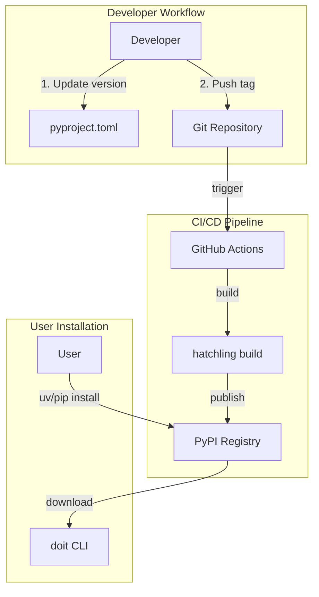

# Implementation Plan: Publish CLI to PyPI

**Branch**: `013-publish-pypi` | **Date**: 2026-01-11 | **Spec**: [spec.md](./spec.md)
**Input**: Feature specification from `/specs/013-publish-pypi/spec.md`

## Summary

Enable users to install doit-cli from PyPI using `uv tool install doit-cli`, `pip install doit-cli`, or `pipx install doit-cli`. Implementation requires completing the pyproject.toml metadata and creating a GitHub Actions workflow that uses PyPI Trusted Publishing (OIDC) for secure, token-free automated releases.

## Technical Context

**Language/Version**: Python 3.11+
**Primary Dependencies**: hatchling (build), typer (CLI), rich (formatting)
**Storage**: N/A (no database)
**Testing**: pytest, manual smoke tests
**Target Platform**: PyPI (cross-platform package distribution)
**Project Type**: single (CLI tool)
**Performance Goals**: Package install < 30 seconds, CI workflow < 5 minutes
**Constraints**: Package size < 5MB, Python >= 3.11 required
**Scale/Scope**: Single package, automated releases on tag push

## Architecture Overview

<!-- BEGIN:AUTO-GENERATED section="architecture" -->

<!-- END:AUTO-GENERATED -->

## Constitution Check

*GATE: Must pass before Phase 0 research. Re-check after Phase 1 design.*

| Principle | Status | Notes |
|-----------|--------|-------|
| Python 3.11+ | ✅ PASS | Already configured in pyproject.toml |
| CLI-first | ✅ PASS | Package exposes `doit` command |
| Test coverage | ✅ PASS | Smoke test verifies basic functionality |
| Simple build | ✅ PASS | Using standard hatchling build |

**Constitution not formally defined** - inferred from existing project patterns.

## Project Structure

### Documentation (this feature)

```text
specs/013-publish-pypi/
├── spec.md              # Feature specification
├── plan.md              # This file
├── research.md          # PyPI publishing research
├── checklists/
│   └── requirements.md  # Validation checklist
└── tasks.md             # Task breakdown (created by /doit.taskit)
```

### Source Code Changes

```text
# Files to modify
pyproject.toml           # Add metadata (authors, license, readme, urls, classifiers)
README.md                # Ensure good PyPI landing page content

# Files to create
.github/workflows/
└── publish.yml          # PyPI publishing workflow
```

**Structure Decision**: Minimal changes - only metadata completion and CI workflow creation. No new source code directories needed.

## Implementation Approach

### Phase 1: Package Metadata Completion

**File**: `pyproject.toml`

Add missing metadata fields:

```toml
[project]
name = "doit-cli"
version = "X.Y.Z"
description = "Doit CLI - A tool to bootstrap your projects for Spec-Driven Development (SDD)."
readme = "README.md"
license = {text = "MIT"}
authors = [
    {name = "Project Maintainer", email = "maintainer@example.com"}
]
keywords = ["cli", "spec-driven-development", "sdd", "ai", "development-workflow"]
classifiers = [
    "Development Status :: 4 - Beta",
    "Environment :: Console",
    "Intended Audience :: Developers",
    "License :: OSI Approved :: MIT License",
    "Operating System :: OS Independent",
    "Programming Language :: Python :: 3",
    "Programming Language :: Python :: 3.11",
    "Programming Language :: Python :: 3.12",
    "Topic :: Software Development :: Code Generators",
    "Topic :: Software Development :: Quality Assurance",
]

[project.urls]
Homepage = "https://github.com/OWNER/doit"
Documentation = "https://github.com/OWNER/doit#readme"
Repository = "https://github.com/OWNER/doit.git"
Issues = "https://github.com/OWNER/doit/issues"
```

### Phase 2: GitHub Actions Workflow

**File**: `.github/workflows/publish.yml`

```yaml
name: Publish to PyPI

on:
  push:
    tags:
      - 'v*.*.*'

permissions:
  id-token: write  # Required for trusted publishing

jobs:
  build:
    runs-on: ubuntu-latest
    steps:
      - uses: actions/checkout@v4

      - name: Set up Python
        uses: actions/setup-python@v5
        with:
          python-version: '3.11'

      - name: Install build dependencies
        run: pip install build

      - name: Build package
        run: python -m build

      - name: Upload artifact
        uses: actions/upload-artifact@v4
        with:
          name: dist
          path: dist/

  publish:
    needs: build
    runs-on: ubuntu-latest
    environment: pypi
    steps:
      - name: Download artifact
        uses: actions/download-artifact@v4
        with:
          name: dist
          path: dist/

      - name: Publish to PyPI
        uses: pypa/gh-action-pypi-publish@release/v1
```

### Phase 3: PyPI Project Setup (Manual)

1. Create account on pypi.org (if not exists)
2. Create new project `doit-cli` on PyPI
3. Configure Trusted Publishing:
   - Go to Project Settings → Publishing
   - Add GitHub as trusted publisher
   - Set repository owner and name
   - Set workflow name: `publish.yml`
   - Set environment name: `pypi`
4. Create GitHub environment `pypi` in repository settings

### Phase 4: Verify Template Bundling

Verify hatchling correctly includes all templates:

```bash
# Build the package
python -m build

# Extract and inspect
unzip -l dist/doit_cli-*.whl | grep templates
```

Expected output should show:
- `doit_cli/templates/commands/*.md`
- `doit_cli/templates/memory/*.md`
- `doit_cli/templates/scripts/bash/*.sh`
- `doit_cli/templates/github-issue-templates/*.yml`

### Phase 5: Release Process

1. Update version in `pyproject.toml`
2. Commit: `git commit -m "chore: release vX.Y.Z"`
3. Tag: `git tag vX.Y.Z`
4. Push: `git push && git push --tags`
5. Monitor GitHub Actions for successful publish
6. Verify on PyPI: `pip index versions doit-cli`
7. Test installation: `uv tool install doit-cli`

## Complexity Tracking

No constitution violations. Simple, standard PyPI publishing approach using recommended tools.

## Dependencies

| Dependency | Purpose | Version |
|------------|---------|---------|
| hatchling | Build backend | (existing) |
| build | PEP 517 build frontend | latest |
| pypa/gh-action-pypi-publish | GitHub Action | v1 |

## Risks and Mitigations

| Risk | Likelihood | Impact | Mitigation |
|------|------------|--------|------------|
| Package name taken | Low | High | Already verified `doit-cli` available |
| Template bundling fails | Medium | High | Manual verification step before release |
| Trusted publishing misconfigured | Medium | Medium | Follow PyPI docs exactly, test with TestPyPI first |
| Version mismatch | Low | Low | Single source of truth in pyproject.toml |

## Success Verification

After implementation, verify:

1. [ ] `pip install doit-cli` works on clean Python 3.11+ environment
2. [ ] `uv tool install doit-cli` works
3. [ ] `doit --version` returns correct version
4. [ ] `doit init .` creates `.doit/` with all templates
5. [ ] PyPI page shows correct metadata (description, links, license)
6. [ ] GitHub Actions workflow triggers on tag push
7. [ ] New version appears on PyPI within 10 minutes of tag push
