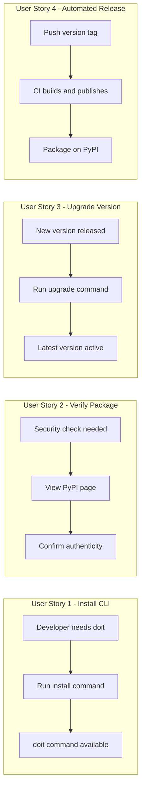

# Feature Specification: Publish CLI to PyPI

**Feature Branch**: `013-publish-pypi`
**Created**: 2026-01-11
**Status**: Draft
**Input**: User description: "we need to deploy the cli and application to the uv package manager so others can install it"

## Summary

Enable users to install the doit CLI tool directly from the Python Package Index (PyPI) using standard Python package managers like `uv`, `pip`, or `pipx`. This eliminates the need for users to clone the repository and allows for simple one-command installation.

## User Scenarios & Testing *(mandatory)*

### User Story 1 - Install CLI via Package Manager (Priority: P1)

A developer discovers the doit CLI and wants to quickly install it on their machine to start using Spec-Driven Development in their projects. They should be able to run a single command to install the tool system-wide.

**Why this priority**: This is the core value proposition - without installability, users cannot access the tool at all. This unblocks all other usage scenarios.

**Independent Test**: Can be fully tested by running `uv tool install doit-cli` (or `pip install doit-cli`) on a clean machine and verifying `doit --version` returns the expected version.

**Acceptance Scenarios**:

1. **Given** a user has `uv` installed, **When** they run `uv tool install doit-cli`, **Then** the `doit` command becomes available in their terminal
2. **Given** a user has `pip` installed, **When** they run `pip install doit-cli`, **Then** the `doit` command becomes available in their terminal
3. **Given** a user has `pipx` installed, **When** they run `pipx install doit-cli`, **Then** the `doit` command is installed in an isolated environment

---

### User Story 2 - Verify Package Authenticity (Priority: P2)

A security-conscious developer wants to verify that the package they're installing is the official doit CLI from trusted maintainers, not a malicious package with a similar name.

**Why this priority**: Security is critical for CLI tools that developers run in their projects. Users need confidence the package is legitimate before installation.

**Independent Test**: Can be tested by viewing the package on PyPI and verifying the project URLs, maintainer information, and metadata match the official GitHub repository.

**Acceptance Scenarios**:

1. **Given** the package is published on PyPI, **When** a user views the package page, **Then** they see the official project description, homepage link to GitHub, and maintainer information
2. **Given** the package has been published, **When** a user checks the package metadata, **Then** the license, author, and source repository are clearly displayed

---

### User Story 3 - Upgrade to Latest Version (Priority: P2)

A user who previously installed doit CLI wants to upgrade to the latest version to get new features and bug fixes.

**Why this priority**: Ongoing maintenance requires users to easily upgrade. Without this, users would be stuck on old versions.

**Independent Test**: Can be tested by having an older version installed, running the upgrade command, and verifying the new version is active.

**Acceptance Scenarios**:

1. **Given** a user has an older version of doit-cli installed, **When** they run `uv tool upgrade doit-cli`, **Then** the latest version is installed and active
2. **Given** a user has an older version installed via pip, **When** they run `pip install --upgrade doit-cli`, **Then** the latest version replaces the old version

---

### User Story 4 - Automated Release Publishing (Priority: P3)

A maintainer wants new releases to be automatically published to PyPI when a new version tag is pushed to GitHub, eliminating manual release steps.

**Why this priority**: Automation reduces human error and ensures consistent releases, but manual publishing can work initially.

**Independent Test**: Can be tested by pushing a new version tag to GitHub and verifying the package appears on PyPI within minutes.

**Acceptance Scenarios**:

1. **Given** a maintainer pushes a git tag matching `v*.*.*`, **When** the CI workflow completes, **Then** the new version is published to PyPI
2. **Given** a release is triggered, **When** the build process runs, **Then** all bundled templates are included in the published package

---

### Edge Cases

- What happens when a user tries to install on Python < 3.11? Package manager displays clear error about Python version requirement
- How does the system handle network failures during PyPI upload? CI workflow fails with clear error message; maintainer can re-run the workflow
- What happens if the package name is already taken on PyPI? Using `doit-cli` to avoid conflicts with existing `doit` package (a different project)

## User Journey Visualization

<!-- BEGIN:AUTO-GENERATED section="user-journey" -->

<!-- END:AUTO-GENERATED -->

## Requirements *(mandatory)*

### Functional Requirements

- **FR-001**: Package MUST be published to PyPI under the name `doit-cli`
- **FR-002**: Package MUST be installable via `uv tool install doit-cli`
- **FR-003**: Package MUST be installable via `pip install doit-cli`
- **FR-004**: Package MUST be installable via `pipx install doit-cli`
- **FR-005**: Installed package MUST provide the `doit` command in user's PATH
- **FR-006**: Package MUST include all bundled templates (commands, workflow templates, scripts, memory templates)
- **FR-007**: Package metadata MUST include: description, author, license, homepage URL, repository URL
- **FR-008**: Package MUST specify Python >= 3.11 requirement
- **FR-009**: Package MUST include a README visible on the PyPI package page
- **FR-010**: CI workflow MUST automatically publish to PyPI when a version tag is pushed
- **FR-011**: CI workflow MUST build the package using the configured build system (hatchling)
- **FR-012**: Package version MUST be updated in pyproject.toml before each release
- **FR-013**: Published package MUST pass basic smoke test (install and run `doit --version`)

### Non-Functional Requirements

- **NFR-001**: Package installation MUST complete in under 30 seconds on standard internet connection
- **NFR-002**: Package size MUST be under 5MB (compressed)
- **NFR-003**: CI publishing workflow MUST complete in under 5 minutes

## Success Criteria *(mandatory)*

### Measurable Outcomes

- **SC-001**: Users can install doit-cli with a single command (`uv tool install doit-cli` or `pip install doit-cli`) and have the `doit` command available immediately
- **SC-002**: Package is discoverable by searching "doit-cli" or "spec-driven development" on PyPI
- **SC-003**: 100% of bundled templates are included and functional in the installed package
- **SC-004**: New releases are automatically published to PyPI within 10 minutes of pushing a version tag
- **SC-005**: Package page on PyPI displays accurate project information with links to documentation and source code

## Assumptions

- The package name `doit-cli` is available on PyPI (there is an existing `doit` package which is a different project)
- Maintainers have or will create a PyPI account for publishing
- GitHub Actions will be used for CI/CD (standard for this project)
- PyPI API tokens will be stored as GitHub repository secrets
- The existing hatchling build configuration is correct and complete

## Out of Scope

- Publishing to conda-forge or other package repositories
- Creating platform-specific installers (Windows MSI, macOS pkg, etc.)
- Signing packages with GPG
- Publishing pre-release/beta versions (future enhancement)
- Documentation site deployment (separate feature)
