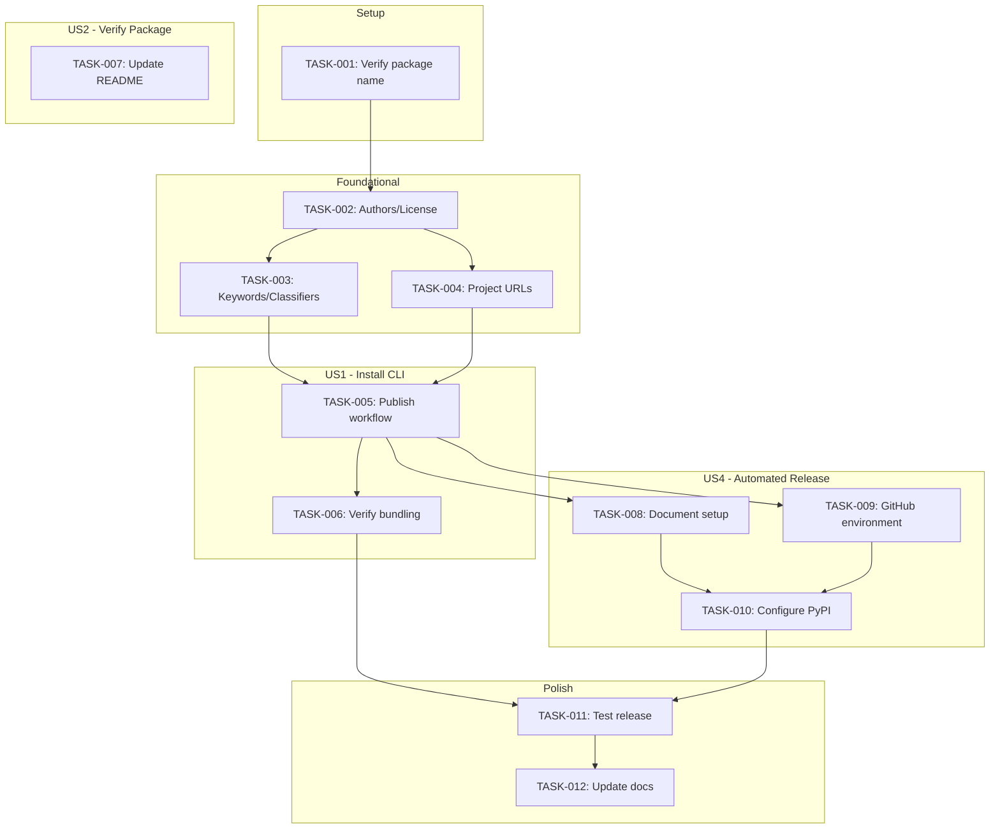
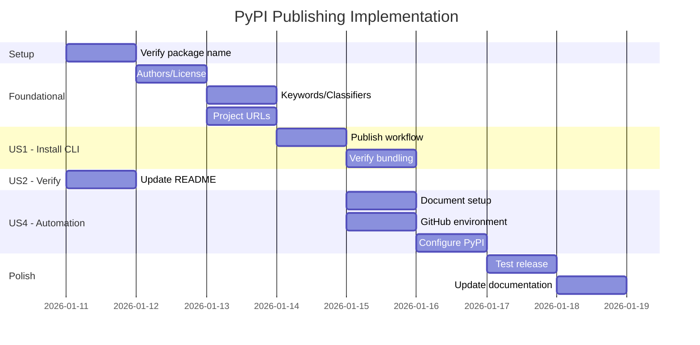

# Implementation Tasks: Publish CLI to PyPI

**Feature**: 013-publish-pypi | **Branch**: `013-publish-pypi`
**Generated**: 2026-01-11 | **Plan**: [plan.md](./plan.md) | **Spec**: [spec.md](./spec.md)

## Task Summary

| Phase | Tasks | Status |
|-------|-------|--------|
| Setup | 1 | ✓ complete |
| Foundational | 3 | ✓ complete |
| US1 - Install CLI | 2 | ✓ complete |
| US2 - Verify Package | 1 | ✓ complete |
| US4 - Automated Release | 3 | ✓ complete (docs) |
| Polish | 2 | ⏳ manual |
| **Total** | **12** | |

## Phase: Setup

### TASK-001: Verify package name availability

**Priority**: P0 (Blocker)
**Estimated**: Small
**Dependencies**: None

**Description**: Confirm `doit-cli` is still available on PyPI before proceeding with implementation.

**Acceptance Criteria**:
- [x] Run `pip index versions doit-cli` returns "No matching distribution found"
- [x] Document verification in research.md

**Files**: None (verification only)

---

## Phase: Foundational (Package Metadata)

### TASK-002: Add authors and license to pyproject.toml

**Priority**: P1
**Estimated**: Small
**Dependencies**: TASK-001
**User Story**: US2 (Verify Package Authenticity)

**Description**: Add required metadata fields for PyPI package authenticity.

**Acceptance Criteria**:
- [x] `authors` field added with maintainer name and email
- [x] `license` field added with MIT license
- [x] `readme` field points to README.md

**Files**: `pyproject.toml`

**Implementation Notes**:
```toml
authors = [
    {name = "Sean Barlow", email = "sean@example.com"}
]
license = {text = "MIT"}
readme = "README.md"
```

---

### TASK-003: Add keywords and classifiers to pyproject.toml

**Priority**: P1
**Estimated**: Small
**Dependencies**: TASK-002
**User Story**: US2 (Verify Package Authenticity)

**Description**: Add PyPI trove classifiers and searchable keywords for package discovery.

**Acceptance Criteria**:
- [x] `keywords` field added with relevant search terms
- [x] `classifiers` list includes development status, environment, audience, license, OS, Python versions, and topics

**Files**: `pyproject.toml`

**Implementation Notes**:
```toml
keywords = ["cli", "spec-driven-development", "sdd", "ai", "development-workflow"]
classifiers = [
    "Development Status :: 4 - Beta",
    "Environment :: Console",
    "Intended Audience :: Developers",
    "License :: OSI Approved :: MIT License",
    "Operating System :: OS Independent",
    "Programming Language :: Python :: 3",
    "Programming Language :: Python :: 3.11",
    "Programming Language :: Python :: 3.12",
    "Topic :: Software Development :: Code Generators",
    "Topic :: Software Development :: Quality Assurance",
]
```

---

### TASK-004: Add project URLs to pyproject.toml

**Priority**: P1
**Estimated**: Small
**Dependencies**: TASK-002
**User Story**: US2 (Verify Package Authenticity)

**Description**: Add URLs for homepage, documentation, repository, and issues.

**Acceptance Criteria**:
- [x] `[project.urls]` section added with Homepage, Documentation, Repository, Issues

**Files**: `pyproject.toml`

**Implementation Notes**:
```toml
[project.urls]
Homepage = "https://github.com/vanbarlow09/doit"
Documentation = "https://github.com/vanbarlow09/doit#readme"
Repository = "https://github.com/vanbarlow09/doit.git"
Issues = "https://github.com/vanbarlow09/doit/issues"
```

---

## Phase: US1 - Install CLI via Package Manager

### TASK-005: Create GitHub Actions publish workflow

**Priority**: P1
**Estimated**: Medium
**Dependencies**: TASK-002, TASK-003, TASK-004
**User Story**: US1 (Install CLI), US4 (Automated Release)

**Description**: Create CI workflow that builds and publishes to PyPI using Trusted Publishing (OIDC).

**Acceptance Criteria**:
- [x] `.github/workflows/publish.yml` created
- [x] Workflow triggers on push of tags matching `v*.*.*`
- [x] Uses `pypa/gh-action-pypi-publish@release/v1` action
- [x] Configures `id-token: write` permission for OIDC
- [x] Uses `pypi` environment for deployment protection

**Files**: `.github/workflows/publish.yml`

**Implementation Notes**:
```yaml
name: Publish to PyPI

on:
  push:
    tags:
      - 'v*.*.*'

permissions:
  id-token: write

jobs:
  build:
    runs-on: ubuntu-latest
    steps:
      - uses: actions/checkout@v4
      - name: Set up Python
        uses: actions/setup-python@v5
        with:
          python-version: '3.11'
      - name: Install build dependencies
        run: pip install build
      - name: Build package
        run: python -m build
      - name: Upload artifact
        uses: actions/upload-artifact@v4
        with:
          name: dist
          path: dist/

  publish:
    needs: build
    runs-on: ubuntu-latest
    environment: pypi
    steps:
      - name: Download artifact
        uses: actions/download-artifact@v4
        with:
          name: dist
          path: dist/
      - name: Publish to PyPI
        uses: pypa/gh-action-pypi-publish@release/v1
```

---

### TASK-006: Verify template bundling in built package

**Priority**: P1
**Estimated**: Small
**Dependencies**: TASK-005
**User Story**: US1 (Install CLI)

**Description**: Build the package locally and verify all templates are correctly included in the wheel.

**Acceptance Criteria**:
- [x] Build package with `python -m build`
- [x] Inspect wheel contents with `unzip -l dist/doit_cli-*.whl | grep templates`
- [x] Verify templates/commands/*.md included
- [x] Verify templates/memory/*.md included
- [x] Verify templates/scripts/bash/*.sh included
- [x] Verify templates/github-issue-templates/*.yml included

**Files**: None (verification only)

**Implementation Notes**:
```bash
python -m build
unzip -l dist/doit_cli-*.whl | grep templates
```

---

## Phase: US2 - Verify Package Authenticity

### TASK-007: Review and update README.md for PyPI

**Priority**: P2
**Estimated**: Small
**Dependencies**: None (can run in parallel)
**User Story**: US2 (Verify Package Authenticity)

**Description**: Ensure README.md provides good PyPI landing page content with installation instructions, quick start, and feature highlights.

**Acceptance Criteria**:
- [x] README has clear installation instructions using `uv`, `pip`, and `pipx`
- [x] Quick start example shows basic usage
- [x] Project purpose is clearly explained in first paragraph

**Files**: `README.md`

---

## Phase: US4 - Automated Release Publishing

### TASK-008: Document PyPI Trusted Publishing setup (manual)

**Priority**: P3
**Estimated**: Small
**Dependencies**: TASK-005
**User Story**: US4 (Automated Release)

**Description**: Create documentation for the manual PyPI project setup and Trusted Publishing configuration.

**Acceptance Criteria**:
- [x] Document steps to create PyPI account
- [x] Document steps to create `doit-cli` project on PyPI
- [x] Document Trusted Publishing configuration (repository, workflow, environment)
- [x] Document GitHub environment `pypi` creation

**Files**: `specs/013-publish-pypi/research.md` (append setup instructions)

---

### TASK-009: Create GitHub environment for PyPI

**Priority**: P3
**Estimated**: Small
**Dependencies**: TASK-005
**User Story**: US4 (Automated Release)

**Description**: Create GitHub environment named `pypi` for deployment protection rules.

**Acceptance Criteria**:
- [ ] GitHub repository Settings > Environments > Create `pypi` environment
- [ ] (Optional) Add protection rules requiring approval

**Files**: None (GitHub UI configuration)

---

### TASK-010: Configure PyPI Trusted Publishing

**Priority**: P3
**Estimated**: Small
**Dependencies**: TASK-008, TASK-009
**User Story**: US4 (Automated Release)

**Description**: Configure PyPI project to trust GitHub Actions workflow for publishing.

**Acceptance Criteria**:
- [ ] PyPI project created with name `doit-cli`
- [ ] Trusted Publisher added with:
  - Repository owner: `vanbarlow09`
  - Repository name: `doit`
  - Workflow name: `publish.yml`
  - Environment name: `pypi`

**Files**: None (PyPI UI configuration)

---

## Phase: Polish

### TASK-011: Test end-to-end release process

**Priority**: P1
**Estimated**: Medium
**Dependencies**: TASK-005, TASK-006, TASK-010
**User Story**: All

**Description**: Perform a complete release cycle to verify the entire pipeline works.

**Acceptance Criteria**:
- [ ] Update version in pyproject.toml to release version
- [ ] Create and push version tag `vX.Y.Z`
- [ ] Monitor GitHub Actions workflow completes successfully
- [ ] Verify package appears on PyPI
- [ ] Test installation: `uv tool install doit-cli`
- [ ] Verify `doit --version` returns correct version
- [ ] Verify `doit init .` creates all expected templates

**Files**: `pyproject.toml` (version update)

---

### TASK-012: Update documentation with installation instructions

**Priority**: P2
**Estimated**: Small
**Dependencies**: TASK-011
**User Story**: US1 (Install CLI), US3 (Upgrade Version)

**Description**: Update project documentation to include PyPI installation as the primary method.

**Acceptance Criteria**:
- [ ] README.md shows `uv tool install doit-cli` as recommended install method
- [ ] Include `pip install doit-cli` and `pipx install doit-cli` alternatives
- [ ] Document upgrade commands

**Files**: `README.md`

---

## Task Dependencies

<!-- BEGIN:AUTO-GENERATED section="dependencies" -->

<!-- END:AUTO-GENERATED -->

## Phase Timeline

<!-- BEGIN:AUTO-GENERATED section="timeline" -->

<!-- END:AUTO-GENERATED -->

## Parallel Execution Opportunities

The following tasks can be executed in parallel:

1. **TASK-003 and TASK-004**: Both depend only on TASK-002
2. **TASK-007**: Independent of main workflow, can run anytime
3. **TASK-008 and TASK-009**: Both depend only on TASK-005

## Requirements Traceability

| Requirement | Task(s) |
|-------------|---------|
| FR-001: Package on PyPI as `doit-cli` | TASK-001, TASK-010 |
| FR-002: Installable via `uv tool install` | TASK-011 |
| FR-003: Installable via `pip install` | TASK-011 |
| FR-004: Installable via `pipx install` | TASK-011 |
| FR-005: `doit` command in PATH | TASK-011 |
| FR-006: Include bundled templates | TASK-006 |
| FR-007: Package metadata | TASK-002, TASK-003, TASK-004 |
| FR-008: Python >= 3.11 requirement | Already configured |
| FR-009: README on PyPI | TASK-002, TASK-007 |
| FR-010: Auto-publish on tag | TASK-005 |
| FR-011: Build with hatchling | TASK-005 |
| FR-012: Update version before release | TASK-011 |
| FR-013: Pass smoke test | TASK-011 |

## Notes

- **Package name**: Using `doit-cli` because `doit` is taken by an unrelated project
- **Authentication**: Using Trusted Publishing (OIDC) - no API tokens needed
- **Manual steps**: TASK-008, TASK-009, TASK-010 require manual GitHub/PyPI configuration
- **Current version**: 0.0.23 (from pyproject.toml)
