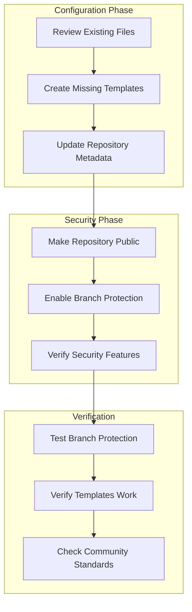

# Implementation Plan: GitHub Repository Protections and Best Practices

**Branch**: `014-github-repo-protections` | **Date**: 2026-01-12 | **Spec**: [spec.md](./spec.md)
**Input**: Feature specification from `/specs/014-github-repo-protections/spec.md`

## Summary

Configure the doit GitHub repository for public release by implementing branch protection rules, security settings, documentation files, repository metadata, issue/PR templates, and updating the docs/ folder documentation to reflect the correct project name and URLs. This is a configuration-focused feature using the `gh` CLI tool and markdown file editing.

## Technical Context

**Language/Version**: Bash scripts, gh CLI, Markdown (YAML for templates)
**Primary Dependencies**: gh CLI (GitHub CLI), Git
**Storage**: N/A (GitHub API / repository settings)
**Testing**: Manual verification via gh CLI and GitHub web UI
**Target Platform**: GitHub.com (seanbarlow/doit repository)
**Project Type**: Configuration (no source code changes)
**Performance Goals**: N/A (one-time configuration)
**Constraints**: Free GitHub tier (branch protection requires public repo)
**Scale/Scope**: Single repository configuration

## Architecture Overview

<!-- BEGIN:AUTO-GENERATED section="architecture" -->

<!-- END:AUTO-GENERATED -->

## Constitution Check

*GATE: Must pass before Phase 0 research. Re-check after Phase 1 design.*

**Note**: This feature is a configuration task, not a code development feature. Constitution tech stack checks are not applicable as no application code is being written.

| Check | Status | Notes |
|-------|--------|-------|
| Tech Stack Alignment | N/A | Configuration only, no code |
| Security Principles | PASS | Feature implements security best practices |
| Quality Gates | PASS | Creates PR review requirements |

## Project Structure

### Documentation (this feature)

```text
specs/014-github-repo-protections/
├── spec.md              # Feature specification
├── plan.md              # This file
├── research.md          # Research findings
├── quickstart.md        # Implementation guide
├── checklists/
│   └── requirements.md  # Quality checklist
└── tasks.md             # Task breakdown (created by /doit.taskit)
```

### Files to Create/Modify

```text
.github/
├── ISSUE_TEMPLATE/
│   ├── bug_report.yml       # NEW: Bug report template
│   └── feature_request.yml  # NEW: Feature request template
├── PULL_REQUEST_TEMPLATE.md # NEW: PR template
├── dependabot.yml           # NEW: Dependabot configuration
└── workflows/
    └── publish.yml          # EXISTING: No changes needed

# Root level (review existing)
├── SECURITY.md              # EXISTING: Review for completeness
├── CONTRIBUTING.md          # EXISTING: Review for completeness
├── CODE_OF_CONDUCT.md       # EXISTING: Review for completeness
└── LICENSE                  # EXISTING: MIT confirmed

# docs/ folder (UPDATE: Replace Spec Kit references with DoIt)
docs/
├── README.md                # UPDATE: Change Spec Kit → DoIt, DocFX → current tooling
├── index.md                 # UPDATE: Change Spec Kit → DoIt, fix GitHub URLs
├── installation.md          # UPDATE: Use doit-toolkit-cli, seanbarlow/doit URLs
├── quickstart.md            # UPDATE: Use doit commands, fix GitHub URLs
└── local-development.md     # UPDATE: Use correct repo URL and CLI names
```

**Structure Decision**: No source code structure changes. All changes are to `.github/` directory, `docs/` folder, and repository settings via GitHub API.

## Implementation Phases

### Phase 1: Documentation & Templates (Can be done on branch)

| Task | Description | Files |
|------|-------------|-------|
| Review existing docs | Verify SECURITY.md, CONTRIBUTING.md, CODE_OF_CONDUCT.md | Root *.md |
| Create bug report template | YAML form template | .github/ISSUE_TEMPLATE/bug_report.yml |
| Create feature request template | YAML form template | .github/ISSUE_TEMPLATE/feature_request.yml |
| Create PR template | Markdown template | .github/PULL_REQUEST_TEMPLATE.md |
| Create Dependabot config | Enable dependency updates | .github/dependabot.yml |
| Update docs/README.md | Replace Spec Kit refs with DoIt | docs/README.md |
| Update docs/index.md | Fix project name and GitHub URLs | docs/index.md |
| Update docs/installation.md | Use doit-toolkit-cli, correct URLs | docs/installation.md |
| Update docs/quickstart.md | Use correct doit commands | docs/quickstart.md |
| Update docs/local-development.md | Fix repo URL and CLI names | docs/local-development.md |

### Phase 2: Repository Settings (Requires merge to main)

| Task | Description | Command |
|------|-------------|---------|
| Update metadata | Set description and topics | `gh repo edit` |
| Make public | Change visibility | `gh repo edit --visibility public` |
| Enable branch protection | Configure main branch rules | `gh api` |
| Verify security | Check secret scanning, Dependabot | GitHub web UI |

### Phase 3: Verification

| Task | Description | Method |
|------|-------------|--------|
| Test direct push rejection | Attempt push to main | Git CLI |
| Test PR requirements | Create test PR | GitHub web UI |
| Verify templates render | Create new issue/PR | GitHub web UI |
| Check community standards | Review GitHub Insights | GitHub web UI |

## Risk Mitigation

| Risk | Impact | Mitigation |
|------|--------|------------|
| Branch protection fails on private repo | High | Make public first, then configure |
| Secrets in repo history | Critical | Review history before making public |
| Breaking existing workflows | Medium | Test publish.yml still works |

## Dependencies

- **Must be done first**: Review for secrets in history
- **Requires public repo**: Branch protection, secret scanning
- **Can be done in parallel**: Documentation review, template creation

## Complexity Tracking

No constitution violations. This is a straightforward configuration task with minimal complexity.

## Success Metrics

All items from [spec.md Success Criteria](./spec.md#success-criteria-mandatory):

- [ ] SC-001: Direct pushes to main rejected
- [ ] SC-002: PRs require review before merge
- [ ] SC-003: Secret scanning and Dependabot enabled
- [ ] SC-004: Documentation files complete
- [ ] SC-005: Repository metadata complete
- [ ] SC-006: Issue/PR templates functional
- [ ] SC-007: GitHub Community Standards 100%
- [ ] SC-008: docs/ folder updated with correct DoIt references (zero Spec Kit refs)
