# Feature Specification: GitHub Repository Protections and Best Practices

**Feature Branch**: `014-github-repo-protections`
**Created**: 2026-01-12
**Status**: Draft
**Input**: User description: "Create branch protections and implement best practices on GitHub repo before making the project public"

## Summary

Prepare the doit repository for public release by implementing GitHub best practices including branch protection rules, security configurations, required documentation files, and repository metadata. This ensures the project presents professionally and maintains code quality standards when contributors begin participating.

## User Scenarios & Testing *(mandatory)*

### User Story 1 - Protected Main Branch (Priority: P1)

As a repository maintainer, I want the main branch to be protected from direct pushes so that all changes must go through pull requests with proper review, ensuring code quality and preventing accidental commits to production.

**Why this priority**: Branch protection is the most critical safeguard for code quality. Without it, accidental or malicious pushes can break the main branch, affecting all users and contributors.

**Independent Test**: Can be fully tested by attempting to push directly to main (should be rejected) and verifying PR requirements are enforced.

**Acceptance Scenarios**:

1. **Given** a user with push access, **When** they attempt to push directly to main, **Then** the push is rejected with a clear error message
2. **Given** a pull request targeting main, **When** submitted, **Then** it requires at least 1 approving review before merge
3. **Given** a pull request, **When** CI status checks are configured, **Then** merging is blocked until checks pass
4. **Given** an approved PR, **When** new commits are pushed, **Then** previous approvals are dismissed requiring re-review

---

### User Story 2 - Security Best Practices (Priority: P1)

As a repository maintainer, I want security features enabled so that vulnerabilities and leaked secrets are detected automatically, protecting both the project and its users.

**Why this priority**: Security vulnerabilities and leaked secrets pose immediate risk to users. This must be configured before going public to prevent exploitation.

**Independent Test**: Can be tested by verifying Dependabot alerts are enabled, secret scanning is active, and security policy exists.

**Acceptance Scenarios**:

1. **Given** the repository settings, **When** viewed, **Then** secret scanning is enabled
2. **Given** a new security vulnerability in dependencies, **When** detected by Dependabot, **Then** an alert is created automatically
3. **Given** a potential contributor, **When** they look for security guidance, **Then** they find SECURITY.md with clear vulnerability reporting instructions
4. **Given** a dependency with a known vulnerability, **When** Dependabot analyzes, **Then** it creates a pull request with the fix

---

### User Story 3 - Required Documentation Files (Priority: P2)

As a potential contributor, I want to find standard documentation files (CONTRIBUTING.md, CODE_OF_CONDUCT.md, SECURITY.md) so that I understand how to participate in the project appropriately.

**Why this priority**: Documentation files enable community participation and set expectations. Important for public release but the project functions without them.

**Independent Test**: Can be tested by verifying each file exists, contains appropriate content, and is linked from README where applicable.

**Acceptance Scenarios**:

1. **Given** a new contributor visiting the repository, **When** they look for contribution guidelines, **Then** they find CONTRIBUTING.md with setup and PR instructions
2. **Given** the repository root, **When** listing files, **Then** CODE_OF_CONDUCT.md exists with community standards
3. **Given** a security researcher, **When** they find a vulnerability, **Then** SECURITY.md provides clear disclosure instructions
4. **Given** a user viewing the repository, **When** they check the license, **Then** LICENSE file exists with MIT license text

---

### User Story 4 - Repository Metadata (Priority: P2)

As a visitor discovering the repository, I want to see professional metadata (description, topics, website link) so that I quickly understand what the project does and find related resources.

**Why this priority**: Good metadata improves discoverability and first impressions but doesn't affect functionality.

**Independent Test**: Can be tested by viewing repository on GitHub and verifying description, topics, and social preview are configured.

**Acceptance Scenarios**:

1. **Given** the repository main page, **When** viewed, **Then** description accurately summarizes the project purpose
2. **Given** the repository settings, **When** viewed, **Then** relevant topics are set (cli, python, spec-driven-development, ai, development-workflow)
3. **Given** the repository page, **When** shared on social media, **Then** a professional social preview image is displayed

---

### User Story 5 - Issue and PR Templates (Priority: P3)

As a maintainer, I want issue and PR templates so that bug reports, feature requests, and pull requests follow a consistent format, making them easier to triage and review.

**Why this priority**: Templates improve contribution quality but the project works without them. Can be refined based on actual community feedback.

**Independent Test**: Can be tested by creating a new issue/PR and verifying templates are offered and contain helpful guidance.

**Acceptance Scenarios**:

1. **Given** a user creating a new issue, **When** they click "New Issue", **Then** they see template options (Bug Report, Feature Request)
2. **Given** a contributor creating a PR, **When** they open the PR form, **Then** a template guides them through description, testing, and checklist
3. **Given** the templates, **When** reviewed, **Then** each contains clear instructions and required sections

---

### User Story 6 - Updated Documentation (Priority: P2)

As a new user or contributor, I want the documentation in the docs/ folder to accurately reflect the DoIt project (not Spec Kit) so that I can understand how to install, use, and contribute to the project.

**Why this priority**: Outdated documentation referring to wrong project names, URLs, and commands will confuse users and damage credibility. Essential for public release.

**Independent Test**: Can be tested by reading each doc file and verifying all references use correct project name (DoIt/doit-toolkit-cli), correct repository URL (seanbarlow/doit), and correct commands.

**Acceptance Scenarios**:

1. **Given** a user reading docs/README.md, **When** they look for project info, **Then** it refers to "DoIt" not "Spec Kit"
2. **Given** a user reading docs/installation.md, **When** they follow install instructions, **Then** they see correct package name (doit-toolkit-cli) and repository URL (seanbarlow/doit)
3. **Given** a user reading docs/quickstart.md, **When** they follow the tutorial, **Then** commands reference correct CLI (`doit`) and slash commands (`/doit.*`)
4. **Given** a user reading docs/local-development.md, **When** they setup dev environment, **Then** instructions use correct repository URL and CLI name
5. **Given** a user reading docs/index.md, **When** they browse documentation, **Then** all links and references are accurate for DoIt project

---

### Edge Cases

- What happens when a maintainer needs to make an emergency fix to main? (Admin bypass should be available but logged)
- How does branch protection interact with automated releases? (CI/CD service accounts should be configured appropriately)
- What if secret scanning produces false positives? (Process for dismissing with justification should be documented)

## User Journey Visualization

```mermaid
flowchart LR
    subgraph "US1 - Protected Main Branch"
        US1_S[Developer pushes to main] --> US1_A[Push rejected] --> US1_B[Create PR instead] --> US1_C[Review & merge]
    end
    subgraph "US2 - Security Best Practices"
        US2_S[Vulnerability detected] --> US2_A[Alert created] --> US2_B[Dependabot PR] --> US2_C[Fix merged]
    end
    subgraph "US3 - Documentation Files"
        US3_S[Contributor visits repo] --> US3_A[Reads CONTRIBUTING.md] --> US3_B[Follows guidelines] --> US3_C[Submits quality PR]
    end
    subgraph "US4 - Repository Metadata"
        US4_S[User discovers repo] --> US4_A[Sees description/topics] --> US4_B[Understands purpose] --> US4_C[Stars/forks repo]
    end
    subgraph "US5 - Issue/PR Templates"
        US5_S[User reports bug] --> US5_A[Selects template] --> US5_B[Fills required info] --> US5_C[Submits complete issue]
    end
    subgraph "US6 - Updated Documentation"
        US6_S[User reads docs] --> US6_A[Correct project info] --> US6_B[Follows accurate guide] --> US6_C[Successfully uses DoIt]
    end
```

<!-- BEGIN:AUTO-GENERATED section="user-journey" -->

<!-- END:AUTO-GENERATED -->

## Requirements *(mandatory)*

### Functional Requirements

**Branch Protection:**

- **FR-001**: Repository MUST have branch protection enabled on main branch
- **FR-002**: Branch protection MUST require at least 1 approving review before merge
- **FR-003**: Branch protection MUST require status checks to pass before merge
- **FR-004**: Branch protection MUST dismiss stale reviews when new commits are pushed
- **FR-005**: Branch protection MUST restrict who can push to main (maintainers only)

**Security Configuration:**

- **FR-006**: Repository MUST have secret scanning enabled
- **FR-007**: Repository MUST have Dependabot alerts enabled
- **FR-008**: Repository MUST have Dependabot security updates enabled
- **FR-009**: Repository MUST have a SECURITY.md file with vulnerability disclosure process

**Documentation Files:**

- **FR-010**: Repository MUST have CONTRIBUTING.md with contribution guidelines
- **FR-011**: Repository MUST have CODE_OF_CONDUCT.md with community standards
- **FR-012**: Repository MUST have LICENSE file with MIT license
- **FR-013**: CONTRIBUTING.md MUST include development setup, PR process, and code standards

**Repository Metadata:**

- **FR-014**: Repository MUST have a description set
- **FR-015**: Repository MUST have relevant topics configured
- **FR-016**: Repository SHOULD have a social preview image (optional enhancement)

**Issue/PR Templates:**

- **FR-017**: Repository MUST have bug report issue template
- **FR-018**: Repository MUST have feature request issue template
- **FR-019**: Repository MUST have pull request template

**Documentation Updates:**

- **FR-020**: docs/README.md MUST reference DoIt project (not Spec Kit)
- **FR-021**: docs/installation.md MUST use correct package name (doit-toolkit-cli) and repository URL (seanbarlow/doit)
- **FR-022**: docs/quickstart.md MUST reference correct commands (`doit init`, `/doit.*` slash commands)
- **FR-023**: docs/local-development.md MUST use correct repository URL and project structure
- **FR-024**: docs/index.md MUST have accurate project name and links

## Success Criteria *(mandatory)*

### Measurable Outcomes

- **SC-001**: All direct pushes to main branch are rejected (100% enforcement)
- **SC-002**: All pull requests require review before merge (0 PRs merged without review)
- **SC-003**: Secret scanning and Dependabot are enabled and actively monitoring
- **SC-004**: All required documentation files exist and contain substantive content (not placeholders)
- **SC-005**: Repository metadata is complete (description, topics, website URL set)
- **SC-006**: Issue and PR templates are available and render correctly when creating new issues/PRs
- **SC-007**: Repository passes GitHub's "Community Standards" checklist with 100% completion
- **SC-008**: All documentation files in docs/ reference correct project name, package name, and URLs (zero references to "Spec Kit" or "github/spec-kit")

## Assumptions

- The `gh` CLI tool is available and authenticated for configuring repository settings
- The repository owner has admin permissions to modify branch protection rules
- The existing LICENSE file is already MIT (verified from pyproject.toml)
- Standard GitHub features (branch protection, secret scanning, Dependabot) are available for public repositories

## Out of Scope

- Setting up GitHub Actions workflows beyond existing publish.yml
- Configuring advanced security features (code scanning, GHAS)
- Setting up project boards or GitHub Projects
- Configuring webhooks or third-party integrations
- Custom domain or GitHub Pages setup
