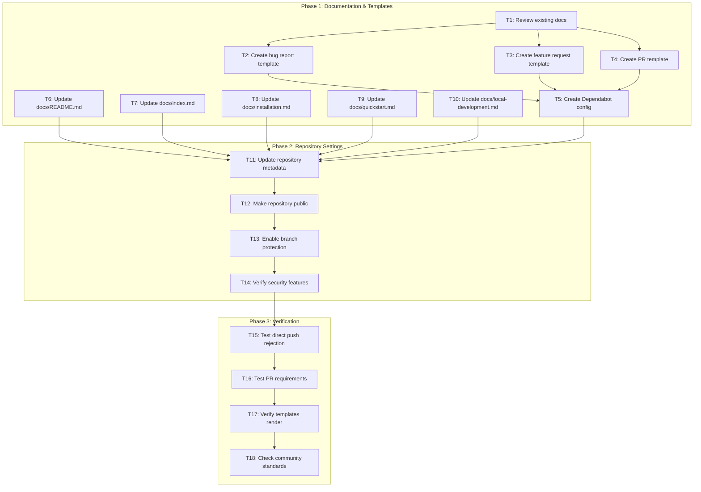
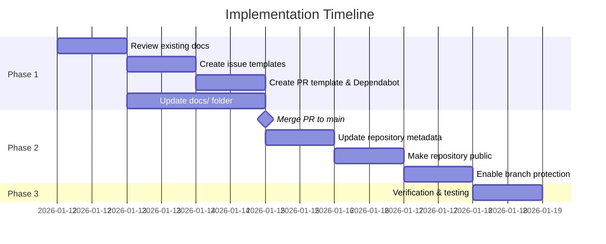

# Tasks: GitHub Repository Protections and Best Practices

**Feature Branch**: `014-github-repo-protections`
**Generated**: 2026-01-12
**Source**: [spec.md](./spec.md) | [plan.md](./plan.md)

## Task Dependencies Flowchart

<!-- BEGIN:AUTO-GENERATED section="task-dependencies" -->

<!-- END:AUTO-GENERATED -->

## Phase Timeline

<!-- BEGIN:AUTO-GENERATED section="phase-timeline" -->

<!-- END:AUTO-GENERATED -->

---

## Tasks by User Story

### US1 - Protected Main Branch (P1) - Issue #2

| ID | Task | Priority | Phase | Status | Dependencies |
|----|------|----------|-------|--------|--------------|
| T12 | Make repository public | P1 | 2 | [X] | T11 |
| T13 | Enable branch protection on main | P1 | 2 | [X] | T12 |
| T15 | Test direct push rejection | P1 | 3 | [X] | T13 |
| T16 | Test PR requirements enforcement | P1 | 3 | [X] | T15 |

**T12: Make repository public**
- **Command**: `gh repo edit seanbarlow/doit --visibility public`
- **Verification**: `gh repo view seanbarlow/doit --json visibility`
- **Note**: Required before branch protection can be enabled on free tier

**T13: Enable branch protection on main**
- **Command**:
```bash
gh api repos/seanbarlow/doit/branches/main/protection \
  --method PUT \
  --field required_status_checks='{"strict":true,"contexts":[]}' \
  --field enforce_admins=false \
  --field required_pull_request_reviews='{"dismiss_stale_reviews":true,"require_code_owner_reviews":false,"required_approving_review_count":1}' \
  --field restrictions=null
```
- **Verification**: `gh api repos/seanbarlow/doit/branches/main/protection`

**T15: Test direct push rejection**
- Create test file, attempt `git push origin main`, verify rejection
- Expected: Push rejected with branch protection message

**T16: Test PR requirements enforcement**
- Create PR, attempt merge without approval, verify blocked
- Expected: Merge blocked until review approved

---

### US2 - Security Best Practices (P1) - Issue #3

| ID | Task | Priority | Phase | Status | Dependencies |
|----|------|----------|-------|--------|--------------|
| T5 | Create Dependabot configuration | P1 | 1 | [X] | T4 |
| T14 | Verify security features enabled | P1 | 2 | [X] | T13 |

**T5: Create Dependabot configuration**
- **File**: `.github/dependabot.yml`
- **Content**:
```yaml
version: 2
updates:
  - package-ecosystem: "pip"
    directory: "/"
    schedule:
      interval: "weekly"
    open-pull-requests-limit: 10
    labels:
      - "dependencies"
      - "python"

  - package-ecosystem: "github-actions"
    directory: "/"
    schedule:
      interval: "weekly"
    open-pull-requests-limit: 5
    labels:
      - "dependencies"
      - "github-actions"
```

**T14: Verify security features enabled**
- Check secret scanning: GitHub Settings > Security > Secret scanning
- Check Dependabot alerts: GitHub Settings > Security > Dependabot alerts
- Check Dependabot security updates: GitHub Settings > Security > Dependabot security updates
- **Note**: These are auto-enabled for public repositories

---

### US3 - Required Documentation Files (P2) - Issue #4

| ID | Task | Priority | Phase | Status | Dependencies |
|----|------|----------|-------|--------|--------------|
| T1 | Review existing documentation files | P2 | 1 | [X] | None |

**T1: Review existing documentation files**
- **Files to verify**:
  - [x] `SECURITY.md` - Exists, contains vulnerability reporting instructions
  - [x] `CONTRIBUTING.md` - Exists, contains contribution guidelines
  - [x] `CODE_OF_CONDUCT.md` - Exists, contains community standards
  - [x] `LICENSE` - Exists, MIT license confirmed
- **Action**: Review content for completeness, update if needed

---

### US4 - Repository Metadata (P2) - Issue #5

| ID | Task | Priority | Phase | Status | Dependencies |
|----|------|----------|-------|--------|--------------|
| T11 | Update repository metadata | P2 | 2 | [X] | T5, T6-T10 |

**T11: Update repository metadata**
- **Commands**:
```bash
# Set description
gh repo edit seanbarlow/doit --description "DoIt: AI-powered spec-driven development toolkit for building software from specifications"

# Set topics
gh api repos/seanbarlow/doit/topics \
  --method PUT \
  --field names='["cli","python","spec-driven-development","ai","development-workflow","code-generation","specifications"]'

# Set homepage (optional)
gh repo edit seanbarlow/doit --homepage "https://seanbarlow.github.io/doit"
```
- **Verification**: `gh repo view seanbarlow/doit`

---

### US5 - Issue and PR Templates (P3) - Issue #6

| ID | Task | Priority | Phase | Status | Dependencies |
|----|------|----------|-------|--------|--------------|
| T2 | Create bug report template | P3 | 1 | [X] | T1 |
| T3 | Create feature request template | P3 | 1 | [X] | T1 |
| T4 | Create PR template | P3 | 1 | [X] | T1 |
| T17 | Verify templates render correctly | P3 | 3 | [X] | T16 |

**T2: Create bug report template**
- **File**: `.github/ISSUE_TEMPLATE/bug_report.yml`
- **Content**: YAML form template with:
  - Title field
  - Description textarea
  - Steps to reproduce
  - Expected vs actual behavior
  - Environment info (OS, Python version, doit version)
  - Log output section

**T3: Create feature request template**
- **File**: `.github/ISSUE_TEMPLATE/feature_request.yml`
- **Content**: YAML form template with:
  - Title field
  - Problem description
  - Proposed solution
  - Alternatives considered
  - Additional context

**T4: Create PR template**
- **File**: `.github/PULL_REQUEST_TEMPLATE.md`
- **Content**: Markdown template with:
  - Summary section
  - Related issues
  - Type of change (bug fix, feature, breaking change)
  - Testing checklist
  - Documentation checklist

**T17: Verify templates render correctly**
- Create new issue, verify template options appear
- Create new PR, verify template content loads
- Expected: All templates render correctly with form fields

---

### US6 - Updated Documentation (P2) - Issue #7

| ID | Task | Priority | Phase | Status | Dependencies |
|----|------|----------|-------|--------|--------------|
| T6 | Update docs/README.md | P2 | 1 | [X] | None |
| T7 | Update docs/index.md | P2 | 1 | [X] | None |
| T8 | Update docs/installation.md | P2 | 1 | [X] | None |
| T9 | Update docs/quickstart.md | P2 | 1 | [X] | None |
| T10 | Update docs/local-development.md | P2 | 1 | [X] | None |
| T18 | Check community standards 100% | P2 | 3 | [X] | T17 |

**T6: Update docs/README.md**
- **Current issues**: References "Spec Kit" and DocFX
- **Changes needed**:
  - Change "Spec Kit" to "DoIt"
  - Update build instructions for current tooling
  - Update GitHub URLs to `seanbarlow/doit`

**T7: Update docs/index.md**
- **Current issues**: Title says "Spec Kit", references `github/spec-kit`
- **Changes needed**:
  - Change "Spec Kit" to "DoIt" in title and content
  - Update Contributing link to `seanbarlow/doit`
  - Update Support link to `seanbarlow/doit`

**T8: Update docs/installation.md**
- **Current issues**: All uvx commands use `github/spec-kit`
- **Changes needed**:
  - Replace all `git+https://github.com/github/spec-kit.git` with `doit-toolkit-cli`
  - Update package name references
  - Simplify installation to use PyPI: `uvx doit-toolkit-cli init`

**T9: Update docs/quickstart.md**
- **Current issues**: Uses `github/spec-kit` URLs
- **Changes needed**:
  - Replace `github/spec-kit.git` with `doit-toolkit-cli`
  - Update example commands
  - Update GitHub link to `seanbarlow/doit`

**T10: Update docs/local-development.md**
- **Current issues**: References `github/spec-kit` throughout
- **Changes needed**:
  - Replace all `github/spec-kit` with `seanbarlow/doit`
  - Replace `spec-kit` folder references with `doit`
  - Update environment variable example `SPEC_KIT_SRC` to `DOIT_SRC`
  - Update shell function `specify-dev` references

**T18: Check community standards 100%**
- Navigate to GitHub Insights > Community Standards
- Verify 100% completion
- Expected: All checkboxes green

---

## Task Summary

| Phase | Tasks | Status |
|-------|-------|--------|
| Phase 1: Documentation & Templates | T1-T10 | 10/10 complete |
| Phase 2: Repository Settings | T11-T14 | 4/4 complete |
| Phase 3: Verification | T15-T18 | 4/4 complete |
| **Total** | **18 tasks** | **18/18 complete** |

## Execution Order

1. **T1**: Review existing documentation files
2. **T2-T4**: Create issue and PR templates (parallel)
3. **T5**: Create Dependabot configuration
4. **T6-T10**: Update docs/ folder files (parallel)
5. **Merge PR to main**
6. **T11**: Update repository metadata
7. **T12**: Make repository public
8. **T13**: Enable branch protection
9. **T14**: Verify security features
10. **T15-T18**: Verification tasks (sequential)

## Success Criteria Mapping

| Success Criteria | Tasks |
|------------------|-------|
| SC-001: Direct pushes rejected | T13, T15 |
| SC-002: PRs require review | T13, T16 |
| SC-003: Secret scanning/Dependabot | T5, T14 |
| SC-004: Documentation files complete | T1 |
| SC-005: Repository metadata complete | T11 |
| SC-006: Templates functional | T2, T3, T4, T17 |
| SC-007: Community Standards 100% | T18 |
| SC-008: docs/ updated (zero Spec Kit refs) | T6, T7, T8, T9, T10 |
