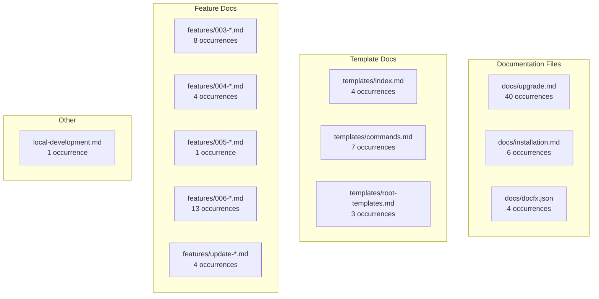

# Implementation Plan: Documentation Branding Cleanup

**Branch**: `015-docs-branding-cleanup` | **Date**: 2026-01-12 | **Spec**: [spec.md](./spec.md)
**Input**: Feature specification from `/specs/015-docs-branding-cleanup/spec.md`

## Summary

Update all documentation files in the `docs/` folder to remove legacy "Spec Kit" and "specify" branding, replace with "DoIt" and "doit-toolkit-cli" branding, fix all GitHub URLs to point to seanbarlow/doit, and update AI agent support to list only Claude and GitHub Copilot. This is a documentation-only feature requiring text replacement across 12 files with 95 total occurrences.

## Technical Context

**Language/Version**: Markdown, JSON (documentation files)
**Primary Dependencies**: None (text editing only)
**Storage**: N/A (file system)
**Testing**: Manual verification via grep/search
**Target Platform**: GitHub Pages (MkDocs)
**Project Type**: Documentation (no code changes)
**Performance Goals**: N/A
**Constraints**: Must maintain valid Markdown/JSON syntax
**Scale/Scope**: 12 files, 95 occurrences to update

## Architecture Overview

<!-- BEGIN:AUTO-GENERATED section="architecture" -->

<!-- END:AUTO-GENERATED -->

## Constitution Check

*GATE: Must pass before Phase 0 research. Re-check after Phase 1 design.*

**Note**: This feature is a documentation task, not a code development feature. Constitution tech stack checks are not applicable as no application code is being written.

| Check | Status | Notes |
|-------|--------|-------|
| Tech Stack Alignment | N/A | Documentation only, no code |
| Security Principles | N/A | No security implications |
| Quality Gates | PASS | Manual verification via grep |

## Project Structure

### Documentation (this feature)

```text
specs/015-docs-branding-cleanup/
├── spec.md              # Feature specification
├── plan.md              # This file
├── research.md          # File analysis and replacement patterns
├── quickstart.md        # Step-by-step implementation guide
├── checklists/
│   └── requirements.md  # Quality checklist
└── tasks.md             # Task breakdown (created by /doit.taskit)
```

### Files to Update

```text
docs/
├── upgrade.md                              # 40 occurrences (highest priority)
├── installation.md                         # 6 occurrences
├── docfx.json                              # 4 occurrences
├── local-development.md                    # 1 occurrence
├── templates/
│   ├── index.md                            # 4 occurrences
│   ├── commands.md                         # 7 occurrences
│   └── root-templates.md                   # 3 occurrences
└── features/
    ├── 003-scaffold-doit-commands.md       # 8 occurrences
    ├── 004-review-template-commands.md     # 4 occurrences
    ├── 005-mermaid-visualization.md        # 1 occurrence
    ├── 006-docs-doit-migration.md          # 13 occurrences
    └── update-doit-templates.md            # 4 occurrences
```

**Structure Decision**: No source code structure changes. All changes are text replacements in the `docs/` directory.

## Replacement Patterns

| Pattern (Case-Sensitive) | Replacement | Context |
|-------------------------|-------------|---------|
| `Spec Kit` | `DoIt` | Proper noun in prose |
| `spec-kit` | `doit` | Package/repo names |
| `specify-cli` | `doit-toolkit-cli` | Package name |
| `specify` | `doit` | CLI command name |
| `github.com/github/spec-kit` | `github.com/seanbarlow/doit` | GitHub URLs |
| `github.github.io/spec-kit` | `seanbarlow.github.io/doit` | GitHub Pages URLs |
| `gemini` | (remove) | Unsupported AI agent |
| `codebuddy` | (remove) | Unsupported AI agent |
| `Gemini` | (remove) | Unsupported AI agent |
| `Codebuddy` | (remove) | Unsupported AI agent |

## Implementation Phases

### Phase 1: Primary Documentation Files

| Task | File | Occurrences | Priority |
|------|------|-------------|----------|
| T1 | docs/upgrade.md | 40 | P1 |
| T2 | docs/docfx.json | 4 | P1 |
| T3 | docs/installation.md | 6 | P1 |

### Phase 2: Template Documentation

| Task | File | Occurrences | Priority |
|------|------|-------------|----------|
| T4 | docs/templates/commands.md | 7 | P2 |
| T5 | docs/templates/index.md | 4 | P2 |
| T6 | docs/templates/root-templates.md | 3 | P2 |

### Phase 3: Feature Documentation

| Task | File | Occurrences | Priority |
|------|------|-------------|----------|
| T7 | docs/features/006-docs-doit-migration.md | 13 | P2 |
| T8 | docs/features/003-scaffold-doit-commands.md | 8 | P2 |
| T9 | docs/features/update-doit-templates.md | 4 | P2 |
| T10 | docs/features/004-review-template-commands.md | 4 | P2 |
| T11 | docs/features/005-mermaid-visualization.md | 1 | P3 |
| T12 | docs/local-development.md | 1 | P3 |

### Phase 4: Verification

| Task | Description | Command |
|------|-------------|---------|
| T13 | Verify zero spec-kit matches | `grep -ri "spec-kit" docs/` |
| T14 | Verify zero specify matches | `grep -ri "specify" docs/` |
| T15 | Verify zero gemini matches | `grep -ri "gemini" docs/` |
| T16 | Verify zero codebuddy matches | `grep -ri "codebuddy" docs/` |

## Risk Mitigation

| Risk | Impact | Mitigation |
|------|--------|------------|
| Breaking Markdown syntax | Medium | Validate each file after edit |
| Breaking JSON syntax | High | Validate docfx.json with JSON linter |
| Missing occurrences | Medium | Grep verification after each phase |
| Incorrect context replacement | Low | Review diffs before commit |

## Success Metrics

All items from [spec.md Success Criteria](./spec.md#success-criteria-mandatory):

- [ ] SC-001: Zero "spec-kit" matches in docs/
- [ ] SC-002: Zero "Spec Kit" matches in docs/
- [ ] SC-003: Zero "specify" CLI command matches in docs/
- [ ] SC-004: Zero "github/spec-kit" matches in docs/
- [ ] SC-005: Zero "gemini" matches in docs/
- [ ] SC-006: Zero "codebuddy" matches in docs/
- [ ] SC-007: All GitHub URLs point to seanbarlow/doit
- [ ] SC-008: docfx.json has correct DoIt branding
