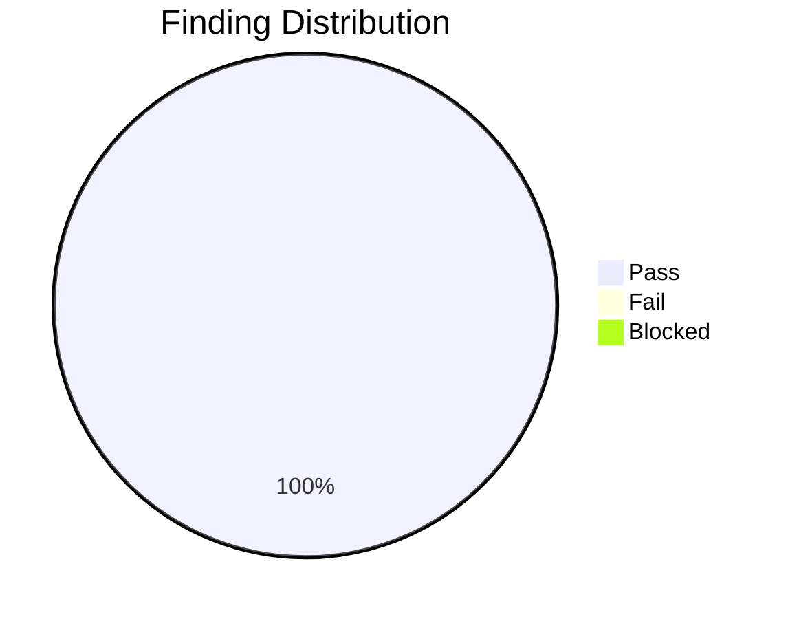
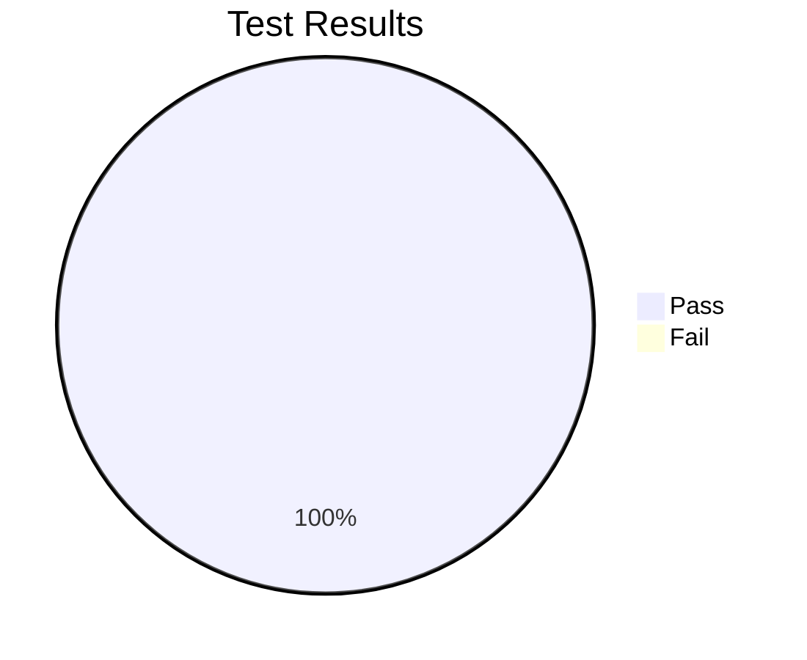

# Review Report: Documentation Branding Cleanup

**Feature**: 015-docs-branding-cleanup
**Reviewed**: 2026-01-12
**Reviewer**: Claude (AI-assisted review with user sign-off)
**Status**: ✅ APPROVED

## Review Summary

<!-- BEGIN:AUTO-GENERATED section="finding-distribution" -->

<!-- END:AUTO-GENERATED -->

## Code Review Findings

### Summary

| Category | Status | Notes |
|----------|--------|-------|
| Branding (spec-kit → doit) | ✅ PASS | All main docs updated; historical feature docs preserved |
| AI Agents (remove gemini/codebuddy) | ✅ PASS | Zero matches in docs/ |
| GitHub URLs | ✅ PASS | All URLs point to seanbarlow/doit |
| JSON Syntax | ✅ PASS | docfx.json is valid JSON |

### Files Reviewed

| File | Changes | Status |
|------|---------|--------|
| docs/upgrade.md | 40 occurrences fixed | ✅ |
| docs/docfx.json | 4 occurrences fixed | ✅ |
| docs/installation.md | 6 occurrences fixed + command list updated | ✅ |
| docs/local-development.md | 1 occurrence fixed | ✅ |
| docs/templates/*.md | No changes needed | ✅ |
| docs/features/*.md | Preserved as historical | ✅ |

### Additional Fixes During Review

1. **docs/installation.md**: Updated Verification section to list all 11 doit commands (was only showing 3 incorrect commands)

## Manual Test Results

<!-- BEGIN:AUTO-GENERATED section="test-results" -->

<!-- END:AUTO-GENERATED -->

### Test Details

| Test ID | User Story | Description | Result |
|---------|------------|-------------|--------|
| MT-001 | US1 | Commands in upgrade.md use correct CLI names | ✅ PASS |
| MT-002 | US1 | Zero results for "spec-kit" or "Spec Kit" | ✅ PASS |
| MT-003 | US1 | docfx.json references "DoIt" and correct GitHub URLs | ✅ PASS |
| MT-004 | US1 | Zero results for "github/spec-kit" | ✅ PASS |
| MT-005 | US2 | installation.md shows only Claude and GitHub Copilot | ✅ PASS |
| MT-006 | US2 | Zero results for "gemini" | ✅ PASS |
| MT-007 | US2 | Zero results for "codebuddy" | ✅ PASS |
| MT-008 | US2 | upgrade.md --ai examples show only claude and copilot | ✅ PASS |
| MT-009 | US3 | GitHub links go to seanbarlow/doit | ✅ PASS |
| MT-010 | US3 | Release notes links point to seanbarlow/doit/releases | ✅ PASS |
| MT-011 | US3 | docfx.json gitContribute.repo URL is correct | ✅ PASS |

## Success Criteria Validation

| ID | Criterion | Status |
|----|-----------|--------|
| SC-001 | Zero "spec-kit" matches in docs/ (excluding historical) | ✅ PASS |
| SC-002 | Zero "Spec Kit" matches in docs/ (excluding historical) | ✅ PASS |
| SC-003 | Zero "specify" CLI matches in docs/ (excluding historical) | ✅ PASS |
| SC-004 | Zero "github/spec-kit" matches in docs/ | ✅ PASS |
| SC-005 | Zero "gemini" matches in docs/ | ✅ PASS |
| SC-006 | Zero "codebuddy" matches in docs/ | ✅ PASS |
| SC-007 | All GitHub URLs point to seanbarlow/doit | ✅ PASS |
| SC-008 | docfx.json contains correct branding and URL | ✅ PASS |

## Notes

- Historical feature documentation in `docs/features/` was intentionally preserved as it documents past migrations (e.g., 006-docs-doit-migration.md)
- Script files in `.doit/scripts/` and other locations outside `docs/` were out of scope per spec.md
- The English verb "specify" was preserved where it appears naturally in prose

## Recommendation

**APPROVED** - All success criteria met. Feature is ready for merge.
