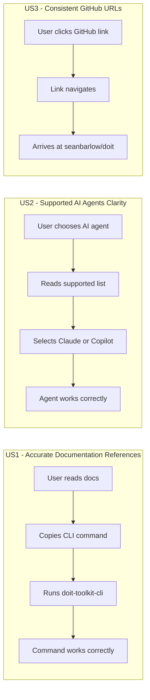

# Feature Specification: Documentation Branding Cleanup

**Feature Branch**: `015-docs-branding-cleanup`
**Created**: 2026-01-12
**Status**: Complete
**Input**: User description: "Update documentation to remove spec-kit and specify references, update supported AI agents to Claude and GitHub Copilot only"

## Summary

Clean up all documentation files to remove legacy "Spec Kit" and "specify" branding references, replacing them with correct "DoIt" and "doit" branding. Additionally, update all AI agent references to reflect the officially supported agents: Claude and GitHub Copilot only (removing references to Gemini, Codebuddy, and other unsupported agents).

## User Scenarios & Testing *(mandatory)*

### User Story 1 - Accurate Documentation References (Priority: P1)

As a new user reading the documentation, I want all documentation to consistently refer to "DoIt" and "doit-toolkit-cli" so that I can follow instructions without confusion about which commands to run or what the project is called.

**Why this priority**: Incorrect branding causes immediate user confusion. Users following upgrade.md or other docs will run wrong commands that fail, creating a terrible first impression and blocking their workflow.

**Independent Test**: Can be fully tested by searching all docs for "spec-kit", "specify", "Spec Kit" and verifying zero matches, then verifying all CLI commands reference "doit" correctly.

**Acceptance Scenarios**:

1. **Given** a user reading docs/upgrade.md, **When** they copy and run any command, **Then** the command uses `doit-toolkit-cli` and `doit` (not `specify-cli` or `specify`)
2. **Given** a user reading any documentation file, **When** they search for "spec-kit" or "Spec Kit", **Then** zero results are found
3. **Given** a user reading docs/docfx.json, **When** they view the file, **Then** all metadata references "DoIt" and correct GitHub URLs (seanbarlow/doit)
4. **Given** a user reading any doc file, **When** they search for "github/spec-kit", **Then** zero results are found

---

### User Story 2 - Supported AI Agents Clarity (Priority: P1)

As a user choosing an AI agent, I want documentation to clearly show only the supported agents (Claude and GitHub Copilot) so that I don't waste time trying to configure an unsupported agent.

**Why this priority**: Listing unsupported agents (Gemini, Codebuddy) misleads users into choosing agents that won't work properly, causing frustration and support burden.

**Independent Test**: Can be tested by searching all docs for "gemini" and "codebuddy" (case-insensitive) and verifying zero matches, then verifying supported agents list shows only Claude and GitHub Copilot.

**Acceptance Scenarios**:

1. **Given** a user reading docs/installation.md, **When** they look for supported agents, **Then** they see only Claude and GitHub Copilot listed
2. **Given** a user reading any documentation file, **When** they search for "gemini" (case-insensitive), **Then** zero results are found
3. **Given** a user reading any documentation file, **When** they search for "codebuddy" (case-insensitive), **Then** zero results are found
4. **Given** a user reading upgrade.md, **When** they see examples with `--ai` flag, **Then** only `claude` and `copilot` are shown as options

---

### User Story 3 - Consistent GitHub URLs (Priority: P2)

As a contributor or user, I want all GitHub URLs to point to the correct repository (seanbarlow/doit) so that links work and I can find the real source code, issues, and releases.

**Why this priority**: Broken links to the wrong repository (github/spec-kit) prevent users from contributing, reporting issues, or viewing releases.

**Independent Test**: Can be tested by extracting all GitHub URLs from documentation and verifying they point to seanbarlow/doit.

**Acceptance Scenarios**:

1. **Given** a user clicking any GitHub link in documentation, **When** the page loads, **Then** it goes to github.com/seanbarlow/doit (not github.com/github/spec-kit)
2. **Given** the docs/upgrade.md file, **When** examining release notes links, **Then** they point to seanbarlow/doit/releases
3. **Given** the docs/docfx.json file, **When** examining the gitContribute section, **Then** the repo URL is `https://github.com/seanbarlow/doit`

---

### Edge Cases

- What if other non-docs files also contain spec-kit references? (Scripts should be checked but are secondary priority after docs)
- What if the docfx.json file is no longer used? (Update anyway for consistency; removing it is out of scope)
- What happens to existing links on the web pointing to old URLs? (External links are out of scope; we only fix our documentation)

## User Journey Visualization

<!-- BEGIN:AUTO-GENERATED section="user-journey" -->

<!-- END:AUTO-GENERATED -->

## Requirements *(mandatory)*

### Functional Requirements

**Branding Updates:**

- **FR-001**: All documentation MUST replace "Spec Kit" with "DoIt" (proper noun)
- **FR-002**: All documentation MUST replace "spec-kit" with "doit" in package/repo names
- **FR-003**: All documentation MUST replace "specify" CLI command with "doit"
- **FR-004**: All documentation MUST replace "specify-cli" with "doit-toolkit-cli" in package names
- **FR-005**: docs/docfx.json MUST update `_appTitle`, `_appName`, and `_appFooter` to reference "DoIt"

**GitHub URL Updates:**

- **FR-006**: All documentation MUST replace "github.com/github/spec-kit" with "github.com/seanbarlow/doit"
- **FR-007**: All documentation MUST replace "github.github.io/spec-kit" with "seanbarlow.github.io/doit"
- **FR-008**: docs/docfx.json MUST update `_gitContribute.repo` to `https://github.com/seanbarlow/doit`

**AI Agent Support Updates:**

- **FR-009**: All documentation MUST remove references to Gemini as a supported agent
- **FR-010**: All documentation MUST remove references to Codebuddy as a supported agent
- **FR-011**: docs/installation.md MUST list only Claude and GitHub Copilot as supported agents
- **FR-012**: docs/upgrade.md MUST show only `--ai claude` and `--ai copilot` in examples

**Files to Update:**

- **FR-013**: docs/upgrade.md MUST be updated to remove all legacy references
- **FR-014**: docs/docfx.json MUST be updated to remove all legacy references
- **FR-015**: Any other doc files with spec-kit/specify/gemini/codebuddy references MUST be updated

## Success Criteria *(mandatory)*

### Measurable Outcomes

- **SC-001**: Zero search results for "spec-kit" (case-insensitive) across all files in docs/ folder
- **SC-002**: Zero search results for "Spec Kit" across all files in docs/ folder
- **SC-003**: Zero search results for "specify" (as CLI command) across all files in docs/ folder
- **SC-004**: Zero search results for "github/spec-kit" across all files in docs/ folder
- **SC-005**: Zero search results for "gemini" (case-insensitive) across all files in docs/ folder
- **SC-006**: Zero search results for "codebuddy" (case-insensitive) across all files in docs/ folder
- **SC-007**: All GitHub URLs in docs/ point to seanbarlow/doit repository
- **SC-008**: docs/docfx.json metadata contains only "DoIt" branding and correct GitHub URL

## Assumptions

- The docfx.json file should be updated for consistency even if DocFX is no longer used for documentation building
- The project uses MkDocs (not DocFX) for actual documentation generation, but docfx.json may be referenced by other tooling
- Scripts in .doit/scripts/ and templates/ may also contain references but are lower priority than docs/
- The supported AI agents are definitively limited to Claude and GitHub Copilot only

## Out of Scope

- Updating script files outside the docs/ folder (scripts, templates, src/)
- Removing or restructuring the docfx.json file entirely
- Updating external documentation or third-party references
- Adding new documentation content beyond branding corrections
- Updating README.md at project root (already updated in previous feature)
