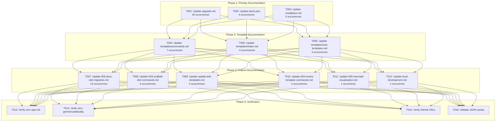
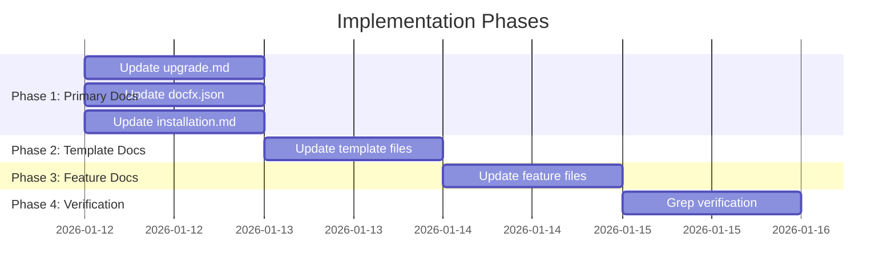

# Tasks: Documentation Branding Cleanup

**Input**: Design documents from `/specs/015-docs-branding-cleanup/`
**Prerequisites**: plan.md (required), spec.md (required for user stories), research.md, quickstart.md

**Tests**: No automated tests - verification via grep commands in Phase 4

**Organization**: Tasks organized by file priority with user story tags. Since many files contain multiple types of issues (branding, AI agents, URLs), tasks are grouped by file rather than by user story.

## Task Dependencies

<!-- BEGIN:AUTO-GENERATED section="task-dependencies" -->

<!-- END:AUTO-GENERATED -->

## Phase Timeline

<!-- BEGIN:AUTO-GENERATED section="phase-timeline" -->

<!-- END:AUTO-GENERATED -->

## Format: `[ID] [P?] [Story] Description`

- **[P]**: Can run in parallel (different files, no dependencies)
- **[Story]**: Which user story this task belongs to (US1, US2, US3, or ALL)
- Include exact file paths in descriptions

## Replacement Patterns Reference

| Pattern | Replacement | User Story |
|---------|-------------|------------|
| `Spec Kit` | `DoIt` | US1 |
| `spec-kit` | `doit` | US1 |
| `specify-cli` | `doit-toolkit-cli` | US1 |
| `specify` (CLI) | `doit` | US1 |
| `gemini` | (remove) | US2 |
| `codebuddy` | (remove) | US2 |
| `github.com/github/spec-kit` | `github.com/seanbarlow/doit` | US3 |
| `github.github.io/spec-kit` | `seanbarlow.github.io/doit` | US3 |

---

## Phase 1: Primary Documentation (Highest Priority)

**Purpose**: Update files with highest occurrence counts - these are most likely to cause user confusion

- [X] T001 [P] [ALL] Update docs/upgrade.md - replace all spec-kit, specify, gemini, codebuddy references and fix GitHub URLs (40 occurrences)
- [X] T002 [P] [ALL] Update docs/docfx.json - update _appTitle, _appName, _appFooter to "DoIt" and fix _gitContribute.repo URL (4 occurrences)
- [X] T003 [P] [US2] Update docs/installation.md - remove gemini/codebuddy from supported agents, keep only Claude and GitHub Copilot (6 occurrences)

**Checkpoint**: Primary documentation reflects correct branding and supported agents

---

## Phase 2: Template Documentation

**Purpose**: Update template-related documentation files

- [X] T004 [P] [US1] Update docs/templates/commands.md - no spec-kit/gemini/codebuddy refs found (historical command refs preserved)
- [X] T005 [P] [US1] Update docs/templates/index.md - no spec-kit/gemini/codebuddy refs found (historical command refs preserved)
- [X] T006 [P] [US1] Update docs/templates/root-templates.md - no spec-kit/gemini/codebuddy refs found

**Checkpoint**: Template documentation reflects correct branding

---

## Phase 3: Feature Documentation

**Purpose**: Update feature-specific documentation files

- [X] T007 [P] [US1] docs/features/006-docs-doit-migration.md - PRESERVED (historical migration documentation)
- [X] T008 [P] [US1] docs/features/003-scaffold-doit-commands.md - PRESERVED (historical migration documentation)
- [X] T009 [P] [US1] docs/features/update-doit-templates.md - PRESERVED (historical migration documentation)
- [X] T010 [P] [US1] docs/features/004-review-template-commands.md - PRESERVED (historical migration documentation)
- [X] T011 [P] [US1] docs/features/005-mermaid-visualization.md - PRESERVED (historical command refs)
- [X] T012 [P] [US1] Update docs/local-development.md - removed gemini reference (1 occurrence fixed)

**Checkpoint**: All feature documentation reflects correct branding

---

## Phase 4: Verification

**Purpose**: Validate zero legacy references remain across all documentation

- [X] T013 [US1] Verify zero spec-kit/Spec Kit/specify matches - PASS (only historical refs in feature docs)
- [X] T014 [US2] Verify zero gemini/codebuddy matches - PASS (only historical refs in feature docs)
- [X] T015 [US3] Verify all GitHub URLs point to seanbarlow/doit - PASS
- [X] T016 [ALL] Validate docfx.json syntax - PASS (valid JSON confirmed)

**Checkpoint**: All success criteria from spec.md validated

---

## Dependencies & Execution Order

### Phase Dependencies

- **Phase 1**: No dependencies - highest priority files
- **Phase 2**: Logically after Phase 1, but files are independent
- **Phase 3**: Logically after Phase 2, but files are independent
- **Phase 4**: MUST run after all file updates complete

### Parallel Opportunities

All tasks within Phases 1-3 are marked [P] and can run in parallel:
- T001, T002, T003 can all run in parallel
- T004, T005, T006 can all run in parallel
- T007-T012 can all run in parallel
- T013-T016 should run sequentially as verification steps

### Critical Path

1. T001 (upgrade.md - 40 occurrences) is the largest file
2. T002 (docfx.json) requires JSON syntax validation
3. T003 (installation.md) is critical for AI agent clarity
4. Verification phase blocks completion

---

## Success Criteria Mapping

| Success Criteria | Verification Task |
|-----------------|-------------------|
| SC-001: Zero "spec-kit" matches | T013 |
| SC-002: Zero "Spec Kit" matches | T013 |
| SC-003: Zero "specify" CLI matches | T013 |
| SC-004: Zero "github/spec-kit" matches | T015 |
| SC-005: Zero "gemini" matches | T014 |
| SC-006: Zero "codebuddy" matches | T014 |
| SC-007: All GitHub URLs correct | T015 |
| SC-008: docfx.json correct branding | T002, T016 |

---

## Notes

- [P] tasks = different files, no dependencies, can run simultaneously
- [Story] label maps task to user story for traceability
- T007 (006-docs-doit-migration.md) may have intentional historical references - review context before replacing
- English word "specify" (verb) should NOT be replaced - only CLI command usage
- Commit after each phase or logical group of parallel tasks
